> **文档元信息**
>
> | 项目 | 内容 |
> |------|------|
> | 文档版本 | v1.0 |
> | 作者 | DTCoder（系分技能自动产出） |
> | 创建日期 | 2026-08-07 |
> | 需求来源 | 任务输入 requirement_section（算法演示 + 导出 + 调用埋点 + 报表可视化） |
> | 评审状态 | 待评审 |

# 算法演示与调用埋点可视化 系分设计

## 1. 需求与范围

### 1.1 背景与目标

图书馆管理系统需要一套「算法演示 + 调用观测」能力：在后端提供三个算法演示接口（HelloWorld、哈希算法、冒泡排序），前端新增一个页面通过三个 Tab 分别展示其执行结果；同时为每个页面提供导出按钮，后端提供导出接口支持导出各页面展示结果；并在后端对算法接口调用做埋点，记录调用次数与调用人，前端在当前页面上以报表形式可视化调用情况（折线图、饼图、柱状图，支持按人员类型、人员层级、人员部门等维度查看）。

目标：打通「演示—导出—观测」闭环，让算法接口的调用情况可追溯、可观测、可多维分析。

### 1.2 核心功能

- 后端三个算法演示接口：HelloWorld、哈希算法、冒泡排序。
- 前端新增页面，三个 Tab 分别展示三种算法执行结果。
- 页面新增导出按钮，后端提供导出接口，支持导出各页面展示结果。
- 后端对算法接口调用埋点，记录调用次数与调用人。
- 前端在当前页面上以报表形式可视化调用情况：折线图（趋势）、饼图（占比）、柱状图（对比），维度支持人员类型、人员层级、人员部门。

### 1.3 约束与非功能要求

- 后端采用 Java + Spring Boot + MyBatis + MySQL 技术栈（与 `library-backend` 既有体系一致）。
- 前端采用 React 19 + Ant Design + ECharts 技术栈（与 `library-frontend` 既有体系一致）。
- 埋点记录不得阻塞主链路：算法接口正常返回优先，埋点失败不回滚主流程、不向用户抛错。
- 导出接口需控制单次数据量，避免内存溢出（OOM）。
- 报表查询接口需对聚合结果做缓存，避免高频打 DB。

### 1.4 排除范围

- 不涉及用户/权限体系的全新建设：人员类型/层级/部门维度复用既有用户上下文（详见假设 A02）。
- 不涉及分布式链路追踪（如 SkyWalking）的接入，仅做业务埋点。
- 不涉及算法接口的鉴权改造（复用现有登录态拦截器）。
- 不涉及报表的大数据离线计算，仅做实时/近实时在线聚合。

### 1.5 需求功能清单与优先级

| 编号 | 功能点 | 优先级 | PRD 原始描述/章节 | 备注 |
|------|--------|--------|-------------------|------|
| F01 | HelloWorld 接口 | P0 | 「分别写三个接口helloworld」 | 返回固定问候串 |
| F02 | 哈希算法接口 | P0 | 「哈希算法」 | 支持多算法（MD5/SHA-256 等），入参文本 |
| F03 | 冒泡排序接口 | P0 | 「冒泡排序」 | 入参数组，返回升序结果与步骤统计 |
| F04 | 算法结果导出接口 | P0 | 「后台提供导出接口，支持导出各个页面的展示结果」 | 按 Tab 维度导出 Excel |
| F05 | 算法调用埋点 | P0 | 「后端再做个埋点，获取调用次数和调用人」 | 记录调用次数、调用人、维度信息 |
| F06 | 算法演示页面（三 Tab） | P0 | 「前端新增一个页面，有三个tab分别展示不同的执行结果」 | 三 Tab + 报表区 |
| F07 | 导出按钮 | P0 | 「新增导出按钮」 | 页面级按钮，导出当前 Tab 结果 |
| F08 | 调用情况报表可视化 | P0 | 「可视化出来一个报表查看调用情况（根据不同的维度：人员类型、人员层级、人员部门等），折线图以及饼图和柱状图不同展示形式」 | 折线/饼图/柱状 + 维度切换 |

### 1.6 假设与待确认项

| 编号 | 假设/待确认内容 | 当前假设 | 确认状态 |
|------|-----------------|----------|----------|
| A01 | 后端技术栈选型 | Java + Spring Boot + MyBatis + MySQL（仓库当前为空，按 `library-backend` 命名惯例与 dtazziboot-java 体系假设） | 待确认 |
| A02 | 前端技术栈选型 | React 19 + Ant Design + ECharts（仓库当前为空，按 `library-frontend` 命名惯例假设） | 待确认 |
| A03 | 人员维度数据来源 | 复用既有用户上下文（登录态拦截器注入 userId/userType/userLevel/department）；本系统不新建用户表，仅在埋点表冗余存储维度字段 | 待确认 |
| A04 | 哈希算法支持范围 | 默认支持 MD5、SHA-256、SHA-512 三种，通过入参 algorithm 指定；非法值降级为 SHA-256 | 待确认 |
| A05 | 冒泡排序入参形态 | 入参为整数数组（JSON 数组），返回升序结果数组 + 比较次数 + 交换次数；数组长度上限 1000 | 待确认 |
| A06 | 导出文件格式 | 导出为 Excel（.xlsx），单次导出上限 10000 行；当前 Tab 的展示结果即导出内容 | 待确认 |
| A07 | 报表时间范围 | 默认近 7 天调用趋势，支持自定义起止日期；维度切换人员类型/层级/部门 | 待确认 |
| A08 | 埋点写入策略 | 异步落库（线程池 + 队列），主链路不等待；队列满则丢弃埋点并记日志告警，不影响算法接口 | 待确认 |

## 2. 架构与模块

### 2.1 功能架构

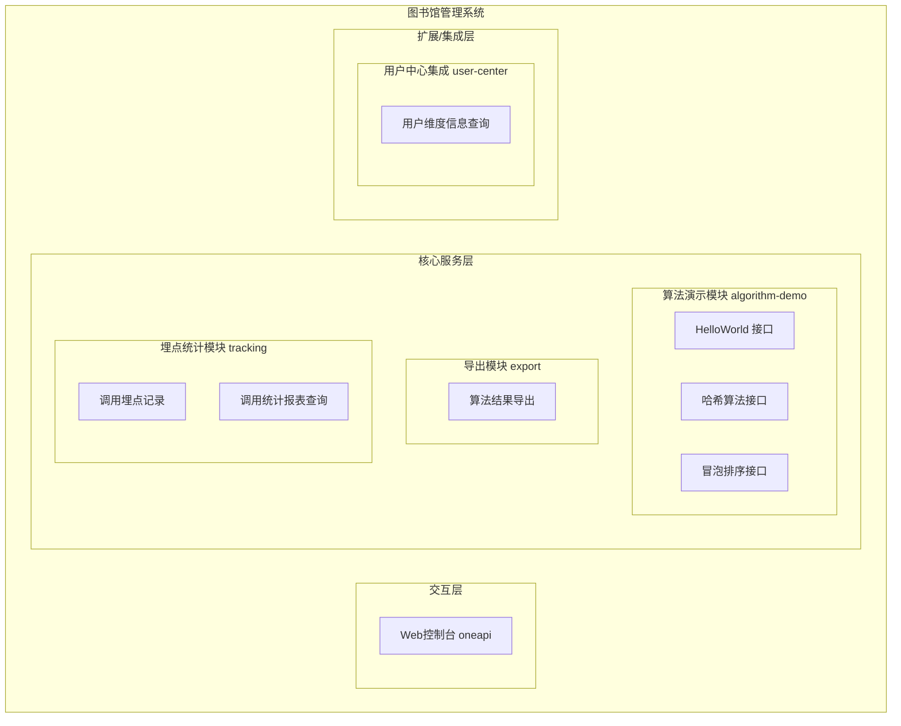

- 交互层说明：Web 控制台 oneapi 接口，前端通过 HTTPS 调用。
- 核心服务层说明：
  - 算法演示模块：提供三个纯计算接口，无状态、无 DB 依赖。
  - 导出模块：基于算法接口能力生成导出内容，输出 Excel。
  - 埋点统计模块：记录调用埋点（调用次数、调用人、维度），并提供聚合报表查询。
- 扩展/集成层说明：用户中心集成用于在埋点时获取/补全人员类型、层级、部门维度（若上下文缺失则回查）。

**模块清单**

| 模块 | 职责 | 依赖 |
|------|------|------|
| algorithm-demo（算法演示模块） | 提供 HelloWorld / 哈希 / 冒泡排序三个算法接口 | 埋点统计模块（被埋点） |
| export（导出模块） | 按算法维度导出展示结果为 Excel | 算法演示模块（复用算法能力生成内容） |
| tracking（埋点统计模块） | 记录算法调用埋点；提供调用次数/调用人/多维统计报表 | 用户中心集成（补全人员维度） |
| user-center（用户中心集成） | 提供 userId 对应的人员类型/层级/部门维度信息 | 外部用户中心服务 |

### 2.2 应用集成架构

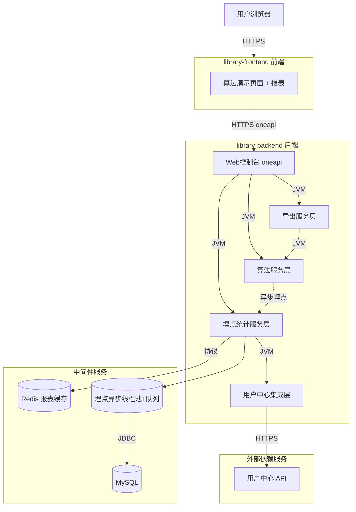

**集成关系说明：**

| 调用方 | 被调用方 | 协议 | 接口类型 | 说明 |
|--------|----------|------|----------|------|
| 用户浏览器 | library-frontend | HTTPS | 静态资源 | 加载算法演示页面 |
| library-frontend | library-backend Web控制台 | HTTPS | oneapi REST | 调用算法/导出/报表接口 |
| library-backend 算法服务层 | library-backend 埋点统计层 | JVM | 内部异步调用 | 算法接口执行后异步埋点 |
| library-backend 埋点统计层 | MySQL | JDBC | SQL | 埋点落库、报表聚合查询 |
| library-backend 埋点统计层 | Redis | 协议 | 缓存 | 报表聚合结果缓存 |
| library-backend 用户中心集成层 | 用户中心 API | HTTPS | 集成接口 | 补全人员维度信息 |

### 2.3 部署架构

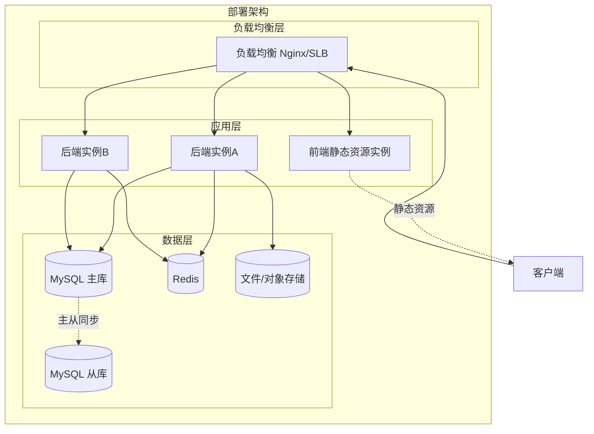

**部署说明：**
- 负载均衡层：Nginx/SLB，前端静态资源与后端 API 统一入口。
- 应用层：前端静态资源独立部署；后端多实例（≥2）保证高可用；埋点异步线程池单实例内独立，多实例各自消费本地队列。
- 数据层：MySQL 主从；Redis 用于报表缓存与埋点队列兜底；导出文件临时落对象存储。

## 3. 数据模型与存储

### 3.1 实体清单

| 实体名称 | 实体说明 | 所属模块 | 与其他实体的关系 |
|----------|----------|----------|-----------------|
| algo_call_log | 算法调用埋点记录，每次算法接口调用一条 | tracking | 多对一 sys_user（逻辑关联，不物理外键） |
| sys_user | 用户信息（人员类型/层级/部门维度来源） | user-center | 一对多 algo_call_log（逻辑） |

### 3.2 实体关系图

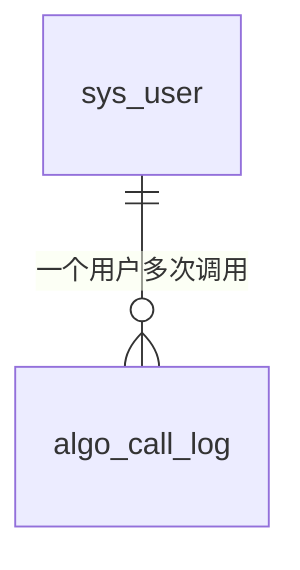

**模型说明：**
- `algo_call_log` 冗余存储人员维度（user_type/user_level/department），避免报表查询时回查用户中心，提升聚合性能。
- `sys_user` 为外部用户中心在本地的人员维度快照（或视图），不在本系统物理维护；埋点时优先取上下文，缺失则回查后冗余写入。
- 不建立物理外键，保持与外部用户体系解耦。

## 4. 接口设计

### 4.1 oneapi（Web 控制台接口）

| 编号 | 接口名称 | 方法 | 路径 | 模块 |
|------|----------|------|------|------|
| W01 | HelloWorld | GET | /api/algorithm/hello-world | algorithm-demo |
| W02 | 哈希算法 | POST | /api/algorithm/hash | algorithm-demo |
| W03 | 冒泡排序 | POST | /api/algorithm/bubble-sort | algorithm-demo |
| W04 | 算法结果导出 | GET | /api/export/algorithm-result | export |
| W05 | 调用统计报表查询 | POST | /api/tracking/algo-call-stats | tracking |

### 4.2 OpenAPI（对外接口）

本需求无对外 OpenAPI 场景，不涉及。

### 4.3 内部接口（Service 层）

| 编号 | 接口名称 | 类 | 方法签名 |
|------|----------|------|----------|
| S01 | HelloWorld 执行 | AlgorithmService | `HelloWorldResultVO helloWorld()` |
| S02 | 哈希计算 | AlgorithmService | `HashResultVO hash(HashRequest request)` |
| S03 | 冒泡排序 | AlgorithmService | `BubbleSortResultVO bubbleSort(BubbleSortRequest request)` |
| S04 | 异步埋点记录 | AlgoCallLogService | `void recordAsync(AlgoCallLogContext context)` |
| S05 | 调用统计聚合查询 | AlgoCallStatsService | `AlgoCallStatsVO stats(AlgoCallStatsQuery query)` |
| S06 | 按算法维度构建导出内容 | ExportService | `ExportContent buildContent(String algorithmType)` |
| S07 | 用户维度补全 | UserCenterIntegration | `UserDimensionVO queryDimension(String userId)` |

### 4.4 集成接口（Integration 层）

| 编号 | 接口名称 | 类 | 方法签名 | 说明 |
|------|----------|------|----------|------|
| I01 | 用户维度查询 | UserCenterClient | `UserDimensionVO queryUserDimension(String userId)` | 调用用户中心 API 获取人员类型/层级/部门 |

## 5. 功能模块设计

### 5.1 算法演示模块（algorithm-demo）

#### 5.1.1 表结构设计

本模块为纯计算模块，无独立业务表。

##### 5.1.1.x 枚举与常量定义

| 枚举名称 | 取值 | 含义 | 关联字段 |
|----------|------|------|----------|
| AlgorithmTypeEnum | HELLO_WORLD | HelloWorld 算法 | algo_call_log.algorithm_type |
| AlgorithmTypeEnum | HASH | 哈希算法 | algo_call_log.algorithm_type |
| AlgorithmTypeEnum | BUBBLE_SORT | 冒泡排序 | algo_call_log.algorithm_type |
| HashAlgorithmEnum | MD5 | MD5 摘要算法 | HashRequest.algorithm |
| HashAlgorithmEnum | SHA256 | SHA-256 摘要算法（默认） | HashRequest.algorithm |
| HashAlgorithmEnum | SHA512 | SHA-512 摘要算法 | HashRequest.algorithm |

#### 5.1.2 接口详细设计

##### W01 HelloWorld

- **URI**: GET /api/algorithm/hello-world
- **描述**: 返回固定问候字符串，用于演示最简接口链路与埋点。
- **入参**: 无

- **出参**:

| 参数名称 | 类型 | 描述 |
|----------|------|------|
| code | String | 结果码 |
| msg | String | 提示信息 |
| data | Object | 业务数据 |
| data.message | String | 问候内容 |

- **错误码**:

| 错误码 | 说明 |
|--------|------|
| ALGO_001 | 系统异常 |

- **业务规则**: 无入参；固定返回 "Hello, World! Welcome to Library Algorithm Demo."；执行后异步埋点（algorithm_type=HELLO_WORLD）。

- **请求示例**:
```
GET /api/algorithm/hello-world
```

- **响应示例**:
```json
{
  "code": "OK",
  "msg": "SUCCESS",
  "data": {
    "message": "Hello, World! Welcome to Library Algorithm Demo."
  }
}
```

##### W02 哈希算法

- **URI**: POST /api/algorithm/hash
- **描述**: 对输入文本计算指定算法的哈希摘要并返回。
- **入参**:

| 参数名称 | 类型 | 是否必填 | 描述 |
|----------|------|----------|------|
| text | String | 是 | 待计算哈希的文本，长度上限 4096 |
| algorithm | String | 否 | 哈希算法：MD5/SHA256/SHA512，默认 SHA256 |

- **出参**:

| 参数名称 | 类型 | 描述 |
|----------|------|------|
| code | String | 结果码 |
| msg | String | 提示信息 |
| data | Object | 业务数据 |
| data.algorithm | String | 实际使用的算法 |
| data.hex | String | 十六进制摘要结果 |
| data.inputLength | Integer | 输入文本长度 |

- **错误码**:

| 错误码 | 说明 |
|--------|------|
| ALGO_002 | text 为空 |
| ALGO_003 | text 超长（>4096） |
| ALGO_004 | algorithm 非法（降级为 SHA256，不报错，仅记录） |

- **业务规则**: text 非空校验；非法 algorithm 静默降级 SHA256；执行后异步埋点（algorithm_type=HASH，extra 记录使用的具体算法）。

- **请求示例**:
```json
{
  "text": "library-demo",
  "algorithm": "SHA256"
}
```

- **响应示例**:
```json
{
  "code": "OK",
  "msg": "SUCCESS",
  "data": {
    "algorithm": "SHA256",
    "hex": "9a87c3b2f1e0d4a6b7c8d9e0f1a2b3c4d5e6f7a8b9c0d1e2f3a4b5c6d7e8f9a0",
    "inputLength": 12
  }
}
```

##### W03 冒泡排序

- **URI**: POST /api/algorithm/bubble-sort
- **描述**: 对输入整数数组执行冒泡排序（升序），返回排序结果与比较/交换次数。
- **入参**:

| 参数名称 | 类型 | 是否必填 | 描述 |
|----------|------|----------|------|
| numbers | Array<Integer> | 是 | 待排序整数数组，长度 1~1000 |

- **出参**:

| 参数名称 | 类型 | 描述 |
|----------|------|------|
| code | String | 结果码 |
| msg | String | 提示信息 |
| data | Object | 业务数据 |
| data.sorted | Array<Integer> | 升序结果数组 |
| data.compareCount | Long | 比较次数 |
| data.swapCount | Long | 交换次数 |
| data.durationMillis | Long | 排序耗时（毫秒） |

- **错误码**:

| 错误码 | 说明 |
|--------|------|
| ALGO_005 | numbers 为空 |
| ALGO_006 | numbers 长度超 1000 |
| ALGO_007 | numbers 含非整数元素 |

- **业务规则**: 数组长度 1~1000 校验；标准冒泡排序实现（含提前退出优化：本轮无交换则终止）；执行后异步埋点（algorithm_type=BUBBLE_SORT，extra 记录数组长度）。

- **请求示例**:
```json
{
  "numbers": [5, 3, 8, 1, 9, 2, 7]
}
```

- **响应示例**:
```json
{
  "code": "OK",
  "msg": "SUCCESS",
  "data": {
    "sorted": [1, 2, 3, 5, 7, 8, 9],
    "compareCount": 18,
    "swapCount": 5,
    "durationMillis": 1
  }
}
```

#### 5.1.3 子功能详细设计

##### 5.1.3.1 算法接口执行 + 异步埋点（F01/F02/F03/F05）

- 处理时序图
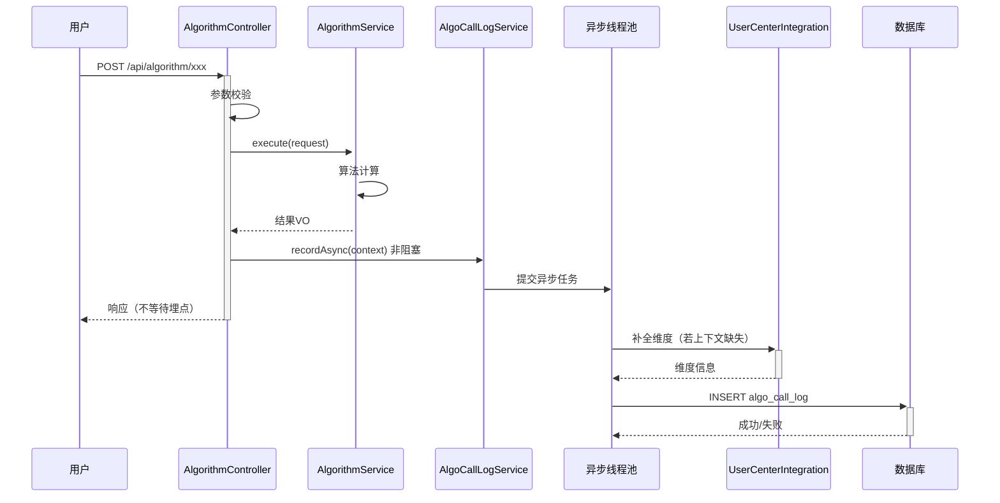

**业务规则：**
| 规则编号 | 规则描述 | 校验时机 | 不满足时的处理 |
|----------|----------|----------|--------------|
| R01 | text/numbers 非空 | 调用时 | 返回 ALGO_002/ALGO_005 |
| R02 | text 长度 ≤4096 / numbers 长度 ≤1000 | 调用时 | 返回 ALGO_003/ALGO_006 |
| R03 | algorithm 合法性 | 调用时 | 非法降级 SHA256，记录 extra |
| R04 | 埋点不得阻塞主链路 | 始终 | 埋点异常仅记日志/告警，不抛给用户 |
| R05 | 埋点队列满 | 提交时 | 丢弃埋点 + 记告警日志，不影响主链路 |

**异常场景：**
| 异常场景 | 处理方式 |
|----------|----------|
| 算法计算抛异常 | 捕获包装为 ALGO_001 返回，不埋点 |
| 异步埋点线程池拒绝 | 丢弃埋点，记 WARN 日志 + 告警 |
| 用户中心维度补全失败 | 维度字段置空，埋点照常落库 |

**并发控制（涉及数据写入）：**
- 并发场景：多用户并发调用算法接口，并发触发埋点写入。
- 控制策略：埋点为异步单条 INSERT，无业务唯一约束冲突；队列满丢弃，无并发风险。报表查询为聚合查询，缓存兜底。

**状态机设计：**
本模块无状态字段，不涉及状态机。

### 5.2 导出模块（export）

#### 5.2.1 表结构设计

本模块无独立业务表，导出内容基于算法接口能力动态构建。

##### 5.2.1.x 枚举与常量定义

| 枚举名称 | 取值 | 含义 | 关联字段 |
|----------|------|------|----------|
| ExportAlgorithmEnum | HELLO_WORLD | 导出 HelloWorld 展示结果 | export 请求 algorithmType |
| ExportAlgorithmEnum | HASH | 导出哈希展示结果 | export 请求 algorithmType |
| ExportAlgorithmEnum | BUBBLE_SORT | 导出冒泡排序展示结果 | export 请求 algorithmType |
| ExportFormatEnum | XLSX | Excel 格式（默认） | 导出文件格式 |

#### 5.2.2 接口详细设计

##### W04 算法结果导出

- **URI**: GET /api/export/algorithm-result
- **描述**: 按算法维度导出该页面展示结果为 Excel 文件，前端触发下载。
- **入参**:

| 参数名称 | 类型 | 是否必填 | 描述 |
|----------|------|----------|------|
| algorithmType | String | 是 | 算法维度：HELLO_WORLD/HASH/BUBBLE_SORT |
| text | String | 否 | 当 algorithmType=HASH 时传入待哈希文本 |
| algorithm | String | 否 | 当 algorithmType=HASH 时传入哈希算法 |
| numbers | String | 否 | 当 algorithmType=BUBBLE_SORT 时传入逗号分隔整数串 |

- **出参**: 二进制文件流（Content-Type: application/vnd.openxmlformats-officedocument.spreadsheetml.sheet）

- **错误码**:

| 错误码 | 说明 |
|--------|------|
| EXPORT_001 | algorithmType 非法 |
| EXPORT_002 | 对应算法入参缺失（如 HASH 缺 text） |
| EXPORT_003 | 导出数据量超限（>10000） |
| EXPORT_004 | 导出文件生成失败 |

- **业务规则**: algorithmType 校验；按算法维度复用 AlgorithmService 计算展示结果；单次导出行数上限 10000；生成 Excel 流式写出避免 OOM。

- **请求示例**:
```
GET /api/export/algorithm-result?algorithmType=BUBBLE_SORT&numbers=5,3,8,1,9,2,7
```

- **响应示例**: 二进制 Excel 文件下载流。

#### 5.2.3 子功能详细设计

##### 5.2.3.1 导出内容构建（F04/F07）

- 处理时序图
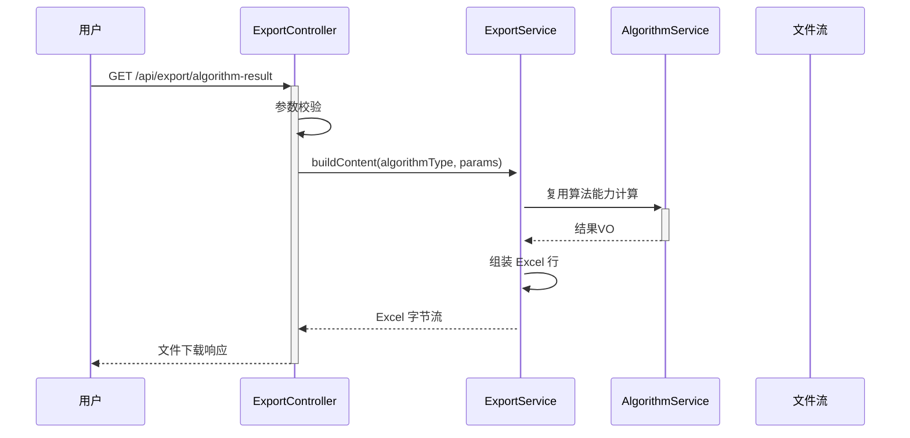

**业务规则：**
| 规则编号 | 规则描述 | 校验时机 | 不满足时的处理 |
|----------|----------|----------|--------------|
| R06 | algorithmType 合法 | 调用时 | 返回 EXPORT_001 |
| R07 | 对应算法入参完整 | 调用时 | 返回 EXPORT_002 |
| R08 | 导出行数 ≤10000 | 构建时 | 返回 EXPORT_003 |

**异常场景：**
| 异常场景 | 处理方式 |
|----------|----------|
| Excel 生成失败 | 返回 EXPORT_004，清理临时文件 |
| 文件过大 | 流式写出，超出阈值拦截 |

**并发控制：**
- 并发场景：多用户同时导出。
- 控制策略：导出为只读计算 + 文件流，无共享状态；单次行数硬上限 10000 控制资源。

**状态机设计：** 不涉及。

### 5.3 埋点统计模块（tracking）

#### 5.3.1 表结构设计

##### 5.3.1.1 algo_call_log（算法调用埋点记录表）

| 字段名 | 数据类型 | 约束 | 默认值 | 说明 |
|--------|----------|------|--------|------|
| id | bigint | PK, 自增 | - | 系统自增主键 |
| algorithm_type | varchar(32) | NOT NULL | - | 算法类型：HELLO_WORLD/HASH/BUBBLE_SORT |
| user_id | varchar(64) | NOT NULL | - | 调用人ID |
| user_type | varchar(32) | NOT NULL | - | 人员类型（冗余） |
| user_level | varchar(32) | NOT NULL | - | 人员层级（冗余） |
| department | varchar(64) | NOT NULL | - | 人员部门（冗余） |
| extra | varchar(512) | NULL | - | 扩展信息（如具体哈希算法/数组长度），JSON 串 |
| trace_id | varchar(64) | NULL | - | 链路追踪ID（便于排查） |
| client_ip | varchar(64) | NULL | - | 调用方IP |
| gmt_create | datetime | NOT NULL | CURRENT_TIMESTAMP | 创建时间（即调用时间） |

**索引：**
- IDX: `idx_algo_call_log_algo_type_gmt` (algorithm_type, gmt_create) — 报表按算法+时间趋势查询
- IDX: `idx_algo_call_log_user_gmt` (user_id, gmt_create) — 按调用人查询
- IDX: `idx_algo_call_log_dept_gmt` (department, gmt_create) — 按部门维度查询
- IDX: `idx_algo_call_log_type_gmt` (user_type, gmt_create) — 按人员类型维度查询
- IDX: `idx_algo_call_log_level_gmt` (user_level, gmt_create) — 按人员层级维度查询

##### 5.3.1.2 sys_user（用户维度快照表，可选）

> 说明：若用户中心无法实时返回维度，则本地维护一份用户维度快照表，埋点时优先取上下文，缺失则查快照，再缺失则回查用户中心并落快照。

| 字段名 | 数据类型 | 约束 | 默认值 | 说明 |
|--------|----------|------|--------|------|
| id | bigint | PK, 自增 | - | 系统自增主键 |
| user_id | varchar(64) | NOT NULL | - | 用户ID |
| user_type | varchar(32) | NOT NULL | - | 人员类型 |
| user_level | varchar(32) | NOT NULL | - | 人员层级 |
| department | varchar(64) | NOT NULL | - | 人员部门 |
| gmt_create | datetime | NOT NULL | CURRENT_TIMESTAMP | 创建时间 |
| gmt_modified | datetime | NOT NULL | CURRENT_TIMESTAMP | 修改时间 |

**索引：**
- UK: `uk_sys_user_user_id` (user_id)

##### 5.3.1.x 枚举与常量定义

| 枚举名称 | 取值 | 含义 | 关联字段 |
|----------|------|------|----------|
| StatsDimensionEnum | USER_TYPE | 按人员类型 | 报表 dimension 参数 |
| StatsDimensionEnum | USER_LEVEL | 按人员层级 | 报表 dimension 参数 |
| StatsDimensionEnum | DEPARTMENT | 按部门 | 报表 dimension 参数 |
| ChartTypeEnum | LINE | 折线图（趋势） | 前端图表类型 |
| ChartTypeEnum | PIE | 饼图（占比） | 前端图表类型 |
| ChartTypeEnum | BAR | 柱状图（对比） | 前端图表类型 |

#### 5.3.2 接口详细设计

##### W05 调用统计报表查询

- **URI**: POST /api/tracking/algo-call-stats
- **描述**: 按维度（人员类型/层级/部门）与时间范围查询算法调用统计，供前端折线/饼图/柱状图渲染。
- **入参**:

| 参数名称 | 类型 | 是否必填 | 描述 |
|----------|------|----------|------|
| algorithmType | String | 否 | 算法维度过滤，不传则全部 |
| dimension | String | 是 | 聚合维度：USER_TYPE/USER_LEVEL/DEPARTMENT |
| startDate | String | 是 | 起始日期 yyyy-MM-dd |
| endDate | String | 是 | 结束日期 yyyy-MM-dd（含） |

- **出参**:

| 参数名称 | 类型 | 描述 |
|----------|------|------|
| code | String | 结果码 |
| msg | String | 提示信息 |
| data | Object | 业务数据 |
| data.line | Array | 折线图数据：[{date, callCount}] 按日趋势 |
| data.pie | Array | 饼图数据：[{name, value}] 维度占比 |
| data.bar | Array | 柱状图数据：[{name, value}] 维度对比 |
| data.totalCallCount | Long | 总调用次数 |
| data.distinctUserCount | Long | 调用人去重数 |

- **错误码**:

| 错误码 | 说明 |
|--------|------|
| TRACK_001 | dimension 非法 |
| TRACK_002 | 日期格式错误 |
| TRACK_003 | 查询范围超 90 天 |

- **业务规则**: dimension 合法性校验；日期范围 ≤90 天；聚合结果按 dimension+algorithmType+日期范围做 Redis 缓存（5 分钟）；折线图按日聚合，饼/柱按维度聚合。

- **请求示例**:
```json
{
  "dimension": "DEPARTMENT",
  "startDate": "2026-08-01",
  "endDate": "2026-08-07"
}
```

- **响应示例**:
```json
{
  "code": "OK",
  "msg": "SUCCESS",
  "data": {
    "line": [
      {"date": "2026-08-01", "callCount": 120},
      {"date": "2026-08-02", "callCount": 150}
    ],
    "pie": [
      {"name": "研发部", "value": 80},
      {"name": "运营部", "value": 40}
    ],
    "bar": [
      {"name": "研发部", "value": 80},
      {"name": "运营部", "value": 40}
    ],
    "totalCallCount": 270,
    "distinctUserCount": 25
  }
}
```

#### 5.3.3 子功能详细设计

##### 5.3.3.1 异步埋点记录（F05）

- 处理时序图
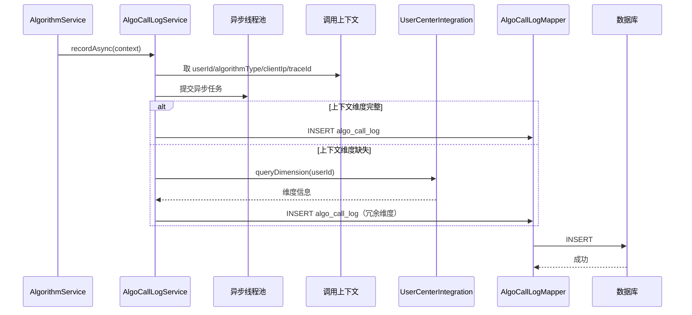

**业务规则：**
| 规则编号 | 规则描述 | 校验时机 | 不满足时的处理 |
|----------|----------|----------|--------------|
| R09 | 埋点异步非阻塞 | 始终 | 主链路不等待 |
| R10 | 维度字段冗余 | 落库前 | 上下文缺失则回查用户中心补全 |
| R11 | 埋点失败不影响主链路 | 始终 | 仅记日志/告警 |

**异常场景：**
| 异常场景 | 处理方式 |
|----------|----------|
| 线程池满拒绝任务 | 丢弃埋点 + WARN 日志 + 告警 |
| 用户中心不可用 | 维度置空，埋点照常落库 |
| DB 写入失败 | 重试 1 次，仍失败记 ERROR 日志，不抛出 |

**并发控制：**
- 并发场景：高并发算法调用产生大量埋点写入。
- 控制策略：异步线程池 + 有界队列（队列满丢弃）；INSERT 单条无冲突；可扩展为批量写入（攒批 200 条/500ms flush）提升吞吐。

**状态机设计：** 不涉及。

##### 5.3.3.2 调用统计报表聚合（F08 后端）

- 处理时序图
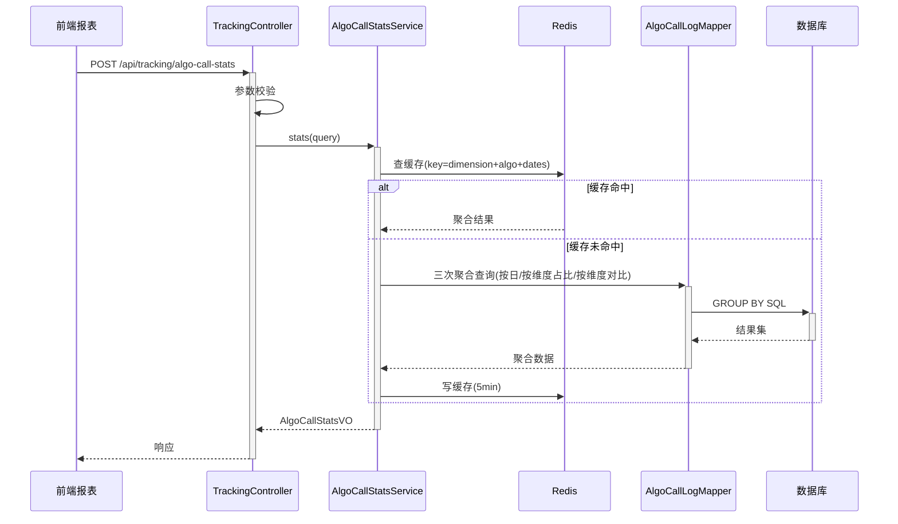

**业务规则：**
| 规则编号 | 规则描述 | 校验时机 | 不满足时的处理 |
|----------|----------|----------|--------------|
| R12 | dimension 合法 | 调用时 | 返回 TRACK_001 |
| R13 | 日期范围 ≤90 天 | 调用时 | 返回 TRACK_003 |
| R14 | 聚合结果缓存 5 分钟 | 查询时 | 缓存未命中则查 DB 并回填 |

**异常场景：**
| 异常场景 | 处理方式 |
|----------|----------|
| Redis 不可用 | 降级直查 DB，记 WARN |
| 聚合查询超时 | 返回 TRACK 超时错误，前端展示兜底空图 |

**并发控制：**
- 并发场景：多用户并发查看报表。
- 控制策略：读多写少，Redis 缓存兜底；缓存击穿用互斥锁（singleflight）单回源。

**状态机设计：** 不涉及。

### 5.4 前端模块（library-frontend）

> 说明：前端模块为表现层设计，无后端表结构，按页面/组件维度展开。

#### 5.4.1 页面结构设计

##### 5.4.1.1 算法演示页面（F06/F07/F08）

- 路由：`/algorithm-demo`
- 布局：顶部三个 Tab + 右上角「导出」按钮 + 下方报表区。
- Tab 结构：

| Tab 编号 | Tab 名称 | 展示内容 | 对应接口 |
|----------|----------|----------|----------|
| Tab1 | HelloWorld | 调用结果 message 展示 | W01 GET /api/algorithm/hello-world |
| Tab2 | 哈希算法 | 输入文本 + 算法下拉 + 摘要结果展示 | W02 POST /api/algorithm/hash |
| Tab3 | 冒泡排序 | 输入数组 + 排序结果 + 比较/交换次数展示 | W03 POST /api/algorithm/bubble-sort |

- 导出按钮：根据当前激活 Tab 调用 W04，触发文件下载。
- 报表区：维度切换（人员类型/层级/部门）+ 三种图表（折线/饼图/柱状图），调用 W05。

##### 5.4.1.x 枚举与常量定义

| 枚举名称 | 取值 | 含义 | 关联字段 |
|----------|------|------|----------|
| TabKeyEnum | hello-world | HelloWorld Tab | 前端 activeTab |
| TabKeyEnum | hash | 哈希 Tab | 前端 activeTab |
| TabKeyEnum | bubble-sort | 冒泡排序 Tab | 前端 activeTab |
| FrontDimensionEnum | USER_TYPE | 人员类型维度 | 报表 dimension |
| FrontDimensionEnum | USER_LEVEL | 人员层级维度 | 报表 dimension |
| FrontDimensionEnum | DEPARTMENT | 人员部门维度 | 报表 dimension |

#### 5.4.2 子功能详细设计

##### 5.4.2.1 三 Tab 执行结果展示（F06）

- 处理时序图
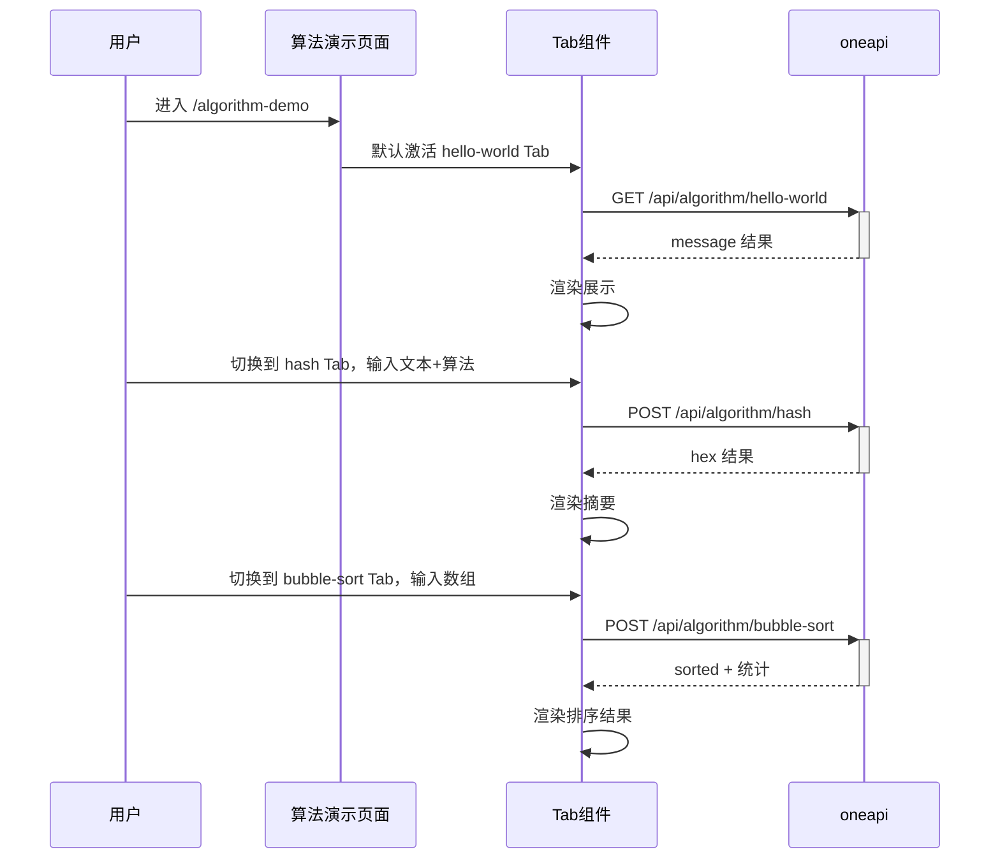

**业务规则：**
| 规则编号 | 规则描述 | 校验时机 | 不满足时的处理 |
|----------|----------|----------|--------------|
| R15 | 切换 Tab 触发对应接口调用 | 切换时 | 接口失败展示错误态，不影响其他 Tab |
| R16 | 哈希 Tab 文本非空 | 提交时 | 前端校验拦截，不发起请求 |
| R17 | 冒泡数组长度 1~1000 | 提交时 | 前端校验拦截 |

##### 5.4.2.2 导出按钮（F07）

- 处理时序图
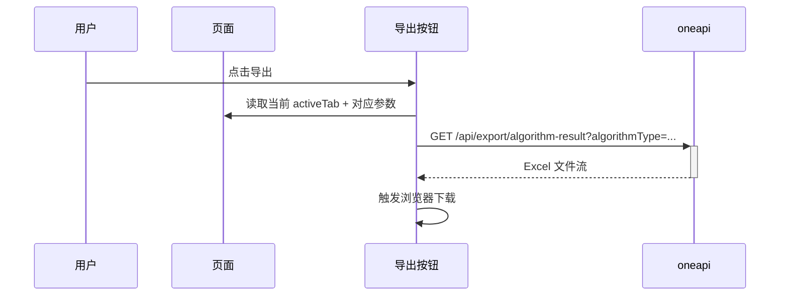

**业务规则：**
| 规则编号 | 规则描述 | 校验时机 | 不满足时的处理 |
|----------|----------|----------|--------------|
| R18 | 导出按当前 Tab 维度 | 点击时 | activeTab 缺失则禁用按钮 |
| R19 | 导出期间按钮 loading | 请求中 | 防重复点击 |

##### 5.4.2.3 报表可视化（F08 前端）

- 处理时序图
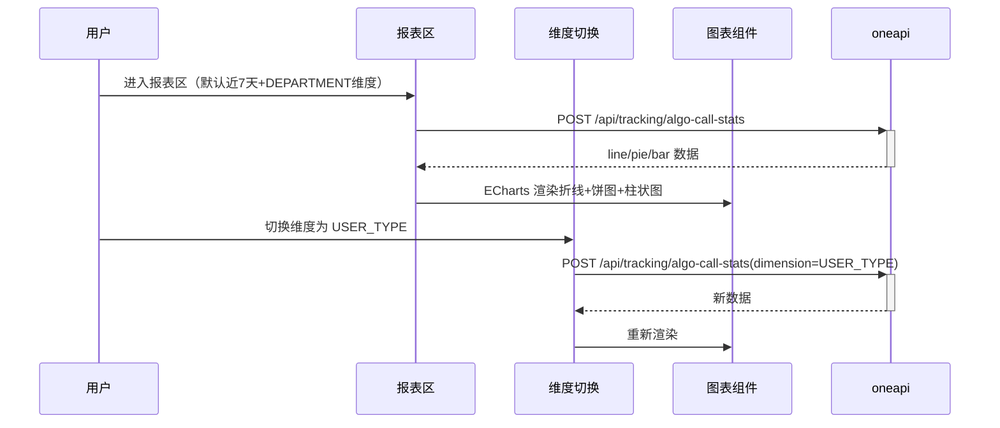

**业务规则：**
| 规则编号 | 规则描述 | 校验时机 | 不满足时的处理 |
|----------|----------|----------|--------------|
| R20 | 三种图表同维度联动 | 渲染时 | 接口失败展示空图兜底 |
| R21 | 维度切换重新拉取 | 切换时 | 防抖 300ms |

**异常场景：**
| 异常场景 | 处理方式 |
|----------|----------|
| 报表接口失败 | 展示空图 + 「数据加载失败」提示，不阻塞 Tab 区 |
| 维度切换频繁 | 防抖 + 取消上一次未完成请求 |

## 6. 非功能性需求设计

### 6.1 高可用性
- 后端多实例部署，算法接口无状态可水平扩展。
- 埋点异步线程池独立，单实例线程池故障不影响算法接口可用性。
- Redis 不可用时报表查询降级直查 DB，不影响可用性。
- 用户中心不可用时维度补全降级置空，不影响埋点落库。

### 6.2 可扩展性
- 算法接口纯计算无状态，水平扩缩容即可承接流量。
- 埋点表按 gmt_create 时间分区（数据量增长后可按月分表），报表查询走索引。
- 报表维度可扩展：StatsDimensionEnum 新增枚举 + 对应 GROUP BY 字段即可支持新维度。
- 导出格式可扩展：ExportFormatEnum 预留，后续可支持 CSV。

### 6.3 稳定性/可靠性
- 埋点队列满丢弃策略保证主链路稳定，不因埋点积压拖垮算法接口。
- 报表查询日期范围 ≤90 天硬限制，避免全表扫描。
- 导出单次 ≤10000 行硬限制，避免 OOM。
- 冒泡排序数组长度 ≤1000，避免长数组排序耗时。

### 6.4 安全性设计

#### 6.4.1 账户系统方案
- 复用既有登录态拦截器（全局统一拦截），算法/导出/报表接口均要求登录态。
- 不自实现登录/注册/找密。

#### 6.4.2 授权&访问控制

##### 6.4.2.1 是否实现水平权限检查
- 报表数据为聚合统计，不涉及单用户私有资源水平越权；不实现单资源水平权限检查。
- 导出内容基于当前用户输入参数生成，无他人私有数据。

##### 6.4.2.2 是否实现垂直权限检查
- 报表查看建议配置角色权限（如「算法报表查看」角色），复用既有角色权限体系。
- 算法演示接口为登录态即可访问的通用能力，不额外做垂直权限。

##### 6.4.2.3 是否检查登录态
- 全局统一拦截器检查登录态，未登录拦截跳转登录页。

#### 6.4.3 数据防护方案

##### 6.4.3.1 是否对敏感数据加密存储
- 埋点表不含身份证/银行卡等强敏感信息；user_id 为业务标识不加密。
- 不涉及敏感数据加密存储。

##### 6.4.3.2 是否对敏感数据展示进行脱敏
- 报表为聚合统计，不展示单用户明细，天然脱敏。
- 哈希接口入参文本若含敏感信息由调用方自行控制；服务端日志不对入参全文打印（仅打印长度）。

### 6.5 监控/统计/日志/告警
- 监控点：算法接口 QPS/RT/错误率；埋点写入成功率；报表查询 RT；导出接口成功率。
- 告警点：埋点线程池拒绝率 >阈值告警；报表查询超时告警；导出失败率告警。
- 日志：算法接口 ERROR 日志；埋点失败 WARN 日志（含 trace_id）。

## 7. 变更三板斧

### 7.1 可监控
- 算法接口：服务埋点（调用次数、处理结果、处理耗时）—— 复用业务埋点表 algo_call_log 即为算法调用埋点本身。
- 埋点统计模块：埋点写入成功率、线程池队列水位、丢弃数。
- 报表查询：缓存命中率、查询 RT、降级直查 DB 次数。
- 导出接口：导出成功率、单次导出行数分布。

### 7.2 可灰度
- 算法演示接口无状态，可按实例灰度（流量按权重切到新版本实例）。
- 报表缓存 key 兼容新旧版本（维度枚举不变），新旧版本可并行。
- 如需按租户灰度，可按 user_id 尾号灰度（本需求未要求租户隔离，暂不实现）。

### 7.3 可应急
- 保留功能开关 `algorithm_demo.enabled`：关闭后算法接口返回降级提示，不影响其他功能。
- 保留埋点开关 `algorithm_tracking.enabled`：关闭后停止埋点，算法接口正常工作。
- 保留报表缓存开关 `algorithm_report.cache_enabled`：关闭后直查 DB。
- 应急以开关为主，避免回滚；如需回滚，埋点表新增字段/索引为向后兼容，回滚不依赖 DDL，安全。
