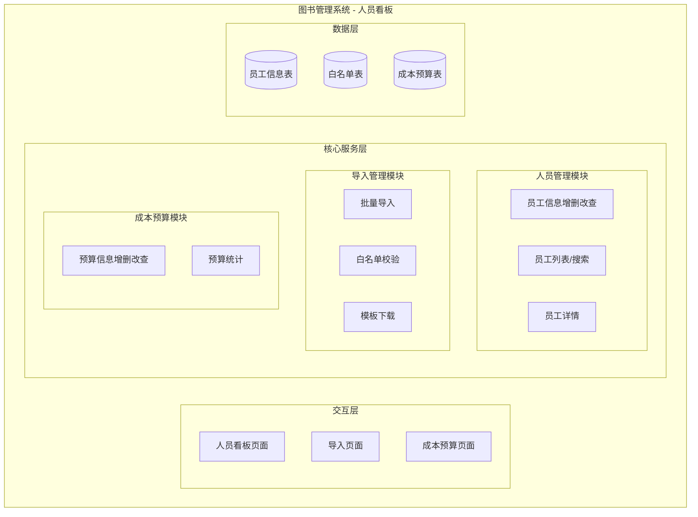
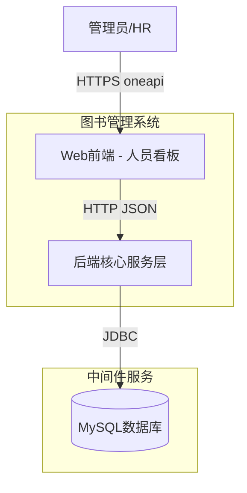
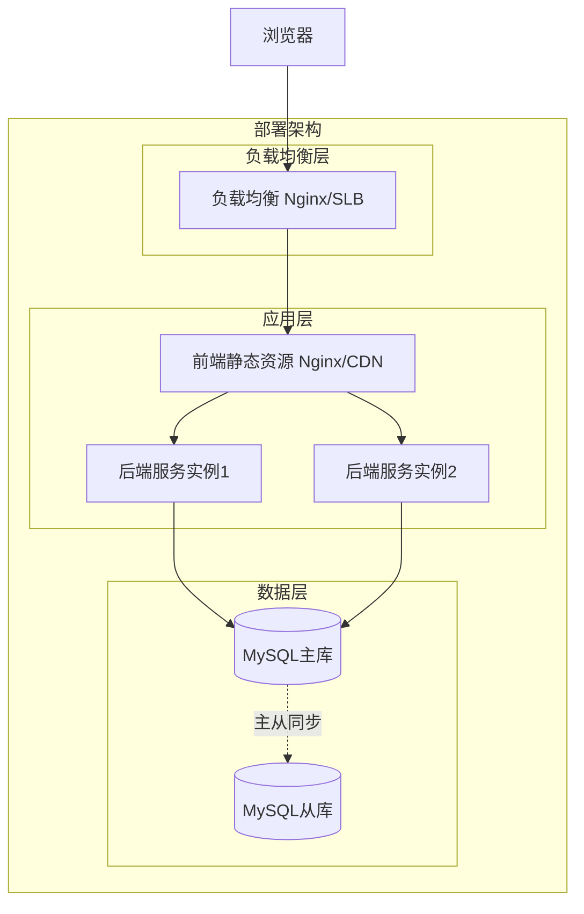
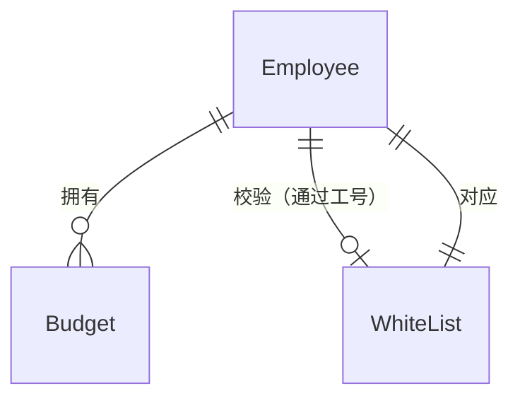
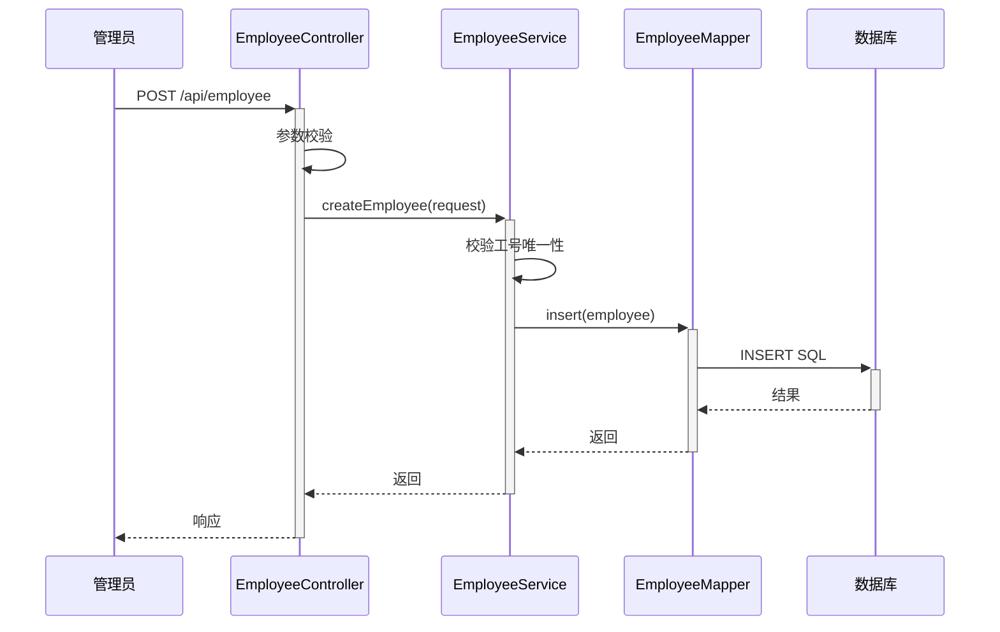
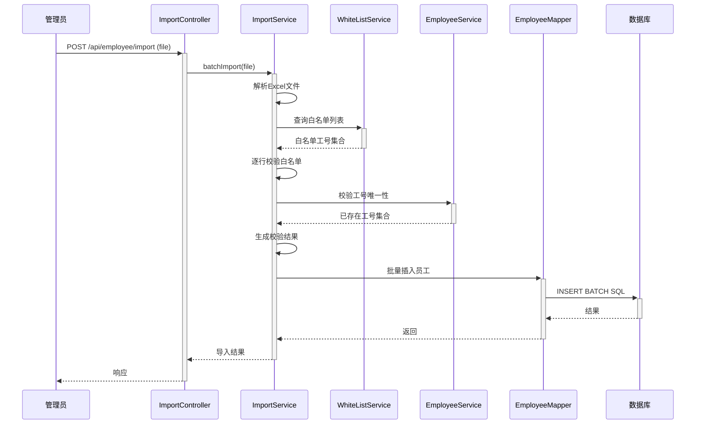
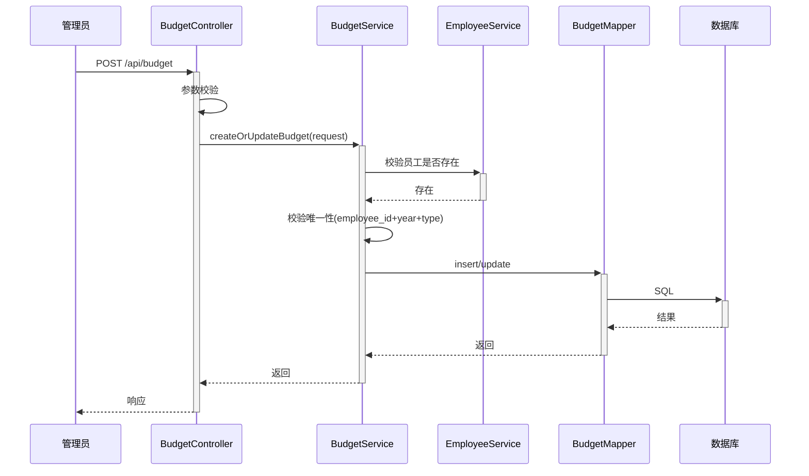

> **文档元信息**
>
> | 项目 | 内容 |
> |------|------|
> | 文档版本 | v1.0 |
> | 作者 | DTCoder |
> | 创建日期 | 2026-08-14 |
> | 需求来源 | 人员看板需求 |
> | 评审状态 | 待评审 |

# 人员看板 系分设计

## 1. 需求与范围

### 背景与目标
在图书管理系统（library）中，开发"人员看板"模块，用于管理图书馆员工/人员的基本信息，支持增删改查（CRUD）、导入导出、成本预算记录（含白名单和批量导入），为图书馆的人员管理提供一站式数字化管理能力。

### 核心功能
1. 人员基本信息管理：记录员工姓名、工号、部门、岗位、联系方式等基础信息
2. 增删改查（CRUD）：支持人员信息的创建、查询、修改、删除
3. 导入功能：支持批量导入人员信息（含白名单过滤）
4. 成本预算记录：记录每个人员的成本预算信息
5. 白名单管理：导入时支持白名单校验，仅允许白名单中的人员导入
6. 批量导入：支持Excel/CSV格式批量导入

### 排除范围
- 不涉及组织架构树管理（仅记录部门/岗位名称）
- 不涉及薪酬计算
- 不涉及考勤管理
- 不涉及人员排班管理

### 需求功能清单与优先级

| 编号 | 功能点 | 优先级 | 需求原始描述 | 备注 |
|------|--------|--------|-------------|------|
| F01 | 人员基本信息录入 | P0 | 记录员工的基本信息 | 姓名、工号、部门、岗位、联系方式等 |
| F02 | 人员列表查询 | P0 | 看板展示 | 支持分页、搜索、筛选 |
| F03 | 人员信息修改 | P0 | 增删改查 | 更新人员基本信息 |
| F04 | 人员删除 | P0 | 增删改查 | 支持逻辑删除 |
| F05 | 人员详情查看 | P0 | 增删改查 | 查看单条完整信息 |
| F06 | 批量导入人员 | P0 | 导入、批量导入 | 支持Excel/CSV格式 |
| F07 | 白名单校验导入 | P1 | 白名单 | 导入时校验白名单，仅白名单内人员可导入 |
| F08 | 成本预算记录 | P1 | 记录成本预算 | 记录每个人员的成本预算信息 |
| F09 | 成本预算编辑 | P1 | 记录成本预算 | 更新成本预算 |
| F10 | 导入模板下载 | P1 | 导入 | 提供标准导入模板下载 |

### 假设与待确认项

| 编号 | 假设/待确认内容 | 当前假设 | 确认状态 |
|------|-----------------|----------|----------|
| A01 | 白名单来源 | 白名单为独立维护的名单记录，导入时进行匹配校验 | 待确认 |
| A02 | 成本预算字段 | 包含年度预算金额、预算类型、预算周期 | 待确认 |
| A03 | 导入格式 | 默认支持Excel(.xlsx)格式，CSV为备选 | 待确认 |
| A04 | 人员唯一标识 | 使用工号(employee_no)作为业务唯一标识 | 待确认 |
| A05 | 删除方式 | 采用逻辑删除(is_deleted) | 待确认 |
| A06 | 部门/岗位 | 使用字符串字段记录，不关联组织架构模块 | 待确认 |

## 2. 架构与模块

### 功能架构



- **交互层说明**：Web 前端页面，包含人员看板主页面、导入页面、成本预算页面
- **核心服务层说明**：后端 Spring Boot 服务，按职责划分为三个模块
- **数据层说明**：MySQL 数据库，三张核心表

**模块清单**

| 模块 | 职责 | 依赖 |
|------|------|------|
| 人员管理模块 | 员工基本信息增删改查、列表展示、搜索筛选 | 无 |
| 导入管理模块 | 批量导入员工、白名单校验、模板下载 | 人员管理模块、白名单 |
| 成本预算模块 | 人员成本预算管理、预算关联 | 人员管理模块 |

### 应用集成架构



**集成关系说明：**

| 调用方 | 被调用方 | 协议 | 接口类型 | 说明 |
|--------|----------|------|----------|------|
| 用户浏览器 | 前端页面 | HTTPS | oneapi REST | 页面访问 |
| 前端 | 后端API | HTTP | REST JSON | 数据交互 |
| 后端服务 | 数据库 | JDBC | SQL | 数据持久化 |

### 部署架构



**部署说明：**
- **负载均衡层**：Nginx 或云 SLB 分发流量
- **应用层**：前端 Nginx 静态分发，后端 Spring Boot 多实例部署
- **数据层**：MySQL 主从架构，建议容器化部署

## 3. 数据模型与存储

### 实体清单

| 实体名称 | 实体说明 | 所属模块 | 与其他实体的关系 |
|----------|----------|----------|-----------------|
| Employee | 员工基本信息 | 人员管理模块 | 一对多关联 Budget；导入时校验 WhiteList |
| WhiteList | 导入白名单 | 导入管理模块 | 一对一关联 Employee（通过工号） |
| Budget | 成本预算 | 成本预算模块 | 多对一关联 Employee |

### 实体关系图



**模型说明：**
- 一个员工可以有多条成本预算记录（不同年度/周期）
- 白名单通过工号(employee_no)与员工进行匹配校验
- 导入时：系统先校验导入的工号是否在白名单中，仅白名单内的员工可导入成功
- 所有实体共用 tenant_id 实现租户隔离（预留）
- 员工删除采用逻辑删除（is_deleted 字段）

## 4. 接口设计

### 4.1 oneapi（Web 控制台接口）

| 编号 | 接口名称 | 方法 | 路径 | 模块 |
|------|----------|------|------|------|
| W01 | 创建员工 | POST | /api/employee | 人员管理 |
| W02 | 删除员工 | DELETE | /api/employee/{id} | 人员管理 |
| W03 | 更新员工 | PUT | /api/employee/{id} | 人员管理 |
| W04 | 查询员工详情 | GET | /api/employee/{id} | 人员管理 |
| W05 | 分页查询员工列表 | GET | /api/employee/page | 人员管理 |
| W06 | 搜索员工 | GET | /api/employee/search | 人员管理 |
| W07 | 批量导入员工 | POST | /api/employee/import | 导入管理 |
| W08 | 下载导入模板 | GET | /api/employee/import/template | 导入管理 |
| W09 | 白名单列表 | GET | /api/whitelist/page | 导入管理 |
| W10 | 添加白名单 | POST | /api/whitelist | 导入管理 |
| W11 | 删除白名单 | DELETE | /api/whitelist/{id} | 导入管理 |
| W12 | 创建/更新成本预算 | POST | /api/budget | 成本预算 |
| W13 | 查询成本预算 | GET | /api/budget/{employeeId} | 成本预算 |
| W14 | 删除成本预算 | DELETE | /api/budget/{id} | 成本预算 |
| W15 | 分页查询预算列表 | GET | /api/budget/page | 成本预算 |

### 4.2 OpenAPI（对外接口）
- 本项不适用，原因：人员看板为内部管理功能，不对外提供OpenAPI接口

### 4.3 内部接口（Service 层）

| 编号 | 接口名称 | 类 | 方法签名 |
|------|----------|------|----------|
| S01 | 创建员工 | EmployeeService | createEmployee(CreateRequest req) |
| S02 | 删除员工 | EmployeeService | deleteEmployee(Long id) |
| S03 | 更新员工 | EmployeeService | updateEmployee(Long id, UpdateRequest req) |
| S04 | 查询员工 | EmployeeService | getEmployee(Long id) |
| S05 | 分页查询 | EmployeeService | pageEmployee(PageQuery query) |
| S06 | 批量导入 | ImportService | batchImport(MultipartFile file, String mode) |
| S07 | 校验白名单 | WhiteListService | checkWhiteList(String employeeNo) |
| S08 | 创建预算 | BudgetService | createOrUpdateBudget(BudgetRequest req) |
| S09 | 查询预算 | BudgetService | getBudgetByEmployee(Long employeeId, Integer year) |

### 4.4 集成接口（Integration 层）
- 本项不适用，原因：无外部系统集成需求

## 5. 功能模块设计

### 全局约定

**通用出参结构**
```json
{
  "code": "OK",
  "msg": "SUCCESS",
  "data": {}
}
```

**分页出参结构**
```json
{
  "code": "OK",
  "msg": "SUCCESS",
  "data": {
    "total": 100,
    "pageSize": 20,
    "pageNum": 1,
    "list": []
  }
}
```

**错误码格式：** {MODULE}_{SEQ}，如 `EMPLOYEE_001`、`BUDGET_001`、`IMPORT_001`

**模块映射表**

| 模块 | 模块代码前缀 | 错误码前缀 |
|------|-------------|-----------|
| 人员管理模块 | employee | EMPLOYEE |
| 导入管理模块 | import | IMPORT / WHITELIST |
| 成本预算模块 | budget | BUDGET |

### 5.1 人员管理模块（employee）

#### 5.1.1 表结构设计

##### employee（员工基本信息表）

| 字段名 | 数据类型 | 约束 | 默认值 | 说明 |
|--------|----------|------|--------|------|
| id | bigint | PK, 自增 | - | 系统自增主键 |
| tenant_id | varchar(32) | NOT NULL | '' | 租户ID（预留） |
| employee_no | varchar(32) | NOT NULL, UNIQUE | - | 员工工号（业务唯一标识） |
| name | varchar(64) | NOT NULL | - | 员工姓名 |
| gender | varchar(8) | NOT NULL | '' | 性别 |
| department | varchar(128) | NOT NULL | '' | 部门 |
| position | varchar(128) | NOT NULL | '' | 岗位 |
| mobile | varchar(20) | NOT NULL | '' | 手机号 |
| email | varchar(128) | NOT NULL | '' | 邮箱 |
| hire_date | date | NOT NULL | - | 入职日期 |
| is_deleted | tinyint(1) | NOT NULL | 0 | 逻辑删除标记：0-未删除，1-已删除 |
| is_active | tinyint(1) | NOT NULL | 1 | 在职状态：1-在职，0-离职 |
| gmt_create | datetime | NOT NULL | CURRENT_TIMESTAMP | 创建时间 |
| gmt_modified | datetime | NOT NULL | CURRENT_TIMESTAMP | 修改时间 |

**索引：**
- PK: `pk_employee` (id)
- UK: `uk_employee_no` (employee_no, tenant_id)
- IDX: `idx_employee_department` (department)
- IDX: `idx_employee_name` (name)
- IDX: `idx_employee_is_deleted` (is_deleted)

##### 枚举与常量定义

| 枚举名称 | 取值 | 含义 | 关联字段 |
|----------|------|------|----------|
| gender_type | MALE / FEMALE / UNKNOWN | 性别 | employee.gender |
| active_status | 1-在职, 0-离职 | 在职状态 | employee.is_active |
| delete_flag | 0-未删除, 1-已删除 | 删除标记 | employee.is_deleted |

#### 5.1.2 接口详细设计

##### W01 创建员工

- **URI**: POST /api/employee
- **描述**: 创建新员工记录
- **入参**:

| 参数名称 | 类型 | 是否必填 | 描述 |
|----------|------|----------|------|
| employee_no | String | 是 | 员工工号 |
| name | String | 是 | 员工姓名 |
| gender | String | 否 | 性别 |
| department | String | 否 | 部门 |
| position | String | 否 | 岗位 |
| mobile | String | 否 | 手机号 |
| email | String | 否 | 邮箱 |
| hire_date | String | 否 | 入职日期(yyyy-MM-dd) |

- **出参**:

| 参数名称 | 类型 | 描述 |
|----------|------|------|
| code | String | 结果code |
| msg | String | 提示信息 |
| data | Object | 员工信息 |

- **错误码**:

| 错误码 | 说明 |
|--------|------|
| EMPLOYEE_001 | 工号已存在 |
| EMPLOYEE_002 | 参数校验失败 |

- **业务规则**: 工号唯一校验；必填项校验

- **请求示例**:
```json
{
  "employee_no": "EMP20240001",
  "name": "张三",
  "gender": "MALE",
  "department": "技术部",
  "position": "开发工程师",
  "mobile": "13800138000",
  "email": "zhangsan@library.com",
  "hire_date": "2024-01-01"
}
```

- **响应示例**:
```json
{
  "code": "OK",
  "msg": "SUCCESS",
  "data": {
    "id": 1,
    "employee_no": "EMP20240001",
    "name": "张三",
    "department": "技术部",
    "position": "开发工程师"
  }
}
```

##### W02 删除员工

- **URI**: DELETE /api/employee/{id}
- **描述**: 逻辑删除员工记录
- **入参**:

| 参数名称 | 类型 | 是否必填 | 描述 |
|----------|------|----------|------|
| id | Long | 是 | 员工ID（路径参数） |

- **错误码**:

| 错误码 | 说明 |
|--------|------|
| EMPLOYEE_003 | 员工不存在 |

- **业务规则**: 逻辑删除，将 is_deleted 置为1；删除时检查关联预算数据

##### W03 更新员工

- **URI**: PUT /api/employee/{id}
- **描述**: 更新员工信息
- **入参**:

| 参数名称 | 类型 | 是否必填 | 描述 |
|----------|------|----------|------|
| id | Long | 是 | 员工ID（路径参数） |
| name | String | 否 | 员工姓名 |
| gender | String | 否 | 性别 |
| department | String | 否 | 部门 |
| position | String | 否 | 岗位 |
| mobile | String | 否 | 手机号 |
| email | String | 否 | 邮箱 |
| hire_date | String | 否 | 入职日期 |
| is_active | Integer | 否 | 在职状态 |

- **错误码**:

| 错误码 | 说明 |
|--------|------|
| EMPLOYEE_003 | 员工不存在 |
| EMPLOYEE_002 | 参数校验失败 |

##### W04 查询员工详情

- **URI**: GET /api/employee/{id}
- **描述**: 查询单个员工完整信息
- **入参**:

| 参数名称 | 类型 | 是否必填 | 描述 |
|----------|------|----------|------|
| id | Long | 是 | 员工ID（路径参数） |

##### W05 分页查询员工列表

- **URI**: GET /api/employee/page
- **描述**: 分页查询员工列表
- **入参**:

| 参数名称 | 类型 | 是否必填 | 描述 |
|----------|------|----------|------|
| pageNum | Integer | 否 | 页码，默认1 |
| pageSize | Integer | 否 | 每页条数，默认20 |
| department | String | 否 | 部门筛选 |
| keyword | String | 否 | 关键字搜索（姓名/工号） |
| is_active | Integer | 否 | 在职状态筛选 |

#### 5.1.3 子功能详细设计

##### 5.1.3.1 创建员工（F01）

- **处理时序图**


**业务规则：**
| 规则编号 | 规则描述 | 校验时机 | 不满足时的处理 |
|----------|----------|----------|--------------|
| R01 | 工号（employee_no）全局唯一 | 创建时 | 返回 EMPLOYEE_001，提示"工号已存在" |
| R02 | 员工姓名、工号为必填项 | 创建时 | 返回 EMPLOYEE_002，提示"必填参数缺失" |

**异常场景：**
| 异常场景 | 处理方式 |
|----------|----------|
| 工号重复 | 返回错误码，提示用户工号已存在 |
| 数据库写入失败 | 回滚事务，返回系统异常 |

**并发控制：**
- 并发场景：多人同时创建同一工号员工
- 控制策略：数据库唯一索引保证工号不重复

##### 5.1.3.2 分页查询员工列表（F02）

**业务规则：**
| 规则编号 | 规则描述 | 校验时机 | 不满足时的处理 |
|----------|----------|----------|--------------|
| R03 | 默认只查询未删除(is_deleted=0)的员工 | 查询时 | - |
| R04 | 支持按部门、姓名/工号模糊搜索 | 查询时 | - |

**异常场景：**
| 异常场景 | 处理方式 |
|----------|----------|
| 分页参数异常 | 使用默认分页值（pageNum=1, pageSize=20） |

### 5.2 导入管理模块（import）

#### 5.2.1 表结构设计

##### whitelist（导入白名单表）

| 字段名 | 数据类型 | 约束 | 默认值 | 说明 |
|--------|----------|------|--------|------|
| id | bigint | PK, 自增 | - | 系统自增主键 |
| tenant_id | varchar(32) | NOT NULL | '' | 租户ID（预留） |
| employee_no | varchar(32) | NOT NULL | - | 员工工号（白名单匹配依据） |
| name | varchar(64) | NOT NULL | '' | 员工姓名 |
| remark | varchar(256) | NOT NULL | '' | 备注说明 |
| is_deleted | tinyint(1) | NOT NULL | 0 | 逻辑删除标记 |
| gmt_create | datetime | NOT NULL | CURRENT_TIMESTAMP | 创建时间 |
| gmt_modified | datetime | NOT NULL | CURRENT_TIMESTAMP | 修改时间 |

**索引：**
- PK: `pk_whitelist` (id)
- UK: `uk_whitelist_employee_no` (employee_no, tenant_id)
- IDX: `idx_whitelist_is_deleted` (is_deleted)

##### 枚举与常量定义

| 枚举名称 | 取值 | 含义 | 关联字段 |
|----------|------|------|----------|
| delete_flag | 0-未删除, 1-已删除 | 删除标记 | whitelist.is_deleted |

#### 5.2.2 接口详细设计

##### W07 批量导入员工

- **URI**: POST /api/employee/import
- **描述**: 通过文件批量导入员工信息，导入时自动校验白名单
- **入参**:

| 参数名称 | 类型 | 是否必填 | 描述 |
|----------|------|----------|------|
| file | MultipartFile | 是 | 导入文件（Excel .xlsx格式） |
| mode | String | 否 | 导入模式：STRICT(仅白名单), SKIP(跳过白名单校验) |

- **出参**:

| 参数名称 | 类型 | 描述 |
|----------|------|------|
| code | String | 结果code |
| msg | String | 提示信息 |
| data | Object | 导入结果概要 |

- **错误码**:

| 错误码 | 说明 |
|--------|------|
| IMPORT_001 | 文件格式不支持 |
| IMPORT_002 | 文件解析失败 |
| IMPORT_003 | 导入数据为空 |
| IMPORT_004 | 白名单校验失败，存在不匹配工号 |

- **业务规则**: 默认 STRICT 模式；白名单校验仅匹配工号；导入成功的事务性写入

- **响应示例**:
```json
{
  "code": "OK",
  "msg": "SUCCESS",
  "data": {
    "totalCount": 100,
    "successCount": 95,
    "failCount": 5,
    "failRecords": [
      {"row": 3, "reason": "工号不在白名单中"},
      {"row": 7, "reason": "工号已存在"}
    ]
  }
}
```

##### W08 下载导入模板

- **URI**: GET /api/employee/import/template
- **描述**: 下载标准的人员导入 Excel 模板

##### W09 白名单列表

- **URI**: GET /api/whitelist/page
- **描述**: 分页查询白名单列表
- **入参**:

| 参数名称 | 类型 | 是否必填 | 描述 |
|----------|------|----------|------|
| pageNum | Integer | 否 | 页码，默认1 |
| pageSize | Integer | 否 | 每页条数，默认20 |
| keyword | String | 否 | 关键字搜索（工号/姓名） |

##### W10 添加白名单

- **URI**: POST /api/whitelist
- **描述**: 新增白名单记录
- **入参**:

| 参数名称 | 类型 | 是否必填 | 描述 |
|----------|------|----------|------|
| employee_no | String | 是 | 员工工号 |
| name | String | 是 | 员工姓名 |
| remark | String | 否 | 备注 |

- **错误码**:

| 错误码 | 说明 |
|--------|------|
| WHITELIST_001 | 该工号已在白名单中 |

##### W11 删除白名单

- **URI**: DELETE /api/whitelist/{id}
- **描述**: 删除白名单记录

#### 5.2.3 子功能详细设计

##### 5.2.3.1 批量导入员工（F06）

- **处理时序图**


**业务规则：**
| 规则编号 | 规则描述 | 校验时机 | 不满足时的处理 |
|----------|----------|----------|--------------|
| R05 | 导入文件格式必须为.xlsx | 导入时 | 返回 IMPORT_001 |
| R06 | 导入模板列头必须与标准模板一致 | 导入时 | 返回 IMPORT_002 |
| R07 | STRICT模式下，工号必须在白名单中 | 导入时 | 该行跳过，记录失败原因 |
| R08 | 导入的工号不能与已有员工重复 | 导入时 | 该行跳过，记录失败原因 |
| R09 | 同一批导入中工号不能重复 | 导入时 | 该行跳过，记录失败原因 |
| R10 | 导入数据为空时直接返回失败 | 导入时 | 返回 IMPORT_003 |

**异常场景：**
| 异常场景 | 处理方式 |
|----------|----------|
| 文件格式错误 | 返回 IMPORT_001，提示"仅支持.xlsx格式" |
| 文件解析异常 | 返回 IMPORT_002，提示"文件解析失败" |
| 部分行导入失败 | 整体事务不中断，记录失败行及原因，返回成功/失败计数 |
| 网络中断 | 事务回滚，不产生脏数据 |

**并发控制：**
- 并发场景：多人同时导入
- 控制策略：导入操作采用逐行校验 + 批量插入，利用数据库唯一索引保证工号不重复。无需额外锁。

##### 5.2.3.2 白名单校验导入（F07）

**业务规则：**
| 规则编号 | 规则描述 | 校验时机 | 不满足时的处理 |
|----------|----------|----------|--------------|
| R11 | STRICT模式：所有导入工号必须存在于白名单中 | 导入校验时 | 不在白名单中的工号跳过 |
| R12 | SKIP模式：跳过白名单校验，直接导入 | 导入校验时 | - |

**异常场景：**
| 异常场景 | 处理方式 |
|----------|----------|
| 白名单为空但使用STRICT模式 | 所有导入行均失败，提示"白名单为空，请先添加白名单" |

### 5.3 成本预算模块（budget）

#### 5.3.1 表结构设计

##### budget（成本预算表）

| 字段名 | 数据类型 | 约束 | 默认值 | 说明 |
|--------|----------|------|--------|------|
| id | bigint | PK, 自增 | - | 系统自增主键 |
| tenant_id | varchar(32) | NOT NULL | '' | 租户ID（预留） |
| employee_id | bigint | NOT NULL | - | 关联员工ID（外键逻辑） |
| budget_year | int(4) | NOT NULL | - | 预算年度 |
| budget_type | varchar(32) | NOT NULL | '' | 预算类型 |
| budget_amount | decimal(18,2) | NOT NULL | 0.00 | 预算金额 |
| used_amount | decimal(18,2) | NOT NULL | 0.00 | 已使用金额 |
| currency | varchar(8) | NOT NULL | 'CNY' | 币种 |
| remark | varchar(256) | NOT NULL | '' | 备注 |
| is_deleted | tinyint(1) | NOT NULL | 0 | 逻辑删除标记 |
| gmt_create | datetime | NOT NULL | CURRENT_TIMESTAMP | 创建时间 |
| gmt_modified | datetime | NOT NULL | CURRENT_TIMESTAMP | 修改时间 |

**索引：**
- PK: `pk_budget` (id)
- UK: `uk_budget_employee_year` (employee_id, budget_year, budget_type, tenant_id)
- IDX: `idx_budget_employee_id` (employee_id)
- IDX: `idx_budget_year` (budget_year)
- IDX: `idx_budget_is_deleted` (is_deleted)

##### 枚举与常量定义

| 枚举名称 | 取值 | 含义 | 关联字段 |
|----------|------|------|----------|
| budget_type | SALARY / TRAINING / TRAVEL / EQUIPMENT / OTHER | 预算类型 | budget.budget_type |
| budget_year | yyyy格式, 如2024 | 预算年度 | budget.budget_year |
| delete_flag | 0-未删除, 1-已删除 | 删除标记 | budget.is_deleted |

#### 5.3.2 接口详细设计

##### W12 创建/更新成本预算

- **URI**: POST /api/budget
- **描述**: 创建或更新员工成本预算记录
- **入参**:

| 参数名称 | 类型 | 是否必填 | 描述 |
|----------|------|----------|------|
| id | Long | 否 | 预算ID，为空则创建，非空则更新 |
| employee_id | Long | 是 | 关联员工ID |
| budget_year | Integer | 是 | 预算年度 |
| budget_type | String | 是 | 预算类型 |
| budget_amount | BigDecimal | 是 | 预算金额 |
| used_amount | BigDecimal | 否 | 已使用金额，默认0 |
| currency | String | 否 | 币种，默认CNY |
| remark | String | 否 | 备注 |

- **错误码**:

| 错误码 | 说明 |
|--------|------|
| BUDGET_001 | 该员工该年度该类型预算已存在 |
| BUDGET_002 | 员工不存在 |
| BUDGET_003 | 预算金额不能为负数 |

- **业务规则**: 同一员工同一年度同一预算类型仅允许一条记录；更新时如已存在则覆盖

##### W13 查询成本预算

- **URI**: GET /api/budget/{employeeId}
- **描述**: 查询指定员工的所有成本预算记录
- **入参**:

| 参数名称 | 类型 | 是否必填 | 描述 |
|----------|------|----------|------|
| employeeId | Long | 是 | 员工ID（路径参数） |
| budgetYear | Integer | 否 | 预算年度筛选 |

##### W14 删除成本预算

- **URI**: DELETE /api/budget/{id}
- **描述**: 删除成本预算记录

##### W15 分页查询预算列表

- **URI**: GET /api/budget/page
- **描述**: 分页查询所有预算记录
- **入参**:

| 参数名称 | 类型 | 是否必填 | 描述 |
|----------|------|----------|------|
| pageNum | Integer | 否 | 页码，默认1 |
| pageSize | Integer | 否 | 每页条数，默认20 |
| employeeId | Long | 否 | 员工ID筛选 |
| budgetYear | Integer | 否 | 预算年度筛选 |
| budgetType | String | 否 | 预算类型筛选 |

#### 5.3.3 子功能详细设计

##### 5.3.3.1 创建成本预算（F08）

- **处理时序图**


**业务规则：**
| 规则编号 | 规则描述 | 校验时机 | 不满足时的处理 |
|----------|----------|----------|--------------|
| R13 | 关联员工必须存在 | 创建/更新时 | 返回 BUDGET_002 |
| R14 | 同一员工+年度+预算类型唯一 | 创建时 | 如已存在，走更新逻辑 |
| R15 | 预算金额不能为负数 | 创建/更新时 | 返回 BUDGET_003 |
| R16 | 已使用金额不能超过预算金额 | 更新时 | 返回 BUDGET_004 |

**异常场景：**
| 异常场景 | 处理方式 |
|----------|----------|
| 关联员工被删除 | 返回 BUDGET_002，提示"员工不存在" |
| 预算金额为负数 | 返回 BUDGET_003，提示"预算金额不能为负数" |

**并发控制：**
- 并发场景：多人同时编辑同一员工预算
- 控制策略：使用数据库唯一索引(employee_id, budget_year, budget_type)保证不重复创建；使用乐观锁（version字段可选）防止并发覆盖

## 6. 非功能性需求设计

### 6.1 高可用性
- 后端服务采用多实例部署（至少2副本），避免单点故障
- 数据库采用主从架构，主库故障时从库可切换
- 导入操作采用异步处理机制，避免大文件导入阻塞服务
- 前端静态资源通过 CDN 或 Nginx 缓存分发

### 6.2 可扩展性
- 后端服务支持横向扩展，新增实例无需修改代码
- 数据库设计预留 tenant_id 字段，支持多租户扩展
- 导入模块支持扩展不同的文件格式（Excel/CSV）

### 6.3 稳定性/可靠性
- 导入操作的事务性保证：批量导入采用逐行校验+批量插入，利用数据库事务保证数据一致性
- 输入校验：所有接口做参数校验，防止 SQL 注入和 XSS 攻击
- 文件大小限制：导入文件限制最大 10MB，防止大文件内存溢出

### 6.4 安全性设计

#### 6.4.1 账户系统方案
- 本模块复用图书管理系统现有账户体系，不单独实现登录注册

#### 6.4.2 授权&访问控制

##### 6.4.2.1 是否实现水平权限检查
- 预留 tenant_id 实现租户级数据隔离，后续通过 request 上下文获取当前租户信息过滤数据

##### 6.4.2.2 是否实现垂直权限检查
- 人员管理功能建议仅管理员/HR角色可访问，通过角色权限配置控制

##### 6.4.2.3 是否检查登录态
- 全局统一拦截器校验登录态，/api/* 接口均需登录

#### 6.4.3 数据防护方案

##### 6.4.3.1 是否对敏感数据加密存储
- 手机号、邮箱等个人信息建议加密存储（AES-256）

##### 6.4.3.2 是否对敏感数据展示进行脱敏
- 前端展示列表时，手机号中间4位脱敏（如 138****8000）
- 日志打印时对敏感字段脱敏

### 6.5 监控/统计/日志
- 关键接口埋点：员工创建、导入、预算操作记录操作日志
- 导入操作记录详细日志：文件名称、导入数量、成功/失败数、操作人
- 数据库慢查询监控（超过500ms的SQL记录日志）

## 7. 变更三板斧

### 7.1 可监控
- 关键操作埋点：
  - 员工创建/更新/删除操作 → 记录操作人、时间、操作类型
  - 导入操作 → 记录文件名称、导入总数、成功数、失败数、耗时
  - 预算创建/更新 → 记录操作人、金额变化
- 接口响应时间监控：超过 1s 的接口记录慢调用日志
- 数据库连接池监控：活跃连接数、等待队列长度

### 7.2 可灰度
- 本模块为新增功能，不涉及存量功能改造，无需灰度方案
- 如需灰度，可按租户 ID 尾号进行灰度引流（后续多租户场景）

### 7.3 可应急
- 导入功能：可通过配置开关关闭导入功能，避免大文件导入导致系统负载过高
- 数据库操作：所有写操作均有事务保护，异常时自动回滚
- 发布回滚：前后端独立发布，可单独回滚人员看板模块，不影响图书管理系统其他功能