> **文档元信息**
>
> | 项目 | 内容 |
> |------|------|
> | 文档版本 | v1.1 |
> | 作者 | DTCoder |
> | 创建日期 | 2026-08-07 |
> | 需求来源 | helloworld-dtT3DJ |
> | 评审状态 | 待评审 |

# HelloWorld/哈希/冒泡排序 Demo 及调用埋点可视化 系分设计

## 1. 需求与范围

后端提供 helloworld、哈希算法、冒泡排序三个接口；前端新增页面以三 Tab 展示执行结果并提供导出按钮；后端导出接口支持导出各 Tab 结果；后端埋点记录调用次数、调用人及人员维度（类型/层级/部门）；前端在页面上以折线图/饼图/柱状图按多维度可视化展示调用情况。两仓当前为空仓库，本次为全量新建。

**技术栈**：后端 Java + Spring Boot（library-backend）；前端 Vue 3 + ECharts（library-frontend）。接口风格 RESTful（`/api` 前缀），通用出参 `{code, msg, data}`。数据库 MySQL。

### 需求功能清单与优先级

| 编号 | 功能点 | 优先级 | 备注 |
|------|--------|--------|------|
| F01 | helloworld 接口 | P0 | 后端 |
| F02 | 哈希算法接口 | P0 | 后端 |
| F03 | 冒泡排序接口 | P0 | 后端 |
| F04 | 前端三 Tab 展示页 | P0 | 前端 |
| F05 | 前端导出按钮 | P0 | 前端 |
| F06 | 后端导出接口 | P0 | 后端 |
| F07 | 后端调用埋点 | P0 | 后端 |
| F08 | 调用统计查询接口 | P0 | 后端 |
| F09 | 前端可视化报表 | P0 | 前端 |

### 假设与待确认项

| 编号 | 假设/待确认内容 | 默认值（已确认） | 确认状态 |
|------|-----------------|------------------|----------|
| A01 | 调用人身份及人员维度信息来源 | 由统一登录拦截器/网关注入请求上下文（RequestContext），后端从上下文读取 | 已确认 |
| A02 | 哈希算法接口输入与算法类型 | 入参为文本，默认 SHA-256，可选 MD5 | 已确认 |
| A03 | 冒泡排序接口输入 | 整型数组，升序排序，长度 ≤ 1000 | 已确认 |
| A04 | 导出格式 | Excel（.xlsx），每个 Tab 对应一个 Sheet | 已确认 |
| A05 | 统计时间范围 | 支持按时间区间查询，默认近 7 天 | 已确认 |
| A06 | 前端图表库 | ECharts 实现折线图/饼图/柱状图 | 已确认 |

## 2. 架构与模块

### 功能架构

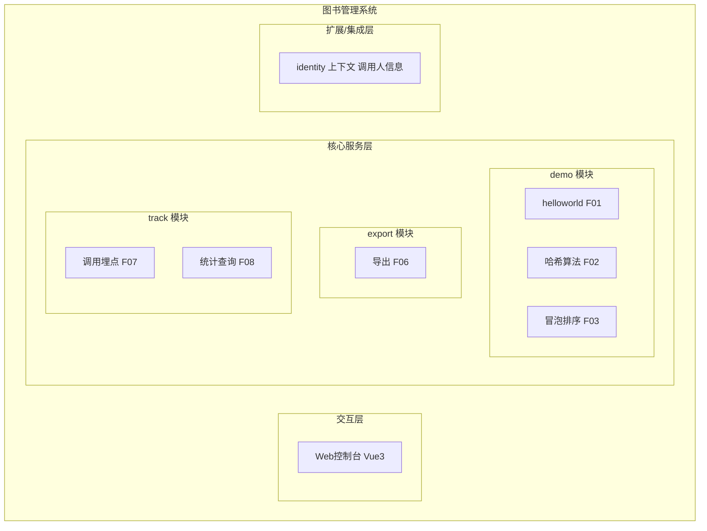

**模块清单**

| 模块 | 职责 | 依赖 |
|------|------|------|
| demo | helloworld/hash/bubbleSort 三接口，执行算法并返回结果 | identity、track |
| export | 导出各 Tab 结果为 Excel | demo |
| track | 调用埋点记录 + 多维度统计查询 | identity |
| identity | 从请求上下文获取调用人 ID/姓名/类型/层级/部门 | 统一登录拦截器 |
| 前端 Demo 页面 | 三 Tab + 导出 + 可视化报表 | 后端 oneapi |

### 应用集成架构

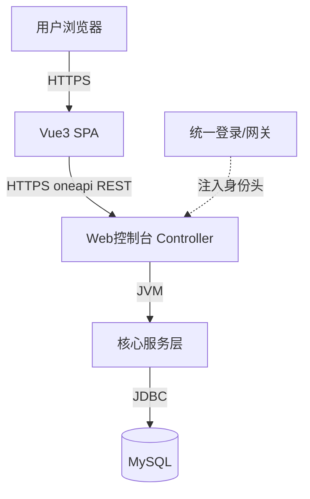

**集成关系说明**

| 调用方 | 被调用方 | 协议 | 接口类型 | 说明 |
|--------|----------|------|----------|------|
| library-frontend | library-backend | HTTPS | oneapi REST | 调用 demo/export/statistics |
| library-backend | MySQL | JDBC | SQL | 埋点写入、统计聚合查询 |
| 统一登录/网关 | library-backend | HTTP Header | 身份注入 | 注入调用人身份维度信息 |

### 部署架构

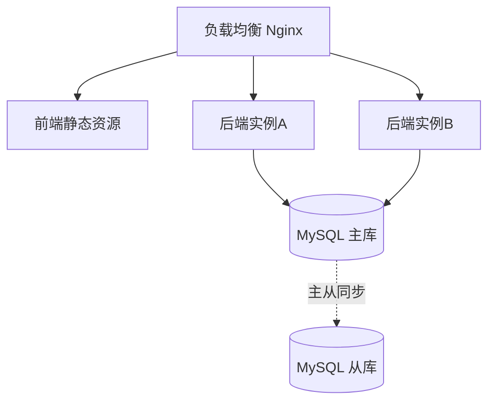

后端多实例（≥2，无单点），MySQL 主从读写分离。

## 3. 数据模型与存储

### 实体清单

| 实体名称 | 实体说明 | 所属模块 | 关系 |
|----------|----------|----------|------|
| biz_call_record | 调用埋点记录，每次接口调用产生一条 | track | 独立实体无外键 |

### 实体关系图

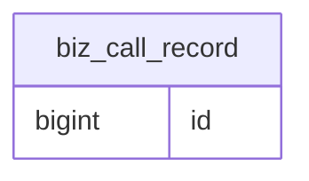

日志型实体，人员维度信息冗余存储便于多维度聚合。无外键关联（遵循 db.md 规范）。

## 4. 接口设计

### 4.1 oneapi（Web 控制台接口）

| 编号 | 接口名称 | 方法 | 路径 | 模块 |
|------|----------|------|------|------|
| W01 | helloworld | POST | /api/demo/helloworld | demo |
| W02 | 哈希算法 | POST | /api/demo/hash | demo |
| W03 | 冒泡排序 | POST | /api/demo/bubble-sort | demo |
| W04 | 导出结果 | GET | /api/demo/export | export |
| W05 | 调用统计查询 | GET | /api/demo/statistics | track |

### 4.2 内部接口（Service 层）

| 编号 | 接口名称 | 类 | 方法签名 |
|------|----------|------|----------|
| S01 | helloworld 服务 | DemoService | `DemoResult helloworld()` |
| S02 | 哈希计算服务 | DemoService | `HashResult hash(HashRequest req)` |
| S03 | 冒泡排序服务 | DemoService | `SortResult bubbleSort(SortRequest req)` |
| S04 | 导出服务 | ExportService | `byte[] export(String bizType, Map params)` |
| S05 | 埋点记录服务 | TrackService | `void recordCall(CallRecord record)` |
| S06 | 统计查询服务 | StatisticsService | `StatisticsVO query(StatisticsQuery query)` |

### 4.3 集成接口（Integration 层）

| 编号 | 接口名称 | 类 | 方法签名 | 说明 |
|------|----------|------|----------|------|
| I01 | 获取调用人上下文 | RequestContextHelper | `CallerContext getCallerContext(HttpServletRequest req)` | 从请求头获取调用人维度信息 |

## 5. 功能模块设计

### 全局约定

- 错误码格式 `{MODULE}_{SEQ}`，前缀：DEMO / EXPORT / TRACK。
- 通用出参 `{code, msg, data}`，`code="OK"` 表示成功。

### 5.1 demo 演示模块

#### 5.1.1 表结构设计

本模块无独立表，埋点写入 track 模块 `biz_call_record`。

#### 5.1.2 枚举与常量定义

| 枚举名称 | 取值 | 含义 | 关联字段 |
|----------|------|------|----------|
| BizTypeEnum | HELLOWORLD / HASH / BUBBLE_SORT | 三业务类型 | biz_call_record.biz_type |
| HashAlgorithmEnum | SHA_256 / MD5 | 哈希算法 | hash 接口 algorithm |
| CallResultEnum | SUCCESS / FAIL | 调用结果 | biz_call_record.result |

#### 5.1.3 接口详细设计

##### W01 helloworld

- **URI**: POST /api/demo/helloworld
- **入参**: 无业务入参（身份信息由请求头注入）
- **出参**: `data.result`(String, "Hello, World!")、`data.timestamp`(String)
- **错误码**: DEMO_001 服务处理异常
- **请求示例**: `{}`
- **响应示例**:
```json
{"code":"OK","msg":"SUCCESS","data":{"result":"Hello, World!","timestamp":"2026-08-07T10:00:00"}}
```

##### W02 哈希算法

- **URI**: POST /api/demo/hash
- **入参**: `text`(String, 必填)、`algorithm`(String, 默认 SHA_256，可选 MD5)
- **出参**: `data.algorithm`、`data.input`、`data.hash`(十六进制摘要)
- **错误码**: DEMO_002 文本不能为空、DEMO_003 不支持的算法、DEMO_001 服务异常
- **请求示例**: `{"text":"hello world","algorithm":"SHA_256"}`
- **响应示例**:
```json
{"code":"OK","msg":"SUCCESS","data":{"algorithm":"SHA_256","input":"hello world","hash":"b94d27b9934d3e08a52e52d7da7dabfac484efe37a5380ee9088f7ace2efcde9"}}
```

##### W03 冒泡排序

- **URI**: POST /api/demo/bubble-sort
- **入参**: `numbers`(Array<Integer>, 必填, 长度 1~1000)
- **出参**: `data.sorted`(Array<Integer>)、`data.costMs`(Long)、`data.size`(Integer)
- **错误码**: DEMO_004 数组不能为空、DEMO_005 长度超限、DEMO_001 服务异常
- **请求示例**: `{"numbers":[5,3,8,1,9,2]}`
- **响应示例**:
```json
{"code":"OK","msg":"SUCCESS","data":{"sorted":[1,2,3,5,8,9],"costMs":1,"size":6}}
```

#### 5.1.4 子功能详细设计

##### F01 helloworld 执行

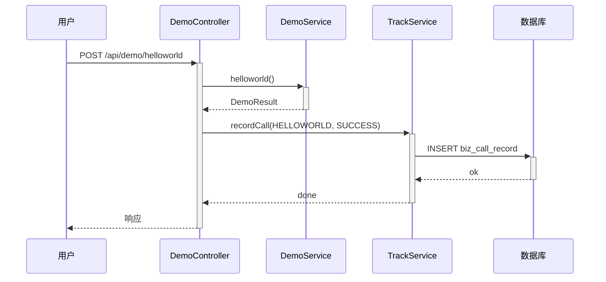

**业务规则**: R01 无业务入参校验；R02 埋点必须记录（失败仅记日志不影响主流程）。

##### F02 哈希执行

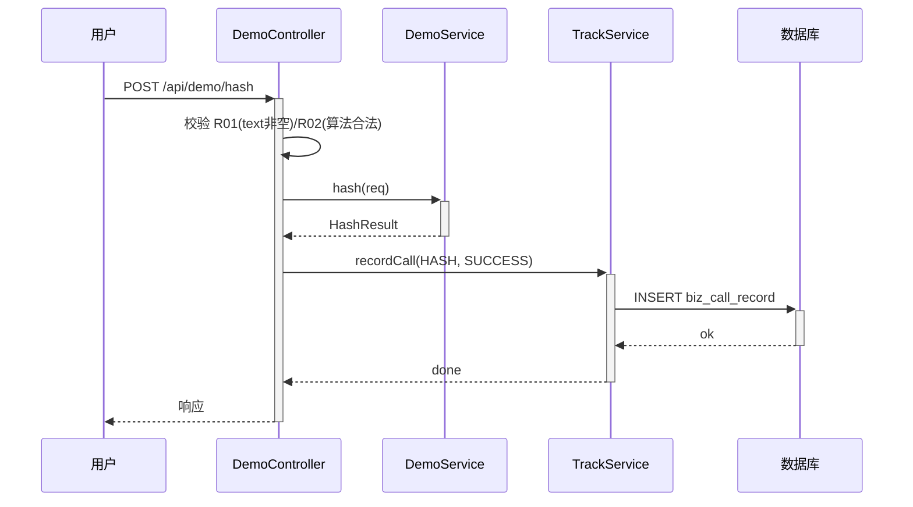

**业务规则**: R01 text 非空→DEMO_002；R02 algorithm ∈ {SHA_256,MD5}→否则 DEMO_003。

##### F03 冒泡排序执行

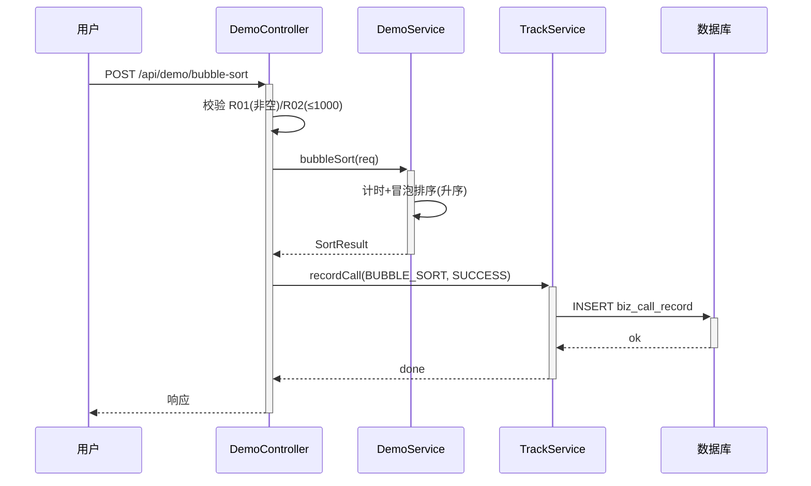

**业务规则**: R01 numbers 非空→DEMO_004；R02 长度 ≤ 1000→否则 DEMO_005。

**并发控制**: 三接口均为无状态纯计算，无并发风险。

### 5.2 export 导出模块

#### 5.2.1 接口详细设计

##### W04 导出结果

- **URI**: GET /api/demo/export
- **入参**: `bizType`(String, 必填, HELLOWORLD/HASH/BUBBLE_SORT)、`numbers`(String, 冒泡排序时需)、`text`(哈希时需)、`algorithm`(哈希时可选)
- **出参**: .xlsx 文件流（Content-Type: application/vnd.openxmlformats-officedocument.spreadsheetml.sheet）
- **错误码**: EXPORT_001 bizType 为空、EXPORT_002 不支持的类型、EXPORT_003 生成异常
- **业务规则**: 按 bizType 调用对应算法生成结果写入 Excel 单 Sheet 返回。

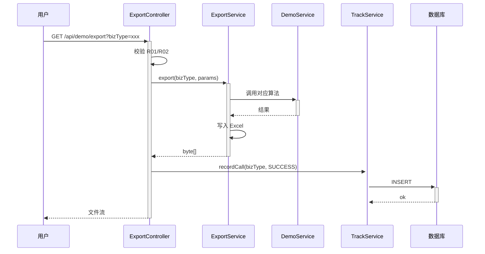

**并发控制**: 只读计算+独立文件生成，无共享可变状态，无并发风险。

### 5.3 track 埋点统计模块

#### 5.3.1 表结构设计

##### biz_call_record

| 字段名 | 数据类型 | 约束 | 默认值 | 说明 |
|--------|----------|------|--------|------|
| id | bigint | PK, 自增 | - | 主键 |
| biz_type | varchar(32) | NOT NULL | '' | 业务类型 |
| caller_id | varchar(64) | NOT NULL | '' | 调用人 ID |
| caller_name | varchar(64) | NOT NULL | '' | 调用人姓名 |
| caller_type | varchar(32) | NOT NULL | '' | 人员类型 |
| caller_level | varchar(32) | NOT NULL | '' | 人员层级 |
| caller_dept | varchar(128) | NOT NULL | '' | 人员部门 |
| cost_ms | bigint | NOT NULL | 0 | 调用耗时(ms) |
| result | varchar(16) | NOT NULL | 'SUCCESS' | 调用结果 |
| gmt_create | datetime | NOT NULL | CURRENT_TIMESTAMP | 创建时间 |
| gmt_modified | datetime | NOT NULL | CURRENT_TIMESTAMP | 修改时间 |

**索引**: PK `pk_biz_call_record`(id); IDX `idx_call_record_biz_type`(biz_type); IDX `idx_call_record_caller_id`(caller_id); IDX `idx_call_record_gmt_create`(gmt_create); IDX `idx_call_record_type_level`(caller_type, caller_level)

##### 枚举定义

| 枚举名称 | 取值 | 含义 | 关联字段 |
|----------|------|------|----------|
| CallResultEnum | SUCCESS / FAIL | 调用结果 | biz_call_record.result |
| StatisticsDimensionEnum | CALLER_TYPE / CALLER_LEVEL / CALLER_DEPT | 统计维度 | statistics 接口 dimension |

#### 5.3.2 接口详细设计

##### W05 调用统计查询

- **URI**: GET /api/demo/statistics
- **入参**: `dimension`(String, 必填)、`bizType`(String, 可选)、`startDate`(yyyy-MM-dd, 默认近7天)、`endDate`(yyyy-MM-dd, 默认今天)
- **出参**: `data.dimension`、`data.total`(Long)、`data.pie`(Array[{name,value}])、`data.bar`({categories,series})、`data.line`({dates,series})
- **错误码**: TRACK_001 dimension 为空、TRACK_002 不支持的维度、TRACK_003 查询异常
- **请求示例**: `GET /api/demo/statistics?dimension=CALLER_TYPE&bizType=HELLOWORLD&startDate=2026-08-01&endDate=2026-08-07`
- **响应示例**:
```json
{"code":"OK","msg":"SUCCESS","data":{"dimension":"CALLER_TYPE","total":150,"pie":[{"name":"正式员工","value":80},{"name":"外包","value":50}],"bar":{"categories":["正式员工","外包"],"series":[{"name":"调用次数","data":[80,50]}]},"line":{"dates":["2026-08-01","2026-08-02"],"series":[{"name":"正式员工","data":[10,15]}]}}}
```

#### 5.3.3 子功能详细设计

##### F07 调用埋点记录

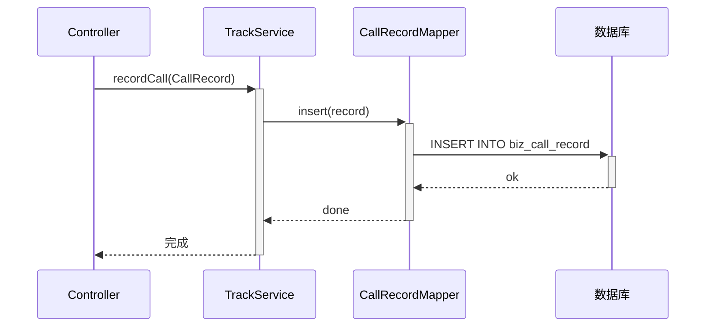

**业务规则**: R01 biz_type 非空；R02 埋点失败仅记日志不阻断主流程（降级）。**并发控制**: 独立 INSERT，自增主键，无并发风险。

##### F08 统计查询

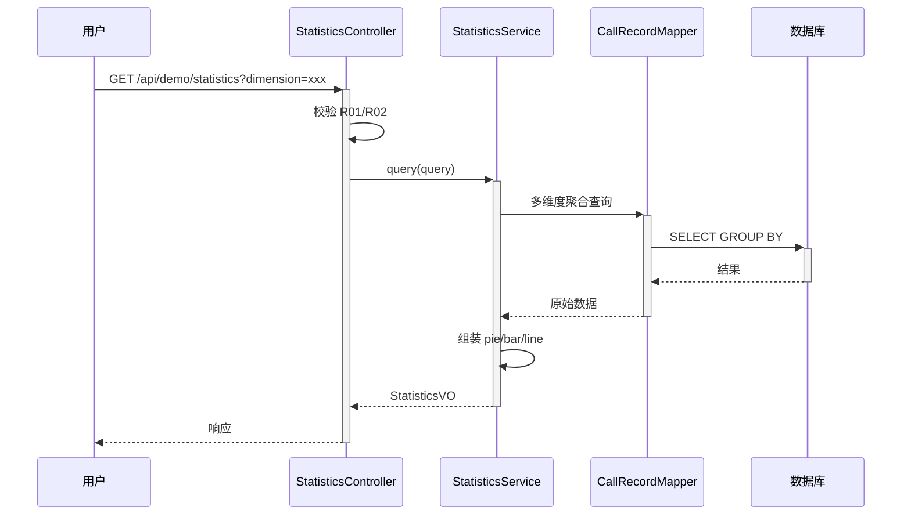

**业务规则**: R01 dimension 非空→TRACK_001；R02 ∈ {CALLER_TYPE,CALLER_LEVEL,CALLER_DEPT}→否则 TRACK_002。**并发控制**: 只读 SELECT 走从库，无并发风险。

### 5.4 前端 Demo 页面模块（library-frontend）

#### 页面布局

```
┌─────────────────────────────────────────────┐
│  Demo 演示页面                              │
├─────────────────────────────────────────────┤
│  [Tab: HelloWorld] [Tab: 哈希算法] [Tab: 冒泡排序] │
├─────────────────────────────────────────────┤
│  输入区 + 执行按钮 + 结果展示区 + [导出按钮]   │
├─────────────────────────────────────────────┤
│  维度切换 [人员类型][人员层级][人员部门]         │
│  业务类型[全部▼] 时间[近7天▼]               │
│  [折线图]  [饼图]  [柱状图]                 │
└─────────────────────────────────────────────┘
```

#### 组件划分

| 组件 | 职责 | 对接接口 |
|------|------|----------|
| DemoPage | 页面容器，管理 Tab 和报表状态 | - |
| HelloWorldTab | helloworld 执行与展示 | W01 |
| HashTab | 哈希输入/执行/展示 | W02 |
| BubbleSortTab | 冒泡排序输入/执行/展示 | W03 |
| ExportButton | 导出下载 | W04 |
| StatisticsReport | 报表区容器 | W05 |
| LineChart/PieChart/BarChart | ECharts 图表 | 接收 report 数据 |

#### F04 三 Tab 展示与执行

切换 Tab→展示输入区→点击执行调用对应接口→结果区展示。每 Tab 含导出按钮导出当前 Tab 结果。

#### F05 导出功能

点击导出→携带 bizType 及参数→调用 W04→浏览器接收文件流触发下载。

#### F09 可视化报表

页面加载/维度/业务类型/时间切换→调用 W05→数据传入三图表渲染。折线图（日期趋势）、饼图（维度占比）、柱状图（维度计数对比）。

### 跨仓调用链时序图

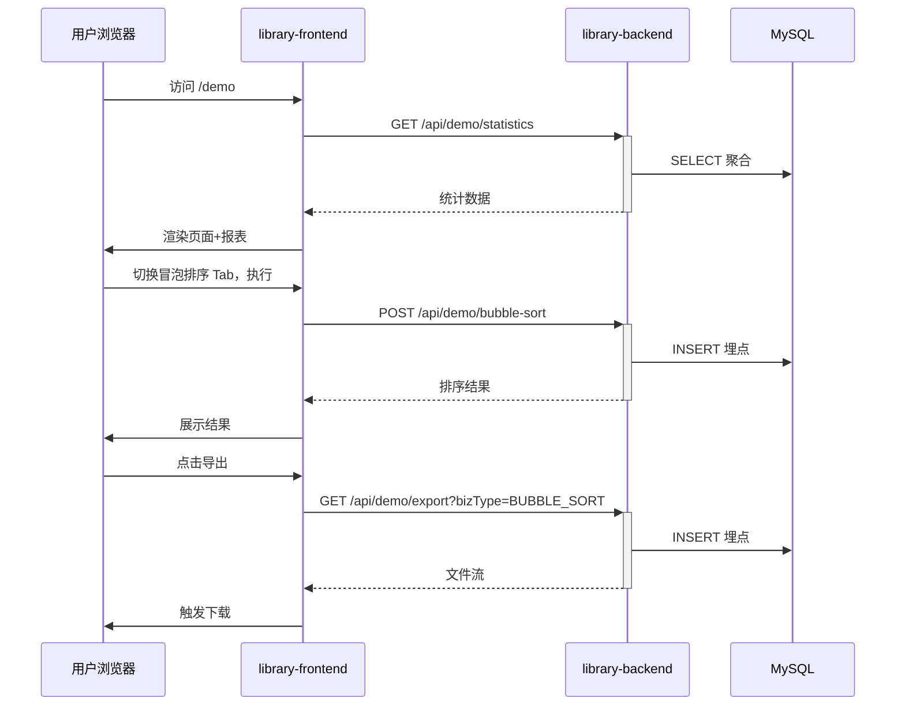

## 6. 异常兜底方案（全局）

本章节统一描述前后端各层级的异常兜底策略，确保系统在任一环节故障时仍可用或优雅降级。

### 6.1 后端异常兜底

#### 6.1.1 全局异常处理

采用 `@RestControllerAdvice` 全局异常拦截器，按异常类型分级处理，统一返回 `{code, msg, data}` 结构：

| 异常类型 | 处理方式 | 返回 code | 说明 |
|----------|----------|-----------|------|
| BizException（业务异常） | 按 errorEntity 的 code/msg 返回 | 对应错误码 | 参数校验、业务规则不满足 |
| IllegalArgumentException | 转为参数校验错误 | DEMO_002 / EXPORT_001 等 | 框架层参数非法 |
| 未捕获 Exception | 兜底返回通用错误 | SYSTEM_999 | 记录 ERROR 日志，不暴露堆栈 |

#### 6.1.2 埋点降级兜底

- 埋点写入（TrackService.recordCall）包裹 try-catch，失败仅记录 WARN 日志，不抛出异常、不阻断主业务流程。
- 埋点开关 `demo.track.enabled`，异常时可关闭埋点降级运行。

#### 6.1.3 统计查询兜底

- 统计查询异常时返回空结构（pie=[], bar={categories:[],series:[]}, line={dates:[],series:[]}，total=0），不抛错给前端。
- 查询超时（>3s）记录告警日志，返回空数据降级。

#### 6.1.4 导出兜底

- Excel 生成异常时捕获并返回 EXPORT_003 错误码，不输出半截文件流。
- 对应算法执行异常时返回对应 DEMO 错误码。

#### 6.1.5 数据库连接兜底

- 数据库连接获取失败时，demo 接口主流程仍可返回（纯计算不依赖 DB），仅埋点降级失败。
- 统计查询走从库，从库不可用时降级走主库（短暂性能影响但不中断）。

### 6.2 前端异常兜底

#### 6.2.1 接口调用兜底

- 所有 API 调用包裹统一错误处理，网络异常/超时/非 200 时展示友好提示"服务暂时不可用，请稍后重试"，不白屏。
- 接口返回非 OK code 时展示后端 msg 提示信息。

#### 6.2.2 图表空数据兜底

- 统计接口返回空数据或异常时，图表展示"暂无数据"占位，不报错。
- ECharts 初始化失败时降级为文本展示"图表加载失败"。

#### 6.2.3 导出兜底

- 导出接口异常时弹出提示"导出失败，请稍后重试"，不阻塞页面其他功能。

## 7. 非功能性需求设计

### 7.1 高可用性
后端多实例（≥2），埋点降级不阻断主流程，MySQL 主从读写分离。

### 7.2 可扩展性
后端无状态水平扩容；统计维度通过枚举扩展；新增 demo 接口复用埋点逻辑。

### 7.3 稳定性/可靠性
埋点异步降级语义；冒泡排序限长 1000 防过载；统计走从库不影响主库。

### 7.4 安全性设计
不自建账户系统（A01），身份由统一登录注入；无高敏感数据；前端报表姓名脱敏展示；日志脱敏。

### 7.5 监控/统计/日志/告警
接口 P99 > 500ms 告警；埋点失败率 > 1% 告警；统计查询超时 > 3s 告警。

## 8. 变更三板斧

### 8.1 可监控
demo 三接口埋点天然实现可监控；统计接口为监控数据可视化出口；补充三项告警指标。

### 8.2 可灰度
全新功能首版全量上线；后续可按 caller_id 尾号灰度。

### 8.3 可应急
五个 Feature Flag 开关：`demo.helloworld.enabled`、`demo.hash.enabled`、`demo.bubblesort.enabled`、`demo.statistics.enabled`、`demo.track.enabled`。优先降级不回滚；如必须回滚，前后端独立部署可分别回滚。

## 9. 仓间对齐点

| 对齐点 | library-backend | library-frontend | 对齐说明 |
|--------|-----------------|------------------|----------|
| 接口契约 | W01~W05 路径/入参/出参 | 按契约调用 | 字段名/类型一致 |
| 导出文件流 | W04 返回 .xlsx | 触发下载 | 按 Content-Disposition 处理 |
| 统计数据结构 | W05 pie/bar/line | ECharts 渲染 | 结构前后端一致 |
| 业务类型枚举 | HELLOWORLD/HASH/BUBBLE_SORT | Tab 与 bizType 映射 | 对齐 |
| 统计维度枚举 | CALLER_TYPE/CALLER_LEVEL/CALLER_DEPT | 维度按钮 | 对齐 |

## 10. 方案检查

| 检查项 | 结果 | 说明 |
|--------|------|------|
| 模块划分合理性 | 通过 | 三模块职责单一无循环依赖 |
| 依赖关系合理性 | 通过 | demo→track→identity 单向依赖 |
| 单点问题（部署） | 通过 | 多实例+主从无单点 |
| 表模型范式 | 通过 | 满足第三范式，冗余字段为查询优化 |
| 隐私安全 | 通过 | 无高敏感数据，姓名脱敏 |
| 兼容性（接口/表） | 不适用 | 全新建设 |
| 数据迁移 | 不适用 | 全新建表 |
| 一致性（功能点/表/接口/枚举） | 通过 | F01~F09、biz_call_record、W01~W05 均有对应设计 |
| 状态机完整性 | 不适用 | 无状态字段实体 |
| 并发风险 | 通过 | 纯计算+独立INSERT+只读查询，无并发风险 |
| 单点（定时任务） | 不适用 | 无定时任务 |
| 非功能性可行性 | 通过 | 多实例+降级+限长+从库均可落地 |
| 变更三板斧（监控/灰度/应急） | 通过 | 埋点可监控+尾号灰度+开关降级 |
