> **文档元信息**
>
> | 项目 | 内容 |
> |------|------|
> | 文档版本 | v1.0 |
> | 作者 | DTCoder |
> | 创建日期 | 2025-08-17 |
> | 需求来源 | .agents/specs/dima.md（需求澄清）；.agents/specs/20260817-分别写三个接口helloworld、哈希.md（实施计划） |
> | 评审状态 | 待评审 |

# 算法演示模块 系分设计

## 1. 需求与范围

### 背景与目标
为图书管理系统新增"算法演示"功能模块，提供三个经典算法演示（HelloWorld、SHA-256 哈希、冒泡排序）及结果导出能力。用户通过前端页面交互式体验算法执行过程，并可将结果导出为 JSON/CSV 文件。

### 核心功能

| 编号 | 功能点 | 说明 |
|------|--------|------|
| F01 | HelloWorld 接口 | GET 请求，返回问候语与当前时间戳 |
| F02 | 哈希算法接口 | POST 请求，对输入字符串执行 SHA-256 哈希并返回结果 |
| F03 | 冒泡排序接口 | POST 请求，对整数数组执行冒泡排序，返回排序过程、比较次数和交换次数 |
| F04 | 前端三 Tab 展示页面 | 路由 `/algorithm-demo`，三个 Tab 分别调用 F01/F02/F03 并展示结果 |
| F05 | 导出功能 | 前端导出按钮触发后端导出接口，支持 JSON 和 CSV 格式文件下载 |

### 约束与非功能要求
- 接口响应时间 < 500ms（正常输入规模）
- 冒泡排序输入数组长度 ≤ 100
- 导出文件格式：JSON（默认）+ CSV
- 前端超时：30s
- 公开页面，无需权限控制

### 排除范围
- 不涉及用户认证与权限控制
- 不涉及数据持久化（无数据库表）
- 哈希算法仅支持 SHA-256（后续可扩展）
- 不涉及其他排序算法

### 需求功能清单与优先级

| 编号 | 功能点 | 优先级 | PRD 原始描述/章节 | 备注 |
|------|--------|--------|-------------------|------|
| F01 | HelloWorld 接口 | P0 | 需求描述 + dima.md §1.1 | 无参数 GET 接口 |
| F02 | 哈希算法接口 | P0 | 需求描述 + dima.md §1.1 | POST，SHA-256 |
| F03 | 冒泡排序接口 | P0 | 需求描述 + dima.md §1.1 | POST，返回排序过程 |
| F04 | 前端三 Tab 页面 | P0 | 需求描述 + dima.md §4 | /algorithm-demo |
| F05 | 导出功能 | P1 | 需求描述 + dima.md §3.4 | JSON + CSV |

### 假设与待确认项

| 编号 | 假设/待确认内容 | 当前假设 | 确认状态 |
|------|-----------------|----------|----------|
| A01 | 前端框架选型 | React 18 + TypeScript + Vite | 已确认 |
| A02 | 后端框架选型 | Spring Boot 2.7 + Java 11 + Maven | 已确认 |
| A03 | 哈希算法范围 | 仅 SHA-256，后续可扩展 | 已确认 |
| A04 | 冒泡排序步骤展示 | 返回 steps[] 数组，每轮状态 | 已确认 |
| A05 | 导出格式 | JSON + CSV | 已确认 |
| A06 | 路由路径 | /algorithm-demo | 已确认 |
| A07 | 权限控制 | 否，公开页面 | 已确认 |
| A08 | 统一响应格式 | {code: int, message: string, data: T} | 已确认 |

---

## 2. 架构与模块

### 功能架构

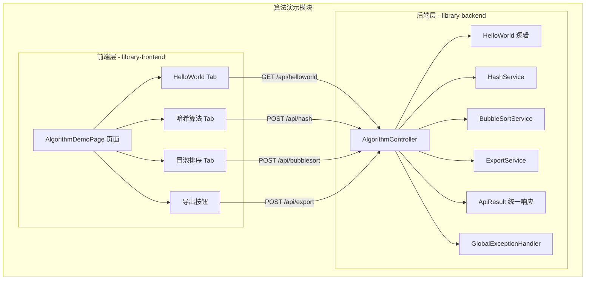

- **交互层说明**：前端 React 页面通过 HTTP REST 调用后端接口，后端统一通过 ApiResult 包装响应，异常由 GlobalExceptionHandler 统一处理。
- **核心服务层说明**：HashService 负责 SHA-256 哈希计算；BubbleSortService 负责冒泡排序及过程记录；ExportService 负责 JSON/CSV 文件生成。
- **扩展/集成层说明**：本模块无外部系统集成，纯内存计算型服务。

**模块清单**

| 模块 | 所属仓库 | 职责 | 依赖 |
|------|----------|------|------|
| 前端页面模块 | library-frontend | `/algorithm-demo` 页面，含三 Tab + 导出按钮，调用后端 REST API | 后端 REST 接口 |
| 后端 Controller 层 | library-backend | 暴露 4 个 REST 端点，参数校验，统一响应包装 | Service 层 |
| 后端 Service 层 | library-backend | 核心算法逻辑（哈希、冒泡排序）及导出文件生成 | 无外部依赖 |
| 公共层 | library-backend | ApiResult 统一响应格式 + GlobalExceptionHandler 全局异常处理 | 无 |

### 应用集成架构

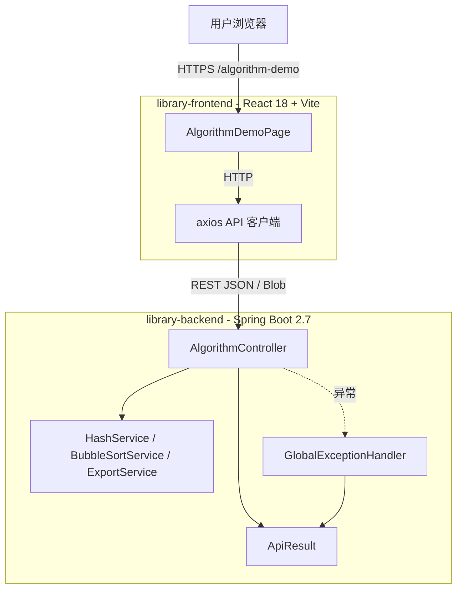

**集成关系说明：**

| 调用方 | 被调用方 | 协议 | 接口类型 | 说明 |
|--------|----------|------|----------|------|
| 用户浏览器 | library-frontend | HTTPS | Web 页面 | 访问 `/algorithm-demo` |
| library-frontend | library-backend | HTTP REST | oneapi | 调用 `/api/*` 接口 |
| AlgorithmController | HashService | JVM 内部 | Service 方法 | 同步调用 |
| AlgorithmController | BubbleSortService | JVM 内部 | Service 方法 | 同步调用 |
| AlgorithmController | ExportService | JVM 内部 | Service 方法 | 同步调用 |

### 部署架构

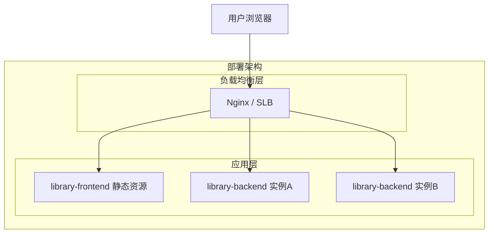

**部署说明：**
- **负载均衡层**：Nginx 反向代理，前端静态资源与后端 API 统一入口
- **应用层**：前端为静态资源部署（CDN/Nginx），后端 Spring Boot 双实例部署（无状态，可横向扩展）
- **数据层**：本模块无数据库依赖，纯计算型服务
- **假设**：采用公有云同城双机房部署，默认容器化（Docker + K8s）

---

## 3. 数据模型与存储

### 实体清单

本模块为纯计算型功能，不涉及数据库持久化。所有数据均为请求-响应周期内的临时对象，无持久化实体。

| 实体名称 | 实体说明 | 所属模块 | 与其他实体的关系 |
|----------|----------|----------|-----------------|
| 本项不适用 | 算法演示模块无持久化数据需求 | - | - |

### 实体关系图

本项不适用，原因：模块不涉及数据库存储，所有数据在内存中处理，请求结束后即释放。

### 缓存与消息队列

本项不适用，原因：当前阶段无缓存或异步消息需求，所有接口为同步计算型。

### 数据形态说明

虽然是临时数据，但以下对象在系统内部流转：

| 数据结构 | 形态 | 生命周期 | 说明 |
|----------|------|----------|------|
| HelloWorldResponse | Java POJO → JSON | 请求-响应周期 | greeting + timestamp |
| HashRequest/HashResponse | Java POJO → JSON | 请求-响应周期 | input/algorithm/hash |
| BubbleSortRequest/BubbleSortResponse | Java POJO → JSON | 请求-响应周期 | array/sorted/steps |
| ExportRequest | Java POJO → JSON | 请求-响应周期 | type/data/format |
| Export 文件流 | byte[] | 响应流传输 | JSON/CSV 文件字节 |

---

## 4. 接口设计

### 4.1 oneapi（Web 控制台接口）

| 编号 | 接口名称 | 方法 | 路径 | 模块 |
|------|----------|------|------|------|
| W01 | HelloWorld | GET | /api/helloworld | 算法演示 |
| W02 | 哈希计算 | POST | /api/hash | 算法演示 |
| W03 | 冒泡排序 | POST | /api/bubblesort | 算法演示 |
| W04 | 结果导出 | POST | /api/export | 算法演示 |

### 4.2 OpenAPI（对外接口）

本项不适用，原因：算法演示模块为内部 Web 控制台页面使用，无需对外暴露 OpenAPI。

### 4.3 内部接口（Service 层）

| 编号 | 接口名称 | 类 | 方法签名 |
|------|----------|------|----------|
| S01 | 哈希计算 | HashService | HashResponse computeHash(String input, String algorithm) |
| S02 | 冒泡排序 | BubbleSortService | BubbleSortResponse sort(int[] array) |
| S03 | 结果导出 | ExportService | ExportResult export(String type, Map data, String format) |

### 4.4 集成接口（Integration 层）

本项不适用，原因：算法演示模块不依赖外部系统，无集成接口。

---

## 5. 功能模块设计

### 全局约定

**错误码格式**：`ALG_{SEQ}`

| 错误码 | 说明 |
|--------|------|
| ALG_001 | 输入参数为空 |
| ALG_002 | 数组长度超限（> 100） |
| ALG_003 | 不支持的导出类型 |
| ALG_004 | 不支持的导出格式 |
| ALG_999 | 内部服务器错误 |

**通用出参结构**：

| 字段 | 类型 | 说明 |
|------|------|------|
| code | int | 0=成功，非0=错误 |
| message | string | 提示信息 |
| data | object/null | 业务数据，错误时为 null |

**模块映射表：**

| 模块 | 对应功能编号 | 所属仓库 |
|------|-------------|----------|
| 后端 AlgorithmController | F01, F02, F03, F05 | library-backend |
| 后端 HashService | F02 | library-backend |
| 后端 BubbleSortService | F03 | library-backend |
| 后端 ExportService | F05 | library-backend |
| 前端 AlgorithmDemoPage | F04 | library-frontend |
| 前端 HelloWorldPanel | F01 | library-frontend |
| 前端 HashPanel | F02 | library-frontend |
| 前端 BubbleSortPanel | F03 | library-frontend |
| 前端 ExportButton | F05 | library-frontend |

---

### 5.1 后端模块

#### 5.1.1 表结构设计

本模块为纯计算型，无数据库表。

#### 5.1.2 接口详细设计

##### W01 — GET /api/helloworld

- **URI**: GET /api/helloworld
- **描述**: 返回问候语与当前服务器时间戳
- **入参**: 无

- **出参**:

| 参数名称 | 类型 | 描述 |
|----------|------|------|
| code | int | 0 |
| message | string | "success" |
| data.greeting | string | "Hello, World!" |
| data.timestamp | string | ISO-8601 格式时间戳 |

- **错误码**:

| 错误码 | 说明 |
|--------|------|
| ALG_999 | 内部服务器错误 |

- **请求示例**: 无请求体

- **响应示例 (200)**:
```json
{
  "code": 0,
  "message": "success",
  "data": {
    "greeting": "Hello, World!",
    "timestamp": "2025-07-10T12:00:00.000Z"
  }
}
```

---

##### W02 — POST /api/hash

- **URI**: POST /api/hash
- **描述**: 对输入字符串执行 SHA-256 哈希
- **入参**:

| 参数名称 | 类型 | 是否必填 | 描述 |
|----------|------|----------|------|
| input | string | 是 | 待哈希字符串，非空 |
| algorithm | string | 否 | 哈希算法，默认 "SHA-256" |

- **出参**:

| 参数名称 | 类型 | 描述 |
|----------|------|------|
| code | int | 0 |
| message | string | "success" |
| data.input | string | 原始输入 |
| data.algorithm | string | 使用的哈希算法 |
| data.hash | string | 十六进制小写哈希值 |

- **错误码**:

| 错误码 | 说明 |
|--------|------|
| ALG_001 | 输入参数为空 |
| ALG_004 | 不支持的哈希算法 |
| ALG_999 | 内部服务器错误 |

- **请求示例**:
```json
{
  "input": "hello world",
  "algorithm": "SHA-256"
}
```

- **响应示例 (200)**:
```json
{
  "code": 0,
  "message": "success",
  "data": {
    "input": "hello world",
    "algorithm": "SHA-256",
    "hash": "b94d27b9934d3e08a52e52d7da7dabfac484efe37a5380ee9088f7ace2efcde9"
  }
}
```

---

##### W03 — POST /api/bubblesort

- **URI**: POST /api/bubblesort
- **描述**: 对整数数组执行冒泡排序，返回排序过程
- **入参**:

| 参数名称 | 类型 | 是否必填 | 描述 |
|----------|------|----------|------|
| array | number[] | 是 | 待排序整数数组，非空，长度 ≤ 100 |

- **出参**:

| 参数名称 | 类型 | 描述 |
|----------|------|------|
| code | int | 0 |
| message | string | "success" |
| data.input | number[] | 原始输入数组 |
| data.sorted | number[] | 排序后数组 |
| data.steps | SortStep[] | 每轮排序步骤 |
| data.steps[].round | int | 轮次编号 |
| data.steps[].after | number[] | 本轮结束后数组状态 |
| data.steps[].swapped | boolean | 本轮是否发生交换 |
| data.comparisons | int | 总比较次数 |
| data.swaps | int | 总交换次数 |

- **错误码**:

| 错误码 | 说明 |
|--------|------|
| ALG_001 | 输入数组为空 |
| ALG_002 | 数组长度超过 100 |
| ALG_999 | 内部服务器错误 |

- **请求示例**:
```json
{
  "array": [5, 3, 8, 1, 2]
}
```

- **响应示例 (200)**:
```json
{
  "code": 0,
  "message": "success",
  "data": {
    "input": [5, 3, 8, 1, 2],
    "sorted": [1, 2, 3, 5, 8],
    "steps": [
      {"round": 1, "after": [3, 5, 1, 2, 8], "swapped": true},
      {"round": 2, "after": [3, 1, 2, 5, 8], "swapped": true},
      {"round": 3, "after": [1, 2, 3, 5, 8], "swapped": true},
      {"round": 4, "after": [1, 2, 3, 5, 8], "swapped": false}
    ],
    "comparisons": 10,
    "swaps": 6
  }
}
```

---

##### W04 — POST /api/export

- **URI**: POST /api/export
- **描述**: 根据 Tab 类型和格式导出结果文件
- **入参**:

| 参数名称 | 类型 | 是否必填 | 描述 |
|----------|------|----------|------|
| type | string | 是 | 枚举: "helloworld" / "hash" / "bubblesort" |
| data | object | 是 | 对应 Tab 当前展示的完整结果数据 |
| format | string | 否 | 导出格式: "json"（默认）或 "csv" |

- **出参**: 文件流

| 响应头 | 值 |
|--------|-----|
| Content-Type | application/json 或 text/csv |
| Content-Disposition | attachment; filename="export-{type}-{timestamp}.{ext}" |

- **错误码**:

| 错误码 | 说明 |
|--------|------|
| ALG_001 | 数据为空 |
| ALG_003 | 不支持的导出类型 |
| ALG_004 | 不支持的导出格式 |
| ALG_999 | 内部服务器错误 |

- **请求示例**:
```json
{
  "type": "bubblesort",
  "data": {
    "input": [5, 3, 8, 1, 2],
    "sorted": [1, 2, 3, 5, 8],
    "steps": [{"round": 1, "after": [3, 5, 1, 2, 8], "swapped": true}]
  },
  "format": "json"
}
```

#### 5.1.3 子功能详细设计

##### 5.1.3.1 HelloWorld 查询 (F01)

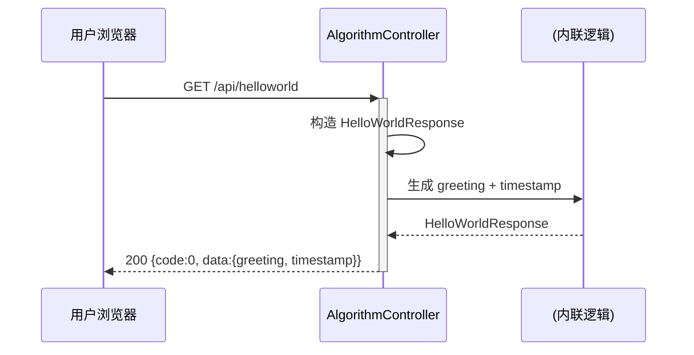

**业务规则：**

| 规则编号 | 规则描述 | 校验时机 | 不满足时的处理 |
|----------|----------|----------|--------------|
| R01 | timestamp 必须为服务器当前时间 ISO-8601 格式 | 响应生成时 | 无（无外部依赖，不会失败） |

**异常场景：**

| 异常场景 | 处理方式 |
|----------|----------|
| 无特定异常 | 纯静态返回，无失败路径 |

**并发控制：** 无并发风险，原因：纯读取操作，无共享状态。

---

##### 5.1.3.2 哈希计算 (F02)

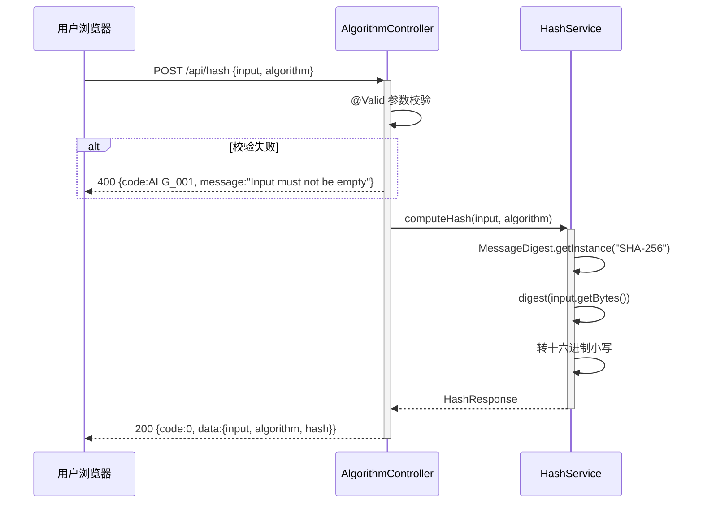

**业务规则：**

| 规则编号 | 规则描述 | 校验时机 | 不满足时的处理 |
|----------|----------|----------|--------------|
| R02 | input 非空字符串 | 请求进入时 | 返回 ALG_001，提示 "Input must not be empty" |
| R03 | algorithm 默认为 "SHA-256" | 请求处理时 | 若 algorithm 为 null，自动填充 "SHA-256" |
| R04 | 仅支持 SHA-256 | 请求处理时 | 若 algorithm 非 "SHA-256"，返回 ALG_004 |

**异常场景：**

| 异常场景 | 处理方式 |
|----------|----------|
| input 为空字符串或 null | 返回 400，ALG_001 |
| algorithm 指定了不支持的值 | 返回 400，ALG_004 |
| MessageDigest 算法不可用 | 返回 500，ALG_999，记录日志 |

**并发控制：** 无并发风险，原因：纯计算操作，无共享可变状态。

---

##### 5.1.3.3 冒泡排序 (F03)

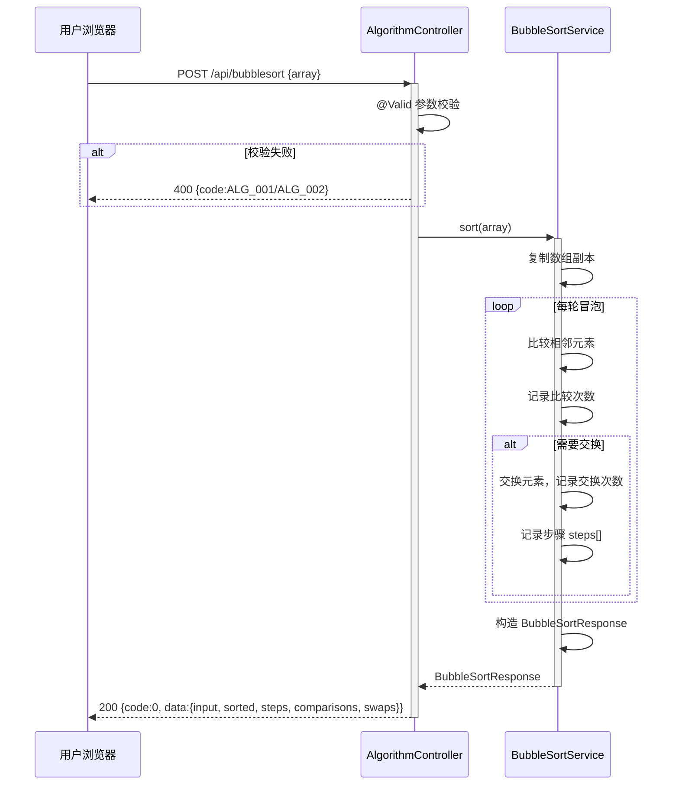

**业务规则：**

| 规则编号 | 规则描述 | 校验时机 | 不满足时的处理 |
|----------|----------|----------|--------------|
| R05 | array 非空 | 请求进入时 | 返回 ALG_001 |
| R06 | array 长度 ≤ 100 | 请求进入时 | 返回 ALG_002 |
| R07 | 每轮记录排序后数组状态（深拷贝） | 排序过程中 | 保证 steps 不受后续修改影响 |

**异常场景：**

| 异常场景 | 处理方式 |
|----------|----------|
| array 为空数组 [] | 返回 400，ALG_001 |
| array 长度 > 100 | 返回 400，ALG_002 |
| array 元素非整数 | 返回 400，由 @Valid 校验拦截 |

**并发控制：** 无并发风险，原因：每次请求独立操作数组副本，无共享状态。

---

##### 5.1.3.4 结果导出 (F05)

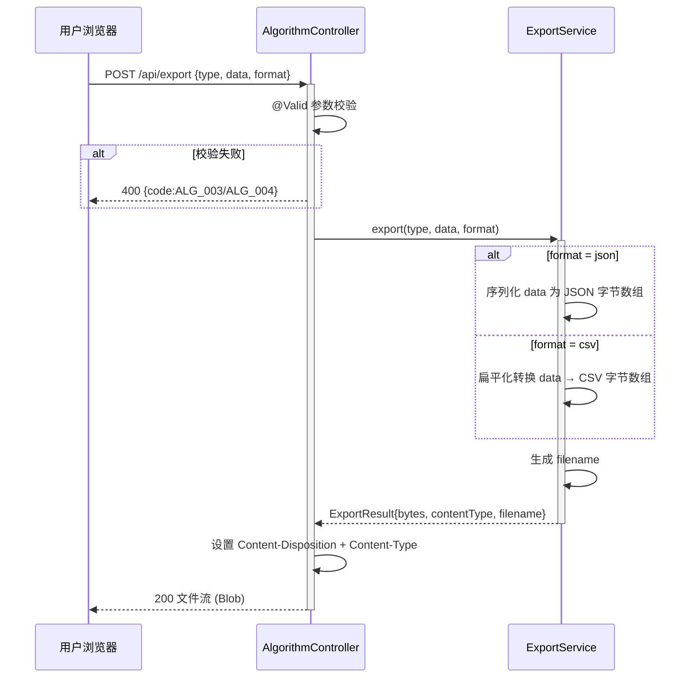

**业务规则：**

| 规则编号 | 规则描述 | 校验时机 | 不满足时的处理 |
|----------|----------|----------|--------------|
| R08 | type 必须为 helloworld/hash/bubblesort 之一 | 请求进入时 | 返回 ALG_003 |
| R09 | format 默认为 "json" | 请求处理时 | 若 format 为 null，自动填充 "json" |
| R10 | format 仅支持 json/csv | 请求处理时 | 返回 ALG_004 |
| R11 | CSV 导出时，bubblesort 以 steps 为行；helloworld/hash 以键值对为行 | 导出时 | 保证 CSV 结构一致 |

**异常场景：**

| 异常场景 | 处理方式 |
|----------|----------|
| type 为非法值 | 返回 400，ALG_003 |
| format 为非法值 | 返回 400，ALG_004 |
| data 为空 | 返回 400，ALG_001 |
| CSV 转换异常 | 返回 500，ALG_999，记录日志 |

**并发控制：** 无并发风险，原因：纯数据转换操作，无共享状态。

---

### 5.2 前端模块

#### 5.2.1 表结构设计

本模块为前端页面，无数据库表。

#### 5.2.2 接口详细设计

前端模块通过 HTTP REST 调用后端接口，接口定义已在后端模块中详细描述。此处定义前端 API 层封装：

| 编号 | 函数签名 | 对应后端接口 | 说明 |
|------|----------|-------------|------|
| F-API-01 | fetchHelloWorld(): Promise\<ApiResponse\<HelloWorldData\>\> | GET /api/helloworld | 获取问候语 |
| F-API-02 | fetchHash(input: string, algorithm?: string): Promise\<ApiResponse\<HashData\>\> | POST /api/hash | 哈希计算 |
| F-API-03 | fetchBubbleSort(array: number[]): Promise\<ApiResponse\<BubbleSortData\>\> | POST /api/bubblesort | 冒泡排序 |
| F-API-04 | exportResult(type: string, data: any, format?: string): Promise\<Blob\> | POST /api/export | 导出结果文件 |

#### 5.2.3 子功能详细设计

##### 5.2.3.1 AlgorithmDemoPage 页面容器 (F04)

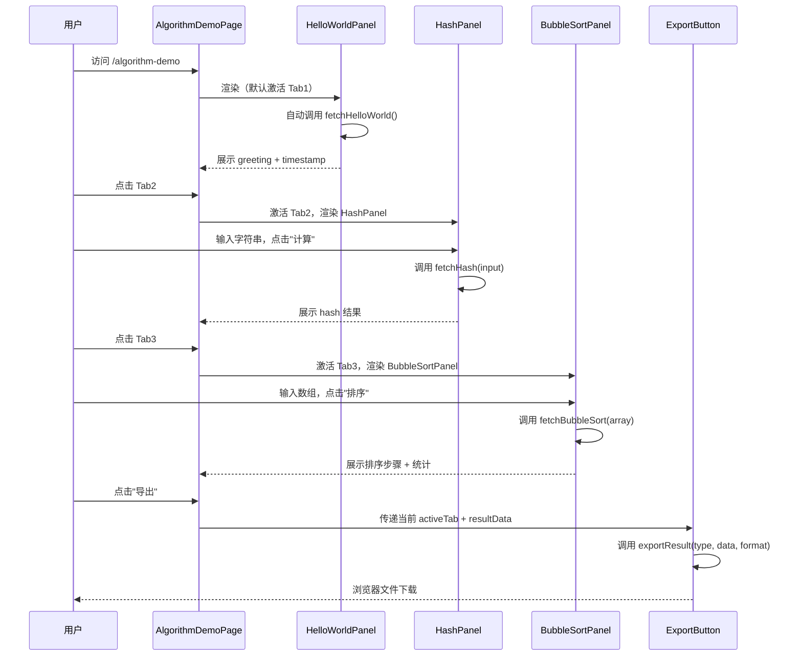

**业务规则：**

| 规则编号 | 规则描述 | 校验时机 | 不满足时的处理 |
|----------|----------|----------|--------------|
| R12 | 每个 Tab 独立管理自身状态（loading/data/error） | 组件挂载/交互时 | 展示对应 UI 状态 |
| R13 | 导出按钮读取当前活跃 Tab 的最新结果数据 | 点击导出时 | 若无结果数据，提示"请先执行操作" |
| R14 | 前端 axios 超时设为 30s | API 调用时 | 展示"请求超时，请重试" |

**异常场景：**

| 异常场景 | 处理方式 |
|----------|----------|
| 网络错误 | try/catch 捕获，展示 Toast/Alert 错误提示 |
| 后端返回 400/500 | 解析 message 字段，展示友好错误提示 |
| 请求超时（>30s） | 展示"请求超时，请重试" |
| 导出失败 | 展示"导出失败，请重试"，不清空当前 Tab 数据 |
| Tab 切换时上一个 Tab 有未完成请求 | 不做特殊处理，允许自然完成或忽略 |

**并发控制：** 无并发风险，原因：每个 Tab 独立状态，导出为同步操作。

---

##### 5.2.3.2 HelloWorldPanel (F01)

**状态机设计：**

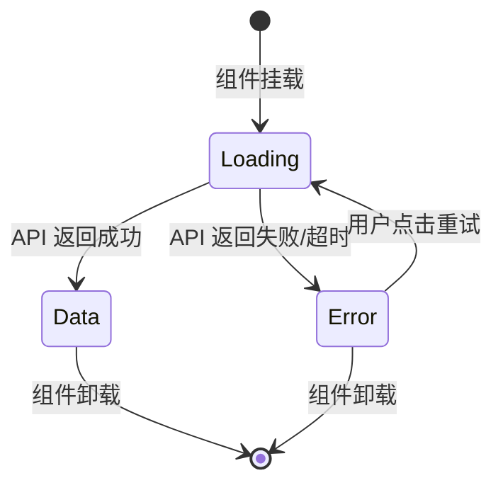

**组件状态说明：**

| 状态 | 展示内容 |
|------|----------|
| Loading | 加载中指示器（Spinner） |
| Data | greeting 文本 + timestamp 格式化展示 |
| Error | 错误提示信息 + "重试"按钮 |

---

##### 5.2.3.3 HashPanel (F02)

**状态机设计：**

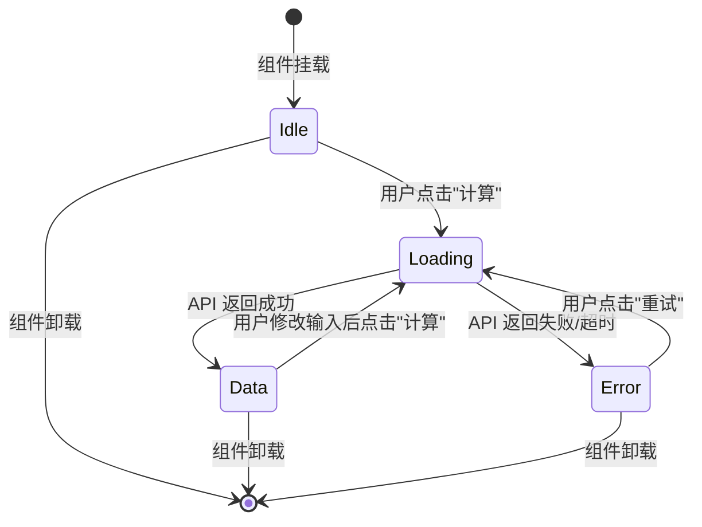

**组件状态说明：**

| 状态 | 展示内容 |
|------|----------|
| Idle | 输入框（空）+ "计算"按钮（可用） |
| Loading | 输入框（禁用）+ "计算"按钮（禁用）+ 加载指示器 |
| Data | 输入框 + 结果展示区域（原始输入、算法、哈希值）+ "计算"按钮（可用） |
| Error | 输入框 + 错误提示 + "重试"按钮 |

---

##### 5.2.3.4 BubbleSortPanel (F03)

**状态机设计：**


**组件状态说明：**

| 状态 | 展示内容 |
|------|----------|
| Idle | 输入框（逗号分隔数字）+ "排序"按钮（可用） |
| Loading | 输入框（禁用）+ "排序"按钮（禁用）+ 加载指示器 |
| Data | 输入框 + 原始数组 + 排序后数组 + 步骤列表（每轮 after 数组）+ 统计信息（comparisons/swaps）+ "排序"按钮（可用） |
| Error | 输入框 + 错误提示 + "重试"按钮 |

---

##### 5.2.3.5 ExportButton (F05)

**技术选型方案对比：**

| 方案 | 描述 | 优点 | 缺点 |
|------|------|------|------|
| 方案A：后端生成文件流 | 前端 POST 携带数据到后端，后端返回文件流 | 统一导出逻辑、支持 CSV 转换、文件名可定制 | 需要额外网络请求 |
| 方案B：前端纯客户端导出 | 前端直接 Blob 构造 + URL.createObjectURL 下载 | 无网络开销 | CSV 转换逻辑分散、文件名难以统一 |

**推荐方案：A**。理由：导出逻辑集中在后端，CSV 扁平化转换统一处理，文件名由后端 Content-Disposition 控制，与 dima.md 契约一致。

**状态处理：**

| 场景 | 行为 |
|------|------|
| 当前 Tab 无结果数据 | 按钮禁用，提示"请先执行操作" |
| 导出中 | 按钮显示"导出中..."，禁用 |
| 导出成功 | 浏览器触发下载，按钮恢复 |
| 导出失败 | Toast 提示"导出失败，请重试"，按钮恢复 |

---

### 5.3 跨模块调用链

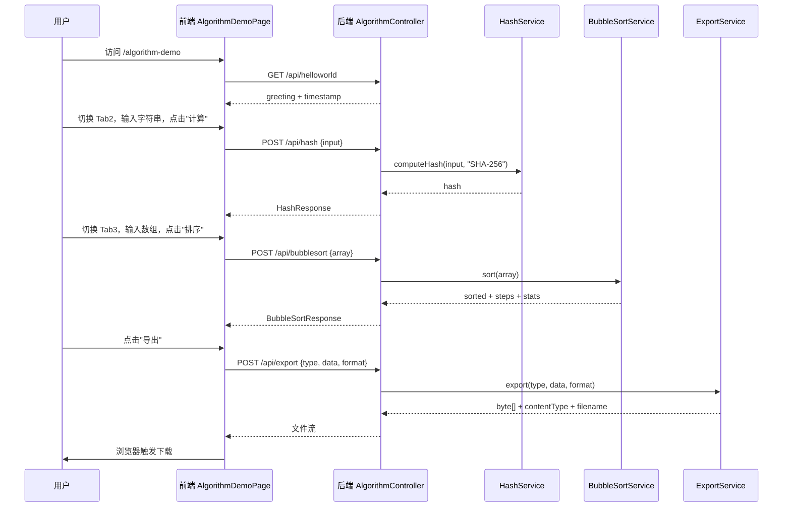

---

## 6. 非功能性需求设计

### 6.1 高可用性

- **服务降级**：本模块为纯计算型服务，无外部依赖，不存在级联故障风险。前端网络异常时展示友好错误提示并保留重试能力。
- **容错切换**：后端双实例部署，Nginx 健康检查自动剔除故障实例，前端请求自动路由到健康实例。
- **导出降级**：导出失败仅影响文件下载，不影响当前 Tab 数据展示，用户可重试。

### 6.2 可扩展性

- **水平扩展**：后端 Spring Boot 无状态服务，可横向扩展实例数，Nginx 负载均衡分发。
- **算法扩展**：HashService 的 algorithm 参数设计为可扩展，后续可增加 MD5、SHA-512 等算法。
- **导出格式扩展**：ExportService 的 format 参数设计为可扩展，后续可增加 Excel、PDF 等格式。
- **前端 Tab 扩展**：Tabs 容器组件化设计，新增算法 Tab 只需添加新 Panel 组件并注册路由。

### 6.3 稳定性/可靠性

- **输入边界保护**：冒泡排序数组长度 ≤ 100，防止大数组导致长时间阻塞。
- **超时保护**：前端 axios 30s 超时，防止请求无限等待。
- **内存安全**：每次请求独立处理，排序操作使用数组副本，不修改原始输入。
- **无状态设计**：后端不保存任何会话状态，单实例故障不影响整体服务。

### 6.4 安全性设计

#### 6.4.1 账户系统方案
本项不适用，原因：算法演示模块为公开页面，无需登录认证。

#### 6.4.2 授权&访问控制

##### 6.4.2.1 是否实现水平权限检查
本项不适用，原因：不涉及数据库查询，为公共数据查询。

##### 6.4.2.2 是否实现垂直权限检查
本项不适用，原因：公开页面，无角色权限区分。

##### 6.4.2.3 是否检查登录态
本项不适用，原因：公开页面，所有 `/api/*` 接口配置白名单，不检查登录态。

#### 6.4.3 数据防护方案

##### 6.4.3.1 是否对敏感数据加密存储
本项不适用，原因：模块不持久化任何数据，无存储需求。

##### 6.4.3.2 是否对敏感数据展示进行脱敏
本项不适用，原因：模块展示的数据均为算法计算结果，不涉及用户个人信息。

### 6.5 监控/统计/日志/告警

- **接口监控**：每个 API 端点埋点记录请求量、成功率、响应时间（P50/P99）。
- **异常监控**：GlobalExceptionHandler 中记录异常日志，包含堆栈信息。
- **告警规则**：5xx 错误率 > 1% 触发告警；P99 响应时间 > 1s 触发告警。
- **前端监控**：API 调用失败时上报前端错误日志。

---

## 7. 变更三板斧

### 7.1 可监控

| 监控点 | 埋点位置 | 指标 | 说明 |
|--------|----------|------|------|
| helloworld 接口 | AlgorithmController | 调用量、成功率、耗时 | 基础可用性监控 |
| hash 接口 | AlgorithmController | 调用量、成功率、耗时 | 含参数校验失败统计 |
| bubblesort 接口 | AlgorithmController | 调用量、成功率、耗时、数组长度分布 | 关注大数组性能 |
| export 接口 | AlgorithmController | 调用量、成功率、耗时、导出格式分布 | 关注 CSV 转换耗时 |
| 全局异常 | GlobalExceptionHandler | 异常类型、堆栈 | 5xx 错误率监控 |
| 前端 API 错误 | axios interceptor | 错误码、端点 | 前端视角可用性 |

**告警规则：**
- 5xx 错误率 > 1%（5 分钟窗口）→ P2 告警
- 接口 P99 响应时间 > 1s → P3 告警
- bubblesort 接口收到数组长度 > 100 的请求 → P3 告警（可能为攻击）

### 7.2 可灰度

**灰度方案对比：**

| 方案 | 描述 | 优点 | 缺点 |
|------|------|------|------|
| 方案A：按租户尾号灰度 | 根据 tenant_id 尾号将流量路由到新旧版本 | 粒度可控，回滚快 | 本模块无租户概念 |
| 方案B：按路由灰度 | 新增 /algorithm-demo 路由，逐步放量 | 简单直接 | 粒度较粗 |
| 方案C：全量发布 | 直接全量上线 | 零配置 | 无法灰度回退 |

**推荐方案：B**。理由：本模块为全新功能页面，不涉及旧逻辑变更，通过新增路由 `/algorithm-demo` 上线。灰度策略：先在内部环境验证 → 放量 10% 用户 → 观察 30 分钟 → 全量。

### 7.3 可应急

| 应急场景 | 应急措施 | 恢复时间 |
|----------|----------|----------|
| 后端接口异常 | Nginx 将 `/api/helloworld`、`/api/hash`、`/api/bubblesort`、`/api/export` 路由切回旧版本或返回降级响应 | < 5 分钟 |
| 前端页面异常 | 移除 `/algorithm-demo` 路由注册，页面不可访问，不影响其他功能 | < 5 分钟 |
| 导出功能异常 | 前端隐藏导出按钮（配置开关），仅保留三 Tab 展示功能 | < 5 分钟 |
| 全模块回滚 | 回滚 library-backend 和 library-frontend 至上一版本 | < 10 分钟 |

**回滚依赖分析：**
- library-backend 回滚：仅影响算法演示接口，不影响图书管理系统核心功能
- library-frontend 回滚：仅移除 `/algorithm-demo` 路由，不影响其他页面
- 前后端独立回滚：前端可独立回滚（移除路由），后端可独立回滚（接口不可用但前端已有错误处理）
- 注意：回滚时需确保 Nginx 路由配置同步更新

**开关设计：**
- 前端导出按钮：通过配置开关控制是否展示，默认开启
- 后端导出接口：无独立开关（依赖前端控制），如需要可增加配置项