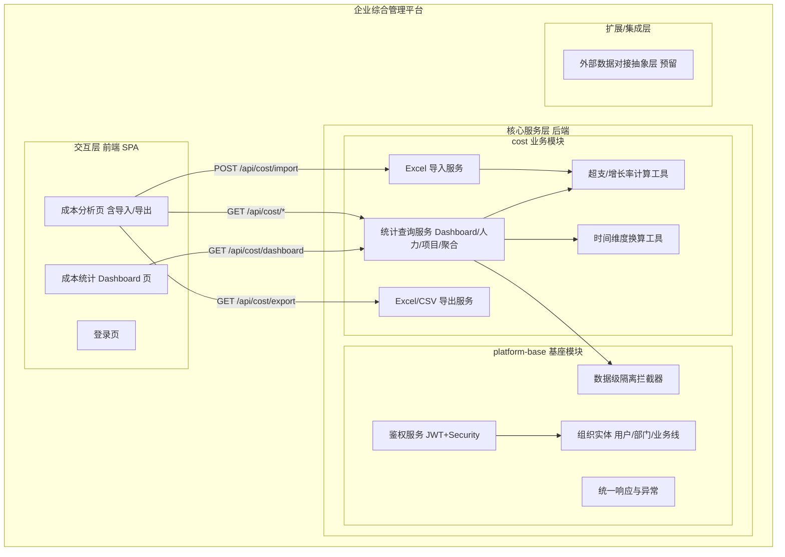
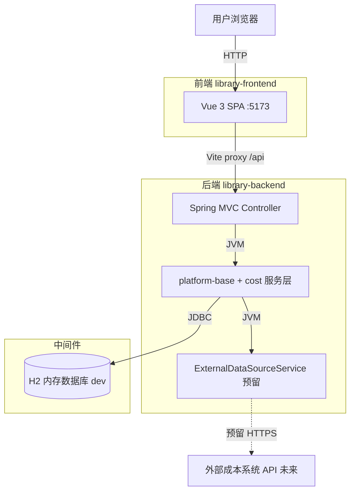
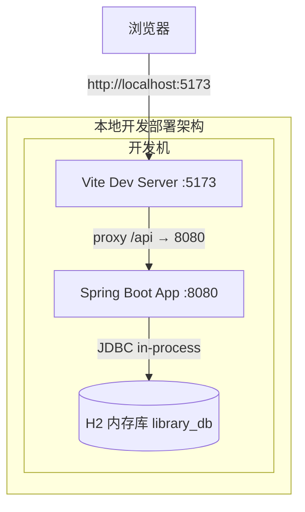
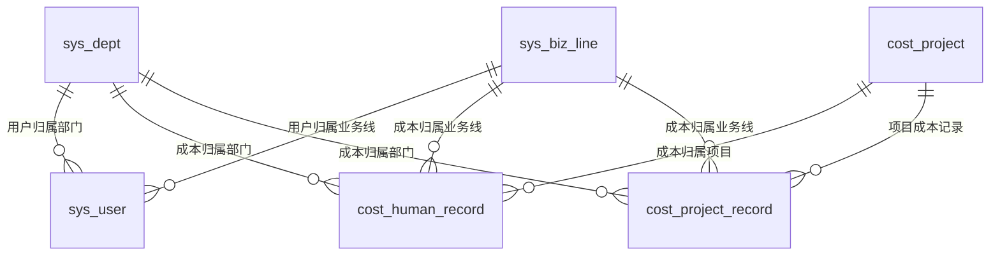
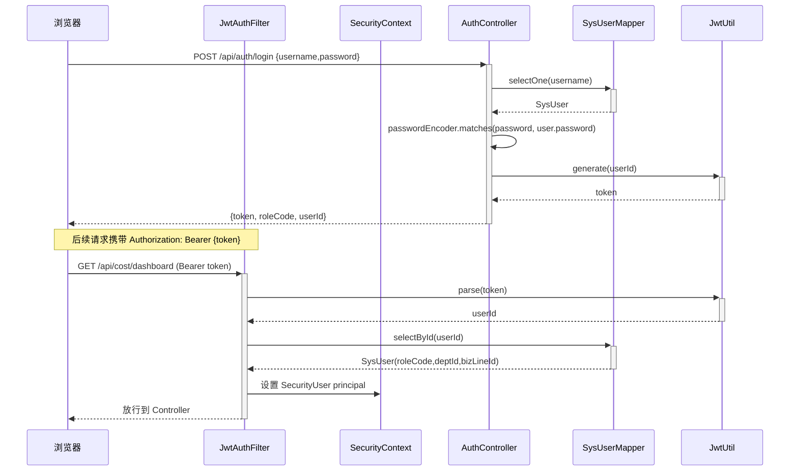
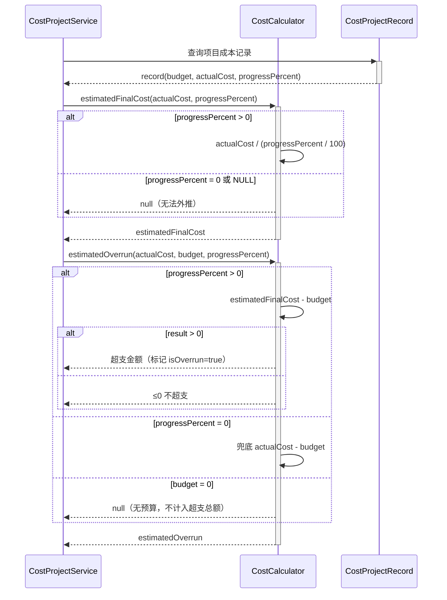
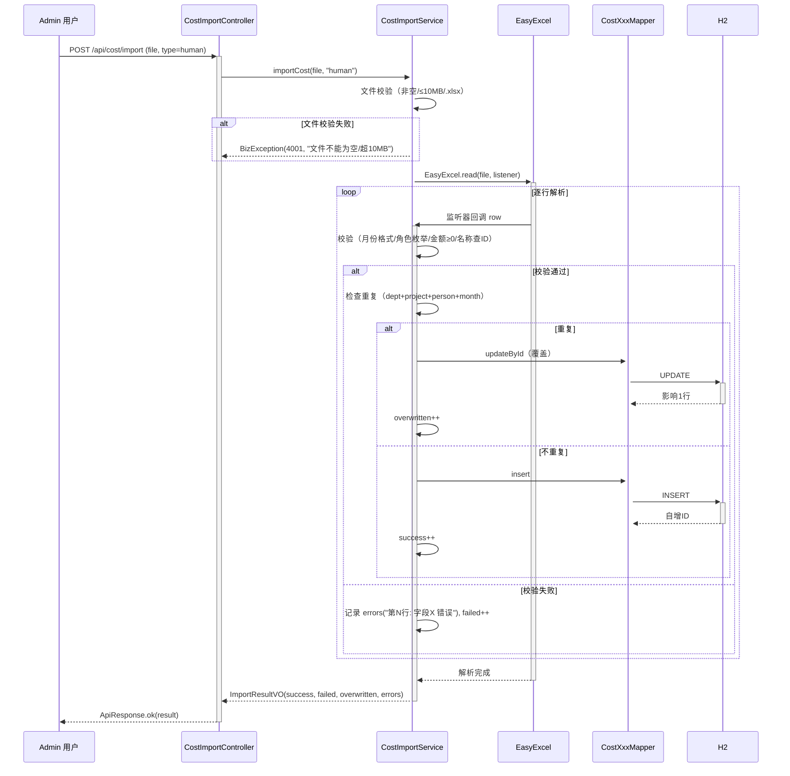
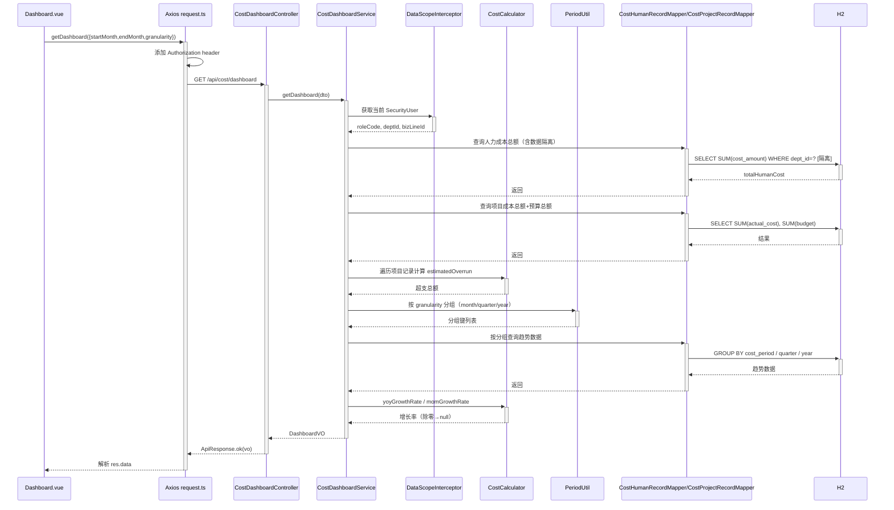

> **文档元信息**
>
> | 项目 | 内容 |
> |------|------|
> | 文档版本 | v1.0 |
> | 作者 | DTCoder |
> | 创建日期 | 2026-08-07 |
> | 需求来源 | dima.md（需求澄清文档）、cost-statistics-report-implementation-plan.md（实施计划） |
> | 评审状态 | 待评审 |

# 成本统计报表 系分设计

## 1. 需求与范围

- **背景与目标**：library 平台演进为企业综合管理平台，成本统计为首业务域。开发成本统计报表，用于统计企业各项成本支出情况，前端新建成本统计分析页面与 Dashboard，按部门/项目/业务线/人员/月份/季度/年度多维度展示与统计，涵盖人力成本（开发/测试/产品/运维）与项目成本（预算/实际消耗/预算占比/预计超支），支持报表导出。
- **核心功能**：Dashboard 概览（成本总览卡片+趋势图+维度分布图）、成本分析页（多维度筛选+人力明细+项目明细+导入+导出）、后端统计聚合 API（含同比/环比）、Excel 导入/导出、JWT 鉴权+数据级隔离。
- **约束与非功能要求**：前端 Vue 3 + TS + Vite + Element Plus + ECharts SPA（无 SSR）；后端 Java 17 + Spring Boot 3 + Maven 多模块（platform-base + cost）+ MyBatis-Plus；数据来源仅 Excel 导入（EasyExcel）；导出 Excel/CSV；两角色 ADMIN/USER 硬编码+数据级隔离；本地开发环境（Vite proxy → 8080 + H2 dev DB）。
- **排除范围**：不引入录入页面、PDF 导出、Dockerfile/CI-CD/Nginx、蒙特卡洛/多情景预测、RBAC 多角色扩展（本期预留升级）。

### 需求功能清单与优先级

| 编号 | 功能点 | 优先级 | PRD 原始描述/章节 | 备注 |
|------|--------|--------|-------------------|------|
| F01 | 前端成本统计 Dashboard 页（概览卡片+趋势图+分布图） | P0 | dima.md §3.1.1 | 4 卡片：总人力/总项目/总预算/预计超支 |
| F02 | 前端成本分析页（多维度筛选+人力明细+项目明细） | P0 | dima.md §3.1.2 | 7 维度交叉筛选 |
| F03 | Excel 导入页（模板下载+上传+结果预览，仅 ADMIN） | P0 | dima.md §3.1.3 | EasyExcel 解析 .xlsx |
| F04 | 报表导出（Excel/CSV，仅 ADMIN） | P0 | dima.md §3.1.4 | 前端触发后端生成 Blob 下载 |
| F05 | 后端数据模型（部门/项目/业务线/人员/人力成本/项目成本含 progress_percent） | P0 | dima.md §3.2.1 | 6 实体表 |
| F06 | 后端统计查询 API（含同比/环比计算） | P0 | dima.md §3.2.2 | Dashboard+明细+聚合 |
| F07 | 后端 Excel 导入 API | P0 | dima.md §3.2.3 | POST /api/cost/import |
| F08 | 后端报表导出 API | P0 | dima.md §3.2.4 | GET /api/cost/export |
| F09 | 权限：ADMIN/USER + 数据级隔离（部门/业务线） | P0 | dima.md Q6 | Spring Security + JWT + DataScopeInterceptor |
| F10 | 超支预测算法（进度外推+兜底） | P0 | dima.md Q8/§4.3 | CostCalculator 工具类 |
| F11 | 外部数据对接抽象层预留 | P1 | dima.md Q4 | ExternalDataSourceService 接口空实现 |

### 假设与待确认项

| 编号 | 假设/待确认内容 | 当前假设 | 确认状态 |
|------|-----------------|----------|----------|
| A01 | 部门/业务线/项目基础数据初始化方式 | H2 schema.sql 种子数据硬编码 3 部门+2 业务线，项目随导入创建 | 已确认（dima.md Q9 本地开发） |
| A02 | 种子用户密码哈希 | BCrypt 运行时生成填入 schema.sql | 已确认（实施计划 Task 2 Step 12） |
| A03 | 季度/年度与月份映射规则 | Q1=01-03月、Q2=04-06月、Q3=07-09月、Q4=10-12月，基于 java.time.YearMonth | 已确认（dima.md §6） |
| A04 | 重复导入数据策略 | 覆盖更新（同维度+月份唯一键），返回覆盖提示 | 已确认（dima.md §8.1） |
| A05 | 数据量上限 | 单文件≤10MB、导出>10万行限制或分批、查询超时 30s | 已确认（dima.md §8.1/§8.2/§8.4） |

## 2. 架构与模块

### 功能架构



- **交互层说明**：Vue 3 SPA，通过 Vite dev proxy 转发 /api 到后端 8080；Dashboard 与成本分析页为两个主路由，登录页为鉴权入口。
- **核心服务层说明**：platform-base 提供统一鉴权、组织实体、统一响应/异常、数据级隔离拦截器；cost 模块为业务核心，包含统计查询、导入、导出、计算工具与时间换算工具，插件化接入基座。
- **扩展/集成层说明**：ExternalDataSourceService 为预留接口，本期空实现，后续对接外部成本系统。

**模块清单**

| 模块 | 职责 | 依赖 |
|------|------|------|
| platform-base | 平台基座：统一鉴权（JWT+Spring Security）、组织实体（用户/部门/业务线）、统一响应封装 ApiResponse、全局异常处理、数据级隔离 DataScopeInterceptor、MyBatis-Plus 配置 | 无（基座，项目起点） |
| cost | 成本统计业务模块：数据模型（项目/人力成本/项目成本记录）、统计查询（Dashboard+明细+聚合）、Excel 导入/导出、超支计算工具、时间换算工具、外部对接抽象 | platform-base |

### 应用集成架构



**集成关系说明：**

| 调用方 | 被调用方 | 协议 | 接口类型 | 说明 |
|--------|----------|------|----------|------|
| 用户浏览器 | 前端 SPA | HTTP | 页面路由 | Vue Router 前端路由 |
| 前端 SPA | 后端 Controller | HTTP（Vite proxy 转发） | oneapi REST | /api 前缀，JWT Authorization header |
| 后端服务层 | H2 数据库 | JDBC | SQL | MyBatis-Plus 数据访问 |
| 后端 cost 模块 | 后端 platform-base | JVM | 内部调用 | 继承 ApiResponse/SecurityUser/DataScopeInterceptor |
| ExternalDataSourceService | 外部成本系统 | HTTPS（预留） | 集成接口 | 本期空实现，预留抽象层 |

### 部署架构



**部署说明：**
- **负载均衡层**：无（本地开发环境，dima.md Q9 明确不引入 Nginx/SLB）。
- **应用层**：前端 Vite dev server 监听 5173，后端 Spring Boot 监听 8080，单实例本地运行。
- **数据层**：H2 内存数据库（dev profile，`jdbc:h2:mem:library_db`），schema.sql + cost-schema.sql 自动初始化；不涉及主从架构与外部存储。

## 3. 数据模型与存储

### 实体清单

| 实体名称 | 实体说明 | 所属模块 | 与其他实体的关系 |
|----------|----------|----------|-----------------|
| sys_user | 系统用户 | platform-base | 关联 sys_dept（dept_id）、sys_biz_line（biz_line_id） |
| sys_dept | 部门 | platform-base | 被 sys_user、cost_human_record、cost_project_record 关联 |
| sys_biz_line | 业务线 | platform-base | 被 sys_user、cost_human_record、cost_project_record 关联 |
| cost_project | 项目主表 | cost | 被 cost_human_record、cost_project_record 关联 |
| cost_human_record | 人力成本记录 | cost | 关联 sys_dept、cost_project、sys_biz_line |
| cost_project_record | 项目成本记录 | cost | 关联 cost_project、sys_dept、sys_biz_line |

### 实体关系图



**模型说明：**
- 组织实体（sys_dept/sys_biz_line/sys_user）由 platform-base 管理，cost 模块通过外键引用，不重复定义。
- cost_human_record 与 cost_project_record 以 `cost_period`（VARCHAR(7)，格式 `YYYY-MM`）为时间序列主键维度。
- 维度字段（dept_id/biz_line_id/project_id）在 cost 表中为可空外键（导入时按名称查找，不存在则报错），不强制物理外键约束（H2 dev 模式，便于种子数据初始化）。
- 所有表采用逻辑删除（deleted 字段，MyBatis-Plus @TableLogic），不物理删除历史（dima.md Q7）。

## 4. 接口设计

### 4.1 oneapi（Web 控制台接口）

| 编号 | 接口名称 | 方法 | 路径 | 模块 |
|------|----------|------|------|------|
| W01 | 用户登录 | POST | /api/auth/login | platform-base |
| W02 | 成本 Dashboard 概览 | GET | /api/cost/dashboard | cost |
| W03 | 人力成本明细 | GET | /api/cost/human/list | cost |
| W04 | 项目成本明细 | GET | /api/cost/project/list | cost |
| W05 | 多维度聚合统计 | GET | /api/cost/aggregate | cost |
| W06 | Excel 导入成本数据 | POST | /api/cost/import | cost |
| W07 | 报表导出 | GET | /api/cost/export | cost |

### 4.2 OpenAPI（对外接口）

本期不提供对外 OpenAPI（dima.md Q9 本地开发环境）。外部系统对接通过 Internal ExternalDataSourceService 抽象层预留，非 HTTP 对外接口。

### 4.3 内部接口（Service 层）

| 编号 | 接口名称 | 类 | 方法签名 |
|------|----------|------|----------|
| S01 | Dashboard 概览 | CostDashboardService | `DashboardVO getDashboard(DashboardDTO dto)` |
| S02 | 人力成本明细 | CostHumanService | `List<CostHumanVO> listHuman(CostHumanListDTO dto)` |
| S03 | 项目成本明细 | CostProjectService | `List<CostProjectVO> listProject(CostProjectListDTO dto)` |
| S04 | 多维度聚合 | CostAggregateService | `List<AggregateItemVO> aggregate(CostAggregateDTO dto)` |
| S05 | Excel 导入 | CostImportService | `ImportResultVO importCost(MultipartFile file, String type)` |
| S06 | 报表导出 | CostExportService | `void exportCost(HttpServletResponse response, String type, String format, Map<String,Object> params)` |
| S07 | 预算占比计算 | CostCalculator | `static BigDecimal budgetRatio(BigDecimal actual, BigDecimal budget)` |
| S08 | 预计最终成本 | CostCalculator | `static BigDecimal estimatedFinalCost(BigDecimal actual, BigDecimal progress)` |
| S09 | 预计超支金额 | CostCalculator | `static BigDecimal estimatedOverrun(BigDecimal actual, BigDecimal budget, BigDecimal progress)` |
| S10 | 同比增长率 | CostCalculator | `static BigDecimal yoyGrowthRate(BigDecimal current, BigDecimal lastYear)` |
| S11 | 环比增长率 | CostCalculator | `static BigDecimal momGrowthRate(BigDecimal current, BigDecimal prev)` |
| S12 | 月份转季度 | PeriodUtil | `static String toQuarter(String month)` |
| S13 | 月份转年度 | PeriodUtil | `static String toYear(String month)` |
| S14 | 月份范围列表 | PeriodUtil | `static List<String> monthRange(String start, String end)` |
| S15 | 去年同期 | PeriodUtil | `static String samePeriodLastYear(String month)` |
| S16 | 上月 | PeriodUtil | `static String previousMonth(String month)` |

### 4.4 集成接口（Integration 层）

| 编号 | 接口名称 | 类 | 方法签名 | 说明 |
|------|----------|------|----------|------|
| I01 | 拉取外部人力成本 | ExternalDataSourceService | `List<CostHumanRecord> fetchHumanFromExternal(String period)` | 预留抽象，本期返回空列表 |
| I02 | 拉取外部项目成本 | ExternalDataSourceService | `List<CostProjectRecord> fetchProjectFromExternal(String period)` | 预留抽象，本期返回空列表 |

## 5. 功能模块设计

### 5.1 platform-base 模块（平台基座）

#### 5.1.1 表结构设计

##### 5.1.1.1 sys_dept（部门表）

| 字段名 | 数据类型 | 约束 | 默认值 | 说明 |
|--------|----------|------|--------|------|
| id | bigint | PK, 自增 | - | 系统自增主键 |
| dept_name | varchar(100) | NOT NULL | - | 部门名称 |
| dept_code | varchar(50) | NOT NULL | - | 部门编码 |
| deleted | int | NOT NULL | 0 | 逻辑删除标识（0=未删除，1=已删除） |

**索引：**
- UK: `uk_sys_dept_code` (dept_code)
- IDX: `idx_sys_dept_name` (dept_name)

##### 5.1.1.2 sys_biz_line（业务线表）

| 字段名 | 数据类型 | 约束 | 默认值 | 说明 |
|--------|----------|------|--------|------|
| id | bigint | PK, 自增 | - | 系统自增主键 |
| biz_line_name | varchar(100) | NOT NULL | - | 业务线名称 |
| biz_line_code | varchar(50) | NOT NULL | - | 业务线编码 |
| deleted | int | NOT NULL | 0 | 逻辑删除标识 |

**索引：**
- UK: `uk_sys_biz_line_code` (biz_line_code)

##### 5.1.1.3 sys_user（用户表）

| 字段名 | 数据类型 | 约束 | 默认值 | 说明 |
|--------|----------|------|--------|------|
| id | bigint | PK, 自增 | - | 系统自增主键 |
| username | varchar(50) | NOT NULL, UNIQUE | - | 用户名 |
| password | varchar(100) | NOT NULL | - | 密码（BCrypt 哈希） |
| role_code | varchar(20) | NOT NULL | - | 角色编码（ADMIN/USER） |
| dept_id | bigint | - | - | 部门 ID（关联 sys_dept） |
| biz_line_id | bigint | - | - | 业务线 ID（关联 sys_biz_line） |
| deleted | int | NOT NULL | 0 | 逻辑删除标识 |

**索引：**
- UK: `uk_sys_user_username` (username)
- IDX: `idx_sys_user_dept` (dept_id), `idx_sys_user_biz_line` (biz_line_id)

##### 5.1.1.4 枚举与常量定义

| 枚举名称 | 取值 | 含义 | 关联字段 |
|----------|------|------|----------|
| RoleCode | ADMIN | 管理员（查看+导出+导入，跳过数据隔离） | sys_user.role_code |
| RoleCode | USER | 普通用户（仅查看，按部门/业务线隔离） | sys_user.role_code |

#### 5.1.2 接口详细设计

##### W01 用户登录

- **URI**: POST /api/auth/login
- **描述**: 用户登录，校验用户名密码后签发 JWT，返回 token 与角色信息
- **入参**:

| 参数名称 | 类型 | 是否必填 | 描述 |
|----------|------|----------|------|
| username | String | 是 | 用户名 |
| password | String | 是 | 密码明文 |

- **出参**:

| 参数名称 | 类型 | 描述 |
|----------|------|------|
| code | int | 结果code（0=成功） |
| message | String | 提示信息 |
| data.token | String | JWT token |
| data.roleCode | String | 角色编码（ADMIN/USER） |
| data.userId | Long | 用户 ID |
| data.username | String | 用户名 |

- **错误码**:

| 错误码 | 说明 |
|--------|------|
| 4001 | 用户名或密码错误 |
| 4001 | 未登录或登录已过期 |
| 4003 | 无权限 |
| 5000 | 系统内部错误 |

- **业务规则**: 密码 BCrypt 比对（passwordEncoder.matches）；登录成功签发 JWT（jwt.secret，过期 86400000ms=24h）；SecurityConfig 白名单放行 /api/auth/** 与 /h2-console/**。

- **请求示例**:
```json
{
  "username": "admin",
  "password": "admin123"
}
```

- **响应示例**:
```json
{
  "code": 0,
  "message": "success",
  "data": {
    "token": "eyJhbGciOiJIUzI1NiJ9...",
    "roleCode": "ADMIN",
    "userId": 1,
    "username": "admin"
  }
}
```

#### 5.1.3 子功能详细设计

##### 5.1.3.1 JWT 鉴权流程（F09）

- 处理时序图


**业务规则：**
| 规则编号 | 规则描述 | 校验时机 | 不满足时的处理 |
|----------|----------|----------|--------------|
| R01 | 用户名必须存在 | 登录时 | 返回 4001，提示"用户名或密码错误" |
| R02 | 密码 BCrypt 比对一致 | 登录时 | 返回 4001，提示"用户名或密码错误" |
| R03 | JWT token 有效且未过期 | 每次请求 | 返回 401，提示"未登录或登录已过期" |
| R04 | /api/cost/import** 与 /api/cost/export** 需 ADMIN 角色 | 每次请求 | 返回 403，提示"无权限" |

**异常场景：**
| 异常场景 | 处理方式 |
|----------|----------|
| JWT 解析失败/过期 | 返回 401，前端 Axios 拦截器重定向 /login |
| 非法 token 篡改 | 返回 401 |
| SecurityContext 未设置（token 缺失） | 返回 401 |

##### 5.1.3.2 数据级隔离（F09）

- 处理时序图
```mermaid
sequenceDiagram
    participant Ctrl as CostXxxController
    participant Svc as CostXxxService
    participant DS as DataScopeInterceptor
    participant Mapper as XxxMapper
    participant DB as H2

    Ctrl->>+Svc: query(dto)
    Svc->>DS: 获取当前 SecurityUser
    alt roleCode == ADMIN
        DS->>Mapper: 不附加条件，全量查询
    else roleCode == USER
        DS->>Mapper: 附加 dept_id = currentUser.deptId AND biz_line_id = currentUser.bizLineId
    end
    Mapper->>+DB: SELECT ... WHERE [数据隔离条件]
    DB-->>-Mapper: 结果集
    Mapper-->>-Svc: 返回
    Svc-->>-Ctrl: 返回
```

**业务规则：**
| 规则编号 | 规则描述 | 校验时机 | 不满足时的处理 |
|----------|----------|----------|--------------|
| R05 | ADMIN 用户跳过数据隔离 | 查询时 | 静默全量返回 |
| R06 | USER 用户强制附加 dept_id/biz_line_id 条件 | 查询时 | 静默收敛，不报错 |
| R07 | 数据权限越界不抛异常 | 查询时 | 强制过滤，USER 无法感知越界 |

**异常场景：**
| 异常场景 | 处理方式 |
|----------|----------|
| 用户 dept_id/biz_line_id 为 null | 附加 IS NULL 条件，返回该字段为 null 的记录 |
| SecurityUser 未设置（未鉴权） | 前置 JwtAuthFilter 已拦截，返回 401 |

### 5.2 cost 模块（成本统计业务）

#### 5.2.1 表结构设计

##### 5.2.1.1 cost_project（项目主表）

| 字段名 | 数据类型 | 约束 | 默认值 | 说明 |
|--------|----------|------|--------|------|
| id | bigint | PK, 自增 | - | 系统自增主键 |
| project_name | varchar(200) | NOT NULL | - | 项目名称 |
| project_code | varchar(50) | - | - | 项目编码 |
| dept_id | bigint | - | - | 归属部门 ID |
| biz_line_id | bigint | - | - | 归属业务线 ID |
| deleted | int | NOT NULL | 0 | 逻辑删除标识 |

**索引：**
- UK: `uk_cost_project_name` (project_name)
- IDX: `idx_cost_project_dept` (dept_id), `idx_cost_project_biz_line` (biz_line_id)

##### 5.2.1.2 cost_human_record（人力成本记录表）

| 字段名 | 数据类型 | 约束 | 默认值 | 说明 |
|--------|----------|------|--------|------|
| id | bigint | PK, 自增 | - | 系统自增主键 |
| dept_id | bigint | - | - | 成本归属部门 ID |
| project_id | bigint | - | - | 成本归属项目 ID |
| biz_line_id | bigint | - | - | 成本归属业务线 ID |
| person_name | varchar(100) | NOT NULL | - | 人员姓名 |
| cost_period | varchar(7) | NOT NULL | - | 月份（YYYY-MM，时间序列主键维度） |
| role_code | varchar(20) | NOT NULL | - | 角色（DEV/QA/PM/OPS） |
| cost_amount | decimal(12,2) | NOT NULL | - | 人力成本金额 |
| person_months | decimal(5,2) | - | - | 人月数 |
| deleted | int | NOT NULL | 0 | 逻辑删除标识 |

**索引：**
- UK: `uk_cost_human_dup` (dept_id, project_id, person_name, cost_period)（导入去重/覆盖键）
- IDX: `idx_cost_human_period` (cost_period), `idx_cost_human_dept` (dept_id), `idx_cost_human_project` (project_id), `idx_cost_human_biz_line` (biz_line_id), `idx_cost_human_role` (role_code)

##### 5.2.1.3 cost_project_record（项目成本记录表）

| 字段名 | 数据类型 | 约束 | 默认值 | 说明 |
|--------|----------|------|--------|------|
| id | bigint | PK, 自增 | - | 系统自增主键 |
| project_id | bigint | NOT NULL | - | 项目 ID |
| dept_id | bigint | - | - | 归属部门 ID |
| biz_line_id | bigint | - | - | 归属业务线 ID |
| cost_period | varchar(7) | NOT NULL | - | 月份（YYYY-MM） |
| budget | decimal(12,2) | - | - | 项目预算金额 |
| actual_cost | decimal(12,2) | - | - | 实际消耗成本 |
| progress_percent | decimal(5,2) | - | 0 | 项目完成进度百分比（0-100） |
| deleted | int | NOT NULL | 0 | 逻辑删除标识 |

**索引：**
- UK: `uk_cost_project_record_dup` (project_id, cost_period)（导入去重/覆盖键）
- IDX: `idx_cost_project_record_period` (cost_period), `idx_cost_project_record_dept` (dept_id), `idx_cost_project_record_biz_line` (biz_line_id)

##### 5.2.1.4 枚举与常量定义

| 枚举名称 | 取值 | 含义 | 关联字段 |
|----------|------|------|----------|
| RoleCode（人力角色） | DEV | 开发 | cost_human_record.role_code |
| RoleCode（人力角色） | QA | 测试 | cost_human_record.role_code |
| RoleCode（人力角色） | PM | 产品 | cost_human_record.role_code |
| RoleCode（人力角色） | OPS | 运维 | cost_human_record.role_code |
| Dimension（聚合维度） | dept | 部门 | CostAggregateDTO.dimension |
| Dimension | project | 项目 | CostAggregateDTO.dimension |
| Dimension | bizLine | 业务线 | CostAggregateDTO.dimension |
| Dimension | person | 人员 | CostAggregateDTO.dimension |
| Dimension | month | 月份 | CostAggregateDTO.dimension |
| Dimension | quarter | 季度 | CostAggregateDTO.dimension |
| Dimension | year | 年度 | CostAggregateDTO.dimension |
| Granularity（趋势粒度） | month | 按月 | DashboardDTO.granularity |
| Granularity | quarter | 按季 | DashboardDTO.granularity |
| Granularity | year | 按年 | DashboardDTO.granularity |
| CompareType（对比类型） | none | 无对比 | CostHumanListDTO.compareType |
| CompareType | yoy | 同比（YoY） | CostHumanListDTO.compareType |
| CompareType | mom | 环比（MoM） | CostHumanListDTO.compareType |
| ExportFormat | xlsx | Excel 格式 | 导出 format 参数 |
| ExportFormat | csv | CSV 格式 | 导出 format 参数 |
| ImportType | human | 人力成本导入 | 导入 type 参数 |
| ImportType | project | 项目成本导入 | 导入 type 参数 |

#### 5.2.2 接口详细设计

##### W02 成本 Dashboard 概览

- **URI**: GET /api/cost/dashboard
- **描述**: 返回 Dashboard 概览数据，含成本总览卡片、趋势图、维度分布、同比/环比增长率
- **入参**:

| 参数名称 | 类型 | 是否必填 | 描述 |
|----------|------|----------|------|
| startMonth | String | 是 | 起始月份（YYYY-MM） |
| endMonth | String | 是 | 结束月份（YYYY-MM） |
| granularity | String | 否 | 趋势图粒度（month/quarter/year，默认 month） |

- **出参**:

| 参数名称 | 类型 | 描述 |
|----------|------|------|
| code | int | 结果code |
| message | String | 提示信息 |
| data.totalHumanCost | BigDecimal | 总人力成本（SUM cost_human_record.cost_amount） |
| data.totalProjectCost | BigDecimal | 总项目成本（SUM actual_cost） |
| data.totalBudget | BigDecimal | 总预算（SUM budget） |
| data.totalOverrun | BigDecimal | 预计超支总额（Σ all overrun>0） |
| data.yoyGrowthRate | BigDecimal/null | 同比增长率（除零返回 null） |
| data.momGrowthRate | BigDecimal/null | 环比增长率 |
| data.trend | List<TrendPointVO> | 趋势图数据点 |
| data.distribution | List<AggregateItemVO> | 维度分布（默认按部门） |

- **错误码**:

| 错误码 | 说明 |
|--------|------|
| 4001 | 未登录或登录已过期 |
| 5000 | 系统内部错误 |

- **业务规则**: 按 granularity 分组聚合；超支总额遍历项目记录调用 CostCalculator.estimatedOverrun() 累加>0 值；同比/环比除零返回 null；无数据返回空结构（totalHumanCost=0, trend=[], distribution=[]）；查询超时 30s 降级返回空结构+超时提示。

- **请求示例**:
```
GET /api/cost/dashboard?startMonth=2026-01&endMonth=2026-06&granularity=month
```

- **响应示例**:
```json
{
  "code": 0,
  "message": "success",
  "data": {
    "totalHumanCost": 1200000.00,
    "totalProjectCost": 850000.00,
    "totalBudget": 1000000.00,
    "totalOverrun": 50000.00,
    "yoyGrowthRate": 12.50,
    "momGrowthRate": 3.20,
    "trend": [
      {"period": "2026-01", "humanCost": 200000.00, "projectCost": 140000.00, "totalCost": 340000.00, "yoyGrowthRate": null, "momGrowthRate": null}
    ],
    "distribution": [
      {"label": "研发部", "amount": 600000.00, "ratio": 50.00}
    ]
  }
}
```

##### W03 人力成本明细

- **URI**: GET /api/cost/human/list
- **描述**: 返回人力成本明细列表，支持多维度筛选与同比/环比对比
- **入参**:

| 参数名称 | 类型 | 是否必填 | 描述 |
|----------|------|----------|------|
| deptId | Long | 否 | 部门 ID |
| projectId | Long | 否 | 项目 ID |
| bizLineId | Long | 否 | 业务线 ID |
| personName | String | 否 | 人员姓名 |
| roleCode | String | 否 | 角色（DEV/QA/PM/OPS） |
| startMonth | String | 否 | 起始月份 |
| endMonth | String | 否 | 结束月份 |
| compareType | String | 否 | 对比类型（none/yoy/mom，默认 none） |

- **出参**:

| 参数名称 | 类型 | 描述 |
|----------|------|------|
| code | int | 结果code |
| message | String | 提示信息 |
| data | List<CostHumanVO> | 人力成本明细列表 |

CostHumanVO 字段：deptName, projectName, bizLineName, personName, costPeriod, roleCode, costAmount, personMonths, avgCostPerPerson（=costAmount/personMonths，personMonths=0→null）, yoyGrowthRate, momGrowthRate

- **错误码**: 4001 未登录、5000 系统错误
- **业务规则**: 数据级隔离（USER 附加 dept_id 条件）；JOIN 部门/项目/业务线表获取名称；compareType=yoy 查询去年同期计算每行 yoyGrowthRate；compareType=mom 查询上月计算 momGrowthRate；无数据返回空列表。

- **请求示例**:
```
GET /api/cost/human/list?deptId=1&roleCode=DEV&startMonth=2026-01&endMonth=2026-06&compareType=yoy
```

- **响应示例**:
```json
{
  "code": 0,
  "message": "success",
  "data": [
    {
      "deptName": "研发部",
      "projectName": "项目A",
      "bizLineName": "信贷线",
      "personName": "张三",
      "costPeriod": "2026-01",
      "roleCode": "DEV",
      "costAmount": 30000.00,
      "personMonths": 1.00,
      "avgCostPerPerson": 30000.00,
      "yoyGrowthRate": 10.00,
      "momGrowthRate": null
    }
  ]
}
```

##### W04 项目成本明细

- **URI**: GET /api/cost/project/list
- **描述**: 返回项目成本明细列表，含预算占比/预计最终成本/预计超支计算字段
- **入参**:

| 参数名称 | 类型 | 是否必填 | 描述 |
|----------|------|----------|------|
| deptId | Long | 否 | 部门 ID |
| projectId | Long | 否 | 项目 ID |
| bizLineId | Long | 否 | 业务线 ID |
| startMonth | String | 否 | 起始月份 |
| endMonth | String | 否 | 结束月份 |
| onlyOverrun | Boolean | 否 | 是否只看超支项目（默认 false） |

- **出参**:

| 参数名称 | 类型 | 描述 |
|----------|------|------|
| code | int | 结果code |
| message | String | 提示信息 |
| data | List<CostProjectVO> | 项目成本明细列表 |

CostProjectVO 字段：projectName, deptName, bizLineName, costPeriod, budget, actualCost, progressPercent, budgetRatio（=actualCost/budget，budget=0→null）, estimatedFinalCost（progress=0→null）, estimatedOverrun（主算法 finalCost-budget；进度=0 兜底 actualCost-budget；budget=0→null）, isOverrun（estimatedOverrun!=null && >0）, yoyGrowthRate, momGrowthRate

- **错误码**: 4001 未登录、5000 系统错误
- **业务规则**: 对每条记录调用 CostCalculator 计算 budgetRatio/estimatedFinalCost/estimatedOverrun/isOverrun；onlyOverrun=true 过滤 isOverrun=true 记录；无数据返回空列表。

- **请求示例**:
```
GET /api/cost/project/list?projectId=1&onlyOverrun=true
```

- **响应示例**:
```json
{
  "code": 0,
  "message": "success",
  "data": [
    {
      "projectName": "项目A",
      "deptName": "研发部",
      "bizLineName": "信贷线",
      "costPeriod": "2026-01",
      "budget": 100000.00,
      "actualCost": 80000.00,
      "progressPercent": 60.00,
      "budgetRatio": 80.00,
      "estimatedFinalCost": 133333.33,
      "estimatedOverrun": 33333.33,
      "isOverrun": true,
      "yoyGrowthRate": null,
      "momGrowthRate": null
    }
  ]
}
```

##### W05 多维度聚合统计

- **URI**: GET /api/cost/aggregate
- **描述**: 按指定维度聚合统计成本，返回各维度项金额与占比
- **入参**:

| 参数名称 | 类型 | 是否必填 | 描述 |
|----------|------|----------|------|
| dimension | String | 是 | 聚合维度（dept/project/bizLine/person/month/quarter/year） |
| deptId | Long | 否 | 部门 ID 筛选 |
| projectId | Long | 否 | 项目 ID 筛选 |
| bizLineId | Long | 否 | 业务线 ID 筛选 |
| startMonth | String | 否 | 起始月份 |
| endMonth | String | 否 | 结束月份 |

- **出参**:

| 参数名称 | 类型 | 描述 |
|----------|------|------|
| code | int | 结果code |
| message | String | 提示信息 |
| data | List<AggregateItemVO> | 聚合结果列表 |

AggregateItemVO 字段：label（维度名称）, amount（聚合金额）, ratio（占比百分比，=amount/totalAmount*100）

- **错误码**: 4001 未登录、5000 系统错误
- **业务规则**: dimension 决定 GROUP BY 字段（dept→dept_id, project→project_id, bizLine→biz_line_id, person→person_name 仅人力, month→cost_period, quarter→PeriodUtil.toYearQuarter 内存聚合, year→PeriodUtil.toYear）；聚合 SUM(cost_amount)（人力）或 SUM(actual_cost)（项目）；占比除零（totalAmount=0）返回 0；无数据返回空列表。

- **请求示例**:
```
GET /api/cost/aggregate?dimension=dept&startMonth=2026-01&endMonth=2026-06
```

- **响应示例**:
```json
{
  "code": 0,
  "message": "success",
  "data": [
    {"label": "研发部", "amount": 600000.00, "ratio": 50.00},
    {"label": "测试部", "amount": 300000.00, "ratio": 25.00}
  ]
}
```

##### W06 Excel 导入成本数据

- **URI**: POST /api/cost/import
- **描述**: 上传 .xlsx 文件，解析校验后写入数据库，返回导入结果（成功/失败/覆盖条数+错误明细）。权限：仅 ADMIN。
- **入参**:

| 参数名称 | 类型 | 是否必填 | 描述 |
|----------|------|----------|------|
| file | MultipartFile | 是 | 上传的 .xlsx 文件（≤10MB） |
| type | String | 是 | 导入类型（human/project） |

- **出参**:

| 参数名称 | 类型 | 描述 |
|----------|------|------|
| code | int | 结果code |
| message | String | 提示信息 |
| data.success | int | 成功导入条数 |
| data.failed | int | 失败条数 |
| data.overwritten | int | 覆盖更新条数 |
| data.errors | List<String> | 逐行错误明细（格式："第N行: 字段X 错误原因"） |
| data.message | String | 汇总提示 |

- **错误码**:

| 错误码 | 说明 |
|--------|------|
| 4001 | 文件不能为空 / 文件不能超过10MB / 模板格式错误 |
| 4003 | 无权限（非 ADMIN） |
| 5000 | 系统内部错误 |

- **业务规则**: EasyExcel 监听器逐行解析；type=human 模板字段（部门名称/项目名称/业务线名称/人员姓名/月份/角色/成本金额/人月数）；type=project 模板字段（项目名称/部门名称/业务线名称/月份/预算/实际消耗/进度%）；逐行校验（月份格式 ^\d{4}-\d{2}$、角色枚举 DEV/QA/PM/OPS、金额≥0、进度0-100、部门/项目/业务线名称查 ID）；重复数据（同维度+月份）覆盖更新；解析超时 60s 中止；合法行成功导入失败行记录明细；不抛异常返回 ImportResultVO。

- **请求示例**:
```
POST /api/cost/import
Content-Type: multipart/form-data
file=@cost_human.xlsx&type=human
```

- **响应示例**:
```json
{
  "code": 0,
  "message": "success",
  "data": {
    "success": 50,
    "failed": 3,
    "overwritten": 2,
    "errors": ["第5行: 月份格式错误 2026-13", "第8行: 角色枚举非法 DEVELOPER", "第12行: 成本金额为负"],
    "message": "导入完成，成功50条，失败3条，覆盖2条"
  }
}
```

##### W07 报表导出

- **URI**: GET /api/cost/export
- **描述**: 按维度参数导出成本报表，支持 Excel/CSV 格式，返回文件流。权限：仅 ADMIN。
- **入参**:

| 参数名称 | 类型 | 是否必填 | 描述 |
|----------|------|----------|------|
| type | String | 是 | 导出类型（human/project/dashboard） |
| format | String | 是 | 导出格式（xlsx/csv） |
| (维度参数) | 各类型 | 否 | 复用 W03/W04/W05 的筛选参数 |

- **出参**: 文件流（非 JSON）

| 响应头 | 值 |
|--------|------|
| Content-Type | application/vnd.openxmlformats-officedocument.spreadsheetml.sheet（xlsx）或 text/csv; charset=UTF-8（csv） |
| Content-Disposition | attachment; filename=cost_export.xlsx 或 .csv |

- **错误码**:

| 错误码 | 说明 |
|--------|------|
| 4001 | 无数据可导出（不生成空文件） |
| 4003 | 无权限（非 ADMIN） |
| 5000 | 导出失败（文件生成错误） |

- **业务规则**: type=human 复用 CostHumanService.listHuman()；type=project 复用 CostProjectService.listProject()（含 budgetRatio/estimatedFinalCost/estimatedOverrun/isOverrun 列）；type=dashboard 复用 CostDashboardService.getDashboard()（概览卡片）；format=xlsx 用 EasyExcel（表头样式+合计行）；format=csv 手动拼接 UTF-8 BOM 首行+原始明细无样式无合计；数据为空抛 BizException(4001) 不生成空文件；>10万行限制或分批。

- **请求示例**:
```
GET /api/cost/export?type=project&format=xlsx&projectId=1
```

- **响应示例**: 文件流 Blob，前端 downloadBlob() 触发下载

#### 5.2.3 子功能详细设计

##### 5.2.3.1 超支预测计算（F10）

- 处理时序图


**业务规则：**
| 规则编号 | 规则描述 | 校验时机 | 不满足时的处理 |
|----------|----------|----------|--------------|
| R08 | 主算法：estimated_final_cost = actual_cost / (progress_percent / 100) | 进度>0 时 | 计算预计最终成本 |
| R09 | 兜底（进度=0/NULL）：estimated_overrun = actual_cost - budget | 进度=0 时 | 降级为实际超预算判定 |
| R10 | 预算=0 时 estimated_overrun 返回 null | budget=0 时 | 标记"无预算"，不计入超支总额 |
| R11 | actual_cost 为负时导入校验拦截 | 导入时 | 拒绝该行导入 |
| R12 | Dashboard 超支总额 = Σ(所有项目 overrun>0) | 聚合时 | 仅累加正值 |

**异常场景：**
| 异常场景 | 处理方式 |
|----------|----------|
| 进度=0 或 NULL | 降级为 actual_cost - budget 兜底判定 |
| 预算=0 | estimated_overrun=null，标记无预算 |
| 除零（预算=0 计算 budgetRatio） | budgetRatio 返回 null |

**技术选型方案对比：**
| 方案 | 优势 | 劣势 |
|------|------|------|
| 方案A：BigDecimal + RoundingMode.HALF_UP 精确计算 | 金额计算无精度丢失 | 代码略繁琐 |
| 方案B：double 基本类型 | 代码简洁 | 浮点精度丢失，金额场景不可接受 |

**推荐**：方案A。理由：成本金额对精度敏感，BigDecimal 是金融/成本域标准实践。直接采用。

##### 5.2.3.2 Excel 导入流程（F03）

- 处理时序图


**业务规则：**
| 规则编号 | 规则描述 | 校验时机 | 不满足时的处理 |
|----------|----------|----------|--------------|
| R13 | 文件非空且≤10MB 且扩展名 .xlsx | 导入开始 | 拒绝整批，返回 BizException(4001) |
| R14 | 月份格式 ^\d{4}-\d{2}$ | 逐行 | 记录错误，该行失败 |
| R15 | 角色枚举 ∈ {DEV,QA,PM,OPS} | 逐行 | 记录错误，该行失败 |
| R16 | 金额≥0、进度0-100 | 逐行 | 拒绝该行 |
| R17 | 部门/项目/业务线名称查找对应 ID | 逐行 | 不存在则记录错误 |
| R18 | 重复数据覆盖更新 | 逐行 | 返回 overwritten 提示 |
| R19 | 解析超时 60s 中止 | 全局 | 返回超时错误 |

**异常场景：**
| 异常场景 | 处理方式 |
|----------|----------|
| 模板格式错误（Sheet 名不符） | 拒绝整批 ImportResultVO(success=0, failed=N) |
| 文件过大 | BizException(4001, "文件不能超过10MB") |
| 解析超时 | 中止并返回错误 |

**并发控制：**
- 并发场景：多个 ADMIN 同时导入同月份同维度数据
- 控制策略：无并发风险。理由：导入为覆盖更新语义（以最新导入为准），重复键 UK 约束保证幂等；本期单机本地开发，无分布式并发。后续迭代如需严格顺序可加乐观锁 version 字段。

##### 5.2.3.3 报表导出流程（F04）

- 处理时序图
```mermaid
sequenceDiagram
    participant C as Admin 用户
    participant Ctrl as CostExportController
    participant Svc as CostExportService
    participant Query as CostQueryService
    participant EE as EasyExcel/CSV
    participant Resp as HttpServletResponse

    C->>+Ctrl: GET /api/cost/export?type=project&format=xlsx
    Ctrl->>+Svc: exportCost(response, "project", "xlsx", params)
    Svc->>+Query: CostProjectService.listProject(params)
    Query-->>-Svc: List<CostProjectVO>
    alt 数据为空
        Svc-->>Ctrl: BizException(4001, "无数据可导出")
    end
    alt format=xlsx
        Svc->>+EE: EasyExcel.write(outputStream, class).sheet().doWrite(list)
        EE->>Resp: 表头样式+合计行+明细
    else format=csv
        Svc->>Resp: 写 UTF-8 BOM
        Svc->>Resp: 拼接原始明细行
    end
    Resp-->>-C: 文件流 Blob 下载
```

**业务规则：**
| 规则编号 | 规则描述 | 校验时机 | 不满足时的处理 |
|----------|----------|----------|--------------|
| R20 | 数据为空不生成空文件 | 导出前 | BizException(4001, "无数据可导出") |
| R21 | xlsx 含表头样式+合计行 | 生成时 | EasyExcel 注解配置 |
| R22 | csv 含 UTF-8 BOM+原始明细无样式 | 生成时 | 首行 \uFEFF |
| R23 | >10万行限制或分批 | 导出前 | 返回限制提示 |

**异常场景：**
| 异常场景 | 处理方式 |
|----------|----------|
| 文件生成失败 | 返回 500，前端提示"导出失败，请重试" |

#### 5.2.4 跨模块调用链

Dashboard 数据流（前端→后端→DB 跨模块时序）：


## 6. 非功能性需求设计

### 6.1 高可用性
本期为本地开发环境（dima.md Q9），单机运行，无分布式高可用要求。关键降级点：统计查询超时 30s 降级返回空结构+超时提示；导入解析超时 60s 中止返回错误。后续迭代部署生产环境时需考虑 Spring Boot 多实例+数据库主从+负载均衡。

### 6.2 可扩展性
- **水平/垂直扩缩容**：后端 Spring Boot 单实例，可垂直扩容（调 JVM 参数）；Maven 多模块设计，新增业务域模块只需在父 POM 注册 `<module>` + 依赖 platform-base，插件化接入。
- **架构可扩展性**：ExternalDataSourceService 抽象层预留外部系统对接；RBAC 权限预留升级（role_code 字段可扩展多角色）；维度枚举化（CostAggregateDTO.dimension 可扩展新维度）。

### 6.3 稳定性/可靠性
- **边界场景**：同比/环比除零（基期=0/无数据）返回 null，前端显示"-"；预算=0 返回 null 不报错；进度=0 降级兜底超支判定；无数据返回空结构（非报错）。
- **数据一致性**：导入覆盖更新语义（以最新为准），重复键 UK 约束保证幂等；逻辑删除不物理删除历史（dima.md Q7）。
- **金额精度**：BigDecimal + RoundingMode.HALF_UP，DECIMAL(12,2) 存储，避免浮点精度丢失。

### 6.4 安全性设计

#### 6.4.1 账户系统方案
本期自实现登录（Spring Security + JWT），两角色 ADMIN/USER 硬编码。新应用首次系分，后续迭代对接公共服务（IAM/OAuth）或升级 RBAC。

#### 6.4.2 授权&访问控制

##### 6.4.2.1 是否实现水平权限检查
是。通过 DataScopeInterceptor 在 MyBatis-Plus 查询时自动附加 dept_id/biz_line_id 条件，USER 用户强制数据级隔离，ADMIN 跳过。实现方式：SecurityUser principal 获取当前用户 deptId/bizLineId，拦截器注入查询条件。

##### 6.4.2.2 是否实现垂直权限检查
是。SecurityConfig 配置 `/api/cost/import**` 与 `/api/cost/export**` 需 ROLE_ADMIN，`/api/auth/**` 与 `/h2-console/**` 白名单放行，其余 authenticated()。自实现角色权限检查（role_code 字段）。

##### 6.4.2.3 是否检查登录态
是。JwtAuthFilter 全局过滤器解析 Authorization header 的 JWT，未登录/过期返回 401；前端 Axios 响应拦截器捕获 401 重定向 /login。

#### 6.4.3 数据防护方案

##### 6.4.3.1 是否对敏感数据加密存储
是。用户密码 BCrypt 哈希存储（password 字段）。成本金额、人员姓名等业务数据明文存储（非高敏感）。JWT secret 配置在 application.yml。

##### 6.4.3.2 是否对敏感数据展示进行脱敏
本期成本数据为内部管理数据，人员姓名明文展示。日志打印脱敏：GlobalExceptionHandler 日志不打印完整请求体；JwtUtil 日志不打印 token 明文。后续迭代如对接外部系统需接入脱敏 SDK。

### 6.5 监控/统计/日志/告警
- **监控点**：登录成功/失败次数、API 请求量、查询超时率、导入成功率/失败率、导出文件大小。
- **日志**：GlobalExceptionHandler 记录业务异常（WARN）、系统异常（ERROR，含堆栈）；CostImportService 记录导入结果摘要。
- **告警**：本期本地开发环境无告警系统；后续迭代接入监控平台（如 Prometheus+Grafana）。

## 7. 变更三板斧

### 7.1 可监控
- 登录鉴权埋点：AuthController 记录登录成功/失败日志（不含密码明文）。
- 导入埋点：CostImportService 记录 success/failed/overwritten 汇总日志。
- 查询埋点：CostDashboardService 记录查询耗时（超时阈值 30s 触发 WARN 日志）。
- 超支计算埋点：CostProjectService 记录超支项目数量与总额。

### 7.2 可灰度
本期本地开发环境，不涉及灰度发布。后续迭代生产部署时，因 Maven 多模块设计，cost 模块可独立发布（热部署/灰度），platform-base 基座稳定不动。新功能可通过 feature flag 控制（如 ExternalDataSourceService 开关）。

### 7.3 可应急
- **导入开关**：CostImportController 可通过 SecurityConfig 权限配置快速禁用导入（移除 `/api/cost/import**` 路径放行）。
- **导出开关**：同上，可快速禁用导出。
- **数据隔离降级**：DataScopeInterceptor 可通过配置开关临时关闭数据级隔离（仅应急排查用）。
- **回滚策略**：导入为覆盖更新，无独立回滚需求；如需回滚历史数据，依赖逻辑删除（deleted 字段恢复）。回滚依赖关系：cost 模块依赖 platform-base 基座，回滚 cost 不影响基座；回滚 platform-base 需同步回滚 cost（基座接口变更）。

---

## 附录：仓间对齐点

| 对齐点 | 前端 | 后端 | 验证方式 |
|--------|------|------|----------|
| 维度枚举一致性 | constants/cost.ts（DEV/QA/PM/OPS、dept/project/bizLine/month/quarter/year） | 实体字段值 + CostAggregateDTO.dimension | 前端常量与后端枚举一一对应 |
| 成本域字段口径 | types/cost.ts（budgetRatio/estimatedFinalCost/estimatedOverrun/isOverrun） | CostCalculator 计算结果 | 前端显示值与后端计算值一致 |
| 导出文件格式 | format 参数（xlsx/csv） | CostExportService 生成格式 | 前端请求 format 与后端 Content-Type 一致 |
| 时间维度换算 | 前端无换算（直接传 month） | PeriodUtil（Q1=01-03月，跨年环比） | 前端传 startMonth/endMonth，后端统一换算 |
| API 路径 | api/cost.ts 调用路径 | Controller @RequestMapping | 路径一致 |
| 响应结构 | Axios 拦截器解析 res.data（code/message/data） | ApiResponse{code,message,data} | 字段名一致 |

---

*本文档由 dtazziboot-system-analysis-design 技能在「系分生成」节点产出，基于 dima.md 需求澄清文档与 cost-statistics-report-implementation-plan.md 实施计划，细化数据模型与接口契约。*
