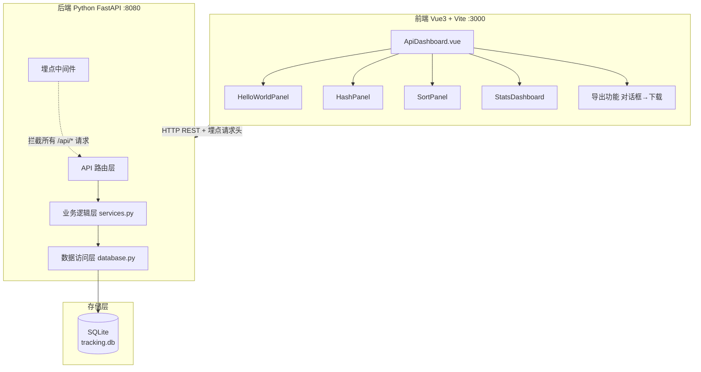
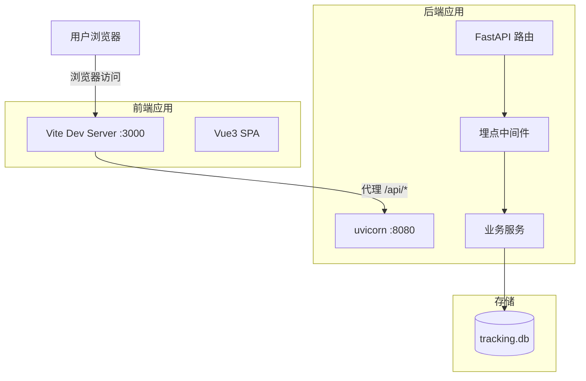
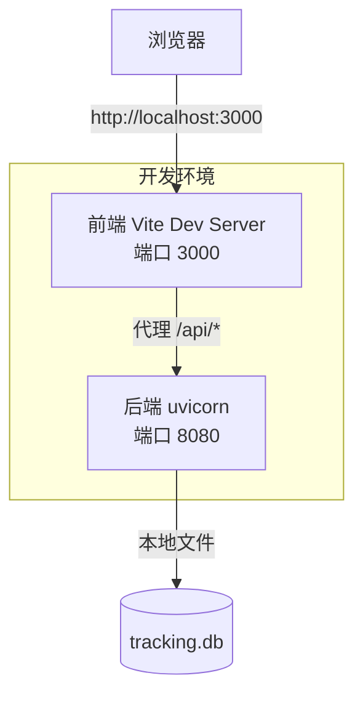
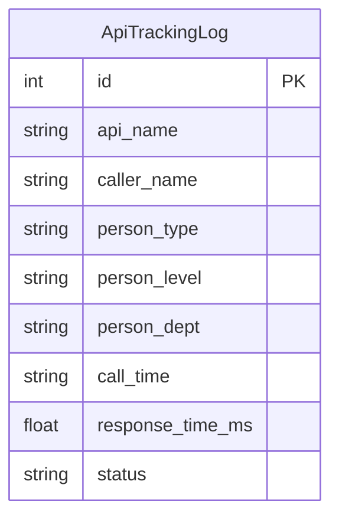
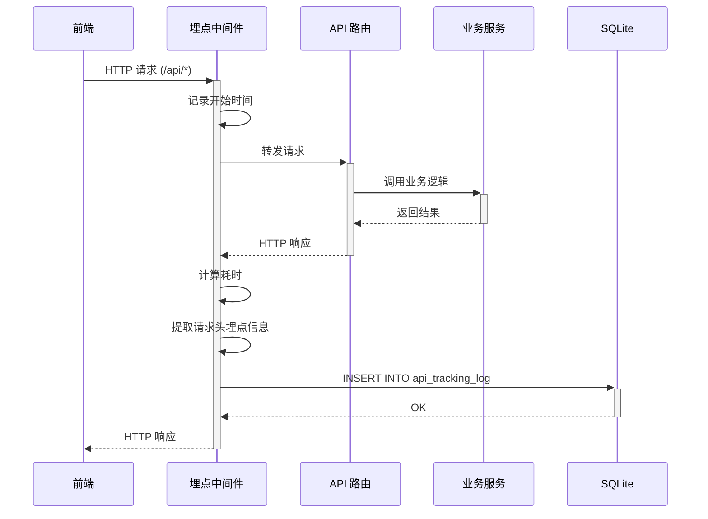
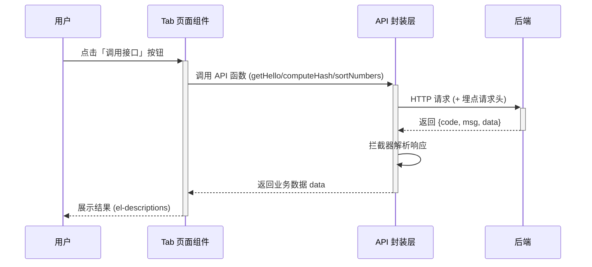
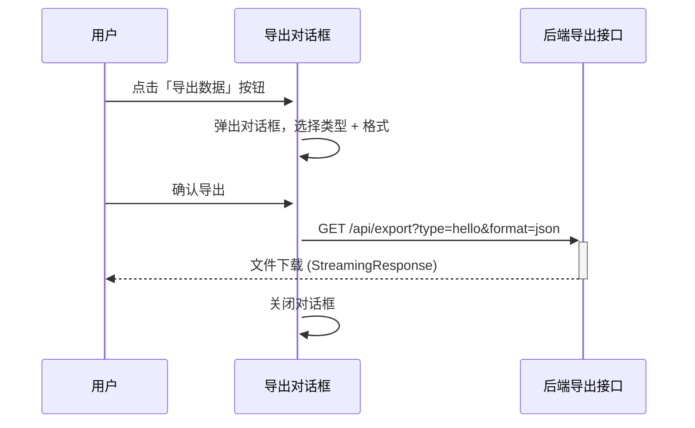
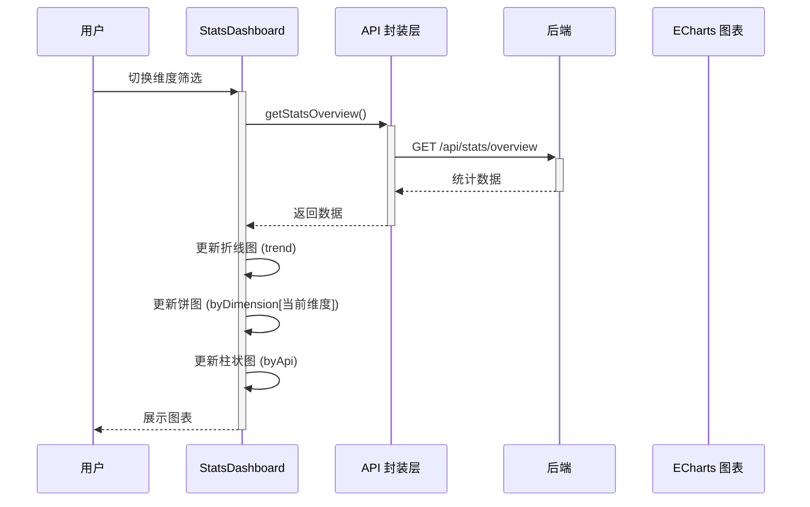

> **文档元信息**
>
> | 项目 | 内容 |
> |------|------|
> | 文档版本 | v1.0 |
> | 作者 | DTCoder |
> | 创建日期 | 2026-08-14 |
> | 需求来源 | 需求描述：三个后端接口 + 前端Tab页面 + 导出 + 埋点看板 |
> | 评审状态 | 待评审 |

# API 演示与数据看板 系分设计

## 1. 需求与范围

### 背景与目标
构建一个 API 演示与数据看板系统，提供三个示例后端接口（HelloWorld、哈希算法、冒泡排序），前端通过 Tab 页面分别展示各接口执行结果，并提供导出功能与调用统计可视化看板，实现全链路演示与数据追踪。

### 核心功能
1. **三个后端示例接口**：HelloWorld 问候、哈希算法（MD5/SHA-256/SHA-512）、冒泡排序（升序/降序）
2. **前端 Tab 页面**：分别展示各接口的调用输入与结果
3. **数据导出**：支持 JSON/CSV 格式导出各接口结果
4. **调用埋点统计**：记录每次 API 调用的调用人、人员类型、人员层级、人员部门等信息
5. **可视化看板**：折线图（调用趋势）、饼图（维度分布）、柱状图（接口对比），支持维度切换

### 约束与非功能要求
- **前端技术栈**：Vue 3 (Composition API) + Vite 5 + Element Plus + ECharts 5 + axios
- **后端技术栈**：Python 3.12 + FastAPI + uvicorn + SQLite3
- **接口协议**：RESTful JSON，统一前缀 `/api`
- **数据存储**：SQLite 本地文件
- **无需用户认证登录**：所有接口公开访问

### 排除范围
- 不涉及用户注册/登录/权限管理
- 不涉及外部系统集成
- 不涉及生产级高可用部署
- 不涉及消息队列/缓存中间件

### 需求功能清单与优先级

| 编号 | 功能点 | 优先级 | 原始描述 | 备注 |
|------|--------|--------|----------|------|
| F01 | HelloWorld 接口 | P0 | 写 helloworld 接口 | GET /api/hello，返回问候语+时间戳 |
| F02 | 哈希算法接口 | P0 | 写哈希算法接口 | POST /api/hash，支持 MD5/SHA-256/SHA-512 |
| F03 | 冒泡排序接口 | P0 | 写冒泡排序接口 | POST /api/sort，升序/降序 |
| F04 | 前端 Tab 页面 | P0 | 新增页面，三个 Tab 展示不同执行结果 | 含 HelloWorld/Hash/Sort Panel 组件 |
| F05 | 导出按钮与接口 | P0 | 新增导出按钮，后台提供导出接口 | 支持 JSON/CSV 格式，各类型独立导出 |
| F06 | 埋点统计 | P0 | 后端埋点，获取调用次数和调用人 | 中间件自动收集，含人员类型/层级/部门 |
| F07 | 可视化看板报表 | P0 | 前端可视化报表查看调用情况 | 折线图+饼图+柱状图 |
| F08 | 维度筛选 | P1 | 按人员类型/层级/部门维度 | 饼图联动切换 |

### 假设与待确认项

| 编号 | 假设/待确认内容 | 当前假设 | 确认状态 |
|------|-----------------|----------|----------|
| A01 | 后端采用 Python FastAPI 而非 Java Spring Boot | 选择 FastAPI（代码已实现） | 已确认 |
| A02 | 埋点信息通过 HTTP 请求头传递 | 前端 request.js 设置 X-Caller-Name 等头 | 已确认 |
| A03 | 统计维度为人员类型/层级/部门三个维度 | 三个维度，通过 Select 切换 | 已确认 |
| A04 | 埋点数据不包含敏感信息 | 仅记录调用元数据 | 已确认 |

## 2. 架构与模块

### 功能架构



### 模块清单

| 模块 | 职责 | 依赖 |
|------|------|------|
| 前端 Dashboard 页面 | 容器页面，Tab 切换、导出对话框入口 | 各子组件、Element Plus |
| HelloWorld Panel | 展示 HelloWorld 接口调用结果 | api/dashboard.js |
| Hash Panel | 展示哈希算法接口调用结果 | api/dashboard.js |
| Sort Panel | 展示冒泡排序接口调用结果 | api/dashboard.js |
| Stats Dashboard | 统计看板，三种图表展示 | ECharts、api/dashboard.js |
| 前端 API 封装层 | 统一 API 调用入口 | axios、utils/request.js |
| 后端 API 路由层 | 接收 HTTP 请求，分发到 Service | FastAPI |
| 后端埋点中间件 | 自动记录 API 调用日志 | database.py |
| 后端业务逻辑层 | 实现 Hello/Hash/Sort 业务逻辑 | 无外部依赖 |
| 后端数据访问层 | SQLite CRUD 操作 | sqlite3 |

### 应用集成架构



**集成关系说明：**

| 调用方 | 被调用方 | 协议 | 接口类型 | 说明 |
|--------|----------|------|----------|------|
| 用户浏览器 | 前端 Vite Dev Server | HTTP | 静态资源 | 访问 SPA 页面 |
| 前端 Vite 代理 | 后端 uvicorn | HTTP | REST API | 代理 /api/* 请求到后端 |
| 后端 API 路由 | 业务逻辑 Service | Python 调用 | 内部方法 | 处理业务逻辑 |
| 后端数据访问层 | SQLite 数据库 | SQL | 数据库操作 | 读写 tracking.db |

### 部署架构



**部署说明：**
- **前端**：Vite 开发服务器，通过 vite.config.js 的 proxy 将 /api 请求转发到后端
- **后端**：uvicorn 直接运行 FastAPI 应用
- **数据层**：SQLite 本地文件 (src/tracking.db)
- 无负载均衡层，无多实例部署（开发演示环境）

## 3. 数据模型与存储

### 实体清单

| 实体名称 | 实体说明 | 所属模块 | 与其他实体的关系 |
|----------|----------|----------|-----------------|
| ApiTrackingLog | API 调用埋点日志 | 后端埋点模块 | 独立实体，无关联 |

### 实体关系图



**模型说明：**
- ApiTrackingLog 为独立日志实体，不与其他实体关联
- 记录每次 /api/ 路径的 HTTP 请求信息，用于后续统计分析
- 通过 SQLite 存储，无需事务关联

### 存储方案
- **数据库**：SQLite 3
- **库文件**：src/tracking.db（运行时自动生成）
- **字符集**：UTF-8
- **数据保留**：无需清理，当前为演示项目

## 4. 接口设计

### 4.1 oneapi（Web 控制台接口）

| 编号 | 接口名称 | 方法 | 路径 | 模块 |
|------|----------|------|------|------|
| W01 | HelloWorld 问候 | GET | /api/hello | 后端 API 路由 |
| W02 | 哈希计算 | POST | /api/hash | 后端 API 路由 |
| W03 | 冒泡排序 | POST | /api/sort | 后端 API 路由 |
| W04 | 数据导出 | GET | /api/export?type=&format= | 后端 API 路由 |
| W05 | 统计概览 | GET | /api/stats/overview | 后端 API 路由 |

### 4.2 内部接口（Service 层）

| 编号 | 接口名称 | 类 | 方法签名 |
|------|----------|------|----------|
| S01 | 获取问候 | services.py | get_hello() -> HelloResult |
| S02 | 计算哈希 | services.py | compute_hash(input: str, algorithm: str) -> HashResult |
| S03 | 冒泡排序 | services.py | bubble_sort(numbers: List[int], order: str) -> SortResult |
| S04 | 数据库初始化 | database.py | init_db() |
| S05 | 插入日志 | database.py | insert_log(api_name, caller_name, person_type, person_level, person_dept, call_time, response_time_ms, status) |
| S06 | 获取统计概览 | database.py | get_overview() -> dict |

## 5. 功能模块设计

### 5.1 全局约定

#### 错误码格式
| 错误码 | 说明 |
|--------|------|
| 200 | 成功 |
| 400 | 参数错误 |
| 500 | 服务端错误 |

#### 通用出参结构
```json
{
  "code": 200,
  "message": "success",
  "data": {}
}
```

### 5.2 后端 API 路由模块

#### 5.2.1 表结构设计

##### api_tracking_log

| 字段名 | 数据类型 | 约束 | 默认值 | 说明 |
|--------|----------|------|--------|------|
| id | INTEGER | PK, AUTOINCREMENT | - | 系统自增主键 |
| api_name | TEXT | NOT NULL | - | 接口名称 |
| caller_name | TEXT | - | 'anonymous' | 调用人 |
| person_type | TEXT | - | - | 人员类型 |
| person_level | TEXT | - | - | 人员层级 |
| person_dept | TEXT | - | - | 人员部门 |
| call_time | TEXT | NOT NULL | - | 调用时间 (ISO 格式) |
| response_time_ms | REAL | - | - | 响应耗时(ms) |
| status | TEXT | - | 'success' | 状态 |

**索引：**
- IDX: `idx_api_tracking_log_api_name` (api_name)
- IDX: `idx_api_tracking_log_call_time` (call_time)

#### 5.2.2 接口详细设计

##### W01 HelloWorld 接口

- **URI**: GET /api/hello
- **描述**: 返回问候语和时间戳
- **入参**: 无
- **出参**:

| 参数名称 | 类型 | 描述 |
|----------|------|------|
| code | int | 状态码 |
| message | str | 提示信息 |
| data.greeting | str | 问候语 |
| data.timestamp | str | 时间戳 |

- **错误码**: 200 成功 / 500 服务端错误
- **响应示例**:
```json
{
  "code": 200,
  "message": "success",
  "data": {
    "greeting": "Hello World! Welcome to Library System",
    "timestamp": "2025-01-13T10:00:00"
  }
}
```

##### W02 哈希计算接口

- **URI**: POST /api/hash
- **描述**: 对输入文本执行指定哈希算法计算
- **入参**:

| 参数名称 | 类型 | 是否必填 | 描述 |
|----------|------|----------|------|
| input | str | 是 | 要哈希的文本 |
| algorithm | str | 否 | 算法，默认 SHA-256，可选 MD5/SHA-256/SHA-512 |

- **出参**:

| 参数名称 | 类型 | 描述 |
|----------|------|------|
| code | int | 状态码 |
| message | str | 提示信息 |
| data.input | str | 输入文本 |
| data.algorithm | str | 使用的算法 |
| data.hashResult | str | 哈希结果 |

- **错误码**: 200 成功 / 400 参数错误
- **请求示例**:
```json
{
  "input": "test",
  "algorithm": "SHA-256"
}
```
- **响应示例**:
```json
{
  "code": 200,
  "message": "success",
  "data": {
    "input": "test",
    "algorithm": "SHA-256",
    "hashResult": "9f86d081884c7d659a2feaa0c55ad015a3bf4f1b2b0b822cd15d6c15b0f00a08"
  }
}
```

##### W03 冒泡排序接口

- **URI**: POST /api/sort
- **描述**: 对整数数组执行冒泡排序
- **入参**:

| 参数名称 | 类型 | 是否必填 | 描述 |
|----------|------|----------|------|
| numbers | array[int] | 是 | 待排序整数数组 |
| order | str | 否 | 排序顺序，asc 升序 / desc 降序，默认 asc |

- **出参**:

| 参数名称 | 类型 | 描述 |
|----------|------|------|
| code | int | 状态码 |
| message | str | 提示信息 |
| data.originalArray | array[int] | 原始数组 |
| data.sortedArray | array[int] | 排序后数组 |
| data.order | str | 排序顺序 |
| data.swapCount | int | 交换次数 |
| data.executionTimeMs | float | 执行耗时(ms) |

- **错误码**: 200 成功 / 400 参数错误
- **请求示例**:
```json
{
  "numbers": [3, 1, 4, 1, 5],
  "order": "asc"
}
```
- **响应示例**:
```json
{
  "code": 200,
  "message": "success",
  "data": {
    "originalArray": [3, 1, 4, 1, 5],
    "sortedArray": [1, 1, 3, 4, 5],
    "order": "asc",
    "swapCount": 4,
    "executionTimeMs": 0.05
  }
}
```

##### W04 数据导出接口

- **URI**: GET /api/export?type=hello|hash|sort&format=json|csv
- **描述**: 导出指定接口的执行结果文件
- **入参**:

| 参数名称 | 类型 | 是否必填 | 描述 |
|----------|------|----------|------|
| type | str | 是 | 导出类型，可选 hello/hash/sort |
| format | str | 否 | 导出格式，可选 json/csv，默认 json |

- **出参**: 文件下载 (StreamingResponse)
- **Content-Type**: application/json 或 text/csv
- **Content-Disposition**: attachment; filename={type}-result.{format}
- **错误码**: 200 成功 / 400 无效类型

##### W05 统计概览接口

- **URI**: GET /api/stats/overview
- **描述**: 获取调用统计概览数据
- **入参**: 无
- **出参**:

| 参数名称 | 类型 | 描述 |
|----------|------|------|
| code | int | 状态码 |
| message | str | 提示信息 |
| data.totalCalls | int | 总调用次数 |
| data.byApi | object | 各接口调用量，如 {"hello": 350, "hash": 420} |
| data.byDimension.personType | array | 按人员类型分布 |
| data.byDimension.personLevel | array | 按人员层级分布 |
| data.byDimension.personDept | array | 按人员部门分布 |
| data.trend | array | 按天调用趋势 |

- **错误码**: 200 成功
- **响应示例**:
```json
{
  "code": 200,
  "message": "success",
  "data": {
    "totalCalls": 1024,
    "byApi": {"hello": 350, "hash": 420, "sort": 254},
    "byDimension": {
      "personType": [{"label": "管理员", "value": 400}, {"label": "普通用户", "value": 624}],
      "personLevel": [{"label": "初级", "value": 300}, {"label": "中级", "value": 500}, {"label": "高级", "value": 224}],
      "personDept": [{"label": "技术部", "value": 450}, {"label": "产品部", "value": 350}, {"label": "运营部", "value": 224}]
    },
    "trend": [{"date": "2025-01-07", "count": 120}, {"date": "2025-01-08", "count": 150}]
  }
}
```

#### 5.2.3 子功能详细设计

##### 5.2.3.1 埋点中间件（F06）

- **处理时序图**



**业务规则：**

| 规则编号 | 规则描述 | 校验时机 | 不满足时的处理 |
|----------|----------|----------|--------------|
| R01 | 仅追踪 /api/ 路径的请求 | 每次请求到达中间件 | 不记录，直接放行 |
| R02 | 提取请求头埋点信息 | 请求路径匹配 /api/ 时 | 缺失字段默认 'anonymous' 或 null |

**异常场景：**

| 异常场景 | 处理方式 |
|----------|----------|
| 数据库写入失败 | 捕获异常，忽略错误，不影响主流程响应 |
| 请求头字段缺失 | 使用默认值 'anonymous' 或 null，不会报错 |

**并发控制：**
- 无并发风险。SQLite 单连接写入，每次操作直接 commit

##### 5.2.3.2 前端 Tab 页面与接口调用（F01-F04）

- **处理时序图**



##### 5.2.3.3 导出功能（F05）

- **处理时序图**



##### 5.2.3.4 统计看板（F07-F08）

- **处理时序图**



**图表布局：**

```
┌─────────────────────────────────────────────────────────────┐
│ [维度筛选: 人员类型 ▼]          总调用次数: 1024             │
├──────────────────────────┬──────────────────────────────────┤
│ 调用趋势（近7天）        │ 维度分布（饼图）                 │
│   折线图 + 平滑曲线     │   环形饼图                        │
├──────────────────────────┴──────────────────────────────────┤
│ 各接口调用量对比（柱状图）                                    │
│   渐变柱状图                                                 │
└─────────────────────────────────────────────────────────────┘
```

**维度联动机制：**

| 维度选择 | 影响范围 | 数据来源 | 图表类型 |
|----------|----------|----------|----------|
| 人员类型 | 饼图 | byDimension.personType | 环形饼图 |
| 人员层级 | 饼图 | byDimension.personLevel | 环形饼图 |
| 人员部门 | 饼图 | byDimension.personDept | 环形饼图 |

**并发控制：**
- 无并发风险，所有操作均为读取已有数据

### 5.3 前端统计看板模块

#### 维度筛选设计
- 使用 el-select 下拉选择维度
- 选项：人员类型 / 人员层级 / 人员部门
- 切换时重新渲染饼图，折线图和柱状图保持不变

#### 图表设计
| 图表 | 类型 | 数据源 | 说明 |
|------|------|--------|------|
| 调用趋势 | 折线图 (smooth) | trend[] | 近7天调用量，X轴日期，Y轴数量 |
| 维度分布 | 环形饼图 | byDimension[维度] | 选中维度下的分布 |
| 接口对比 | 渐变色柱状图 | byApi | 三个接口的调用量 |

## 6. 非功能性需求设计

### 6.1 高可用性
本项不适用，原因：当前为演示/开发项目，单机运行，不涉及生产级高可用要求。

### 6.2 可扩展性
- **水平扩展**：后端服务无状态，可前置负载均衡后水平扩展
- **前端分发**：构建后为静态 SPA，可通过 CDN 分发
- **数据库迁移**：可从 SQLite 平滑迁移至 MySQL/PostgreSQL（仅需修改 database.py）
- **新增 API**：只需在 main.py 添加路由，在 services.py 添加业务逻辑，在 models.py 添加数据模型

### 6.3 稳定性/可靠性
- 埋点中间件异常不影响主流程（try/except 兜底）
- 接口参数由 Pydantic 自动校验，非法参数返回 400
- 前端拦截器统一处理错误响应

### 6.4 安全性设计
#### 6.4.1 账户系统方案
本项不适用，原因：当前为演示项目，无需用户认证。

#### 6.4.2 授权&访问控制
本项不适用，原因：所有接口均为公开演示接口。

#### 6.4.3 数据防护方案
本项不适用，原因：不涉及敏感数据存储和展示。

### 6.5 监控/统计/日志/告警
- **埋点中间件**：自动记录所有 /api/ 请求的调用信息
- **监控字段**：api_name, caller_name, person_type/level/dept, call_time, response_time_ms, status
- **前端可视化**：ECharts 提供折线图、饼图、柱状图三种展示形式
- **数据查询接口**：/api/stats/overview 支持实时查询

## 7. 变更三板斧

### 7.1 可监控
- **埋点覆盖**：所有 /api/ 路径请求自动记录
- **监控维度**：接口维度、时间维度、人员维度
- **可视化**：前端 ECharts 看板提供趋势、分布、对比三种视图
- **导出能力**：支持 JSON/CSV 格式导出，便于外部分析

### 7.2 可灰度
本项不适用，原因：当前为演示项目，无灰度发布需求。

### 7.3 可应急
- **导出接口**：可直接通过浏览器 URL 访问导出，无需依赖前端
- **代码回滚**：Git 版本管理，可快速回滚至稳定版本
- **埋点降级**：中间件异常不会影响主流程，自动降级为无埋点模式
- **启动方式**：后端 `python main.py` 一键启动，前端 `npm run dev` 一键启动
