> **文档元信息**
>
> | 项目 | 内容 |
> |------|------|
> | 文档版本 | v1.0 |
> | 作者 | DTCoder 系分生成 |
> | 创建日期 | 2026-08-12 |
> | 需求来源 | `.agents/specs/library-demo-analytics-design.md`（需求澄清规格）· `.agents/specs/library-demo-analytics-implementation-plan.md`（实施计划） |
> | 评审状态 | 待评审 |

# 图书管理系统 — 演示接口、导出与调用埋点可视化 系分设计

## 1. 需求与范围

### 背景与目标

图书管理系统需要一套完整的演示与调用分析能力：后端提供三个算法演示接口（HelloWorld、哈希算法、冒泡排序），前端以三 Tab 页面展示执行结果；同时提供导出功能，支持将各 Tab 展示结果导出为 Excel；后端对三个演示接口进行 AOP 埋点，记录调用次数与调用人，前端在同一页面上以多维度（人员类型/层级/部门）、多图表形式（折线图/饼图/柱状图）可视化调用情况。

**目标**：
- F1：后端提供三个 REST 演示接口
- F2：前端单页面三 Tab 展示接口执行结果
- F3：前端导出按钮 + 后端导出接口，支持导出各 Tab 结果为 Excel
- F4：后端 AOP 埋点，记录调用次数、调用人、调用结果
- F5：前端可视化报表，多维度多图表展示调用情况

### 核心功能

- 三个演示接口：HelloWorld（返回固定问候）、哈希算法（SHA-256）、冒泡排序（整数数组排序+交换步数）
- 前端三 Tab 页面 + 导出按钮
- 后端导出接口（从埋点表读取历史记录导出 Excel）
- 后端 AOP 注解式埋点（`@TrackCall`），异步写入 `call_log` 表
- 前端 ECharts 可视化报表（折线图/饼图/柱状图），支持维度切换、接口过滤、日期范围

### 约束与非功能要求

- 双仓库均为 greenfield 空仓库（仅含 README.md），无历史代码约束
- 后端：Spring Boot 3.x + Java 17 + MyBatis-Plus + H2(开发)/MySQL(生产)
- 前端：React 18 + TypeScript + Vite + Axios + ECharts(echarts-for-react)
- 导出格式：Excel (.xlsx) via Apache POI
- 调用人身份通过 HTTP Header `X-User-Id` / `X-User-Name` 模拟传递（无真实 SSO）
- 跨库接口变更始终向后兼容：仅新增字段/接口，不修改/删除现有契约

### 排除范围

- 真实登录/SSO 对接（当前用 Header 模拟）
- 人员中心 API 对接（当前用 person 种子数据）
- 消息队列削峰（当前埋点同步写入，高并发优化为后续迭代）
- 图书管理核心业务（借阅/馆藏等，本需求不涉及）

### 需求功能清单与优先级

| 编号 | 功能点 | 优先级 | PRD 原始描述/章节 | 备注 |
|------|--------|--------|-------------------|------|
| F01 | HelloWorld 演示接口 | P0 | "分别写三个接口helloworld" | 后端 GET /api/demo/helloworld |
| F02 | 哈希算法演示接口 | P0 | "哈希算法" | 后端 GET /api/demo/hash?input=xxx |
| F03 | 冒泡排序演示接口 | P0 | "冒泡排序" | 后端 GET /api/demo/bubblesort?numbers=xxx |
| F04 | 前端三 Tab 页面 | P0 | "前端新增一个页面，有三个tab分别展示不同的执行结果" | DemoPage 内 TabContainer |
| F05 | 导出按钮 + 后端导出接口 | P0 | "新增导出按钮，后台提供导出接口，支持导出各个页面的展示结果" | GET /api/demo/export?tab=xxx → xlsx |
| F06 | 后端 AOP 埋点 | P0 | "后端再做个埋点，获取调用次数和调用人" | @TrackCall 注解 + TrackCallAspect |
| F07 | 前端可视化报表 | P0 | "前端在当前页面上可视化出来一个报表查看调用情况" | AnalyticsPanel + ECharts |
| F08 | 多维度统计 | P0 | "根据不同的维度：人员类型、人员层级、人员部门等" | personType/personLevel/department |
| F09 | 多图表形式 | P0 | "折线图以及饼图和柱状图不同展示形式" | line/pie/bar |

### 假设与待确认项

| 编号 | 假设/待确认内容 | 当前假设 | 确认状态 |
|------|-----------------|----------|----------|
| A01 | 调用人身份获取方式 | 通过 HTTP Header `X-User-Id`/`X-User-Name` 模拟传递，实际项目需对接 SSO | 待确认 |
| A02 | 人员维度数据来源 | person 表种子数据（5 条），实际项目需对接人员中心 API | 待确认 |
| A03 | 导出数据源 | 从埋点表 `call_log.result_snapshot` 读取历史调用记录导出，非前端内存数据 | 已确认 |
| A04 | 埋点写入方式 | 当前同步写入（AOP `@Around`），高并发场景后续引入 MQ 削峰 | 待确认 |
| A05 | 数据库选型 | 开发环境 H2 内存数据库，生产环境 MySQL | 待确认 |

---

## 2. 架构与模块

### 功能架构

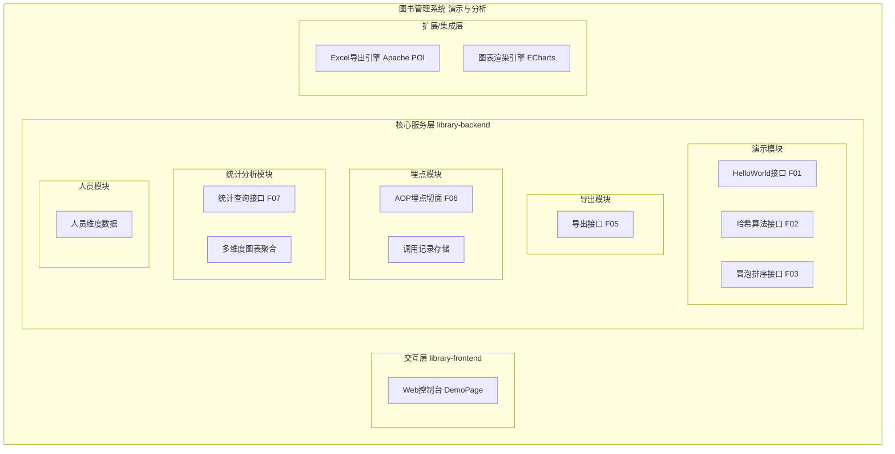

- 交互层说明：library-frontend 提供 DemoPage 单页面，包含三 Tab 展示区、导出按钮、分析报表区，通过 Axios 调用后端 REST 接口
- 核心服务层说明：
  - 演示模块：提供 HelloWorld/Hash/BubbleSort 三个业务接口
  - 导出模块：从埋点表读取历史记录，通过 Apache POI 生成 Excel 文件流
  - 埋点模块：AOP 切面拦截 `@TrackCall` 注解方法，异步写入 call_log 表
  - 统计分析模块：按维度/图表类型/接口/日期聚合 call_log 数据，返回 ECharts 格式数据
  - 人员模块：提供人员维度数据（类型/层级/部门），供统计查询 JOIN
- 扩展/集成层说明：Excel 导出引擎（Apache POI）和图表渲染引擎（ECharts）为工具层组件

**模块清单**

| 模块 | 职责 | 依赖 |
|------|------|------|
| 演示模块 (library-backend) | 提供 HelloWorld/Hash/BubbleSort 三个演示接口的业务逻辑 | 埋点模块（AOP 切面拦截） |
| 导出模块 (library-backend) | 从 call_log 读取历史记录，生成 Excel 文件流下载 | 埋点模块（call_log 表）、Excel 导出引擎 |
| 埋点模块 (library-backend) | AOP 注解式埋点，记录调用次数/调用人/结果/耗时 | 人员模块（person 表 JOIN） |
| 统计分析模块 (library-backend) | 按维度/图表类型聚合 call_log 数据 | 埋点模块（call_log 表）、人员模块（person 表） |
| 人员模块 (library-backend) | 提供人员维度数据（类型/层级/部门） | 无外部依赖（种子数据） |
| 前端演示页 (library-frontend) | 三 Tab 展示 + 导出按钮 + 分析报表 | 后端演示/导出/统计接口 |
| 前端图表组件 (library-frontend) | ECharts 折线图/饼图/柱状图渲染 | 前端 API 调用层、ECharts 库 |

### 应用集成架构

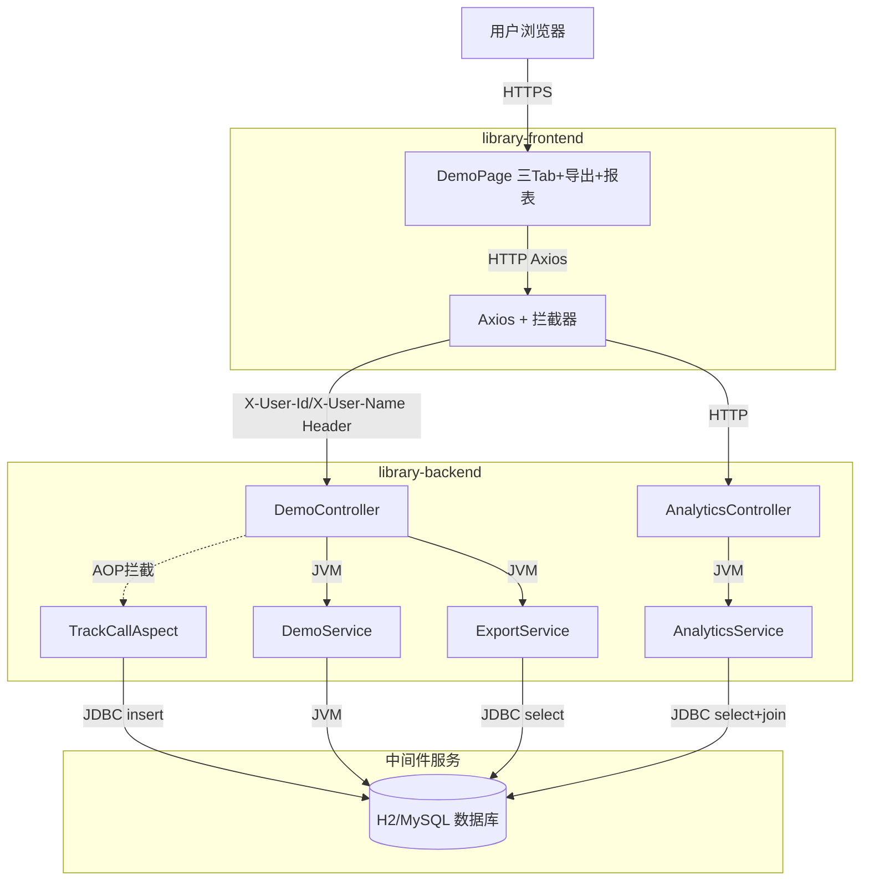

**集成关系说明：**

| 调用方 | 被调用方 | 协议 | 接口类型 | 说明 |
|--------|----------|------|----------|------|
| 用户浏览器 | library-frontend DemoPage | HTTPS | Web 页面 | 浏览器访问 /demo 路由 |
| library-frontend Axios | library-backend DemoController | HTTP | oneapi REST | 调用演示接口 + 导出接口，注入 X-User-Id/X-User-Name Header |
| library-frontend Axios | library-backend AnalyticsController | HTTP | oneapi REST | 查询埋点统计数据 |
| library-backend DemoController | DemoService | JVM | 方法调用 | 执行 HelloWorld/Hash/BubbleSort 业务逻辑 |
| library-backend TrackCallAspect | 数据库 call_log | JDBC | SQL insert | AOP 拦截后异步写入调用记录 |
| library-backend ExportService | 数据库 call_log | JDBC | SQL select | 读取历史调用记录导出 Excel |
| library-backend AnalyticsService | 数据库 call_log + person | JDBC | SQL select + join | 按维度聚合统计 |

### 部署架构

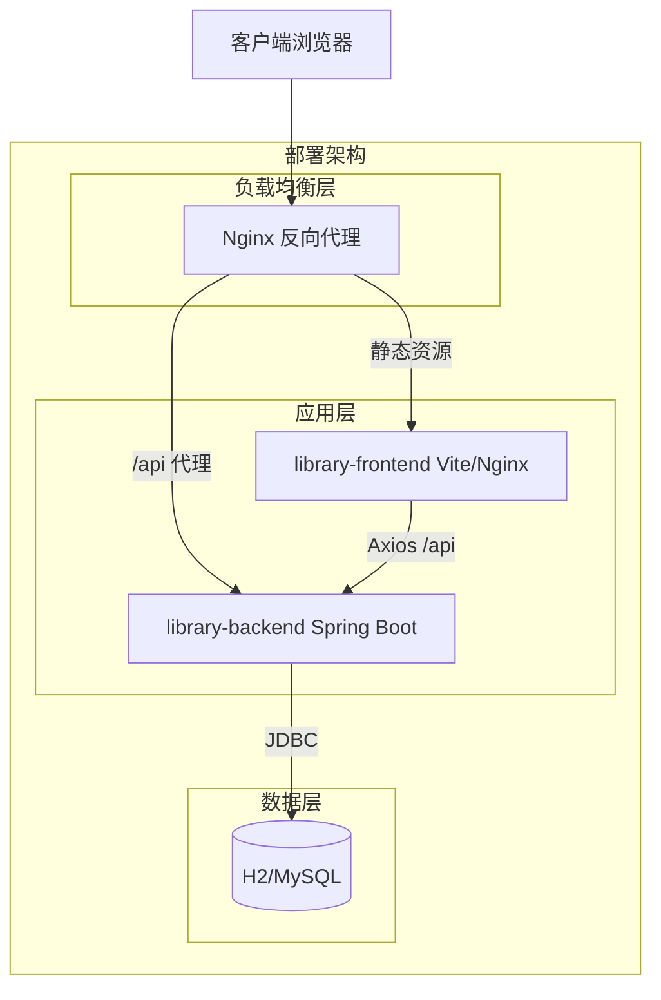

**部署说明：**
- **负载均衡层**：Nginx 反向代理，静态资源指向前端，`/api` 路径代理到后端 Spring Boot（8080 端口）
- **应用层**：前端 Vite dev server（开发）/ Nginx 静态部署（生产）；后端 Spring Boot 单实例（开发），可水平扩展（生产）
- **数据层**：开发环境 H2 内存数据库（schema.sql 自动建表+种子数据）；生产环境 MySQL 主从架构

---

## 3. 数据模型与存储

### 实体清单

| 实体名称 | 实体说明 | 所属模块 | 与其他实体的关系 |
|----------|----------|----------|-----------------|
| call_log | 调用埋点记录，记录每次演示接口调用的接口名/调用人/时间/结果/耗时/结果快照 | 埋点模块 | 多对一关联 person（caller_id → person.id） |
| person | 人员维度数据，包含人员类型/层级/部门 | 人员模块 | 一对多被 call_log 引用（person.id ← call_log.caller_id） |

### 实体关系图

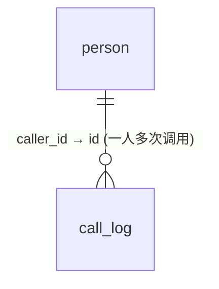

**模型说明：**
- `call_log.caller_id` 外键关联 `person.id`，统计查询通过 JOIN person 表获取人员维度信息（person_type/person_level/department）
- call_log 为追加写入表（仅 insert，无 update/delete），数据量随调用次数线性增长
- person 为基础数据表，种子数据初始化，后续可对接人员中心 API 同步

---

## 4. 接口设计

### 4.1 oneapi（Web 控制台接口）

| 编号 | 接口名称 | 方法 | 路径 | 模块 |
|------|----------|------|------|------|
| W01 | HelloWorld 演示接口 | GET | /api/demo/helloworld | 演示模块 |
| W02 | 哈希算法演示接口 | GET | /api/demo/hash | 演示模块 |
| W03 | 冒泡排序演示接口 | GET | /api/demo/bubblesort | 演示模块 |
| W04 | 导出接口 | GET | /api/demo/export | 导出模块 |
| W05 | 埋点统计查询接口 | GET | /api/analytics/calls | 统计分析模块 |

### 4.2 OpenAPI（对外接口）

本系统无对外 OpenAPI 接口，所有接口均为 Web 控制台内部 oneapi 接口。

### 4.3 内部接口（Service 层）

| 编号 | 接口名称 | 类 | 方法签名 |
|------|----------|------|----------|
| S01 | HelloWorld 业务逻辑 | DemoService | `Map<String,String> helloWorld()` |
| S02 | 哈希计算业务逻辑 | DemoService | `Map<String,String> hash(String input)` |
| S03 | 冒泡排序业务逻辑 | DemoService | `Map<String,Object> bubbleSort(String numbers)` |
| S04 | 导出 Tab 数据为 Excel | ExportService | `void exportTab(String tab, HttpServletResponse response)` |
| S05 | 柱状图/折线图数据聚合 | AnalyticsService | `BarLineChartDTO getBarLineData(String dimension, String chartType, String apiName, String startDate, String endDate)` |
| S06 | 饼图数据聚合 | AnalyticsService | `PieChartDTO getPieData(String dimension, String apiName, String startDate, String endDate)` |

### 4.4 集成接口（Integration 层）

本系统无外部系统集成接口。人员维度数据当前为数据库种子数据，未来对接人员中心 API 时新增集成接口。

---

## 5. 功能模块设计

### 5.1 演示模块（library-backend）

#### 5.1.1 表结构设计

本模块无独立数据表，业务逻辑为纯计算，不涉及数据持久化。埋点记录由埋点模块（5.3）的 call_log 表承载。

##### 5.1.1.x 枚举与常量定义

| 枚举名称 | 取值 | 含义 | 关联字段 |
|----------|------|------|----------|
| ApiName | helloworld | HelloWorld 接口标识 | call_log.api_name / @TrackCall.apiName |
| ApiName | hash | 哈希算法接口标识 | call_log.api_name / @TrackCall.apiName |
| ApiName | bubblesort | 冒泡排序接口标识 | call_log.api_name / @TrackCall.apiName |

#### 5.1.2 接口详细设计

##### W01 HelloWorld 演示接口

- **URI**: GET /api/demo/helloworld
- **描述**: 返回固定问候字符串 "Hello, World!"
- **入参**: 无

- **出参**:

| 参数名称 | 类型 | 描述 |
|----------|------|------|
| code | int | 状态码 200 |
| message | String | "success" |
| data | Object | `{ "result": "Hello, World!" }` |
| traceId | String | UUID 追踪 ID |

- **错误码**:

| 错误码 | 说明 |
|--------|------|
| 500 | 服务端内部异常（全局异常处理器捕获） |

- **业务规则**: 无入参校验，直接返回固定字符串

- **请求示例**:
```
GET /api/demo/helloworld
```

- **响应示例**:
```json
{
  "code": 200,
  "message": "success",
  "data": { "result": "Hello, World!" },
  "traceId": "a1b2c3d4-e5f6-7890-abcd-ef1234567890"
}
```

##### W02 哈希算法演示接口

- **URI**: GET /api/demo/hash
- **描述**: 对输入字符串计算 SHA-256 哈希并返回十六进制摘要
- **入参**:

| 参数名称 | 类型 | 是否必填 | 描述 |
|----------|------|----------|------|
| input | String | 是 | 待哈希的输入字符串 |

- **出参**:

| 参数名称 | 类型 | 描述 |
|----------|------|------|
| code | int | 状态码 200 |
| message | String | "success" |
| data | Object | `{ "input": "abc", "algorithm": "SHA-256", "hashValue": "ba7816bf..." }` |
| traceId | String | UUID 追踪 ID |

- **错误码**:

| 错误码 | 说明 |
|--------|------|
| 400 | input 参数缺失（MissingServletRequestParameterException 全局捕获） |
| 500 | 服务端内部异常 |

- **业务规则**: input 参数必填，使用 SHA-256 算法计算哈希，返回十六进制字符串

- **请求示例**:
```
GET /api/demo/hash?input=abc
```

- **响应示例**:
```json
{
  "code": 200,
  "message": "success",
  "data": {
    "input": "abc",
    "algorithm": "SHA-256",
    "hashValue": "ba7816bf8f01cfea414140de5dae2223b00361a396177a9cb410ff61f20015ad"
  },
  "traceId": "b2c3d4e5-f6a7-8901-bcde-f12345678901"
}
```

##### W03 冒泡排序演示接口

- **URI**: GET /api/demo/bubblesort
- **描述**: 对输入整数数组执行冒泡排序，返回排序结果及交换步数
- **入参**:

| 参数名称 | 类型 | 是否必填 | 描述 |
|----------|------|----------|------|
| numbers | String | 是 | 逗号分隔整数，如 `5,3,8,1,9` |

- **出参**:

| 参数名称 | 类型 | 描述 |
|----------|------|------|
| code | int | 状态码 200 |
| message | String | "success" |
| data | Object | `{ "input": [5,3,8,1,9], "sorted": [1,3,5,8,9], "steps": 4 }` |
| traceId | String | UUID 追踪 ID |

- **错误码**:

| 错误码 | 说明 |
|--------|------|
| 400 | numbers 参数缺失或格式非法（非逗号分隔整数） |
| 500 | 服务端内部异常 |

- **业务规则**: numbers 参数必填，按逗号分割解析为整数数组，执行冒泡排序并记录交换步数

- **请求示例**:
```
GET /api/demo/bubblesort?numbers=5,3,8,1,9
```

- **响应示例**:
```json
{
  "code": 200,
  "message": "success",
  "data": {
    "input": [5, 3, 8, 1, 9],
    "sorted": [1, 3, 5, 8, 9],
    "steps": 4
  },
  "traceId": "c3d4e5f6-a7b8-9012-cdef-123456789012"
}
```

#### 5.1.3 子功能详细设计

##### 5.1.3.1 HelloWorld 执行（F01）

- 处理时序图
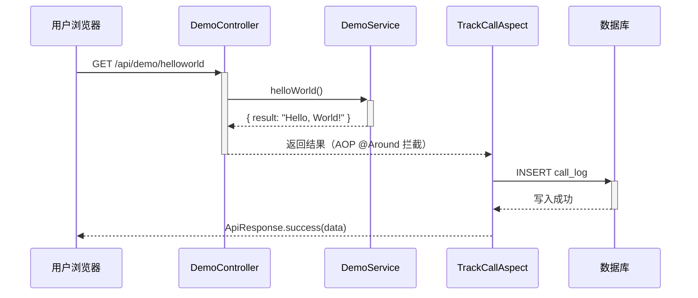

**业务规则：**
| 规则编号 | 规则描述 | 校验时机 | 不满足时的处理 |
|----------|----------|----------|--------------|
| R01 | 无入参，直接返回固定字符串 | 始终 | 无校验失败场景 |

**异常场景：**
| 异常场景 | 处理方式 |
|----------|----------|
| 埋点写入失败 | AOP catch 异常，不影响主流程返回 |

**并发控制：**
- 并发场景：无并发风险，HelloWorld 为纯计算无状态
- 控制策略：无并发风险，原因：无共享状态写入

##### 5.1.3.2 哈希计算执行（F02）

- 处理时序图
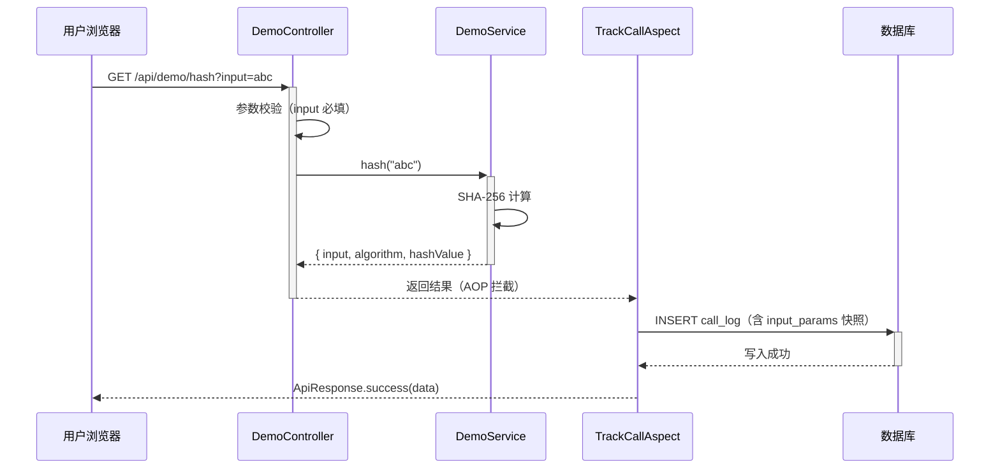

**业务规则：**
| 规则编号 | 规则描述 | 校验时机 | 不满足时的处理 |
|----------|----------|----------|--------------|
| R02 | input 参数必填 | 调用时 | 返回 400 错误，提示 "Required request parameter 'input' is not present" |

**异常场景：**
| 异常场景 | 处理方式 |
|----------|----------|
| input 参数缺失 | 全局异常处理器捕获 MissingServletRequestParameterException，返回 400 |
| 埋点写入失败 | AOP catch 异常，不影响主流程返回 |

**并发控制：**
- 并发场景：无并发风险，哈希计算为纯计算无状态
- 控制策略：无并发风险，原因：无共享状态写入

##### 5.1.3.3 冒泡排序执行（F03）

- 处理时序图
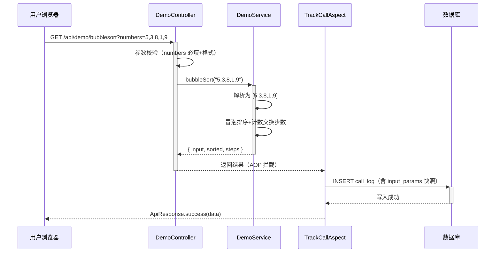

**业务规则：**
| 规则编号 | 规则描述 | 校验时机 | 不满足时的处理 |
|----------|----------|----------|--------------|
| R03 | numbers 参数必填 | 调用时 | 返回 400 错误 |
| R04 | numbers 必须为逗号分隔整数 | 调用时 | 解析失败返回 400 错误，提示 "参数格式错误" |

**异常场景：**
| 异常场景 | 处理方式 |
|----------|----------|
| numbers 参数缺失 | 全局异常处理器捕获，返回 400 |
| numbers 格式非法（非整数） | DemoService 解析时抛出 IllegalArgumentException，全局异常处理器返回 400 |
| 埋点写入失败 | AOP catch 异常，不影响主流程返回 |

**并发控制：**
- 并发场景：无并发风险，冒泡排序为纯计算无状态
- 控制策略：无并发风险，原因：无共享状态写入

---

### 5.2 导出模块（library-backend）

#### 5.2.1 表结构设计

本模块无独立数据表，从埋点模块的 call_log 表读取数据。

##### 5.2.1.x 枚举与常量定义

| 枚举名称 | 取值 | 含义 | 关联字段 |
|----------|------|------|----------|
| ExportTab | helloworld | 导出 HelloWorld Tab 数据 | 请求参数 tab |
| ExportTab | hash | 导出哈希算法 Tab 数据 | 请求参数 tab |
| ExportTab | bubblesort | 导出冒泡排序 Tab 数据 | 请求参数 tab |

#### 5.2.2 接口详细设计

##### W04 导出接口

- **URI**: GET /api/demo/export
- **描述**: 根据指定 Tab 导出对应接口历史调用结果为 Excel 文件
- **入参**:

| 参数名称 | 类型 | 是否必填 | 描述 |
|----------|------|----------|------|
| tab | String | 是 | 导出 Tab 枚举: helloworld / hash / bubblesort |

- **出参**: 文件流下载

| 响应头 | 值 |
|--------|------|
| Content-Type | application/vnd.openxmlformats-officedocument.spreadsheetml.sheet |
| Content-Disposition | attachment; filename="demo_<tab>_<timestamp>.xlsx" |

- **导出数据结构（按 Tab 区分）**:
  - helloworld Tab → 单列：`result`（问候字符串）
  - hash Tab → 三列：`input`、`algorithm`、`hashValue`
  - bubblesort Tab → 三列：`input`（JSON 数组字符串）、`sorted`（JSON 数组字符串）、`steps`

- **错误码**:

| 错误码 | 说明 |
|--------|------|
| 400 | tab 参数缺失或非法枚举值 |
| 500 | Excel 生成异常 |

- **业务规则**: 从 call_log 表读取该 tab 对应 api_name 的历史调用记录，解析 result_snapshot JSON，按列结构生成 Excel

- **请求示例**:
```
GET /api/demo/export?tab=hash
```

- **响应示例**: 二进制文件流（.xlsx）

#### 5.2.3 子功能详细设计

##### 5.2.3.1 导出 Tab 数据（F05）

- 处理时序图
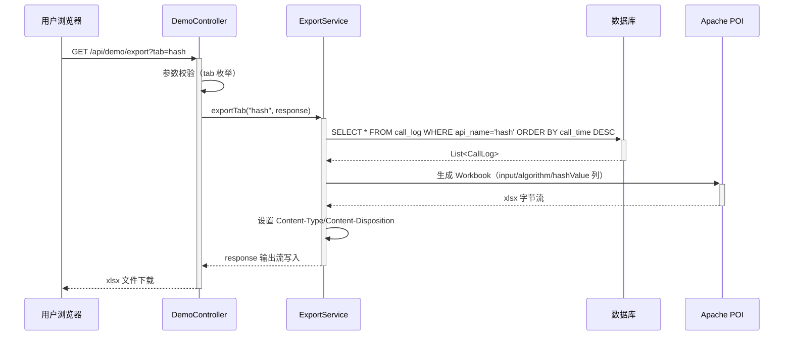

**业务规则：**
| 规则编号 | 规则描述 | 校验时机 | 不满足时的处理 |
|----------|----------|----------|--------------|
| R05 | tab 参数必填且为合法枚举 | 调用时 | 返回 400 错误，提示 "tab 参数非法" |
| R06 | 导出数据源为 call_log 历史记录 | 始终 | 无数据时导出空表（仅表头） |

**异常场景：**
| 异常场景 | 处理方式 |
|----------|----------|
| tab 参数非法 | 返回 400 错误 |
| result_snapshot JSON 解析失败 | 跳过该行，记录日志，继续导出 |
| Excel 生成异常 | 全局异常处理器返回 500 |

**并发控制：**
- 并发场景：多用户同时导出同一 Tab 数据
- 控制策略：无并发风险，原因：导出为只读查询，无数据写入

---

### 5.3 埋点模块（library-backend）

#### 5.3.1 表结构设计

##### 5.3.1.1 call_log（调用埋点记录表）

| 字段名 | 数据类型 | 约束 | 默认值 | 说明 |
|--------|----------|------|--------|------|
| id | bigint | PK, 自增 | - | 系统自增主键 |
| api_name | varchar(50) | NOT NULL | - | 接口标识: helloworld/hash/bubblesort |
| caller_id | varchar(64) | NOT NULL | - | 调用人 ID（关联 person.id） |
| caller_name | varchar(100) | NOT NULL | - | 调用人姓名 |
| call_time | datetime | NOT NULL | - | 调用时间 |
| call_result | varchar(20) | NOT NULL | - | 调用结果: SUCCESS/FAIL |
| result_snapshot | text | - | - | 返回结果快照（JSON，用于导出） |
| input_params | text | - | - | 请求参数快照（JSON） |
| duration_ms | int | - | - | 耗时毫秒 |

**索引：**
- IDX: `idx_call_log_api_name` (api_name) — 按接口过滤查询
- IDX: `idx_call_log_caller_id` (caller_id) — 按调用人过滤查询
- IDX: `idx_call_log_call_time` (call_time) — 按日期范围查询

##### 5.3.1.2 person（人员维度表）

| 字段名 | 数据类型 | 约束 | 默认值 | 说明 |
|--------|----------|------|--------|------|
| id | varchar(64) | PK | - | 人员 ID |
| name | varchar(100) | NOT NULL | - | 姓名 |
| person_type | varchar(30) | NOT NULL | - | 人员类型: 正式员工/实习生/外包 |
| person_level | varchar(30) | NOT NULL | - | 人员层级: P5/P6/P7/P8/管理 |
| department | varchar(50) | NOT NULL | - | 部门: 研发部/产品部/测试部/运维部 |

**索引：**
- PK: `person` (id) — 主键

##### 5.3.1.x 枚举与常量定义

| 枚举名称 | 取值 | 含义 | 关联字段 |
|----------|------|------|----------|
| CallResult | SUCCESS | 调用成功 | call_log.call_result |
| CallResult | FAIL | 调用失败 | call_log.call_result |
| PersonType | 正式员工 | 正式员工 | person.person_type |
| PersonType | 实习生 | 实习生 | person.person_type |
| PersonType | 外包 | 外包 | person.person_type |
| PersonLevel | P5 | P5 层级 | person.person_level |
| PersonLevel | P6 | P6 层级 | person.person_level |
| PersonLevel | P7 | P7 层级 | person.person_level |
| PersonLevel | P8 | P8 层级 | person.person_level |
| PersonLevel | 管理 | 管理层级 | person.person_level |

#### 5.3.2 接口详细设计

本模块无独立对外接口，通过 AOP 切面 `@Around("@annotation(trackCall)")` 拦截标注 `@TrackCall` 的 Controller 方法。

#### 5.3.3 子功能详细设计

##### 5.3.3.1 AOP 埋点切面（F06）

- 处理时序图
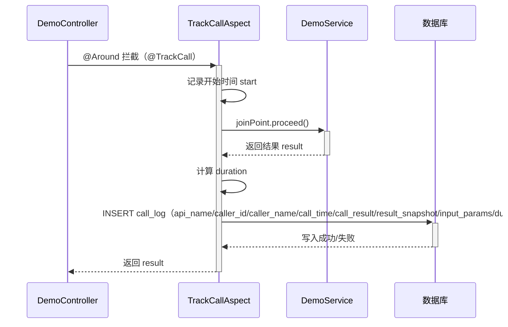

**业务规则：**
| 规则编号 | 规则描述 | 校验时机 | 不满足时的处理 |
|----------|----------|----------|--------------|
| R07 | 从 HTTP Header 读取 X-User-Id/X-User-Name | 埋点时 | Header 缺失时使用默认值 "anonymous"/"匿名" |
| R08 | 埋点失败不影响主流程 | 始终 | catch 异常，静默忽略，主流程正常返回 |

**异常场景：**
| 异常场景 | 处理方式 |
|----------|----------|
| 数据库写入失败 | catch 异常，不影响主流程返回 |
| RequestContextHolder 获取请求失败 | catch 异常，使用默认值 |
| result_snapshot JSON 序列化失败 | catch 异常，result_snapshot 设为 null |

**并发控制：**
- 并发场景：多用户并发调用演示接口，AOP 切面并发写入 call_log
- 控制策略：无并发风险，原因：每条 call_log 为独立 insert，无共享状态竞争；高并发场景后续可引入 MQ 异步削峰

---

### 5.4 统计分析模块（library-backend）

#### 5.4.1 表结构设计

本模块无独立数据表，从 call_log + person 表联合查询。

##### 5.4.1.x 枚举与常量定义

| 枚举名称 | 取值 | 含义 | 关联字段 |
|----------|------|------|----------|
| Dimension | personType | 按人员类型统计 | 查询参数 dimension |
| Dimension | personLevel | 按人员层级统计 | 查询参数 dimension |
| Dimension | department | 按部门统计 | 查询参数 dimension |
| ChartType | line | 折线图 | 查询参数 chartType |
| ChartType | pie | 饼图 | 查询参数 chartType |
| ChartType | bar | 柱状图（默认） | 查询参数 chartType |

#### 5.4.2 接口详细设计

##### W05 埋点统计查询接口

- **URI**: GET /api/analytics/calls
- **描述**: 按维度/图表类型/接口/日期范围聚合 call_log 数据，返回 ECharts 格式数据
- **入参**:

| 参数名称 | 类型 | 是否必填 | 描述 |
|----------|------|----------|------|
| dimension | String | 是 | 统计维度: personType/personLevel/department |
| chartType | String | 否 | 图表类型: line/pie/bar（默认 bar） |
| apiName | String | 否 | 过滤特定接口: helloworld/hash/bubblesort，不传则统计全部 |
| startDate | String | 否 | 起始日期 yyyy-MM-dd，默认近 7 天 |
| endDate | String | 否 | 结束日期 yyyy-MM-dd，默认今天 |

- **出参（折线图/柱状图通用）**:

| 参数名称 | 类型 | 描述 |
|----------|------|------|
| code | int | 状态码 200 |
| message | String | "success" |
| data | Object | 见下方结构 |
| traceId | String | UUID |

- **出参 data 结构（折线图/柱状图）**:
```json
{
  "dimension": "department",
  "chartType": "bar",
  "categories": ["研发部", "产品部", "测试部", "运维部"],
  "series": [
    { "name": "helloworld", "data": [120, 80, 45, 30] },
    { "name": "hash", "data": [90, 60, 30, 15] },
    { "name": "bubblesort", "data": [75, 50, 20, 10] }
  ]
}
```

- **出参 data 结构（饼图）**:
```json
{
  "dimension": "personType",
  "chartType": "pie",
  "series": [
    { "name": "正式员工", "value": 350 },
    { "name": "实习生", "value": 120 },
    { "name": "外包", "value": 80 }
  ]
}
```

- **错误码**:

| 错误码 | 说明 |
|--------|------|
| 400 | dimension 参数缺失或非法枚举值 |
| 500 | 统计查询异常 |

- **业务规则**:
  - dimension 映射到 person 表字段：personType→person_type, personLevel→person_level, department→department
  - chartType=pie 时返回 `{name, value}[]` 格式（按维度值聚合总调用次数）
  - chartType=line/bar 时返回 `{categories, series}` 格式（categories 为维度值列表，series 按接口名分组）
  - 日期范围默认近 7 天

- **请求示例**:
```
GET /api/analytics/calls?dimension=department&chartType=bar&apiName=hash&startDate=2026-08-05&endDate=2026-08-12
```

- **响应示例**:
```json
{
  "code": 200,
  "message": "success",
  "data": {
    "dimension": "department",
    "chartType": "bar",
    "categories": ["研发部", "产品部", "测试部", "运维部"],
    "series": [
      { "name": "hash", "data": [90, 60, 30, 15] }
    ]
  },
  "traceId": "d4e5f6a7-b8c9-0123-defa-456789012345"
}
```

#### 5.4.3 子功能详细设计

##### 5.4.3.1 柱状图/折线图数据聚合（F07/F08/F09）

- 处理时序图
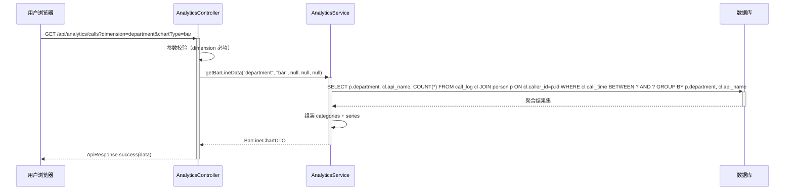

**业务规则：**
| 规则编号 | 规则描述 | 校验时机 | 不满足时的处理 |
|----------|----------|----------|--------------|
| R09 | dimension 参数必填且为合法枚举 | 调用时 | 返回 400 错误 |
| R10 | 日期范围默认近 7 天 | 始终 | startDate/endDate 为空时自动填充 |
| R11 | 无数据时返回空 categories + 空 series | 始终 | 前端图表组件处理空数据状态 |

**异常场景：**
| 异常场景 | 处理方式 |
|----------|----------|
| dimension 参数缺失 | 返回 400 错误 |
| 数据库查询异常 | 全局异常处理器返回 500 |

**并发控制：**
- 并发场景：多用户同时查询统计数据
- 控制策略：无并发风险，原因：统计为只读查询，无数据写入

##### 5.4.3.2 饼图数据聚合（F07/F08/F09）

- 处理时序图
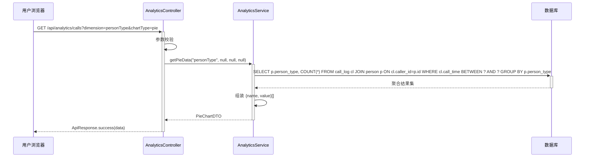

**业务规则：**
| 规则编号 | 规则描述 | 校验时机 | 不满足时的处理 |
|----------|----------|----------|--------------|
| R12 | 饼图按维度值聚合总调用次数（不分接口） | 始终 | 无校验失败场景 |
| R13 | 无数据时返回空 series | 始终 | 前端饼图组件处理空数据状态 |

**异常场景：**
| 异常场景 | 处理方式 |
|----------|----------|
| dimension 参数缺失 | 返回 400 错误 |
| 数据库查询异常 | 全局异常处理器返回 500 |

**并发控制：**
- 并发场景：多用户同时查询统计数据
- 控制策略：无并发风险，原因：统计为只读查询，无数据写入

---

### 5.5 前端演示页模块（library-frontend）

#### 5.5.1 表结构设计

本模块为前端，无数据表。

#### 5.5.2 接口详细设计

本模块为前端页面，调用后端 oneapi 接口（W01-W05），无独立对外接口。

**前端 API 调用层类型定义：**

```typescript
// src/api/types.ts
export interface ApiResponse<T> {
  code: number;
  message: string;
  data: T;
  traceId: string;
}

export interface HelloWorldResult { result: string }
export interface HashResult { input: string; algorithm: string; hashValue: string }
export interface BubbleSortResult { input: number[]; sorted: number[]; steps: number }

export interface AnalyticsQuery {
  dimension: 'personType' | 'personLevel' | 'department';
  chartType?: 'line' | 'pie' | 'bar';
  apiName?: 'helloworld' | 'hash' | 'bubblesort';
  startDate?: string;
  endDate?: string;
}

export interface BarLineChartData {
  dimension: string;
  chartType: string;
  categories: string[];
  series: { name: string; data: number[] }[];
}

export interface PieChartData {
  dimension: string;
  chartType: string;
  series: { name: string; value: number }[];
}
```

**Axios 拦截器（注入调用人 Header）：**

```typescript
// src/api/request.ts
request.interceptors.request.use((config) => {
  config.headers['X-User-Id'] = localStorage.getItem('userId') || 'guest';
  config.headers['X-User-Name'] = localStorage.getItem('userName') || '访客';
  return config;
});
```

#### 5.5.3 子功能详细设计

##### 5.5.3.1 三 Tab 页面展示（F02）

- 处理时序图
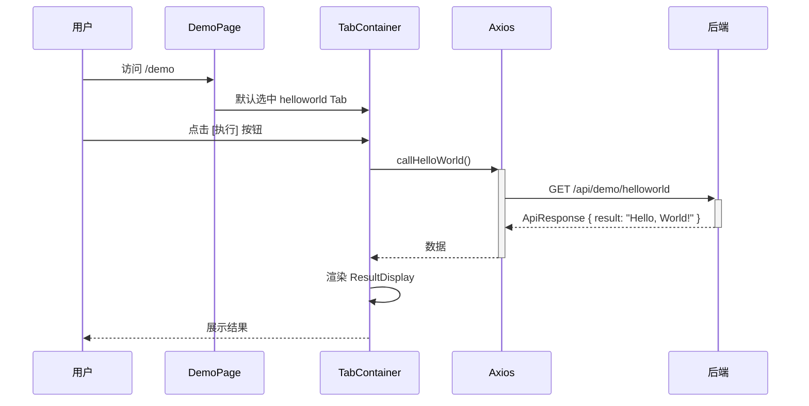

**业务规则：**
| 规则编号 | 规则描述 | 校验时机 | 不满足时的处理 |
|----------|----------|----------|--------------|
| R14 | Tab 切换时保留各 Tab 独立状态 | 始终 | 无校验失败场景 |
| R15 | 哈希 Tab input 为空时禁用执行按钮 | 调用时 | 按钮 disabled |
| R16 | 冒泡排序 Tab numbers 为空或格式非法时禁用执行按钮 | 调用时 | 按钮 disabled + 提示 |

**异常场景：**
| 异常场景 | 处理方式 |
|----------|----------|
| 接口调用失败 | 展示错误提示信息 |
| 接口超时 | Axios timeout 10s，展示超时提示 |

##### 5.5.3.2 导出按钮（F05）

- 处理时序图
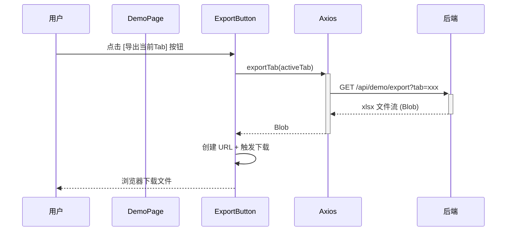

**业务规则：**
| 规则编号 | 规则描述 | 校验时机 | 不满足时的处理 |
|----------|----------|----------|--------------|
| R17 | 导出当前激活 Tab 对应数据 | 始终 | 无校验失败场景 |

**异常场景：**
| 异常场景 | 处理方式 |
|----------|----------|
| 导出接口失败 | 展示错误提示信息 |

##### 5.5.3.3 可视化报表（F07/F08/F09）

- 处理时序图
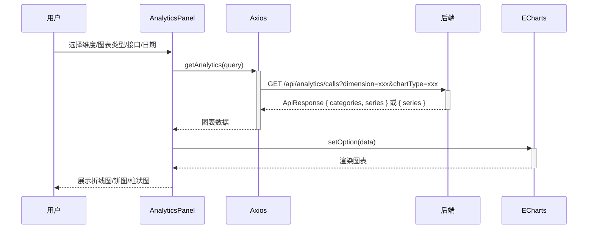

**业务规则：**
| 规则编号 | 规则描述 | 校验时机 | 不满足时的处理 |
|----------|----------|----------|--------------|
| R18 | 维度切换时重新查询数据 | 始终 | 无校验失败场景 |
| R19 | 图表类型切换时重新查询数据（数据格式不同） | 始终 | 无校验失败场景 |
| R20 | 空数据时展示友好提示 | 始终 | 图表区域展示 "暂无调用记录" |

**异常场景：**
| 异常场景 | 处理方式 |
|----------|----------|
| 统计接口失败 | 展示错误提示信息 |
| 图表渲染失败 | 展示错误提示信息 |

**并发控制：**
- 并发场景：用户快速切换维度/图表类型，触发多次查询
- 控制策略：无并发风险，原因：前端为只读展示；快速切换时使用最新请求结果（可引入 AbortController 取消旧请求）

---

## 6. 非功能性需求设计

### 6.1 高可用性

- 后端 Spring Boot 单实例部署，数据库 H2(开发)/MySQL(生产)。后端服务不可用时前端展示错误提示。
- 埋点 AOP 切面采用 try-catch 包裹，埋点失败不影响演示接口主流程返回，保证核心功能可用性。
- 导出接口从 call_log 表读取数据，数据库不可用时返回 500 错误提示。
- 前端 Axios 设置 timeout 10s，超时后展示友好提示，不阻塞用户操作。

### 6.2 可扩展性

- 后端 Spring Boot 可水平扩展为多实例（无状态服务），埋点写入 call_log 表为独立 insert，无共享状态竞争。
- 统计查询为只读 SELECT + JOIN，可引入从库读写分离减轻主库压力。
- 前端 React 组件化设计，Tab/图表/导出按钮均为独立组件，可独立扩展。
- call_log 表数据量增长后可按 call_time 分区，提升查询性能。

### 6.3 稳定性/可靠性

- 埋点写入采用 catch-all 异常处理，保证主流程稳定性。
- 导出接口 result_snapshot JSON 解析失败时跳过该行继续导出，保证导出功能可用性。
- 前端图表组件处理空数据状态（无调用记录时展示友好提示），避免渲染异常。
- 冒泡排序 numbers 参数格式校验在 DemoService 层完成，非法输入返回 400 而非 500。

### 6.4 安全性设计

#### 6.4.1 账户系统方案

当前为演示系统，无真实账户系统。调用人身份通过 HTTP Header `X-User-Id`/`X-User-Name` 模拟传递（前端 Axios 拦截器从 localStorage 读取）。实际项目需对接 SSO/OAuth。

#### 6.4.2 授权&访问控制

##### 6.4.2.1 是否实现水平权限检查

不涉及。当前为演示系统，所有接口为公共演示接口，无用户私有数据。call_log 记录为全局数据，统计查询不区分用户权限。

##### 6.4.2.2 是否实现垂直权限检查

不涉及。当前为演示系统，无角色权限区分。实际项目需对接 IAM 配置角色权限。

##### 6.4.2.3 是否检查登录态

当前不检查登录态。所有 /api/demo/* 和 /api/analytics/* 接口为公开接口，无登录态拦截器。实际项目需添加全局统一拦截器检查登录态。

#### 6.4.3 数据防护方案

##### 6.4.3.1 是否对敏感数据加密存储

不涉及。call_log 和 person 表无敏感数据（无身份证/银行卡等信息）。caller_id/caller_name 为模拟数据。

##### 6.4.3.2 是否对敏感数据展示进行脱敏

不涉及。前端展示的调用记录统计为聚合数据（调用次数），不展示个人敏感信息。导出 Excel 包含 caller_id/caller_name，当前为模拟数据无需脱敏。实际项目需对导出文件中的用户姓名等信息脱敏。

### 6.5 监控/统计/日志/告警

- **埋点监控**：call_log 表本身即为调用监控数据源，统计查询接口提供可视化监控能力。
- **应用日志**：后端使用 SLF4J + Logback，记录接口调用日志、异常堆栈。埋点 AOP 切面在 catch 异常时记录 WARN 日志。
- **关键监控点**：
  - 演示接口调用次数（call_log 表 COUNT）
  - 演示接口调用成功率（call_log.call_result = SUCCESS 比例）
  - 演示接口平均耗时（call_log.duration_ms AVG）
  - 埋点写入失败次数（AOP catch 异常计数）
- **告警点**：演示接口 5xx 错误率 > 5%、埋点写入失败率 > 10%（当前为演示系统暂不配置告警）。

---

## 7. 变更三板斧

### 7.1 可监控

- **埋点数据监控**：call_log 表记录每次调用的 api_name/caller_id/call_time/call_result/duration_ms，通过 /api/analytics/calls 接口可视化监控调用情况。
- **应用日志监控**：后端 SLF4J 记录接口调用日志和异常堆栈，埋点 AOP catch 异常时记录 WARN 日志。
- **前端错误监控**：Axios 响应拦截器捕获 HTTP 错误，前端控制台输出错误日志。
- **关键指标**：接口调用次数、成功率、平均耗时、埋点写入失败率。

### 7.2 可灰度

- 当前为 greenfield 新系统首次上线，全量发布。
- 后续迭代如需灰度：
  - 后端可通过 Nginx 按用户 ID Hash 路由到灰度实例。
  - 埋点 AOP 切面可通过配置开关控制是否启用埋点（`@ConditionalOnProperty`）。
  - 前端可通过特性开关（Feature Flag）控制新功能展示。
- 当前不可灰度，原因：greenfield 首次上线，无存量流量需灰度迁移。

### 7.3 可应急

- **埋点开关**：埋点 AOP 切面可通过配置 `tracking.enabled=false` 快速关闭埋点，不影响演示接口主流程。
- **导出开关**：导出接口可通过配置 `export.enabled=false` 快速关闭，前端隐藏导出按钮。
- **统计查询开关**：统计查询接口可通过配置 `analytics.enabled=false` 快速关闭，前端展示"统计服务暂不可用"。
- **回滚方案**：greenfield 新系统，如需回滚直接停止服务即可，无依赖关系。后续迭代回滚需注意 call_log 表结构变更的兼容性（仅新增字段，不删除/修改现有字段）。
