> **文档元信息**
>
> | 项目 | 内容 |
> |------|------|
> | 文档版本 | v1.0 |
> | 作者 | DTCoder |
> | 创建日期 | 2025-08-20 |
> | 需求来源 | .agents/specs/${system.dima}.md（需求澄清）+ .agents/specs/20260820-分别写三个接口helloworld_哈希.md（实施计划） |
> | 评审状态 | 待评审 |

# 多功能演示页面（HelloWorld / 哈希算法 / 冒泡排序）系分设计

## 1. 需求与范围

### 背景与目标

在图书管理系统中新增一个「功能演示」页面，提供三个基础算法/功能接口（HelloWorld、哈希算法、冒泡排序），前端通过四 Tab 页面分别展示执行结果和调用统计报表。同时后端实现接口调用埋点，记录调用次数与调用者信息，前端通过可视化图表（折线图、饼图、柱状图）从多维度（人员类型、人员层级、人员部门）展示调用情况。每个 Tab 支持导出当前展示结果为 Excel 文件。

### 核心功能

1. **三个后端功能接口**：HelloWorld 问候、哈希算法计算、冒泡排序（含步骤可视化）
2. **前端四 Tab 页面**：HelloWorld / 哈希算法 / 冒泡排序 / 调用统计
3. **导出功能**：每个功能 Tab 支持导出调用历史为 Excel
4. **调用埋点**：后端通过 AOP 切面自动记录每次接口调用的元数据
5. **可视化报表**：多维度（人员类型/层级/部门）、多图表（折线/饼/柱状）展示调用统计

### 约束与非功能要求

| 项目 | 要求 |
|------|------|
| 接口响应时间 | 单接口 < 500ms（不含排序超大数组） |
| 冒泡排序上限 | 数组长度 ≤ 1000，超出返回 400 |
| 导出上限 | 单次导出 ≤ 10000 条记录 |
| 埋点写入 | 异步，不影响主接口响应 |
| 前端兼容 | Chrome 90+ / Edge 90+ / Firefox 88+ |
| 技术栈 | 后端 Java 17 + Spring Boot 3.x；前端 React 18 + TypeScript + Ant Design 5.x + ECharts 5.x |

### 排除范围

- 不涉及图书管理系统的核心业务（图书借阅、归还等）
- 不涉及用户认证/鉴权系统的开发（用户信息通过请求头模拟传入）
- 不涉及生产级高可用部署方案（演示项目）
- 不涉及消息队列、分布式缓存等中间件引入

### 需求功能清单与优先级

| 编号 | 功能点 | 优先级 | PRD 原始描述/章节 | 备注 |
|------|--------|--------|-------------------|------|
| F01 | HelloWorld 接口 | P0 | 需求 §1 "三个后端接口" | POST /api/demo/helloworld |
| F02 | 哈希算法接口 | P0 | 需求 §1 "三个后端接口" | 支持 MD5/SHA-1/SHA-256 |
| F03 | 冒泡排序接口 | P0 | 需求 §1 "三个后端接口" | 含排序步骤记录 |
| F04 | 前端三 Tab 展示 | P0 | 需求 §1 "前端三 Tab 页面" | 各 Tab 含输入、执行、结果展示、历史 |
| F05 | 导出 Excel 功能 | P1 | 需求 §1 "导出功能" | 后端生成 xlsx，前端下载 |
| F06 | 接口调用埋点 | P0 | 需求 §1 "调用埋点" | AOP 切面异步写入 |
| F07 | 调用统计报表 | P1 | 需求 §1 "可视化报表" | 多维度 + 多图表 |
| F08 | 前端调用统计 Tab | P1 | 需求 §5.3 "Tab 4" | 筛选 + 图表 + 统计卡片 |

### 假设与待确认项

| 编号 | 假设/待确认内容 | 当前假设 | 确认状态 |
|------|-----------------|----------|----------|
| A01 | 用户身份信息获取方式 | 通过请求头 X-User-Id/Name/Type/Level/Dept 传入，前端提供用户选择器模拟 | 待确认 |
| A02 | 数据库选型 | 演示环境使用 H2 内存数据库，生产环境切换为 MySQL | 待确认 |
| A03 | 埋点数据保留策略 | 演示环境不做归档，生产环境建议定期清理或迁移 | 待确认 |
| A04 | 前端用户模拟 | 假设：前端提供下拉选择器预置若干模拟用户，演示时手动选择。理由：需求明确为演示场景，无需对接真实认证系统 | 待确认 |
| A05 | 统计接口中 todayCalls/activeUsers/avgDurationMs 字段 | 假设：需求规格中未明确这三个字段，但统计卡片需要，因此在 analytics 响应中补充。理由：前端统计卡片展示需要 | 待确认 |

---

## 2. 架构与模块

### 功能架构

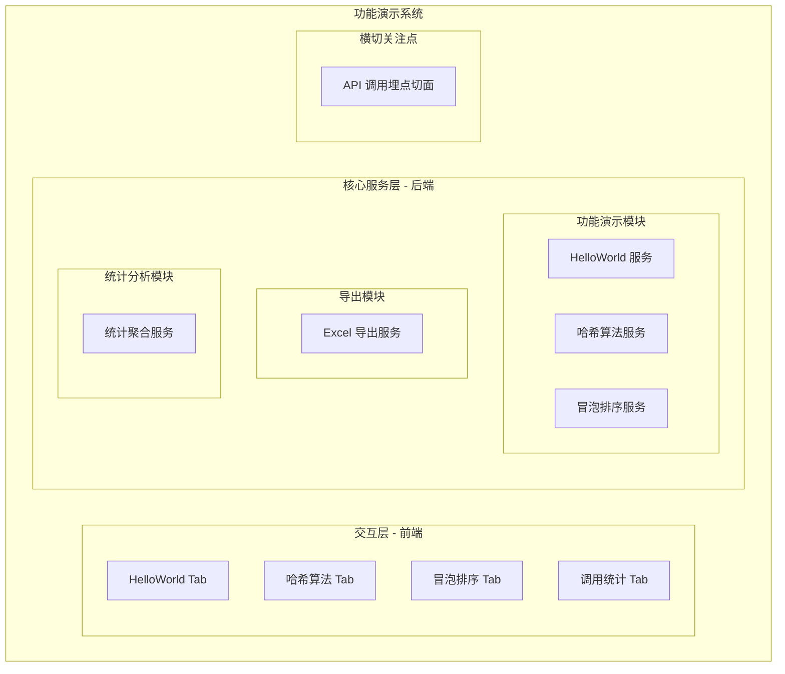

- **交互层**：React 18 + Ant Design 5.x 构建四 Tab 页面，ECharts 实现图表可视化
- **核心服务层**：Spring Boot 3.x 提供 RESTful API，分为功能演示、导出、统计三个模块
- **横切关注点**：AOP 切面统一拦截 /api/demo/** 请求，异步记录调用埋点

**模块清单**

| 模块 | 职责 | 依赖 |
|------|------|------|
| 功能演示模块 (demoModule) | 提供 HelloWorld、哈希算法、冒泡排序三个核心接口 | 无 |
| 导出模块 (exportModule) | 根据调用类型导出历史记录为 Excel | 埋点数据表 |
| 统计分析模块 (analyticsModule) | 多维度聚合查询调用统计数据 | 埋点数据表 |
| 埋点切面 (ApiCallLogAspect) | 拦截 API 请求，异步记录调用元数据 | 埋点数据表 |

### 应用集成架构

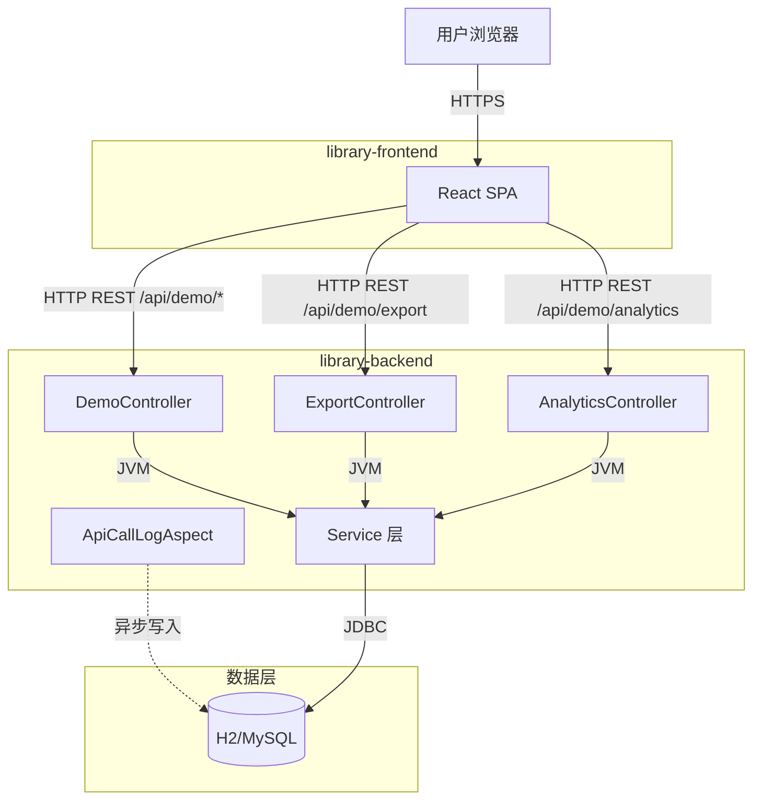

**集成关系说明：**

| 调用方 | 被调用方 | 协议 | 接口类型 | 说明 |
|--------|----------|------|----------|------|
| 用户浏览器 | React SPA | HTTPS | 静态资源 | Vite 开发服务器或 Nginx 托管 |
| React SPA | DemoController | HTTP | REST (oneapi) | /api/demo/helloworld, /hash, /bubble-sort |
| React SPA | ExportController | HTTP | REST (oneapi) | /api/demo/export，返回 Excel 文件流 |
| React SPA | AnalyticsController | HTTP | REST (oneapi) | /api/demo/analytics，返回 JSON 统计 |
| ApiCallLogAspect | H2/MySQL | JDBC | SQL | 异步写入埋点数据 |
| Service 层 | H2/MySQL | JDBC | SQL | 查询埋点数据用于统计和导出 |

### 部署架构

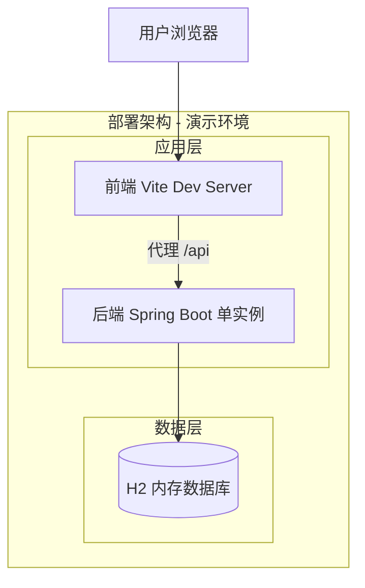

**部署说明：**
- **演示环境**：前端 Vite Dev Server（端口 3000）+ 后端 Spring Boot 单实例（端口 8080）+ H2 内存数据库
- **生产环境（假设）**：Nginx 反向代理 + Spring Boot 多实例 + MySQL 主从，容器化部署
- 本项为演示项目，部署架构从简；生产化时需补充负载均衡、健康检查、日志采集等

---

## 3. 数据模型与存储

### 实体清单

| 实体名称 | 实体说明 | 所属模块 | 与其他实体的关系 |
|----------|----------|----------|-----------------|
| api_call_log | API 调用日志记录，存储每次接口调用的元数据 | 埋点切面 / 导出模块 / 统计模块 | 独立实体，无外键关联 |

### 实体关系图

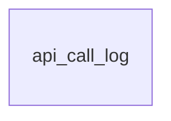

**模型说明：**
- 本系统仅涉及一张埋点日志表 `api_call_log`，无实体间关联关系
- 用户信息（userId、userName、personnelType 等）作为冗余字段直接存储在日志表中，不关联用户主表
- 假设：演示场景下无需用户主表，用户信息从请求头获取并冗余存储

---

## 4. 接口设计

### 4.1 oneapi（Web 控制台接口）

| 编号 | 接口名称 | 方法 | 路径 | 模块 |
|------|----------|------|------|------|
| W01 | HelloWorld 接口 | POST | /api/demo/helloworld | 功能演示模块 |
| W02 | 哈希算法接口 | POST | /api/demo/hash | 功能演示模块 |
| W03 | 冒泡排序接口 | POST | /api/demo/bubble-sort | 功能演示模块 |
| W04 | 导出 Excel 接口 | POST | /api/demo/export | 导出模块 |
| W05 | 调用统计查询接口 | GET | /api/demo/analytics | 统计分析模块 |

### 4.2 OpenAPI（对外接口）

本项不适用，原因：本系统为内部演示项目，不对外暴露 OpenAPI。

### 4.3 内部接口（Service 层）

| 编号 | 接口名称 | 类 | 方法签名 |
|------|----------|------|----------|
| S01 | HelloWorld 服务 | HelloWorldService | HelloWorldResponse greet(String name) |
| S02 | 哈希算法服务 | HashService | HashResponse hash(String input, String algorithm) |
| S03 | 冒泡排序服务 | BubbleSortService | BubbleSortResponse sort(List\<Integer\> numbers, String order) |
| S04 | 导出服务 | ExportService | byte[] export(String type, List\<String\> recordIds) |
| S05 | 统计聚合服务 | AnalyticsService | AnalyticsResponse query(String dimension, String apiType, String startDate, String endDate) |

### 4.4 集成接口（Integration 层）

本项不适用，原因：本系统不集成外部系统。

---

## 5. 功能模块设计

### 全局约定

| 约定项 | 约定内容 |
|--------|----------|
| 错误码格式 | DEMO_{SEQ}，如 DEMO_001 |
| 通用出参结构 | {code: int, message: String, data: T} |
| code 取值 | 200=成功，400=参数校验失败，500=服务端异常 |

**模块映射表：**

| 模块 | 错误码前缀 | 起始序号 |
|------|-----------|----------|
| 功能演示模块 | DEMO_ | 001 |
| 导出模块 | EXPORT_ | 001 |
| 统计分析模块 | ANALYTICS_ | 001 |

---

### 5.1 功能演示模块

#### 5.1.1 表结构设计

##### 5.1.1.1 api_call_log（API 调用日志表）

| 字段名 | 数据类型 | 约束 | 默认值 | 说明 |
|--------|----------|------|--------|------|
| id | bigint | PK, 自增 | - | 系统自增主键 |
| api_type | varchar(32) | NOT NULL | - | 接口标识：helloworld / hash / bubble-sort |
| user_id | varchar(64) | | NULL | 调用者工号 |
| user_name | varchar(128) | | NULL | 调用者姓名 |
| personnel_type | varchar(32) | | NULL | 人员类型（正式/外包/实习） |
| personnel_level | varchar(32) | | NULL | 人员层级（P5/P6/P7 等） |
| department | varchar(128) | | NULL | 所属部门 |
| request_payload | text | | NULL | 请求参数 JSON |
| response_payload | text | | NULL | 响应结果 JSON |
| duration_ms | bigint | | NULL | 执行耗时（毫秒） |
| gmt_create | datetime | NOT NULL | CURRENT_TIMESTAMP | 创建时间 |
| gmt_modified | datetime | NOT NULL | CURRENT_TIMESTAMP | 修改时间 |

**索引：**
- PK: `pk_api_call_log` (id)
- IDX: `idx_api_call_log_api_type` (api_type)
- IDX: `idx_api_call_log_department` (department)
- IDX: `idx_api_call_log_personnel_type` (personnel_type)
- IDX: `idx_api_call_log_personnel_level` (personnel_level)
- IDX: `idx_api_call_log_gmt_create` (gmt_create)

> **命名规范说明**：遵循 references/db.md 规范，时间字段使用 `gmt_create`/`gmt_modified`（而非 `created_at`），使用 `datetime` 类型（而非 `timestamp`），索引以 `idx_` 开头，主键以 `pk_` 开头。

##### 5.1.1.2 枚举与常量定义

| 枚举名称 | 取值 | 含义 | 关联字段 |
|----------|------|------|----------|
| ApiType | helloworld | HelloWorld 接口 | api_call_log.api_type |
| ApiType | hash | 哈希算法接口 | api_call_log.api_type |
| ApiType | bubble-sort | 冒泡排序接口 | api_call_log.api_type |
| HashAlgorithm | MD5 | MD5 哈希算法 | HashRequest.algorithm |
| HashAlgorithm | SHA-1 | SHA-1 哈希算法 | HashRequest.algorithm |
| HashAlgorithm | SHA-256 | SHA-256 哈希算法（默认） | HashRequest.algorithm |
| SortOrder | ASC | 升序（默认） | BubbleSortRequest.order |
| SortOrder | DESC | 降序 | BubbleSortRequest.order |
| PersonnelType | 正式 | 正式员工 | api_call_log.personnel_type |
| PersonnelType | 外包 | 外包人员 | api_call_log.personnel_type |
| PersonnelType | 实习 | 实习人员 | api_call_log.personnel_type |
| AnalyticsDimension | personnelType | 按人员类型统计 | AnalyticsRequest.dimension |
| AnalyticsDimension | personnelLevel | 按人员层级统计 | AnalyticsRequest.dimension |
| AnalyticsDimension | department | 按部门统计 | AnalyticsRequest.dimension |
| ExportType | helloworld | 导出 HelloWorld 记录 | ExportRequest.type |
| ExportType | hash | 导出哈希算法记录 | ExportRequest.type |
| ExportType | bubble-sort | 导出冒泡排序记录 | ExportRequest.type |

#### 5.1.2 接口详细设计

##### W01 HelloWorld 接口

- **URI**: POST /api/demo/helloworld
- **描述**: 根据输入姓名返回问候语，name 为空时默认返回 "Hello, World!"
- **入参**:

| 参数名称 | 类型 | 是否必填 | 描述 |
|----------|------|----------|------|
| name | String | 否 | 姓名，为空时默认 "World" |

- **出参**:

| 参数名称 | 类型 | 描述 |
|----------|------|------|
| code | int | 结果码，200 表示成功 |
| message | String | 提示信息 |
| data.result | String | 问候语，如 "Hello, Alice!" |
| data.timestamp | String | 调用时间（ISO 8601） |

- **错误码**:

| 错误码 | 说明 |
|--------|------|
| 500 | 服务端内部异常 |

- **业务规则**: name 为 null 或空白字符串时，默认使用 "World"

- **请求示例**:
```json
{
  "name": "Alice"
}
```

- **响应示例**:
```json
{
  "code": 200,
  "message": "success",
  "data": {
    "result": "Hello, Alice!",
    "timestamp": "2025-08-20T10:00:00"
  }
}
```

##### W02 哈希算法接口

- **URI**: POST /api/demo/hash
- **描述**: 对输入原文进行哈希计算，支持 MD5/SHA-1/SHA-256 三种算法
- **入参**:

| 参数名称 | 类型 | 是否必填 | 描述 |
|----------|------|----------|------|
| input | String | 是 | 待哈希的原文 |
| algorithm | String | 否 | 哈希算法，枚举：MD5/SHA-1/SHA-256，默认 SHA-256 |

- **出参**:

| 参数名称 | 类型 | 描述 |
|----------|------|------|
| code | int | 结果码 |
| message | String | 提示信息 |
| data.input | String | 原始输入 |
| data.algorithm | String | 使用的算法 |
| data.hashValue | String | 哈希值（十六进制字符串） |
| data.timestamp | String | 调用时间 |

- **错误码**:

| 错误码 | 说明 |
|--------|------|
| 400 | 参数校验失败（input 为空） |
| DEMO_001 | 不支持的算法类型 |
| 500 | 服务端内部异常 |

- **业务规则**: algorithm 为 null 或空白时默认 SHA-256；不支持的算法返回 400

- **请求示例**:
```json
{
  "input": "hello world",
  "algorithm": "SHA-256"
}
```

- **响应示例**:
```json
{
  "code": 200,
  "message": "success",
  "data": {
    "input": "hello world",
    "algorithm": "SHA-256",
    "hashValue": "b94d27b9934d3e08a52e52d7da7dabfac484efe37a5380ee9088f7ace2efcde9",
    "timestamp": "2025-08-20T10:00:00"
  }
}
```

##### W03 冒泡排序接口

- **URI**: POST /api/demo/bubble-sort
- **描述**: 对输入的数字数组进行冒泡排序，支持升序/降序，返回排序结果和每轮中间状态
- **入参**:

| 参数名称 | 类型 | 是否必填 | 描述 |
|----------|------|----------|------|
| numbers | List\<Integer\> | 是 | 待排序数字数组，长度 ≤ 1000 |
| order | String | 否 | 排序方向，枚举：ASC/DESC，默认 ASC |

- **出参**:

| 参数名称 | 类型 | 描述 |
|----------|------|------|
| code | int | 结果码 |
| message | String | 提示信息 |
| data.original | List\<Integer\> | 原始数组 |
| data.sorted | List\<Integer\> | 排序后数组 |
| data.order | String | 排序方向 |
| data.steps | List\<List\<Integer\>\> | 每轮排序中间状态 |
| data.timestamp | String | 调用时间 |

- **错误码**:

| 错误码 | 说明 |
|--------|------|
| 400 | 参数校验失败（numbers 为空或长度超 1000） |
| DEMO_002 | 排序方向参数非法 |
| 500 | 服务端内部异常 |

- **业务规则**:
  - numbers 数组长度上限 1000，超出返回 400
  - order 为 null 或空白时默认 ASC
  - steps 记录每轮冒泡后的数组快照，用于前端可视化

- **请求示例**:
```json
{
  "numbers": [5, 3, 8, 1, 9, 2],
  "order": "ASC"
}
```

- **响应示例**:
```json
{
  "code": 200,
  "message": "success",
  "data": {
    "original": [5, 3, 8, 1, 9, 2],
    "sorted": [1, 2, 3, 5, 8, 9],
    "order": "ASC",
    "steps": [
      [3, 5, 1, 8, 2, 9],
      [3, 1, 5, 2, 8, 9],
      [1, 3, 2, 5, 8, 9],
      [1, 2, 3, 5, 8, 9],
      [1, 2, 3, 5, 8, 9]
    ],
    "timestamp": "2025-08-20T10:00:00"
  }
}
```

#### 5.1.3 子功能详细设计

##### 5.1.3.1 HelloWorld 调用（F01）

- 处理时序图

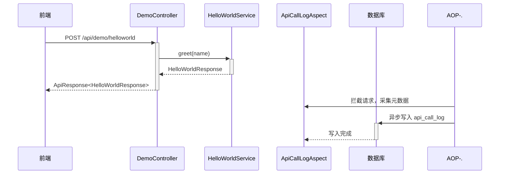

**业务规则：**

| 规则编号 | 规则描述 | 校验时机 | 不满足时的处理 |
|----------|----------|----------|--------------|
| R01 | name 为空时使用默认值 "World" | 调用时 | 自动填充默认值 |

**异常场景：**

| 异常场景 | 处理方式 |
|----------|----------|
| 服务端未知异常 | 返回 code=500，message 包含异常信息 |

**并发控制：**
- 无并发风险，原因：HelloWorld 接口为无状态纯计算，不涉及共享数据写入

##### 5.1.3.2 哈希算法调用（F02）

- 处理时序图

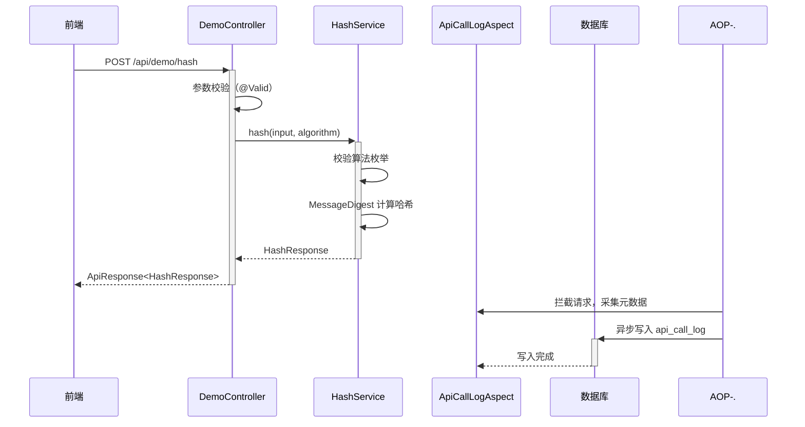

**业务规则：**

| 规则编号 | 规则描述 | 校验时机 | 不满足时的处理 |
|----------|----------|----------|--------------|
| R01 | input 不能为空 | 入参校验 | 返回 400，提示 "input is required" |
| R02 | algorithm 必须为 MD5/SHA-1/SHA-256 之一 | 业务校验 | 返回 DEMO_001，提示不支持的算法 |
| R03 | algorithm 为空时默认 SHA-256 | 调用时 | 自动填充默认值 |

**异常场景：**

| 异常场景 | 处理方式 |
|----------|----------|
| 不支持的算法名称 | 返回 400 + DEMO_001 |
| JDK 不支持的算法（NoSuchAlgorithmException） | 返回 500，记录日志 |

**并发控制：**
- 无并发风险，原因：哈希计算为无状态纯计算

##### 5.1.3.3 冒泡排序调用（F03）

- 处理时序图

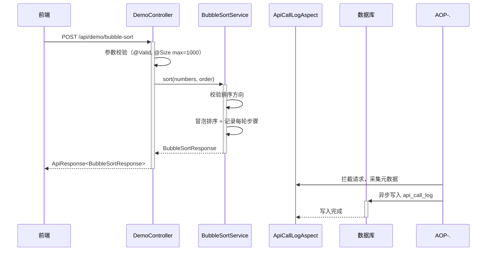

**业务规则：**

| 规则编号 | 规则描述 | 校验时机 | 不满足时的处理 |
|----------|----------|----------|--------------|
| R01 | numbers 数组不能为空 | 入参校验 | 返回 400，提示 "numbers array is required" |
| R02 | numbers 数组长度 ≤ 1000 | 入参校验 | 返回 400，提示 "array length must not exceed 1000" |
| R03 | order 必须为 ASC 或 DESC | 业务校验 | 返回 DEMO_002 |
| R04 | order 为空时默认 ASC | 调用时 | 自动填充默认值 |
| R05 | 每轮冒泡后记录数组快照到 steps | 排序过程中 | 自动记录 |

**异常场景：**

| 异常场景 | 处理方式 |
|----------|----------|
| 数组长度超限 | 返回 400 |
| 非法排序方向 | 返回 400 + DEMO_002 |

**并发控制：**
- 无并发风险，原因：排序为无状态纯计算

---

### 5.2 导出模块

#### 5.2.1 表结构设计

本模块无独立表，复用 api_call_log 表进行数据查询和导出。

#### 5.2.2 接口详细设计

##### W04 导出 Excel 接口

- **URI**: POST /api/demo/export
- **描述**: 根据接口类型导出调用历史记录为 Excel 文件
- **入参**:

| 参数名称 | 类型 | 是否必填 | 描述 |
|----------|------|----------|------|
| type | String | 是 | 接口类型枚举：helloworld / hash / bubble-sort |
| recordIds | List\<String\> | 否 | 指定导出记录 ID 列表，为空则导出全部 |

- **出参**:

| 参数名称 | 类型 | 描述 |
|----------|------|------|
| Content-Type | Header | application/vnd.openxmlformats-officedocument.spreadsheetml.sheet |
| Content-Disposition | Header | attachment; filename="{type}_export.xlsx" |
| Body | Binary | Excel 文件流 |

- **Excel 内容结构**:

| 列名 | 说明 |
|------|------|
| 序号 | 自增序号 |
| 调用时间 | ISO 8601 格式 |
| 调用人 | 用户姓名 |
| 输入参数 | JSON 格式 |
| 输出结果 | JSON 格式 |
| 耗时(ms) | 接口执行耗时 |

- **错误码**:

| 错误码 | 说明 |
|--------|------|
| 400 | type 参数非法 |
| EXPORT_001 | 导出记录数超过上限（10000） |
| 500 | 服务端内部异常 |

- **业务规则**:
  - 单次导出上限 10000 条记录
  - recordIds 为空时导出该类型全部记录
  - 使用 Apache POI 生成 .xlsx 格式

- **请求示例**:
```json
{
  "type": "helloworld",
  "recordIds": []
}
```

#### 5.2.3 子功能详细设计

##### 5.2.3.1 导出调用历史（F05）

- 处理时序图

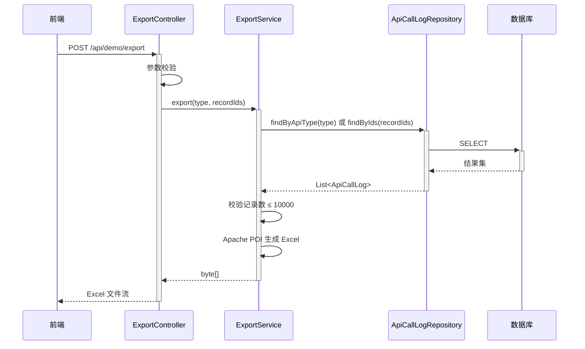

**业务规则：**

| 规则编号 | 规则描述 | 校验时机 | 不满足时的处理 |
|----------|----------|----------|--------------|
| R01 | type 必须为合法枚举值 | 入参校验 | 返回 400 |
| R02 | 导出记录数 ≤ 10000 | 业务校验 | 返回 EXPORT_001 |

**异常场景：**

| 异常场景 | 处理方式 |
|----------|----------|
| 导出记录数超限 | 返回 EXPORT_001 |
| POI 生成异常 | 返回 500 |

**并发控制：**
- 无并发风险，原因：导出为只读查询操作

---

### 5.3 统计分析模块

#### 5.3.1 表结构设计

本模块无独立表，复用 api_call_log 表进行聚合查询。

#### 5.3.2 接口详细设计

##### W05 调用统计查询接口

- **URI**: GET /api/demo/analytics
- **描述**: 按指定维度聚合查询接口调用统计数据，返回分组数据和时序数据
- **入参**:

| 参数名称 | 类型 | 是否必填 | 描述 |
|----------|------|----------|------|
| dimension | String | 是 | 统计维度：personnelType / personnelLevel / department |
| apiType | String | 否 | 接口类型过滤：helloworld / hash / bubble-sort / all，默认 all |
| startDate | String | 否 | 起始日期（yyyy-MM-dd） |
| endDate | String | 否 | 结束日期（yyyy-MM-dd） |
| chartType | String | 否 | 图表类型偏好：line / pie / bar（仅影响前端渲染） |

- **出参**:

| 参数名称 | 类型 | 描述 |
|----------|------|------|
| code | int | 结果码 |
| message | String | 提示信息 |
| data.dimension | String | 当前统计维度 |
| data.apiType | String | 当前接口类型过滤 |
| data.totalCalls | int | 总调用次数 |
| data.todayCalls | int | 今日调用次数 |
| data.activeUsers | int | 活跃用户数（去重 userId） |
| data.avgDurationMs | double | 平均响应耗时（毫秒） |
| data.groups | List | 分组统计数据（用于饼图/柱状图） |
| data.groups[].name | String | 分组名称 |
| data.groups[].count | int | 该分组调用次数 |
| data.groups[].percentage | double | 该分组占比（%） |
| data.timeSeries | List | 时序数据（用于折线图） |
| data.timeSeries[].date | String | 日期（yyyy-MM-dd） |
| data.timeSeries[].groups | Map | 各分组在该日期的调用次数 |

- **错误码**:

| 错误码 | 说明 |
|--------|------|
| 400 | dimension 参数非法 |
| ANALYTICS_001 | 日期范围参数格式错误 |
| 500 | 服务端内部异常 |

- **业务规则**:
  - dimension 为必填，决定 GROUP BY 的字段
  - apiType 为 "all" 或不传时统计全部接口
  - groups 数据用于饼图和柱状图渲染
  - timeSeries 数据用于折线图渲染
  - todayCalls/activeUsers/avgDurationMs 为全局汇总指标，不受 dimension 影响

- **请求示例**:
```
GET /api/demo/analytics?dimension=department&apiType=all
```

- **响应示例**:
```json
{
  "code": 200,
  "message": "success",
  "data": {
    "dimension": "department",
    "apiType": "all",
    "totalCalls": 1520,
    "todayCalls": 85,
    "activeUsers": 42,
    "avgDurationMs": 23.5,
    "groups": [
      { "name": "技术部", "count": 580, "percentage": 38.2 },
      { "name": "产品部", "count": 420, "percentage": 27.6 },
      { "name": "运营部", "count": 320, "percentage": 21.1 },
      { "name": "市场部", "count": 200, "percentage": 13.2 }
    ],
    "timeSeries": [
      {
        "date": "2025-08-18",
        "groups": { "技术部": 85, "产品部": 62, "运营部": 45, "市场部": 30 }
      },
      {
        "date": "2025-08-19",
        "groups": { "技术部": 92, "产品部": 58, "运营部": 50, "市场部": 28 }
      }
    ]
  }
}
```

#### 5.3.3 子功能详细设计

##### 5.3.3.1 调用统计查询（F07）

- 处理时序图

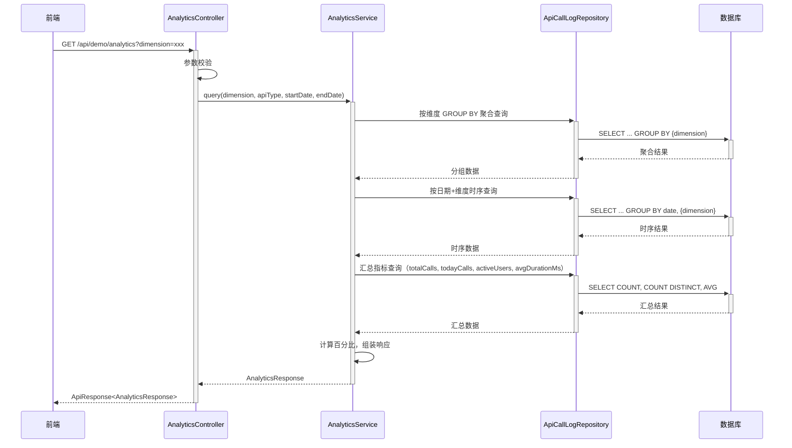

**业务规则：**

| 规则编号 | 规则描述 | 校验时机 | 不满足时的处理 |
|----------|----------|----------|--------------|
| R01 | dimension 必须为合法枚举值 | 入参校验 | 返回 400 |
| R02 | startDate/endDate 格式为 yyyy-MM-dd | 入参校验 | 返回 ANALYTICS_001 |
| R03 | percentage 保留一位小数 | 数据组装 | 自动计算 |

**异常场景：**

| 异常场景 | 处理方式 |
|----------|----------|
| 无埋点数据 | 返回空 groups 和 timeSeries，totalCalls=0 |
| 日期格式错误 | 返回 ANALYTICS_001 |

**并发控制：**
- 无并发风险，原因：统计查询为只读操作

---

### 5.4 埋点切面模块

#### 5.4.1 子功能详细设计

##### 5.4.1.1 API 调用埋点记录（F06）

- 处理时序图

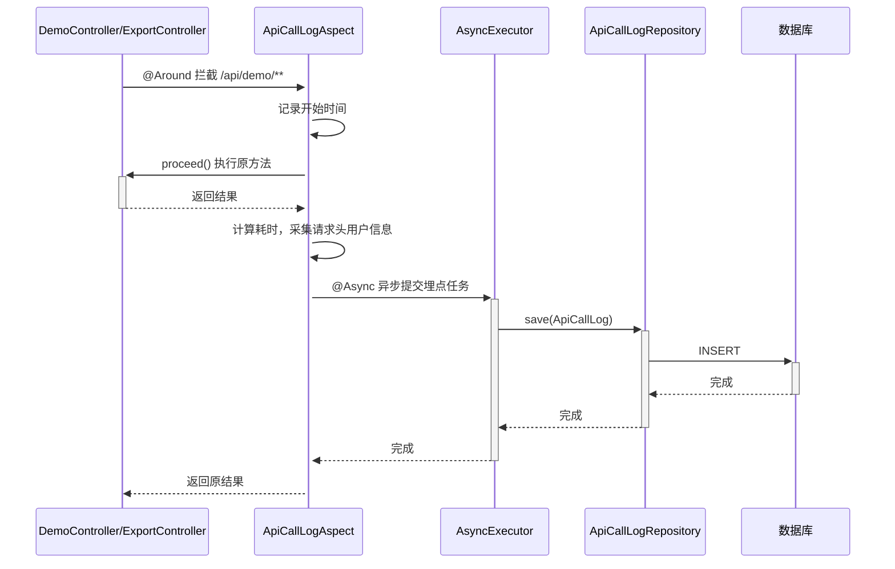

**业务规则：**

| 规则编号 | 规则描述 | 校验时机 | 不满足时的处理 |
|----------|----------|----------|--------------|
| R01 | 仅拦截 /api/demo/** 路径 | 切面 Pointcut | 非目标路径不拦截 |
| R02 | 用户信息从请求头获取 | 采集时 | 缺失字段记录为 NULL |
| R03 | 埋点写入异步执行 | 始终 | 不阻塞主流程响应 |
| R04 | 埋点写入失败不影响主流程 | 异常处理 | 记录错误日志，不抛出异常 |
| R05 | 导出接口和统计接口不记录埋点 | Pointcut 排除 | 排除 /api/demo/export 和 /api/demo/analytics |

**异常场景：**

| 异常场景 | 处理方式 |
|----------|----------|
| 数据库写入失败 | 记录 ERROR 日志，不影响主接口返回 |
| 请求头缺少用户信息字段 | 对应字段记录为 NULL |

**并发控制：**
- 并发场景：多个请求同时触发埋点写入
- 控制策略：异步写入 + 数据库自增主键，无并发冲突风险。@Async 使用 Spring 默认线程池，演示环境并发量低，无需额外控制

---

### 5.5 前端页面模块

#### 5.5.1 子功能详细设计

##### 5.5.1.1 前端四 Tab 页面（F04）

- 页面结构

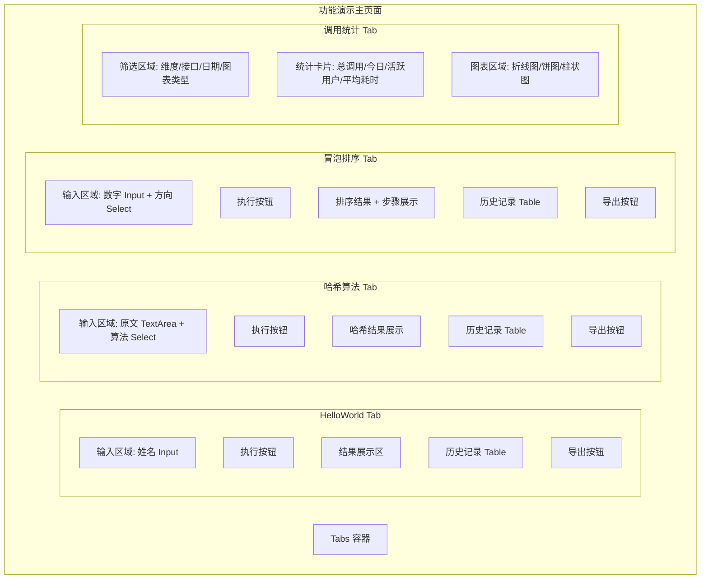

**交互规则：**

| 规则编号 | 规则描述 |
|----------|----------|
| R01 | 每个功能 Tab 包含：输入区、执行按钮、结果展示、历史记录表格、导出按钮 |
| R02 | 历史记录为当前会话内的调用记录（前端内存维护），非数据库全量记录 |
| R03 | 导出按钮调用后端导出接口，下载 Excel 文件 |
| R04 | 调用统计 Tab 在切换筛选条件时自动刷新图表 |
| R05 | 前端每次 API 请求注入 X-User-Id/Name/Type/Level/Dept 请求头 |

##### 5.5.1.2 调用统计报表可视化（F08）

- 图表切换逻辑

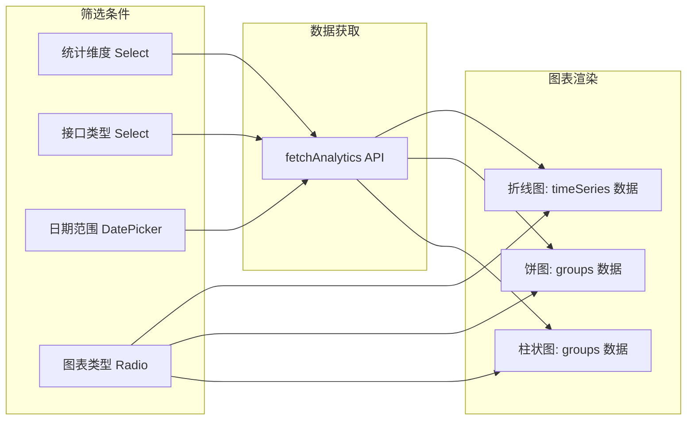

**业务规则：**

| 规则编号 | 规则描述 |
|----------|----------|
| R01 | 折线图使用 timeSeries 数据，X 轴为日期，Y 轴为调用次数 |
| R02 | 饼图使用 groups 数据，展示各分组占比 |
| R03 | 柱状图使用 groups 数据，展示各分组调用次数对比 |
| R04 | 顶部 4 个统计卡片展示：总调用次数、今日调用、活跃用户数、平均响应耗时 |

---

### 5.6 跨模块调用链

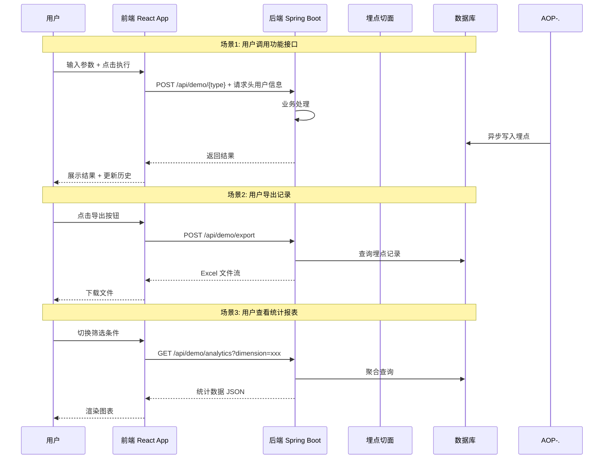

---

## 6. 非功能性需求设计

### 6.1 高可用性

- 后端为单实例部署（演示环境），不涉及多实例高可用切换
- 埋点写入采用异步模式，数据库写入失败不影响主接口可用性
- 前端为纯静态 SPA，无服务端依赖，可用性取决于静态资源托管服务
- 假设：生产化时需补充 Spring Boot 多实例 + 健康检查 + 负载均衡

### 6.2 可扩展性

- **水平扩展**：后端为无状态 RESTful 服务，可横向扩展多实例（需将 H2 切换为 MySQL）
- **模块扩展**：新增功能接口只需在 DemoController 中添加端点，AOP 切面自动覆盖
- **图表扩展**：前端 ChartPanel 组件支持新增图表类型，只需扩展 chartType 枚举
- **维度扩展**：统计维度通过枚举扩展，后端 AnalyticsService 按维度字段动态 GROUP BY

### 6.3 稳定性/可靠性

- 冒泡排序数组长度限制 ≤ 1000，防止超大数组导致 OOM 或超时
- 导出记录数限制 ≤ 10000，防止单次导出消耗过多内存
- 埋点异步写入使用 Spring @Async，主线程不受数据库写入延迟影响
- 前端 API 调用统一通过 axios 拦截器注入请求头，减少人为遗漏

### 6.4 安全性设计

#### 6.4.1 账户系统方案

本项不适用，原因：演示项目不对接真实账户系统，用户信息通过请求头模拟传入。

#### 6.4.2 授权&访问控制

##### 6.4.2.1 是否实现水平权限检查

不涉及，原因：所有数据为公共演示数据，不涉及用户私有资源。

##### 6.4.2.2 是否实现垂直权限检查

不涉及，原因：演示项目无角色权限体系，所有功能对所有用户开放。

##### 6.4.2.3 是否检查登录态

不检查登录态。原因：演示项目无认证系统，所有接口公开访问。

#### 6.4.3 数据防护方案

##### 6.4.3.1 是否对敏感数据加密存储

不涉及，原因：埋点数据中不包含敏感信息（身份证、银行卡等），用户信息为模拟数据。

##### 6.4.3.2 是否对敏感数据展示进行脱敏

不涉及，原因：演示数据不含真实用户敏感信息。

### 6.5 监控/统计/日志/告警

| 监控点 | 监控内容 | 实现方式 |
|--------|----------|----------|
| 接口调用量 | 各接口调用次数 | api_call_log 表统计 |
| 接口响应耗时 | 各接口平均/P99 耗时 | api_call_log.duration_ms |
| 埋点写入成功率 | 异步写入成功/失败比 | 应用日志 + 错误计数 |
| 导出操作频次 | 导出接口调用次数 | api_call_log 统计（如纳入埋点） |
| 异常告警 | 500 错误率超阈值 | Spring Boot Actuator + 日志告警（生产化时补充） |

---

## 7. 变更三板斧

### 7.1 可监控

| 监控项 | 埋点方式 | 说明 |
|--------|----------|------|
| 功能接口调用 | AOP 切面自动记录 api_call_log | 每次调用自动入库，含调用者、耗时、入参、出参 |
| 接口响应耗时 | AOP 切面计算 duration_ms | 从请求进入到响应返回的毫秒数 |
| 导出操作 | 可扩展 AOP 切面覆盖 /api/demo/export | 当前版本导出接口不纳入埋点，可按需开启 |
| 统计查询 | 可扩展 AOP 切面覆盖 /api/demo/analytics | 当前版本统计接口不纳入埋点，可按需开启 |
| 应用健康 | Spring Boot Actuator /health | 生产化时启用 |

### 7.2 可灰度

- **灰度方案**：本功能为全新模块，无旧版本兼容问题，不需要灰度发布
- **原因**：功能演示页面为新增页面，不影响现有图书管理系统功能，用户可直接访问新页面
- **如需灰度**：可通过前端路由配置，按用户 ID 尾号控制是否展示新页面入口

### 7.3 可应急

| 应急场景 | 应急方案 | 恢复时间 |
|----------|----------|----------|
| 功能接口异常 | 前端 Tab 页面展示错误提示，不影响其他 Tab | 即时 |
| 埋点写入异常 | 异步写入失败不影响主流程，仅丢失埋点数据 | 即时（自动降级） |
| 导出功能异常 | 导出按钮提示失败，不影响功能调用 | 即时 |
| 统计报表异常 | 图表展示"暂无数据"，不影响功能调用 | 即时 |
| 整体回滚 | 前端移除页面路由入口，后端保留接口但不再被调用 | < 5 分钟 |

**回滚兼容性分析：**
- 前端回滚：移除 demo 页面路由即可，不影响其他页面
- 后端回滚：新增的 Controller/Service 不影响现有代码，回滚安全
- 数据库回滚：api_call_log 为独立新表，回滚时可直接 DROP，无上下游依赖

---

## 附录：方案检查清单

| # | 检查项 | 结果 | 说明 |
|---|--------|------|------|
| 1 | 模块划分合理性检查 | ✅ 通过 | 四个模块（功能演示/导出/统计/埋点）职责单一，无循环依赖 |
| 2 | 依赖关系合理性 | ✅ 通过 | 导出和统计模块依赖埋点数据表，无外部系统依赖 |
| 3 | 单点问题检查（部署层面） | ⚠️ 不适用 | 演示环境单实例部署，生产化时需补充多实例方案 |
| 4 | 表模型设计范式检查 | ✅ 通过 | 满足第三范式，api_call_log 表字段无冗余（用户信息为埋点快照，非冗余） |
| 5 | 隐私安全检查 | ✅ 通过 | 演示数据不含真实敏感信息，已在 §6.4 说明 |
| 6 | 兼容性检查（接口） | ✅ 通过 | 全部为新增接口，无旧调用方需要兼容 |
| 7 | 兼容性检查（表） | ✅ 通过 | 全部为新增表，无旧版本兼容问题 |
| 8 | 数据迁移检查 | ✅ 通过 | 新增表无需数据迁移，H2 启动时自动建表 |
| 9 | 一致性检查（功能点） | ✅ 通过 | F01~F08 均在 §5 中有对应设计 |
| 10 | 一致性检查（表） | ✅ 通过 | api_call_log 在 §5.1.1 有完整表结构定义 |
| 11 | 一致性检查（接口） | ✅ 通过 | W01~W05 均在 §5 中有详细定义 |
| 12 | 一致性检查（枚举） | ✅ 通过 | §5.1.1.2 枚举定义与表结构字段说明一致 |
| 13 | 状态机完整性检查 | ⚠️ 不适用 | api_call_log 无状态字段，不涉及状态机 |
| 14 | 并发风险检查 | ✅ 通过 | 功能接口为无状态计算，埋点异步写入使用自增主键，无并发冲突 |
| 15 | 单点问题检查（定时任务层面） | ⚠️ 不适用 | 本系统无定时任务 |
| 16 | 非功能性设计可行性检查 | ✅ 通过 | 演示环境要求低，设计方案可落地 |
| 17 | 变更三板斧设计可行性检查（可监控） | ✅ 通过 | AOP 埋点切面天然提供调用监控数据 |
| 18 | 变更三板斧设计可行性检查（可灰度） | ✅ 通过 | 全新模块无需灰度，已说明原因 |
| 19 | 变更三板斧设计可行性检查（可应急） | ✅ 通过 | 各模块独立，回滚无依赖冲突 |
