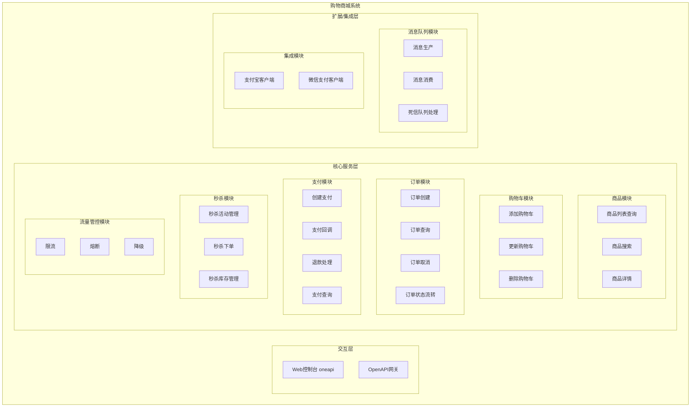
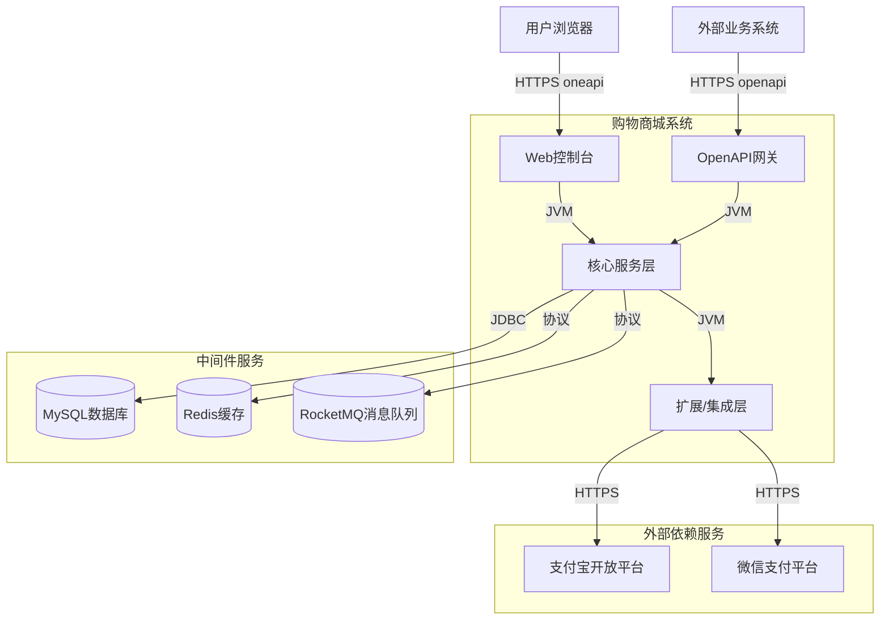
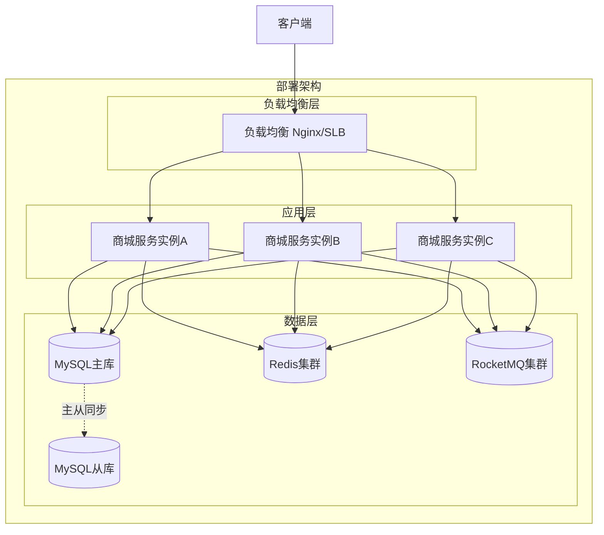
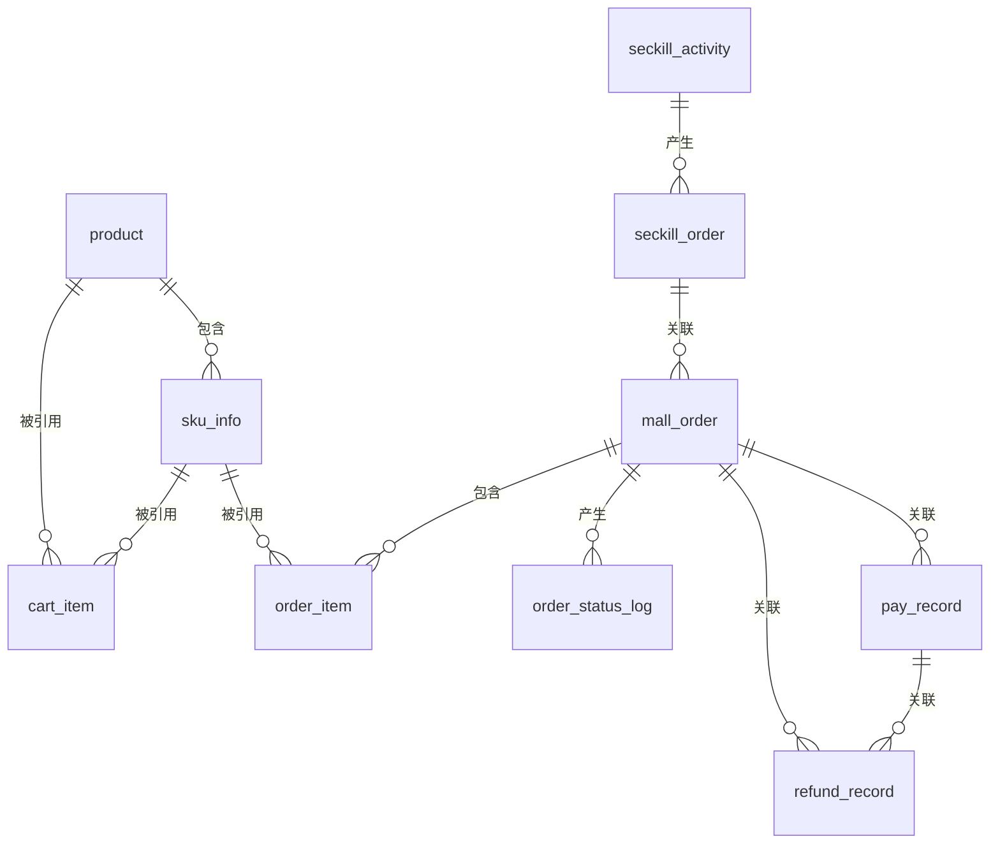
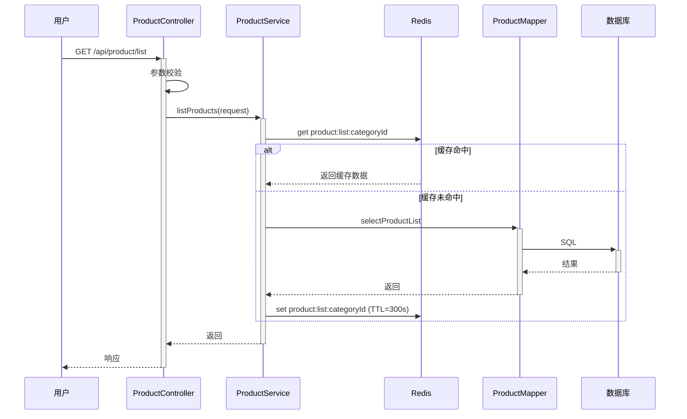
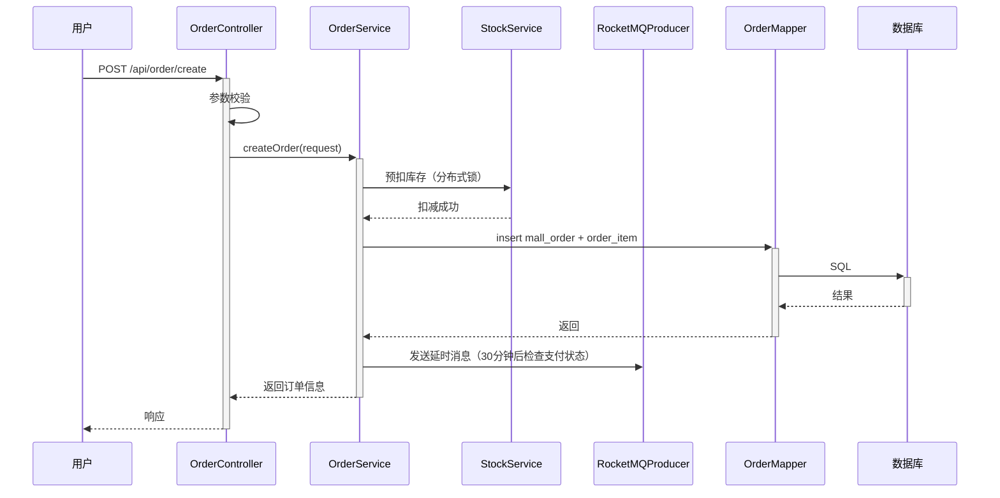
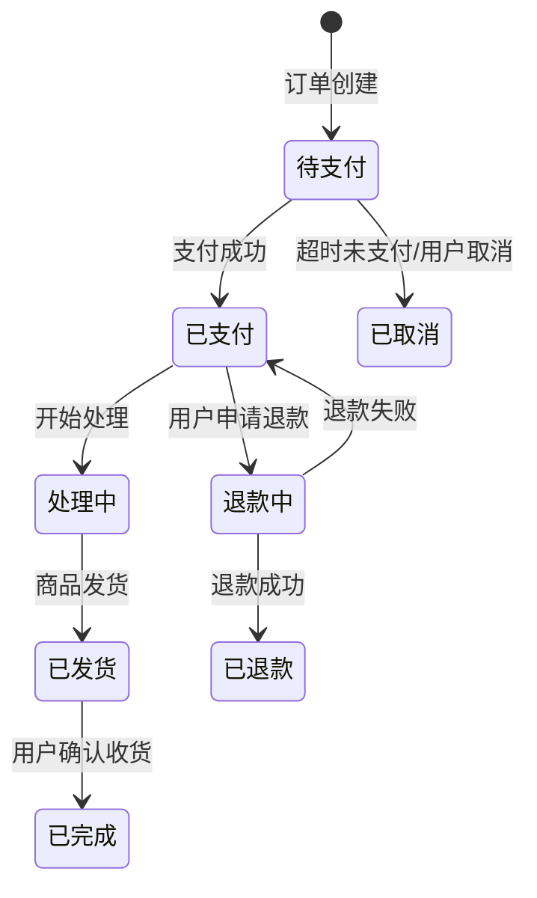
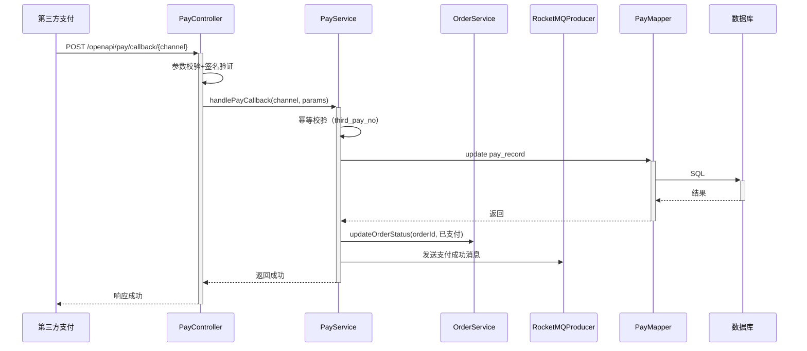

> **文档元信息**
>
> | 项目 | 内容 |
> |------|------|
> | 文档版本 | v1.0 |
> | 作者 | DTCoder |
> | 创建日期 | 2026-08-11 |
> | 需求来源 | 购物商城系统需求描述 |
> | 评审状态 | 待评审 |

# 购物商城系统 系分设计

## 1. 需求与范围

### 1.1 背景与目标

构建一个完整的购物商城系统，支持用户浏览商品、下单、支付、退款及秒杀等核心业务。系统需要具备高可用性、高并发处理能力，通过消息队列实现流量削峰和系统解耦，同时保证订单状态可恢复、可追溯。

### 1.2 核心功能

- **商品管理**：商品信息展示、分类、搜索
- **购物车**：添加/删除商品、数量调整
- **订单系统**：订单创建、查询、取消、状态流转
- **支付模块**：支持支付宝、微信支付，独立封装
- **退款功能**：订单退款、部分退款
- **秒杀系统**：限时抢购、库存扣减、防超卖
- **消息队列**：基于RocketMQ的异步解耦和流量削峰
- **流量管控**：限流、熔断、降级

### 1.3 约束与非功能要求

- 支付模块通过环境变量注入支付宝和微信支付账号配置
- 订单状态需可恢复、可追溯
- 支持高并发秒杀场景
- 使用RocketMQ作为消息中间件
- 需要流量管控、削峰解耦

### 1.4 排除范围

- 用户登录注册模块（假设由外部系统提供）
- 物流/配送系统
- 商品库存管理后台

### 需求功能清单与优先级

| 编号 | 功能点 | 优先级 | PRD 原始描述/章节 | 备注 |
|------|--------|--------|-------------------|------|
| F01 | 商品浏览与搜索 | P0 | 用户可浏览商品列表，支持按分类、关键词搜索 | |
| F02 | 购物车管理 | P0 | 用户可添加商品到购物车，调整数量，删除商品 | |
| F03 | 订单创建 | P0 | 用户从购物车或商品详情页创建订单 | |
| F04 | 订单状态管理 | P0 | 订单状态流转：待支付→已支付→处理中→已发货→已完成/已取消 | |
| F05 | 支付功能（支付宝/微信） | P0 | 支持支付宝和微信支付，通过环境变量注入配置 | |
| F06 | 退款功能 | P0 | 支持订单退款和部分退款 | |
| F07 | 秒杀活动 | P1 | 限时秒杀，库存预扣，防止超卖 | |
| F08 | 流量管控 | P1 | 限流、熔断、降级，防止系统过载 | |
| F09 | 消息队列集成 | P1 | 基于RocketMQ实现异步解耦和流量削峰 | |
| F10 | 订单状态可恢复可追溯 | P1 | 订单状态变更日志，支持状态恢复 | |

### 假设与待确认项

| 编号 | 假设/待确认内容 | 当前假设 | 确认状态 |
|------|-----------------|----------|----------|
| A01 | 用户系统由外部提供，本系统通过用户ID关联 | 假设用户ID全局唯一 | 待确认 |
| A02 | 库存扣减策略：下单扣减还是支付扣减 | 假设下单时预扣库存，超时未支付自动释放 | 待确认 |
| A03 | 秒杀活动数量限制 | 假设每个用户限购1件 | 待确认 |
| A04 | 退款规则：是否支持部分退款 | 假设支持部分退款 | 待确认 |
| A05 | 消息队列选型 | 假设使用RocketMQ | 已确认 |

---

## 2. 架构与模块

### 2.1 功能架构



- **交互层说明**：Web控制台提供用户操作界面，OpenAPI网关提供对外RESTful接口
- **核心服务层说明**：
  - 商品模块：商品信息展示、搜索、详情查询
  - 购物车模块：购物车增删改查
  - 订单模块：订单创建、状态流转、查询、取消
  - 支付模块：支付创建、回调处理、退款、查询（独立封装，支持支付宝和微信）
  - 秒杀模块：秒杀活动管理、库存预扣、下单
  - 流量管控模块：限流、熔断、降级策略
- **扩展/集成层说明**：
  - 消息队列模块：基于RocketMQ的异步消息处理、削峰填谷
  - 集成模块：支付宝和微信支付SDK封装

**模块清单**

| 模块 | 职责 | 依赖 |
|------|------|------|
| 商品模块 | 商品信息展示、分类、搜索 | 无 |
| 购物车模块 | 购物车增删改查 | 商品模块 |
| 订单模块 | 订单创建、状态流转、查询、取消 | 商品模块、购物车模块、支付模块、消息队列模块 |
| 支付模块 | 支付创建、回调、退款、查询 | RocketMQ、支付宝SDK、微信SDK |
| 秒杀模块 | 秒杀活动管理、库存预扣、下单 | 商品模块、订单模块、消息队列模块 |
| 流量管控模块 | 限流、熔断、降级 | 无 |
| 消息队列模块 | 消息生产、消费、死信处理 | RocketMQ |
| 集成模块 | 支付宝/微信支付SDK封装 | 支付宝SDK、微信SDK |

### 2.2 应用集成架构



**集成关系说明：**

| 调用方 | 被调用方 | 协议 | 接口类型 | 说明 |
|--------|----------|------|----------|------|
| 用户浏览器 | 应用 Web控制台 | HTTPS | oneapi REST | 用户操作界面 |
| 外部业务系统 | 应用 OpenAPI网关 | HTTPS | openapi REST | 对外接口 |
| 应用核心服务层 | MySQL数据库 | JDBC | SQL | 数据持久化 |
| 应用核心服务层 | Redis缓存 | Redis协议 | 缓存操作 | 缓存热点数据 |
| 应用核心服务层 | RocketMQ | TCP | 消息发送/消费 | 异步解耦、削峰 |
| 应用扩展/集成层 | 支付宝开放平台 | HTTPS | REST API | 支付/退款 |
| 应用扩展/集成层 | 微信支付平台 | HTTPS | REST API | 支付/退款 |

### 2.3 部署架构



**部署说明：**
- **负载均衡层**：Nginx反向代理，支持轮询/加权策略
- **应用层**：多实例部署，支持水平扩容
- **数据层**：
  - MySQL主从架构，读写分离
  - Redis集群，缓存商品信息、秒杀库存等热点数据
  - RocketMQ集群，保证消息可靠投递

---

## 3. 数据模型与存储

### 3.1 实体清单

| 实体名称 | 实体说明 | 所属模块 | 与其他实体的关系 |
|----------|----------|----------|-----------------|
| product | 商品信息 | 商品模块 | 一对多关联 sku_info |
| sku_info | 商品SKU | 商品模块 | 多对一关联 product |
| cart_item | 购物车项 | 购物车模块 | 多对一关联 sku_info、user |
| mall_order | 订单主表 | 订单模块 | 一对多关联 order_item、pay_record、refund_record |
| order_item | 订单商品项 | 订单模块 | 多对一关联 mall_order、sku_info |
| order_status_log | 订单状态变更日志 | 订单模块 | 多对一关联 mall_order |
| pay_record | 支付记录 | 支付模块 | 多对一关联 mall_order |
| refund_record | 退款记录 | 支付模块 | 多对一关联 mall_order、pay_record |
| seckill_activity | 秒杀活动 | 秒杀模块 | 一对多关联 seckill_order |
| seckill_order | 秒杀订单 | 秒杀模块 | 多对一关联 seckill_activity、mall_order |
| pay_account | 支付账号配置 | 支付模块 | 无 |

### 3.2 实体关系图



**模型说明：**
- `product` 与 `sku_info` 为一对多关系，一个商品可拥有多个SKU（如不同颜色、尺码）
- `mall_order` 与 `order_item` 为一对多关系，一个订单包含多个商品项
- `mall_order` 与 `order_status_log` 为一对多关系，记录订单完整状态变更历史
- `mall_order` 与 `pay_record` 为一对多关系，支持多次支付（如部分支付场景）
- `mall_order` 与 `refund_record` 为一对多关系，支持多次部分退款
- `seckill_activity` 与 `seckill_order` 为一对多关系，记录秒杀活动产生的订单

---

## 4. 接口设计

### 4.1 oneapi（Web 控制台接口）

| 编号 | 接口名称 | 方法 | 路径 | 模块 |
|------|----------|------|------|------|
| W01 | 商品列表查询 | GET | /api/product/list | 商品模块 |
| W02 | 商品搜索 | GET | /api/product/search | 商品模块 |
| W03 | 商品详情查询 | GET | /api/product/detail/{id} | 商品模块 |
| W04 | 添加购物车 | POST | /api/cart/add | 购物车模块 |
| W05 | 更新购物车 | POST | /api/cart/update | 购物车模块 |
| W06 | 删除购物车项 | POST | /api/cart/delete | 购物车模块 |
| W07 | 购物车查询 | GET | /api/cart/list | 购物车模块 |
| W08 | 创建订单 | POST | /api/order/create | 订单模块 |
| W09 | 订单查询 | GET | /api/order/detail/{id} | 订单模块 |
| W10 | 订单列表查询 | GET | /api/order/list | 订单模块 |
| W11 | 取消订单 | POST | /api/order/cancel | 订单模块 |
| W12 | 创建支付 | POST | /api/pay/create | 支付模块 |
| W13 | 支付查询 | GET | /api/pay/query/{orderId} | 支付模块 |
| W14 | 申请退款 | POST | /api/pay/refund | 支付模块 |
| W15 | 秒杀下单 | POST | /api/seckill/order | 秒杀模块 |
| W16 | 秒杀活动列表 | GET | /api/seckill/activities | 秒杀模块 |

### 4.2 OpenAPI（对外接口）

| 编号 | 接口名称 | 方法 | 路径 | 模块 |
|------|----------|------|------|------|
| O01 | 商品列表查询 | GET | /openapi/product/list | 商品模块 |
| O02 | 商品详情查询 | GET | /openapi/product/detail/{id} | 商品模块 |
| O03 | 创建订单 | POST | /openapi/order/create | 订单模块 |
| O04 | 订单查询 | GET | /openapi/order/detail/{id} | 订单模块 |
| O05 | 支付回调 | POST | /openapi/pay/callback/{channel} | 支付模块 |

### 4.3 内部接口（Service 层）

| 编号 | 接口名称 | 类 | 方法签名 |
|------|----------|------|----------|
| S01 | 创建订单 | OrderService | createOrder(OrderCreateRequest request) |
| S02 | 订单状态流转 | OrderService | updateOrderStatus(Long orderId, OrderStatus newStatus) |
| S03 | 创建支付 | PayService | createPay(Long orderId, PayChannel channel) |
| S04 | 处理支付回调 | PayService | handlePayCallback(String channel, Map<String, String> params) |
| S05 | 申请退款 | PayService | applyRefund(Long orderId, BigDecimal amount, String reason) |
| S06 | 扣减库存 | StockService | deductStock(Long skuId, Integer quantity) |
| S07 | 释放库存 | StockService | releaseStock(Long skuId, Integer quantity) |
| S08 | 秒杀下单 | SeckillService | createSeckillOrder(Long activityId, Long userId, Long skuId) |
| S09 | 发送消息 | MQProducerService | sendMessage(String topic, Object message) |
| S10 | 限流检查 | FlowControlService | checkRateLimit(String key, int limit) |

### 4.4 集成接口（Integration 层）

| 编号 | 接口名称 | 类 | 方法签名 | 说明 |
|------|----------|------|----------|------|
| I01 | 支付宝预创建 | AlipayClient | tradePreCreate(AlipayTradeRequest request) | 创建支付宝订单 |
| I02 | 支付宝退款 | AlipayClient | tradeRefund(AlipayRefundRequest request) | 支付宝退款 |
| I03 | 支付宝查询 | AlipayClient | tradeQuery(String outTradeNo) | 查询支付宝订单 |
| I04 | 微信统一下单 | WechatPayClient | unifiedOrder(WechatPayRequest request) | 创建微信订单 |
| I05 | 微信退款 | WechatPayClient | refund(WechatRefundRequest request) | 微信退款 |
| I06 | 微信查询 | WechatPayClient | orderQuery(String outTradeNo) | 查询微信订单 |
| I07 | 发送RocketMQ消息 | RocketMQProducer | send(String topic, Object message, SendCallback callback) | 异步发送消息 |

---

## 5. 功能模块设计

### 5.1 商品模块

#### 5.1.1 表结构设计

##### 5.1.1.1 product（商品主表）

| 字段名 | 数据类型 | 约束 | 默认值 | 说明 |
|--------|----------|------|--------|------|
| id | bigint | PK, 自增 | - | 系统自增主键 |
| product_name | varchar(100) | NOT NULL | - | 商品名称 |
| product_desc | varchar(500) | - | - | 商品描述 |
| category_id | bigint | NOT NULL | - | 分类ID |
| product_status | tinyint | NOT NULL | 1 | 商品状态：1-上架 2-下架 |
| product_image | varchar(255) | - | - | 商品主图URL |
| gmt_create | datetime | NOT NULL | CURRENT_TIMESTAMP | 创建时间 |
| gmt_modified | datetime | NOT NULL | CURRENT_TIMESTAMP | 修改时间 |

**索引：**
- UK: `product_U` (product_name)
- IDX: `idx_product_category_id` (category_id)
- IDX: `idx_product_status` (product_status)

##### 5.1.1.2 sku_info（商品SKU表）

| 字段名 | 数据类型 | 约束 | 默认值 | 说明 |
|--------|----------|------|--------|------|
| id | bigint | PK, 自增 | - | 系统自增主键 |
| product_id | bigint | NOT NULL, FK | - | 商品ID |
| sku_name | varchar(100) | NOT NULL | - | SKU名称（如：红色-XXL） |
| sku_price | decimal(10,2) | NOT NULL | - | SKU售价 |
| sku_stock | int | NOT NULL | 0 | 库存数量 |
| sku_image | varchar(255) | - | - | SKU图片URL |
| gmt_create | datetime | NOT NULL | CURRENT_TIMESTAMP | 创建时间 |
| gmt_modified | datetime | NOT NULL | CURRENT_TIMESTAMP | 修改时间 |

**索引：**
- UK: `sku_info_U` (product_id, sku_name)
- IDX: `idx_sku_info_product_id` (product_id)

##### 5.1.1.3 枚举与常量定义

| 枚举名称 | 取值 | 含义 | 关联字段 |
|----------|------|------|----------|
| product_status | 1 | 上架 | product.product_status |
| product_status | 2 | 下架 | product.product_status |

#### 5.1.2 接口详细设计

##### W01 商品列表查询

- **URI**: GET /api/product/list
- **描述**: 分页查询商品列表
- **入参**:

| 参数名称 | 类型 | 是否必填 | 描述 |
|----------|------|----------|------|
| pageNum | int | 否 | 页码，默认1 |
| pageSize | int | 否 | 每页数量，默认10 |
| categoryId | long | 否 | 分类ID |

- **出参**:

| 参数名称 | 类型 | 描述 |
|----------|------|------|
| result | String | 结果code |
| msg | String | 提示信息 |
| data | Object | 分页商品列表 |

- **错误码**:

| 错误码 | 说明 |
|--------|------|
| PRODUCT_001 | 分类不存在 |

- **业务规则**: 仅查询status=1的上架商品；商品列表走Redis缓存，缓存过期时间5分钟

#### 5.1.3 子功能详细设计

##### 5.1.3.1 商品列表查询（F01）

- 处理时序图


**业务规则：**
| 规则编号 | 规则描述 | 校验时机 | 不满足时的处理 |
|----------|----------|----------|--------------|
| R01 | 仅查询status=1的上架商品 | 查询时 | 过滤掉下架商品 |
| R02 | 商品列表缓存有效期5分钟 | 查询时 | 缓存过期后重新查询数据库 |

**异常场景：**
| 异常场景 | 处理方式 |
|----------|----------|
| 数据库查询超时 | 返回缓存数据（如存在），否则返回空列表 |
| Redis连接失败 | 降级直接查询数据库 |

---

### 5.2 购物车模块

#### 5.2.1 表结构设计

##### 5.2.1.1 cart_item（购物车表）

| 字段名 | 数据类型 | 约束 | 默认值 | 说明 |
|--------|----------|------|--------|------|
| id | bigint | PK, 自增 | - | 系统自增主键 |
| user_id | bigint | NOT NULL | - | 用户ID |
| sku_id | bigint | NOT NULL, FK | - | SKU ID |
| quantity | int | NOT NULL | 1 | 商品数量 |
| gmt_create | datetime | NOT NULL | CURRENT_TIMESTAMP | 创建时间 |
| gmt_modified | datetime | NOT NULL | CURRENT_TIMESTAMP | 修改时间 |

**索引：**
- UK: `cart_item_U` (user_id, sku_id)
- IDX: `idx_cart_item_user_id` (user_id)

#### 5.2.2 接口详细设计

##### W04 添加购物车

- **URI**: POST /api/cart/add
- **描述**: 添加商品到购物车
- **入参**:

| 参数名称 | 类型 | 是否必填 | 描述 |
|----------|------|----------|------|
| skuId | long | 是 | SKU ID |
| quantity | int | 是 | 数量，需大于0 |

- **出参**:

| 参数名称 | 类型 | 描述 |
|----------|------|------|
| result | String | 结果code |
| msg | String | 提示信息 |
| data | Object | 购物车信息 |

- **错误码**:

| 错误码 | 说明 |
|--------|------|
| CART_001 | 商品不存在 |
| CART_002 | 库存不足 |

---

### 5.3 订单模块

#### 5.3.1 表结构设计

##### 5.3.1.1 mall_order（订单主表）

| 字段名 | 数据类型 | 约束 | 默认值 | 说明 |
|--------|----------|------|--------|------|
| id | bigint | PK, 自增 | - | 系统自增主键 |
| order_no | varchar(32) | NOT NULL, UK | - | 订单编号（唯一） |
| user_id | bigint | NOT NULL | - | 用户ID |
| total_amount | decimal(10,2) | NOT NULL | - | 订单总金额 |
| pay_amount | decimal(10,2) | NOT NULL | 0.00 | 实际支付金额 |
| order_status | tinyint | NOT NULL | 0 | 订单状态 |
| pay_status | tinyint | NOT NULL | 0 | 支付状态 |
| pay_channel | varchar(20) | - | - | 支付渠道：alipay/wechat |
| pay_time | datetime | - | - | 支付时间 |
| remark | varchar(255) | - | - | 备注 |
| gmt_create | datetime | NOT NULL | CURRENT_TIMESTAMP | 创建时间 |
| gmt_modified | datetime | NOT NULL | CURRENT_TIMESTAMP | 修改时间 |

**索引：**
- UK: `mall_order_U` (order_no)
- IDX: `idx_mall_order_user_id` (user_id)
- IDX: `idx_mall_order_status` (order_status)
- IDX: `idx_mall_order_gmt_create` (gmt_create)

##### 5.3.1.2 order_item（订单商品项表）

| 字段名 | 数据类型 | 约束 | 默认值 | 说明 |
|--------|----------|------|--------|------|
| id | bigint | PK, 自增 | - | 系统自增主键 |
| order_id | bigint | NOT NULL, FK | - | 订单ID |
| sku_id | bigint | NOT NULL | - | SKU ID |
| sku_name | varchar(100) | NOT NULL | - | SKU名称 |
| sku_price | decimal(10,2) | NOT NULL | - | 单价 |
| quantity | int | NOT NULL | - | 数量 |
| subtotal | decimal(10,2) | NOT NULL | - | 小计金额 |
| gmt_create | datetime | NOT NULL | CURRENT_TIMESTAMP | 创建时间 |

**索引：**
- IDX: `idx_order_item_order_id` (order_id)

##### 5.3.1.3 order_status_log（订单状态变更日志表）

| 字段名 | 数据类型 | 约束 | 默认值 | 说明 |
|--------|----------|------|--------|------|
| id | bigint | PK, 自增 | - | 系统自增主键 |
| order_id | bigint | NOT NULL, FK | - | 订单ID |
| from_status | tinyint | NOT NULL | - | 原状态 |
| to_status | tinyint | NOT NULL | - | 目标状态 |
| operator | varchar(50) | - | - | 操作人/系统 |
| remark | varchar(255) | - | - | 备注 |
| gmt_create | datetime | NOT NULL | CURRENT_TIMESTAMP | 创建时间 |

**索引：**
- IDX: `idx_order_status_log_order_id` (order_id)

##### 5.3.1.4 枚举与常量定义

| 枚举名称 | 取值 | 含义 | 关联字段 |
|----------|------|------|----------|
| order_status | 0 | 待支付 | mall_order.order_status |
| order_status | 1 | 已支付 | mall_order.order_status |
| order_status | 2 | 处理中 | mall_order.order_status |
| order_status | 3 | 已发货 | mall_order.order_status |
| order_status | 4 | 已完成 | mall_order.order_status |
| order_status | 5 | 已取消 | mall_order.order_status |
| order_status | 6 | 退款中 | mall_order.order_status |
| order_status | 7 | 已退款 | mall_order.order_status |
| pay_status | 0 | 未支付 | mall_order.pay_status |
| pay_status | 1 | 已支付 | mall_order.pay_status |
| pay_status | 2 | 部分退款 | mall_order.pay_status |
| pay_status | 3 | 全额退款 | mall_order.pay_status |

#### 5.3.2 接口详细设计

##### W08 创建订单

- **URI**: POST /api/order/create
- **描述**: 从购物车创建订单
- **入参**:

| 参数名称 | 类型 | 是否必填 | 描述 |
|----------|------|----------|------|
| cartItemIds | List<Long> | 是 | 购物车项ID列表 |
| addressId | long | 是 | 收货地址ID |
| remark | String | 否 | 订单备注 |

- **出参**:

| 参数名称 | 类型 | 描述 |
|----------|------|------|
| result | String | 结果code |
| msg | String | 提示信息 |
| data | Object | 订单信息（含订单号） |

- **错误码**:

| 错误码 | 说明 |
|--------|------|
| ORDER_001 | 购物车项不存在 |
| ORDER_002 | 库存不足 |
| ORDER_003 | 商品已下架 |

- **业务规则**: 创建订单时预扣库存，订单超时未支付自动取消并释放库存

#### 5.3.3 子功能详细设计

##### 5.3.3.1 订单创建（F03）

- 处理时序图


**业务规则：**
| 规则编号 | 规则描述 | 校验时机 | 不满足时的处理 |
|----------|----------|----------|--------------|
| R01 | 商品必须处于上架状态 | 创建订单时 | 返回错误码 ORDER_003 |
| R02 | 库存必须充足 | 创建订单时 | 返回错误码 ORDER_002 |
| R03 | 订单创建后30分钟内未支付自动取消 | 订单创建后 | MQ延时消息触发取消 |
| R04 | 订单取消后释放库存 | 订单取消时 | 调用StockService释放库存 |

**异常场景：**
| 异常场景 | 处理方式 |
|----------|----------|
| 库存扣减失败 | 事务回滚，返回库存不足 |
| 订单创建失败 | 事务回滚，释放已扣减库存 |
| MQ发送失败 | 订单已创建，由定时任务补偿检查 |

**并发控制：**
- 并发场景：多个用户同时抢购同一商品
- 控制策略：分布式锁（Redis SETNX）+ 乐观锁（version字段），锁粒度为sku_id

**状态机设计：**


**状态流转规则：**
| 当前状态 | 目标状态 | 流转条件 | 前置校验 | 触发动作 |
|----------|----------|----------|----------|----------|
| 待支付 | 已支付 | 支付成功回调 | 订单状态为待支付 | 更新支付时间，发送通知 |
| 待支付 | 已取消 | 超时30分钟或用户主动取消 | 订单状态为待支付 | 释放库存，记录日志 |
| 已支付 | 处理中 | 系统开始处理 | 订单状态为已支付 | 更新状态，发送消息 |
| 已支付 | 退款中 | 用户申请退款 | 订单状态为已支付 | 创建退款记录 |
| 退款中 | 已退款 | 退款成功 | 退款状态为成功 | 更新订单状态，记录日志 |

---

### 5.4 支付模块

#### 5.4.1 表结构设计

##### 5.4.1.1 pay_record（支付记录表）

| 字段名 | 数据类型 | 约束 | 默认值 | 说明 |
|--------|----------|------|--------|------|
| id | bigint | PK, 自增 | - | 系统自增主键 |
| order_id | bigint | NOT NULL, FK | - | 订单ID |
| pay_no | varchar(64) | NOT NULL, UK | - | 支付流水号 |
| channel | varchar(20) | NOT NULL | - | 支付渠道：alipay/wechat |
| pay_amount | decimal(10,2) | NOT NULL | - | 支付金额 |
| pay_status | tinyint | NOT NULL | 0 | 支付状态 |
| third_pay_no | varchar(64) | - | - | 第三方支付流水号 |
| third_resp | text | - | - | 第三方响应内容 |
| gmt_create | datetime | NOT NULL | CURRENT_TIMESTAMP | 创建时间 |
| gmt_modified | datetime | NOT NULL | CURRENT_TIMESTAMP | 修改时间 |

**索引：**
- UK: `pay_record_U` (pay_no)
- IDX: `idx_pay_record_order_id` (order_id)
- IDX: `idx_pay_record_third_pay_no` (third_pay_no)

##### 5.4.1.2 refund_record（退款记录表）

| 字段名 | 数据类型 | 约束 | 默认值 | 说明 |
|--------|----------|------|--------|------|
| id | bigint | PK, 自增 | - | 系统自增主键 |
| order_id | bigint | NOT NULL, FK | - | 订单ID |
| pay_record_id | bigint | NOT NULL, FK | - | 支付记录ID |
| refund_no | varchar(64) | NOT NULL, UK | - | 退款流水号 |
| refund_amount | decimal(10,2) | NOT NULL | - | 退款金额 |
| refund_status | tinyint | NOT NULL | 0 | 退款状态 |
| reason | varchar(255) | - | - | 退款原因 |
| third_refund_no | varchar(64) | - | - | 第三方退款流水号 |
| gmt_create | datetime | NOT NULL | CURRENT_TIMESTAMP | 创建时间 |
| gmt_modified | datetime | NOT NULL | CURRENT_TIMESTAMP | 修改时间 |

**索引：**
- UK: `refund_record_U` (refund_no)
- IDX: `idx_refund_record_order_id` (order_id)

##### 5.4.1.3 pay_account（支付账号配置表）

| 字段名 | 数据类型 | 约束 | 默认值 | 说明 |
|--------|----------|------|--------|------|
| id | bigint | PK, 自增 | - | 系统自增主键 |
| channel | varchar(20) | NOT NULL, UK | - | 支付渠道 |
| app_id | varchar(64) | NOT NULL | - | 应用ID（环境变量注入） |
| merchant_id | varchar(64) | - | - | 商户ID（环境变量注入） |
| private_key | varchar(2048) | - | - | 私钥（环境变量注入） |
| public_key | varchar(2048) | - | - | 公钥（环境变量注入） |
| api_key | varchar(255) | - | - | API密钥（环境变量注入） |
| sandbox | tinyint | NOT NULL | 0 | 是否沙箱环境 |
| gmt_create | datetime | NOT NULL | CURRENT_TIMESTAMP | 创建时间 |

**索引：**
- UK: `pay_account_U` (channel)

##### 5.4.1.4 枚举与常量定义

| 枚举名称 | 取值 | 含义 | 关联字段 |
|----------|------|------|----------|
| pay_status | 0 | 待支付 | pay_record.pay_status |
| pay_status | 1 | 支付中 | pay_record.pay_status |
| pay_status | 2 | 支付成功 | pay_record.pay_status |
| pay_status | 3 | 支付失败 | pay_record.pay_status |
| refund_status | 0 | 待处理 | refund_record.refund_status |
| refund_status | 1 | 退款中 | refund_record.refund_status |
| refund_status | 2 | 退款成功 | refund_record.refund_status |
| refund_status | 3 | 退款失败 | refund_record.refund_status |
| pay_channel | alipay | 支付宝 | pay_record.channel |
| pay_channel | wechat | 微信支付 | pay_record.channel |

#### 5.4.2 接口详细设计

##### W12 创建支付

- **URI**: POST /api/pay/create
- **描述**: 为订单创建支付
- **入参**:

| 参数名称 | 类型 | 是否必填 | 描述 |
|----------|------|----------|------|
| orderId | long | 是 | 订单ID |
| channel | String | 是 | 支付渠道：alipay/wechat |

- **出参**:

| 参数名称 | 类型 | 描述 |
|----------|------|------|
| result | String | 结果code |
| msg | String | 提示信息 |
| data | Object | 支付参数（供前端调用SDK） |

- **错误码**:

| 错误码 | 说明 |
|--------|------|
| PAY_001 | 订单不存在 |
| PAY_002 | 订单状态不允许支付 |
| PAY_003 | 支付渠道不支持 |

#### 5.4.3 子功能详细设计

##### 5.4.3.1 支付回调处理（F05）

- 处理时序图


**业务规则：**
| 规则编号 | 规则描述 | 校验时机 | 不满足时的处理 |
|----------|----------|----------|--------------|
| R01 | 支付回调必须验证签名 | 收到回调时 | 返回验签失败 |
| R02 | 同一笔支付只能处理一次（幂等） | 处理回调时 | 返回已处理 |
| R03 | 支付金额必须与订单金额一致 | 处理回调时 | 返回金额不匹配 |

**并发控制：**
- 并发场景：同一笔订单可能收到多次支付回调
- 控制策略：幂等设计（基于third_pay_no唯一索引），确保同一笔支付只处理一次

---

### 5.5 秒杀模块

#### 5.5.1 表结构设计

##### 5.5.1.1 seckill_activity（秒杀活动表）

| 字段名 | 数据类型 | 约束 | 默认值 | 说明 |
|--------|----------|------|--------|------|
| id | bigint | PK, 自增 | - | 系统自增主键 |
| activity_name | varchar(100) | NOT NULL | - | 活动名称 |
| sku_id | bigint | NOT NULL, FK | - | SKU ID |
| seckill_price | decimal(10,2) | NOT NULL | - | 秒杀价 |
| stock_quantity | int | NOT NULL | - | 秒杀库存 |
| sold_quantity | int | NOT NULL | 0 | 已售数量 |
| start_time | datetime | NOT NULL | - | 开始时间 |
| end_time | datetime | NOT NULL | - | 结束时间 |
| activity_status | tinyint | NOT NULL | 0 | 活动状态 |
| gmt_create | datetime | NOT NULL | CURRENT_TIMESTAMP | 创建时间 |
| gmt_modified | datetime | NOT NULL | CURRENT_TIMESTAMP | 修改时间 |

**索引：**
- IDX: `idx_seckill_activity_sku_id` (sku_id)
- IDX: `idx_seckill_activity_status` (activity_status)
- IDX: `idx_seckill_activity_time` (start_time, end_time)

##### 5.5.1.2 seckill_order（秒杀订单表）

| 字段名 | 数据类型 | 约束 | 默认值 | 说明 |
|--------|----------|------|--------|------|
| id | bigint | PK, 自增 | - | 系统自增主键 |
| activity_id | bigint | NOT NULL, FK | - | 活动ID |
| order_id | bigint | NOT NULL, FK | - | 订单ID |
| user_id | bigint | NOT NULL | - | 用户ID |
| gmt_create | datetime | NOT NULL | CURRENT_TIMESTAMP | 创建时间 |

**索引：**
- UK: `seckill_order_U` (activity_id, user_id)
- IDX: `idx_seckill_order_user_id` (user_id)

##### 5.5.1.3 枚举与常量定义

| 枚举名称 | 取值 | 含义 | 关联字段 |
|----------|------|------|----------|
| activity_status | 0 | 未开始 | seckill_activity.activity_status |
| activity_status | 1 | 进行中 | seckill_activity.activity_status |
| activity_status | 2 | 已结束 | seckill_activity.activity_status |

#### 5.5.2 接口详细设计

##### W15 秒杀下单

- **URI**: POST /api/seckill/order
- **描述**: 秒杀下单
- **入参**:

| 参数名称 | 类型 | 是否必填 | 描述 |
|----------|------|----------|------|
| activityId | long | 是 | 活动ID |
| skuId | long | 是 | SKU ID |

- **出参**:

| 参数名称 | 类型 | 描述 |
|----------|------|------|
| result | String | 结果code |
| msg | String | 提示信息 |
| data | Object | 订单信息 |

- **错误码**:

| 错误码 | 说明 |
|--------|------|
| SECKILL_001 | 活动不存在 |
| SECKILL_002 | 活动未开始/已结束 |
| SECKILL_003 | 库存不足 |
| SECKILL_004 | 已参与过该活动 |

#### 5.5.3 子功能详细设计

##### 5.5.3.1 秒杀下单（F07）

- 处理时序图
```mermaid
sequenceDiagram
    participant C as 用户
    participant Ctrl as SeckillController
    participant Svc as SeckillService
    participant Redis as Redis
    participant MQ as RocketMQProducer
    participant DB as 数据库

    C->>+Ctrl: POST /api/seckill/order
    Ctrl->>Ctrl: 参数校验+流量管控
    Ctrl->>+Svc: createSeckillOrder(activityId, userId, skuId)
    Svc->>Redis: 检查库存（decr）
    alt 库存充足
        Redis-->>Svc: 扣减成功
        Svc->>Redis: 检查是否已参与（setnx）
        alt 未参与
            Svc->>MQ: 发送异步创建订单消息
            Svc-->>Ctrl: 返回排队中
        else 已参与
            Svc->>Redis: 恢复库存（incr）
            Svc-->>-Ctrl: 返回已参与
        end
    else 库存不足
        Svc-->>-Ctrl: 返回库存不足
    end
    Ctrl-->>-C: 响应
```

**业务规则：**
| 规则编号 | 规则描述 | 校验时机 | 不满足时的处理 |
|----------|----------|----------|--------------|
| R01 | 活动必须在有效时间内 | 下单时 | 返回 SECKILL_002 |
| R02 | 每个用户每个活动限购1件 | 下单时 | 返回 SECKILL_004 |
| R03 | 库存通过Redis预扣，不足时直接返回 | 下单时 | 返回 SECKILL_003 |
| R04 | 下单成功后异步创建订单 | 下单后 | 发送MQ消息异步处理 |

**并发控制：**
- 并发场景：大量用户同时秒杀同一商品
- 控制策略：
  1. Redis原子操作（decr）扣减库存，避免超卖
  2. 分布式锁（setnx）防止重复下单
  3. 消息队列异步处理订单创建，削峰填谷
  4. 限流：每秒QPS限制，超出返回"活动火爆，请稍后再试"

---

### 5.6 流量管控模块

#### 5.6.1 设计说明

流量管控模块不单独建表，主要通过代码层实现限流、熔断、降级策略。

**限流策略：**
- 接口级别限流：基于Redis令牌桶或滑动窗口算法，限制单接口QPS
- 用户级别限流：限制单个用户的请求频率
- 秒杀场景限流：秒杀接口独立限流，设置更高的并发阈值

**熔断策略：**
- 当第三方支付接口连续失败达到阈值时，自动熔断，返回"支付服务暂不可用"
- 熔断后进入半开状态，定期探测服务恢复情况

**降级策略：**
- 数据库查询失败时，降级读取缓存
- 缓存也失败时，返回兜底数据或友好提示
- 秒杀高峰期，非核心接口自动降级（如商品详情图走CDN静态资源）

---

### 5.7 消息队列模块

#### 5.7.1 设计说明

消息队列模块主要处理以下场景：
- 订单超时未支付自动取消（延时消息）
- 支付成功后的异步通知（异步消息）
- 秒杀订单异步创建（异步消息）
- 库存同步（异步消息）

**Topic设计：**

| Topic | 类型 | 说明 |
|-------|------|------|
| order-delay | 延时消息 | 订单超时未支付处理 |
| order-pay-success | 普通消息 | 支付成功异步处理 |
| seckill-order-create | 普通消息 | 秒杀订单异步创建 |
| stock-sync | 普通消息 | 库存同步 |

#### 5.7.2 表结构设计

##### 5.7.2.1 mq_message_record（消息发送记录表）

| 字段名 | 数据类型 | 约束 | 默认值 | 说明 |
|--------|----------|------|--------|------|
| id | bigint | PK, 自增 | - | 系统自增主键 |
| topic | varchar(64) | NOT NULL | - | Topic名称 |
| tag | varchar(64) | - | - | Tag |
| message_key | varchar(128) | - | - | 消息Key |
| message_body | text | NOT NULL | - | 消息内容 |
| message_status | tinyint | NOT NULL | 0 | 消息状态 |
| retry_count | int | NOT NULL | 0 | 重试次数 |
| gmt_create | datetime | NOT NULL | CURRENT_TIMESTAMP | 创建时间 |
| gmt_modified | datetime | NOT NULL | CURRENT_TIMESTAMP | 修改时间 |

**索引：**
- IDX: `idx_mq_message_topic_key` (topic, message_key)
- IDX: `idx_mq_message_status` (message_status)

##### 5.7.2.3 枚举与常量定义

| 枚举名称 | 取值 | 含义 | 关联字段 |
|----------|------|------|----------|
| message_status | 0 | 待发送 | mq_message_record.message_status |
| message_status | 1 | 已发送 | mq_message_record.message_status |
| message_status | 2 | 发送失败 | mq_message_record.message_status |
| message_status | 3 | 已消费 | mq_message_record.message_status |
| message_status | 4 | 消费失败 | mq_message_record.message_status |

---

## 6. 非功能性需求设计

### 6.1 高可用性

- **服务多副本部署**：应用层至少部署3个实例，通过负载均衡实现故障转移
- **数据库高可用**：MySQL主从架构，主库故障时自动切换从库
- **缓存高可用**：Redis哨兵模式或集群模式，保证缓存服务可用性
- **消息队列高可用**：RocketMQ集群部署，Broker主从同步
- **第三方支付降级**：支付宝/微信支付异常时，自动熔断并提示用户稍后再试

### 6.2 可扩展性

- **水平扩展**：应用层无状态设计，支持随时扩容
- **数据库扩展**：读写分离，必要时可分库分表（如按用户ID分表）
- **缓存扩展**：Redis集群模式，支持动态扩容
- **插件式支付**：支付模块独立封装，新增支付渠道只需实现统一接口

### 6.3 稳定性/可靠性

- **限流熔断**：通过Sentinel或自定义限流组件，防止流量突增导致系统崩溃
- **消息可靠性**：RocketMQ消息持久化，消费失败进入死信队列，人工介入处理
- **订单状态恢复**：订单状态变更记录完整日志，支持状态追溯和人工修复
- **定时任务补偿**：对于MQ发送失败或消费失败的情况，定时任务扫描并补偿处理

### 6.4 安全性设计

#### 6.4.1 账户系统方案
- 用户登录由外部系统提供，本系统通过JWT Token或Session验证用户身份
- 接口统一鉴权，未登录用户无法访问业务接口

#### 6.4.2 授权&访问控制
##### 6.4.2.1 水平权限检查
- 用户只能查看/操作自己的订单、购物车
- 通过用户ID参数校验实现水平权限控制

##### 6.4.2.2 垂直权限检查
- 管理员接口与普通用户接口分离
- 通过角色校验实现垂直权限控制

##### 6.4.2.3 登录态检查
- 全局统一拦截器检查登录态
- 除公开接口外，所有接口必须登录后才能访问

#### 6.4.3 数据防护方案
##### 6.4.3.1 敏感数据加密存储
- 支付相关密钥（app_id、private_key等）通过环境变量注入，不存储在代码中
- 用户敏感信息（如手机号、身份证号）加密存储

##### 6.4.3.2 敏感数据展示脱敏
- 日志打印时脱敏处理，不输出敏感信息
- 接口返回时脱敏处理，如手机号显示为138****8888

### 6.5 监控/统计/日志/告警

- **监控埋点**：
  - 接口QPS、RT、错误率监控
  - 订单量、支付成功率等业务指标监控
  - RocketMQ消息堆积量监控
- **日志规范**：
  - 统一日志格式，包含trace_id便于链路追踪
  - 敏感信息脱敏
- **告警策略**：
  - 接口错误率超过阈值时告警
  - 消息队列堆积量超过阈值时告警
  - 支付成功率低于阈值时告警

---

## 7. 变更三板斧

### 7.1 可监控

- 订单创建、支付、退款等关键操作均记录操作日志
- 支付模块接入监控，实时监控支付成功率和响应时间
- 秒杀活动实时监控库存消耗速度和QPS
- RocketMQ消息消费监控，及时发现消费延迟或失败

### 7.2 可灰度

- 新支付渠道接入时，可通过配置开关控制是否开启
- 秒杀功能可通过白名单方式灰度开放
- 流量管控策略（如限流阈值）可通过配置中心动态调整

### 7.3 可应急

- **支付开关**：支付模块提供总开关，紧急情况下可关闭支付功能
- **秒杀开关**：秒杀活动提供独立开关，可随时暂停活动
- **降级开关**：
  - 缓存降级开关：缓存故障时自动降级查数据库
  - 消息队列降级开关：MQ故障时同步处理
- **回滚策略**：
  - 尽量避免回滚，优先使用开关控制
  - 如需回滚，需考虑订单状态一致性，避免回滚后导致订单状态混乱
