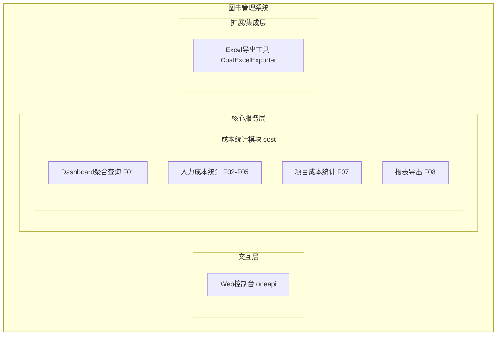
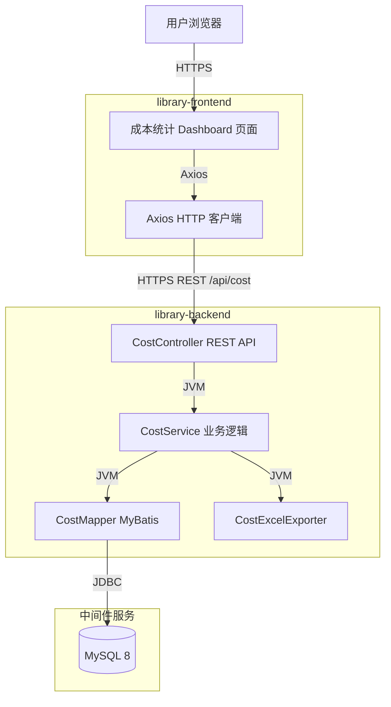
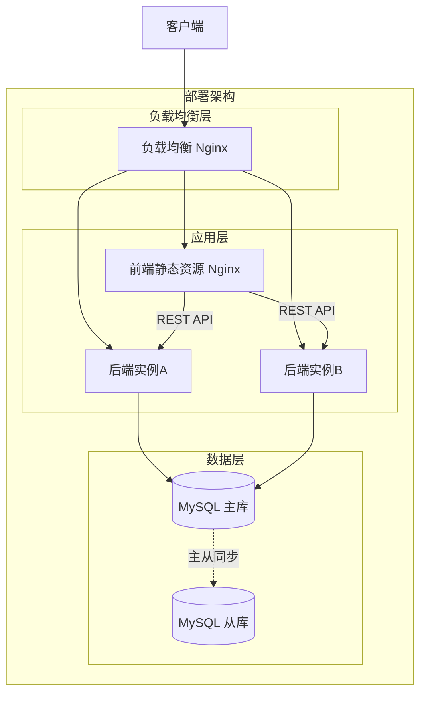
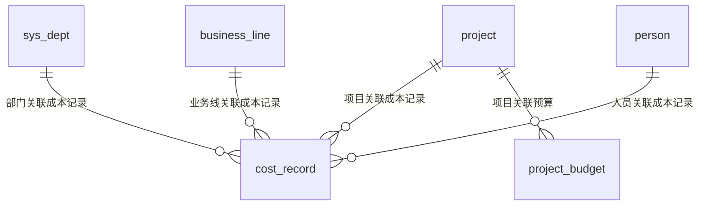
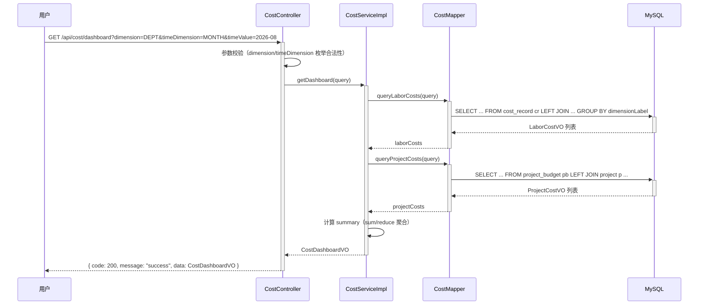
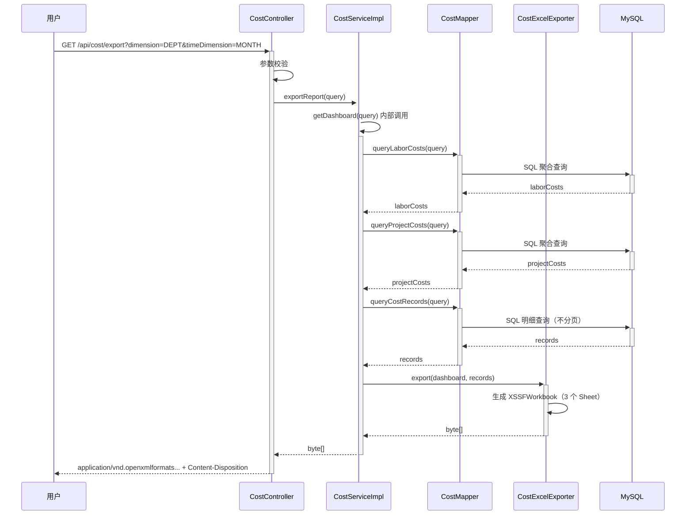
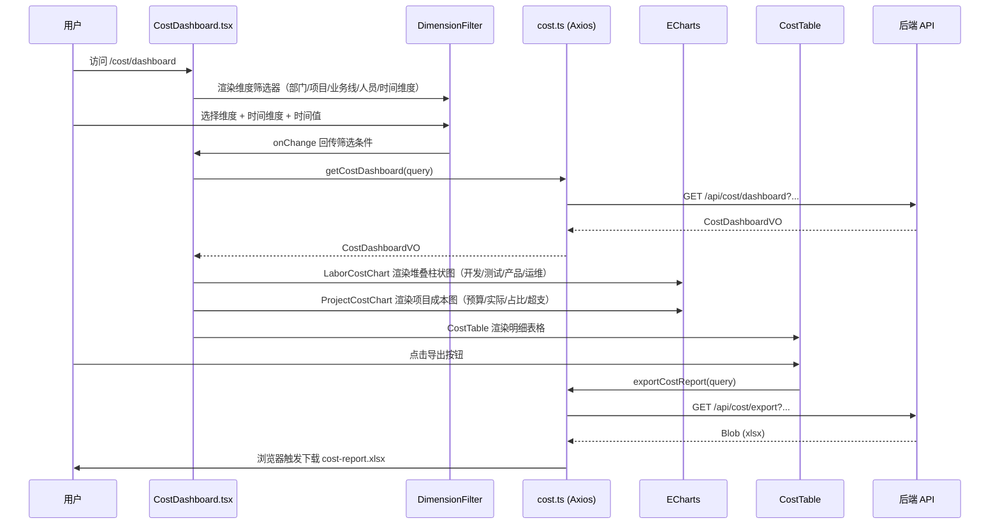

> **文档元信息**
>
> | 项目 | 内容 |
> |------|------|
> | 文档版本 | v1.0 |
> | 作者 | DTCoder |
> | 创建日期 | 2026-08-12 |
> | 需求来源 | `.agents/specs/cost-report.md`（成本统计报表 Implementation Plan） |
> | 评审状态 | 待评审 |

# 成本统计报表 系分设计

## 1. 需求与范围

- **背景与目标**：企业需要统计各项成本支出情况，当前图书管理系统（library-frontend + library-backend）缺少成本统计能力。本次新增成本统计报表功能，支持按部门、项目、业务线、人员、月份/季度/年度多维度统计人力成本（开发/测试/产品/运维）与项目成本（预算/实际消耗/预算占比/预计超支金额），并提供 Dashboard 可视化与报表导出。
- **核心功能**：
  - 成本统计 Dashboard 页面，组合维度筛选器 + 图表 + 表格
  - 按部门/项目/业务线/人员维度聚合人力成本（开发/测试/产品/运维）
  - 项目成本统计（预算/实际消耗/预算占比/预计超支金额）
  - 按月份/季度/年度时间维度筛选
  - 报表 Excel 导出（.xlsx）
- **约束与非功能要求**：
  - 前端 Node >= 18.18.0，pnpm >= 8.9.0
  - 后端 Java 17，Maven 3.9+
  - 所有金额字段使用 `BigDecimal`（后端）与 number（前端，单位：元），禁止 float/double
  - API 路径统一前缀 `/api/cost`
  - 所有接口返回统一响应体 `{ code: number; message: string; data: T }`
  - 时间维度参数：month 格式 `yyyy-MM`，quarter 格式 `yyyy-Qq`（如 `2026-Q1`），year 格式 `yyyy`
  - 金额展示统一保留 2 位小数
  - 报表导出格式：Excel (.xlsx)
  - 禁止修改现有图书管理业务代码，仅新增 cost 模块文件
- **排除范围**：
  - 成本数据的录入/编辑功能（本期仅统计展示，不涉及写入）
  - 成本预算审批流程
  - 实时成本监控告警
  - 非 Excel 格式导出（PDF/CSV 等）

### 需求功能清单与优先级

| 编号 | 功能点 | 优先级 | PRD 原始描述/章节 | 备注 |
|------|--------|--------|-------------------|------|
| F01 | 成本统计 Dashboard 页面 | P0 | "前端新建成本统计分析页面以及Dashboard" | 组合筛选器+图表+表格 |
| F02 | 按部门维度统计人力成本 | P0 | "涉及部门...人力成本（开发、测试、产品、运维）" | 聚合维度 DEPT |
| F03 | 按项目维度统计人力成本 | P0 | "涉及项目...人力成本" | 聚合维度 PROJECT |
| F04 | 按业务线维度统计人力成本 | P0 | "涉及业务线...人力成本" | 聚合维度 BUSINESS_LINE |
| F05 | 按人员维度统计人力成本 | P0 | "涉及人员...人力成本" | 聚合维度 PERSON |
| F06 | 按月份/季度/年度时间维度筛选 | P0 | "月份、季度、年度" | TimeDimension 枚举 |
| F07 | 项目成本统计（预算/实际消耗/预算占比/预计超支） | P0 | "项目成本（项目预算、实际消耗、预算占比、预计超支金额）" | ProjectCostVO |
| F08 | 报表 Excel 导出 | P0 | "支持报表导出" | Apache POI，.xlsx 格式 |
| F09 | 成本明细分页查询 | P1 | 统计数据展示 | GET /api/cost/stat 分页 |
| F10 | Dashboard 汇总摘要 | P1 | "按照不同维度展示和统计数据" | Summary 汇总指标 |

### 假设与待确认项

| 编号 | 假设/待确认内容 | 当前假设 | 确认状态 |
|------|-----------------|----------|----------|
| A01 | 部门/项目/业务线/人员基础表已存在 | 假设 `sys_dept`、`project`、`business_line`、`person` 表已存在于 library-backend 数据库，CostMapper.xml 通过 LEFT JOIN 关联查询 | 待确认 |
| A02 | 成本数据来源 | 假设 `cost_record` 表和 `project_budget` 表为本次新建，数据通过其他系统或手工导入，本期不涉及录入功能 | 待确认 |
| A03 | 权限模型 | 假设复用 library-backend 现有登录态校验和角色权限体系，cost 模块接口需登录后访问 | 待确认 |
| A04 | 前端项目脚手架 | 假设 library-frontend 已有 React + TypeScript + Ant Design + React Router 基础脚手架，本次新增 cost 页面和路由 | 待确认 |
| A05 | 数据库迁移工具 | 假设 library-backend 使用 Flyway 管理数据库迁移脚本 | 待确认 |

## 2. 架构与模块

### 功能架构


- **交互层说明**：用户通过浏览器访问 Web 控制台，前端 React SPA 提供 `/cost/dashboard` 路由页面，通过 Axios 调用后端 REST API。
- **核心服务层说明**：cost 模块包含 Controller（REST 接口入口）、Service（聚合统计业务逻辑）、Mapper（MyBatis SQL 聚合查询），负责按维度聚合人力成本和项目成本数据。
- **扩展/集成层说明**：CostExcelExporter 基于 Apache POI 生成多 Sheet Excel 文件，供报表导出接口调用。

**模块清单**

| 模块 | 职责 | 依赖 |
|------|------|------|
| cost-controller | 成本统计 REST 接口入口，参数校验与响应封装 | cost-service |
| cost-service | 成本聚合统计业务逻辑，汇总 summary 指标 | cost-mapper, cost-excel-exporter |
| cost-mapper | MyBatis SQL 聚合查询，按维度/时间筛选 | MySQL 数据库 |
| cost-excel-exporter | Excel 多 Sheet 生成（人力成本/项目成本/明细） | Apache POI |
| cost-frontend | 前端 Dashboard 页面、图表、筛选器、导出按钮 | 后端 REST API |


### 应用集成架构


**集成关系说明：**

| 调用方 | 被调用方 | 协议 | 接口类型 | 说明 |
|--------|----------|------|----------|------|
| 用户浏览器 | library-frontend | HTTPS | oneapi REST | 访问 `/cost/dashboard` 页面 |
| library-frontend | library-backend | HTTPS | REST `/api/cost/*` | Axios 调用成本统计 API |
| CostController | CostService | JVM | Service 方法调用 | 传递 CostStatQueryDTO |
| CostService | CostMapper | JVM | MyBatis Mapper 调用 | SQL 聚合查询 |
| CostService | CostExcelExporter | JVM | 工具类调用 | 生成 Excel byte[] |
| CostMapper | MySQL | JDBC | SQL | 聚合查询 cost_record / project_budget |

### 部署架构


**部署说明：**
- **负载均衡层**：Nginx 负载均衡，前端静态资源与后端 API 统一入口
- **应用层**：前端通过 Nginx 部署静态资源；后端 Spring Boot 多实例部署，支持水平扩展
- **数据层**：MySQL 主从架构，cost 模块查询走主库或从库（统计查询建议走从库减轻主库压力）


## 3. 数据模型与存储

### 实体清单

| 实体名称 | 实体说明 | 所属模块 | 与其他实体的关系 |
|----------|----------|----------|-----------------|
| cost_record | 成本记录表，记录每笔人力成本支出 | cost | 多对一关联 sys_dept（部门）、project（项目）、business_line（业务线）、person（人员） |
| project_budget | 项目预算表，记录项目预算与实际消耗 | cost | 多对一关联 project（项目） |

### 实体关系图


**模型说明：**
- `cost_record` 通过 `dept_id`、`project_id`、`business_line_id`、`person_id` 分别关联部门、项目、业务线、人员基础表，支持按任一维度聚合统计
- `project_budget` 通过 `project_id` 关联项目，按 `period`（周期）记录每个项目的预算与实际消耗
- `cost_record.labor_role` 存储人力角色枚举值（DEV/QA/PM/OPS），聚合查询时通过 `SUM(CASE WHEN ...)` 按角色分组统计


## 4. 接口设计

### 4.1 oneapi（Web 控制台接口）

| 编号 | 接口名称 | 方法 | 路径 | 模块 |
|------|----------|------|------|------|
| W01 | 成本统计 Dashboard | GET | /api/cost/dashboard | cost-controller |
| W02 | 成本明细分页查询 | GET | /api/cost/stat | cost-controller |
| W03 | 成本报表导出 | GET | /api/cost/export | cost-controller |

### 4.2 OpenAPI（对外接口）

本模块无对外 OpenAPI 接口。

### 4.3 内部接口（Service 层）

| 编号 | 接口名称 | 类 | 方法签名 |
|------|----------|------|----------|
| S01 | 获取 Dashboard 聚合数据 | CostService | `CostDashboardVO getDashboard(CostStatQueryDTO query)` |
| S02 | 获取成本明细列表 | CostService | `List<CostRecordDTO> getCostRecords(CostStatQueryDTO query)` |
| S03 | 导出报表 | CostService | `byte[] exportReport(CostStatQueryDTO query)` |
| S04 | 查询人力成本聚合 | CostMapper | `List<LaborCostVO> queryLaborCosts(@Param("query") CostStatQueryDTO query)` |
| S05 | 查询项目成本聚合 | CostMapper | `List<ProjectCostVO> queryProjectCosts(@Param("query") CostStatQueryDTO query)` |
| S06 | 查询成本明细 | CostMapper | `List<CostRecordDTO> queryCostRecords(@Param("query") CostStatQueryDTO query)` |
| S07 | 统计成本明细总数 | CostMapper | `long countCostRecords(@Param("query") CostStatQueryDTO query)` |
| S08 | 生成 Excel | CostExcelExporter | `byte[] export(CostDashboardVO dashboard, List<CostRecordDTO> records)` |

### 4.4 集成接口（Integration 层）

本模块无外部系统集成接口。


## 5. 功能模块设计

### 5.1 成本统计模块（cost）

#### 5.1.1 表结构设计

##### 5.1.1.1 cost_record（成本记录表）

| 字段名 | 数据类型 | 约束 | 默认值 | 说明 |
|--------|----------|------|--------|------|
| id | bigint | PK, 自增 | - | 系统自增主键 |
| dept_id | bigint | NOT NULL | - | 部门ID |
| project_id | bigint | DEFAULT NULL | NULL | 项目ID |
| business_line_id | bigint | DEFAULT NULL | NULL | 业务线ID |
| person_id | bigint | NOT NULL | - | 人员ID |
| labor_role | varchar(10) | NOT NULL | - | 人力角色: DEV/QA/PM/OPS |
| amount | decimal(15,2) | NOT NULL | - | 金额(元) |
| cost_date | date | NOT NULL | - | 成本日期 |
| created_at | datetime | NOT NULL | CURRENT_TIMESTAMP | 创建时间 |
| updated_at | datetime | NOT NULL | CURRENT_TIMESTAMP | 修改时间（ON UPDATE CURRENT_TIMESTAMP） |

**索引：**
- PK: `id` (主键)
- IDX: `idx_cost_date` (cost_date)
- IDX: `idx_dept_id` (dept_id)
- IDX: `idx_project_id` (project_id)

##### 5.1.1.2 project_budget（项目预算表）

| 字段名 | 数据类型 | 约束 | 默认值 | 说明 |
|--------|----------|------|--------|------|
| id | bigint | PK, 自增 | - | 系统自增主键 |
| project_id | bigint | NOT NULL | - | 项目ID |
| budget | decimal(15,2) | NOT NULL | - | 项目预算(元) |
| actual_cost | decimal(15,2) | NOT NULL | 0.00 | 实际消耗(元) |
| period | varchar(10) | NOT NULL | - | 周期: yyyy-MM / yyyy-Qq / yyyy |
| created_at | datetime | NOT NULL | CURRENT_TIMESTAMP | 创建时间 |
| updated_at | datetime | NOT NULL | CURRENT_TIMESTAMP | 修改时间（ON UPDATE CURRENT_TIMESTAMP） |

**索引：**
- PK: `id` (主键)
- UK: `uk_project_period` (project_id, period) — 唯一键，同一项目同一周期仅一条预算记录

##### 5.1.1.x 枚举与常量定义

| 枚举名称 | 取值 | 含义 | 关联字段 |
|----------|------|------|----------|
| CostDimension | DEPT | 部门 | CostStatQueryDTO.dimension |
| CostDimension | PROJECT | 项目 | CostStatQueryDTO.dimension |
| CostDimension | BUSINESS_LINE | 业务线 | CostStatQueryDTO.dimension |
| CostDimension | PERSON | 人员 | CostStatQueryDTO.dimension |
| LaborRole | DEV | 开发 | cost_record.labor_role |
| LaborRole | QA | 测试 | cost_record.labor_role |
| LaborRole | PM | 产品 | cost_record.labor_role |
| LaborRole | OPS | 运维 | cost_record.labor_role |
| TimeDimension | MONTH | 月份 | CostStatQueryDTO.timeDimension |
| TimeDimension | QUARTER | 季度 | CostStatQueryDTO.timeDimension |
| TimeDimension | YEAR | 年度 | CostStatQueryDTO.timeDimension |

**全局约定：**
- 错误码格式：`COST_{SEQ}`（如 COST_001、COST_002）
- 通用出参结构：`{ code: number, message: string, data: T }`
- 金额精度：DECIMAL(15,2)，后端 BigDecimal，前端 number（单位：元），展示保留 2 位小数

#### 5.1.2 接口详细设计

##### W01 成本统计 Dashboard

- **URI**: GET `/api/cost/dashboard`
- **描述**: 按维度和时间筛选，返回人力成本聚合、项目成本聚合及汇总摘要，供前端 Dashboard 页面渲染图表和指标卡
- **入参**:

| 参数名称 | 类型 | 是否必填 | 描述 |
|----------|------|----------|------|
| dimension | string | 否 | 聚合维度：DEPT / PROJECT / BUSINESS_LINE / PERSON，默认 DEPT |
| timeDimension | string | 否 | 时间维度：MONTH / QUARTER / YEAR，默认 MONTH |
| timeValue | string | 否 | 时间值，如 `2026-08` / `2026-Q3` / `2026` |
| deptId | long | 否 | 部门 ID 筛选 |
| projectId | long | 否 | 项目 ID 筛选 |
| businessLineId | long | 否 | 业务线 ID 筛选 |
| personId | long | 否 | 人员 ID 筛选 |

- **出参**:

| 参数名称 | 类型 | 描述 |
|----------|------|------|
| code | number | 结果码，200 表示成功 |
| message | string | 提示信息 |
| data | CostDashboardVO | 业务数据 |
| data.laborCosts | List&lt;LaborCostVO&gt; | 人力成本聚合列表 |
| data.projectCosts | List&lt;ProjectCostVO&gt; | 项目成本聚合列表 |
| data.summary | Summary | 汇总摘要 |

- **错误码**:

| 错误码 | 说明 |
|--------|------|
| COST_001 | 参数校验失败：dimension/timeDimension 枚举值非法 |
| COST_002 | 时间维度参数格式错误：month 应为 yyyy-MM，quarter 应为 yyyy-Qq，year 应为 yyyy |

- **业务规则**: dimension 默认 DEPT，timeDimension 默认 MONTH；timeValue 为空时不按时间筛选（返回全量聚合）

- **请求示例**:
```json
GET /api/cost/dashboard?dimension=DEPT&timeDimension=MONTH&timeValue=2026-08
```

- **响应示例**:
```json
{
  "code": 200,
  "message": "success",
  "data": {
    "laborCosts": [
      { "dimensionLabel": "研发一部", "dev": 120000.00, "qa": 50000.00, "pm": 30000.00, "ops": 20000.00, "total": 220000.00 }
    ],
    "projectCosts": [
      {
        "projectId": 1,
        "projectName": "图书管理系统升级",
        "budget": 500000.00,
        "actualCost": 320000.00,
        "budgetRatio": 0.64,
        "estimatedOverspend": 0.00
      }
    ],
    "summary": {
      "totalLaborCost": 220000.00,
      "totalProjectBudget": 500000.00,
      "totalActualCost": 320000.00,
      "overallBudgetRatio": 0.64,
      "totalEstimatedOverspend": 0.00
    }
  }
}
```

##### W02 成本明细分页查询

- **URI**: GET `/api/cost/stat`
- **描述**: 按维度和时间筛选，分页返回成本明细记录列表
- **入参**:

| 参数名称 | 类型 | 是否必填 | 描述 |
|----------|------|----------|------|
| dimension | string | 否 | 聚合维度，默认 DEPT |
| timeDimension | string | 否 | 时间维度，默认 MONTH |
| timeValue | string | 否 | 时间值 |
| deptId | long | 否 | 部门 ID 筛选 |
| projectId | long | 否 | 项目 ID 筛选 |
| businessLineId | long | 否 | 业务线 ID 筛选 |
| personId | long | 否 | 人员 ID 筛选 |
| page | int | 否 | 页码，默认 1 |
| size | int | 否 | 每页条数，默认 20 |

- **出参**:

| 参数名称 | 类型 | 描述 |
|----------|------|------|
| code | number | 结果码 |
| message | string | 提示信息 |
| data | List&lt;CostRecordDTO&gt; | 成本明细列表 |

- **错误码**:

| 错误码 | 说明 |
|--------|------|
| COST_001 | 参数校验失败 |
| COST_003 | 分页参数越界：page < 1 或 size > 1000 |

- **业务规则**: page 默认 1，size 默认 20，最大 1000；按 cost_date DESC 排序

- **请求示例**:
```json
GET /api/cost/stat?dimension=DEPT&timeDimension=MONTH&timeValue=2026-08&page=1&size=20
```

- **响应示例**:
```json
{
  "code": 200,
  "message": "success",
  "data": [
    {
      "id": 1,
      "deptId": 1,
      "deptName": "研发一部",
      "projectId": 1,
      "projectName": "图书管理系统升级",
      "businessLineId": 1,
      "businessLineName": "数字阅读",
      "personId": 10,
      "personName": "张三",
      "laborRole": "DEV",
      "amount": 15000.00,
      "costDate": "2026-08-01"
    }
  ]
}
```

##### W03 成本报表导出

- **URI**: GET `/api/cost/export`
- **描述**: 按维度和时间筛选，导出包含「人力成本」「项目成本」「明细」三个 Sheet 的 Excel 文件
- **入参**: 同 W01（不分页）

| 参数名称 | 类型 | 是否必填 | 描述 |
|----------|------|----------|------|
| dimension | string | 否 | 聚合维度，默认 DEPT |
| timeDimension | string | 否 | 时间维度，默认 MONTH |
| timeValue | string | 否 | 时间值 |
| deptId | long | 否 | 部门 ID 筛选 |
| projectId | long | 否 | 项目 ID 筛选 |
| businessLineId | long | 否 | 业务线 ID 筛选 |
| personId | long | 否 | 人员 ID 筛选 |

- **出参**: 二进制流 `application/vnd.openxmlformats-officedocument.spreadsheetml.sheet`，Content-Disposition: `attachment; filename="cost-report.xlsx"`

- **错误码**:

| 错误码 | 说明 |
|--------|------|
| COST_004 | Excel 生成失败：POI 异常或内存不足 |

- **业务规则**: 导出数据不分页，返回全量筛选结果；Excel 包含三个 Sheet：人力成本（维度/开发/测试/产品/运维/合计）、项目成本（项目ID/项目名称/预算/实际消耗/预算占比/预计超支）、成本明细（全部字段）

- **请求示例**:
```json
GET /api/cost/export?dimension=DEPT&timeDimension=MONTH&timeValue=2026-08
```

#### 5.1.3 子功能详细设计

##### 5.1.3.1 Dashboard 聚合查询（F01-F07）

- 处理时序图


**业务规则：**
| 规则编号 | 规则描述 | 校验时机 | 不满足时的处理 |
|----------|----------|----------|--------------|
| R01 | dimension 必须是 DEPT/PROJECT/BUSINESS_LINE/PERSON 之一 | 接口入口 | 返回 COST_001，提示"聚合维度参数非法" |
| R02 | timeDimension 必须是 MONTH/QUARTER/YEAR 之一 | 接口入口 | 返回 COST_001，提示"时间维度参数非法" |
| R03 | timeValue 格式与 timeDimension 匹配 | 接口入口 | 返回 COST_002，提示"时间值格式错误" |
| R04 | budgetRatio 计算时 budget > 0 才计算比值，否则为 0 | Service 层 | 除零保护，返回 0 |
| R05 | estimatedOverspend 仅当 actualCost > budget 时为正，否则为 0 | SQL 层 | CASE WHEN 保护 |
| R06 | overallBudgetRatio 保留 4 位小数（HALF_UP） | Service 层 | BigDecimal.divide 设置 scale=4 |

**异常场景：**
| 异常场景 | 处理方式 |
|----------|----------|
| 数据库连接失败 | 抛出 RuntimeException，全局异常处理器返回 code=500 |
| 查询结果为空 | 返回空列表 + summary 全零值，不报错 |
| timeValue 格式不匹配 | 返回 COST_002 错误码 |

**并发控制：**
- 并发场景：Dashboard 查询为只读操作，无并发写入冲突
- 控制策略：无并发风险，原因：cost 模块本期仅涉及统计查询，不涉及数据写入

##### 5.1.3.2 报表 Excel 导出（F08）

- 处理时序图


**业务规则：**
| 规则编号 | 规则描述 | 校验时机 | 不满足时的处理 |
|----------|----------|----------|--------------|
| R07 | 导出数据不分页，返回全量筛选结果 | Service 层 | queryCostRecords 不传分页参数 |
| R08 | Excel 包含三个 Sheet：人力成本、项目成本、明细 | Exporter 层 | 固定三个 Sheet |
| R09 | 金额字段使用 BigDecimal.doubleValue() 写入 Excel | Exporter 层 | 保证精度 |

**异常场景：**
| 异常场景 | 处理方式 |
|----------|----------|
| POI 生成异常 | 抛出 RuntimeException，返回 COST_004 |
| 数据量过大导致 OOM | 建议限制导出数据量（如最大 10 万条），超出提示分批导出 |

##### 5.1.3.3 前端 Dashboard 页面渲染（F01）

- 处理时序图


**业务规则：**
| 规则编号 | 规则描述 | 校验时机 | 不满足时的处理 |
|----------|----------|----------|--------------|
| R10 | 筛选条件变更后自动重新查询 | 前端 useEffect | 依赖 query 状态变化触发 |
| R11 | 金额展示保留 2 位小数 | 前端格式化 | toFixed(2) |
| R12 | 导出响应为 Blob 类型，触发浏览器下载 | 前端 Axios | responseType: 'blob' |

**异常场景：**
| 异常场景 | 处理方式 |
|----------|----------|
| API 请求失败 | Ant Design message.error 提示错误信息 |
| 图表数据为空 | 显示空状态占位 |
| 导出失败 | message.error 提示"导出失败，请重试" |

### 5.2 前端模块（cost-frontend）

#### 5.2.1 文件结构

| 文件路径 | 职责 |
|---|---|
| `src/types/cost.ts` | 成本相关 TypeScript 类型定义（CostRecord, ProjectCost, Dimension, StatQuery, StatResult） |
| `src/api/cost.ts` | 成本统计 API 请求封装（getCostDashboard, getCostStat, exportCostReport） |
| `src/pages/cost/CostDashboard.tsx` | 成本统计 Dashboard 主页面，组合筛选器 + 图表 + 表格 |
| `src/pages/cost/components/DimensionFilter.tsx` | 维度筛选器组件（部门/项目/业务线/人员/时间维度） |
| `src/pages/cost/components/LaborCostChart.tsx` | 人力成本图表（按角色：开发/测试/产品/运维） |
| `src/pages/cost/components/ProjectCostChart.tsx` | 项目成本图表（预算/实际/占比/超支） |
| `src/pages/cost/components/CostTable.tsx` | 成本明细表格组件，支持导出按钮 |
| `src/pages/cost/components/ExportButton.tsx` | 报表导出按钮组件 |
| `src/router/index.ts` | 修改：新增 `/cost/dashboard` 路由 |
| `src/layouts/MainLayout.tsx` | 修改：侧边栏新增「成本统计」菜单项 |
| `src/api/request.ts` | 修改：统一处理 blob 下载响应 |
| `src/__tests__/cost.test.ts` | 成本 API 与类型测试 |

#### 5.2.2 前端类型定义

```typescript
// src/types/cost.ts
export type CostDimension = 'DEPT' | 'PROJECT' | 'BUSINESS_LINE' | 'PERSON';
export type TimeDimension = 'MONTH' | 'QUARTER' | 'YEAR';
export type LaborRole = 'DEV' | 'QA' | 'PM' | 'OPS';

export interface StatQuery {
  dimension?: CostDimension;
  timeDimension?: TimeDimension;
  timeValue?: string;
  deptId?: number;
  projectId?: number;
  businessLineId?: number;
  personId?: number;
  page?: number;
  size?: number;
}

export interface LaborCost {
  dimensionLabel: string;
  dev: number;
  qa: number;
  pm: number;
  ops: number;
  total: number;
}

export interface ProjectCost {
  projectId: number;
  projectName: string;
  budget: number;
  actualCost: number;
  budgetRatio: number;
  estimatedOverspend: number;
}

export interface CostSummary {
  totalLaborCost: number;
  totalProjectBudget: number;
  totalActualCost: number;
  overallBudgetRatio: number;
  totalEstimatedOverspend: number;
}

export interface CostDashboardVO {
  laborCosts: LaborCost[];
  projectCosts: ProjectCost[];
  summary: CostSummary;
}

export interface CostRecord {
  id: number;
  deptId: number;
  deptName: string;
  projectId: number;
  projectName: string;
  businessLineId: number;
  businessLineName: string;
  personId: number;
  personName: string;
  laborRole: LaborRole;
  amount: number;
  costDate: string;
}
```

#### 5.2.3 前端 API 封装

```typescript
// src/api/cost.ts
import request from './request';
import type { CostDashboardVO, CostRecord, StatQuery } from '../types/cost';

export function getCostDashboard(query: StatQuery) {
  return request.get<{ code: number; message: string; data: CostDashboardVO }>(
    '/api/cost/dashboard', { params: query }
  );
}

export function getCostStat(query: StatQuery) {
  return request.get<{ code: number; message: string; data: CostRecord[] }>(
    '/api/cost/stat', { params: query }
  );
}

export function exportCostReport(query: StatQuery) {
  return request.get('/api/cost/export', {
    params: query,
    responseType: 'blob',
  });
}
```

#### 5.2.4 前端组件设计

**CostDashboard.tsx**：主页面，管理筛选状态 `StatQuery`，通过 `useEffect` 监听筛选变化调用 `getCostDashboard`，将数据传递给子组件渲染。包含指标卡（summary 汇总）、LaborCostChart（堆叠柱状图）、ProjectCostChart（柱状图/饼图）、CostTable（明细表格 + ExportButton）。

**DimensionFilter.tsx**：使用 Ant Design `Select` / `DatePicker` / `Radio.Group` 组合，提供维度选择（DEPT/PROJECT/BUSINESS_LINE/PERSON）、时间维度选择（MONTH/QUARTER/YEAR）、时间值输入、部门/项目/业务线/人员 ID 筛选。onChange 回调父组件。

**LaborCostChart.tsx**：基于 ECharts 渲染堆叠柱状图，X 轴为 dimensionLabel，Y 轴为金额，系列为开发/测试/产品/运维，堆叠展示 total。

**ProjectCostChart.tsx**：基于 ECharts 渲染柱状图，展示每个项目的预算 vs 实际消耗，标注预算占比和预计超支。

**CostTable.tsx**：Ant Design `Table` 组件，展示成本明细，列含部门/项目/业务线/人员/角色/金额/日期，支持分页，内嵌 ExportButton。

**ExportButton.tsx**：Ant Design `Button`，点击调用 `exportCostReport`，响应为 Blob，通过 `URL.createObjectURL` + `a` 标签触发下载 `cost-report.xlsx`。


## 6. 非功能性需求设计

### 6.1 高可用性
- 后端 Spring Boot 多实例部署，通过 Nginx 负载均衡，单实例故障不影响整体可用性
- MySQL 主从架构，统计查询可走从库，主库故障时从库可提供只读服务
- 前端静态资源通过 Nginx 部署，CDN 加速，后端 API 不可用时前端展示降级提示

### 6.2 可扩展性
- 后端无状态，支持水平扩缩容，新增实例接入 Nginx 即可
- cost 模块独立包名 `com.library.cost`，与现有图书管理业务解耦，后续可独立拆分为微服务
- 聚合查询 SQL 支持动态维度切换，新增维度只需扩展 CostDimension 枚举和 Mapper XML

### 6.3 稳定性/可靠性
- 金额计算全程使用 BigDecimal，避免浮点精度丢失
- budgetRatio 计算做除零保护（budget > 0 才计算）
- 分页参数做边界校验（page >= 1, size <= 1000）
- 导出数据量过大时建议限制最大条数，防止 OOM

### 6.4 安全性设计
#### 6.4.1 账户系统方案
- 复用 library-backend 现有登录态校验体系，cost 模块接口需登录后访问
- 不自实现登录/注册功能

#### 6.4.2 授权&访问控制
##### 6.4.2.1 是否实现水平权限检查
- 不涉及数据库写入，为公共数据查询
- 成本统计为只读查询，用户登录后可查看其有权限的部门/项目数据（如有数据权限控制需求，后续在 Service 层追加用户数据范围过滤）

##### 6.4.2.2 是否实现垂直权限检查
- 复用 library-backend 现有角色权限体系
- cost 模块接口需登录后访问，导出接口建议限制为管理员/财务角色

##### 6.4.2.3 是否检查登录态
- 全局统一拦截器检查登录态，未登录返回 401
- `/api/cost/*` 不在白名单中

#### 6.4.3 数据防护方案
##### 6.4.3.1 是否对敏感数据加密存储
- 成本金额数据为业务数据，非个人敏感信息，不加密存储
- 如涉及人员薪酬明细，建议按安全规范加密

##### 6.4.3.2 是否对敏感数据展示进行脱敏
- 人员姓名在明细展示时如涉及隐私可做脱敏（如张*），本期暂不脱敏
- 日志打印不记录金额明细，仅记录查询参数和结果数量

### 6.5 监控/统计/日志/告警
- 接口调用监控：记录 `/api/cost/*` 接口 QPS、响应时间、错误率
- 慢查询监控：CostMapper 聚合 SQL 执行时间超过 1s 告警
- 导出监控：记录导出请求的数据量、耗时，超过阈值（如 5 万条）告警
- 业务日志：INFO 级别记录查询参数摘要，ERROR 级别记录异常堆栈


## 7. 变更三板斧

### 7.1 可监控
- CostController 三个接口（dashboard/stat/export）埋点：调用次数、响应耗时、成功/失败率
- CostMapper SQL 执行埋点：慢查询（>1s）记录 WARN 日志
- CostExcelExporter 导出埋点：记录导出数据量、生成耗时、内存使用
- 前端页面埋点：Dashboard 页面加载时间、API 请求耗时、导出点击次数

### 7.2 可灰度
- cost 模块为新增功能，不影响现有图书管理业务，可全量发布
- 如需灰度：前端通过路由权限控制，仅对特定角色开放 `/cost/dashboard` 菜单
- 后端接口可通过网关层按用户/租户灰度引流
- 数据库迁移脚本 `V2026081201__create_cost_tables.sql` 使用 `CREATE TABLE IF NOT EXISTS`，可安全重复执行

### 7.3 可应急
- 前端路由开关：通过配置控制 `/cost/dashboard` 菜单显隐，紧急时下线菜单
- 后端接口开关：通过 `@ConditionalOnProperty` 或网关路由控制 `/api/cost/*` 是否暴露
- 数据库回滚：`cost_record` 和 `project_budget` 为新增表，回滚仅需 `DROP TABLE IF EXISTS cost_record, project_budget`，不影响现有业务
- 回滚依赖关系：cost 模块完全独立，不依赖现有表结构变更，回滚无上下游影响
