> **文档元信息**
>
> | 项目 | 内容 |
> |------|------|
> | 文档版本 | v1.0 |
> | 作者 | DTCoder |
> | 创建日期 | 2025-08-14 |
> | 需求来源 | `.agents/specs/${system.dima}.md`（需求规格）、`.agents/specs/20260814-分别写三个接口helloworld、哈希.md`（实施计划） |
> | 评审状态 | 待评审 |

# 算法工具与调用分析平台 — 系分设计

## 1. 需求与范围

### 背景与目标

在图书管理系统（library-frontend / library-backend）基础上，新增一个**算法工具与调用分析**模块，提供三个核心算法接口的在线调用、结果导出，以及基于埋点数据的可视化分析报表。

**目标**：
- 为普通用户提供算法工具（HelloWorld、哈希算法、冒泡排序）的在线调用入口
- 支持将各算法执行结果导出为 CSV/XLSX 文件
- 后端通过 AOP 切面对每次 API 调用自动埋点（调用人、调用次数、时间等）
- 前端在同一页面以可视化报表（折线图、饼图、柱状图）展示调用统计，支持按人员类型、人员层级、人员部门等维度切换

### 核心功能

| 功能域 | 说明 |
|--------|------|
| 算法工具 | 三个算法接口的在线调用：HelloWorld（GET）、哈希算法（POST）、冒泡排序（POST） |
| 结果导出 | 每个 Tab 页面的执行结果支持导出为 CSV 或 XLSX 文件 |
| 埋点记录 | AOP 切面自动拦截算法接口调用，记录调用人、时间、耗时、成功状态等信息 |
| 统计报表 | 调用分析可视化报表，支持维度切换（人员类型/层级/部门）和图表类型切换（折线图/饼图/柱状图） |

### 约束与非功能要求

| 类别 | 约束内容 |
|------|----------|
| 技术栈 | 后端：Spring Boot 3.x + Java 17 + MyBatis-Plus + MySQL 8.0；前端：React 18 + TypeScript + Vite + Ant Design 5.x + ECharts 5.x |
| 接口规范 | 统一返回 `{code, data, message}` 结构 |
| 认证 | 调用人信息通过请求头 `X-User-*` 传递，Axios 拦截器注入 |
| 埋点 | AOP 切面自动触发，不侵入业务代码；异步写入 api_metrics 表 |
| 导出 | 支持 CSV（默认）和 XLSX 格式 |
| 数组排序 | 长度限制 2~1000 |
| 哈希算法 | 支持 MD5、SHA-1、SHA-256、SHA-512 |
| 图表维度 | 人员类型（caller_type）、人员层级（caller_level）、人员部门（caller_dept） |
| 安全 | CORS 配置、参数校验、全局异常处理 |

### 排除范围

- 不涉及用户登录/注册/权限体系改造（复用现有认证机制，假设已存在）
- 不涉及图书管理核心业务逻辑修改
- 不涉及移动端适配
- 不涉及国际化（i18n）
- 不涉及实时推送/WebSocket

### 需求功能清单与优先级

| 编号 | 功能点 | 优先级 | PRD 原始描述/章节 | 备注 |
|------|--------|--------|-------------------|------|
| F01 | HelloWorld 接口：GET /api/helloworld?name={name}，返回问候消息 | P0 | 规格 §3.1.1 | 核心算法入口之一 |
| F02 | 哈希算法接口：POST /api/hash，支持 MD5/SHA-1/SHA-256/SHA-512 | P0 | 规格 §3.1.2 | 核心算法入口之一 |
| F03 | 冒泡排序接口：POST /api/bubblesort，支持升序/降序，长度 2~1000 | P0 | 规格 §3.1.3 | 核心算法入口之一 |
| F04 | 结果导出接口：POST /api/export，支持 CSV/XLSX 格式 | P1 | 规格 §3.2 | 依赖 F01/F02/F03 执行结果 |
| F05 | AOP 埋点切面：自动拦截算法接口，记录调用信息到 api_metrics 表 | P0 | 规格 §3.3.1 / §6 | 报表数据源 |
| F06 | 统计查询接口：GET /api/metrics，按维度/日期范围查询调用统计 | P1 | 规格 §3.3.2 | 报表数据源 |
| F07 | 前端三 Tab 页面（HelloWorld / 哈希 / 冒泡排序），含输入区和结果展示 | P0 | 规格 §4.2 / §4.3 | 用户交互入口 |
| F08 | 前端导出按钮：每个 Tab 页独立导出当前结果 | P1 | 规格 §4.3 | UI 交互 |
| F09 | 可视化报表面板：维度选择 + 图表类型切换（折线/饼图/柱状图）+ 日期筛选 | P1 | 规格 §4.2 / §4.3 | UI 交互 |
| F10 | 全局异常处理：参数校验失败（400）、服务器错误（500） | P0 | 规格 §8 | 横切关注点 |

### 假设与待确认项

| 编号 | 假设/待确认内容 | 当前假设 | 确认状态 |
|------|-----------------|----------|----------|
| A01 | 用户认证信息传递方式 | 通过请求头 `X-User-Id`、`X-User-Name`、`X-User-Type`、`X-User-Level`、`X-User-Dept` 传递，前端 Axios 拦截器注入；若缺失则从 Spring Security Context 获取，仍缺失记录为 "anonymous" | 待确认 |
| A02 | 人员类型/层级/部门的取值规范 | 人员类型：内部员工/外部访客/管理员；人员层级：P1-P10；人员部门：按实际组织架构（如技术部、产品部等） | 待确认 |
| A03 | 埋点数据存储周期 | 暂不设自动清理策略，默认永久保留 | 待确认 |
| A04 | 前端路由和菜单集成方式 | 新增路由 `/algorithm-tools`，在左侧菜单新增"算法工具"菜单项；假设现有菜单系统可扩展 | 待确认 |
| A05 | 数据库连接信息 | 默认 MySQL 本地实例，库名 `library`，用户名/密码 `root/root` | 待确认 |

---

## 2. 架构与模块

### 功能架构

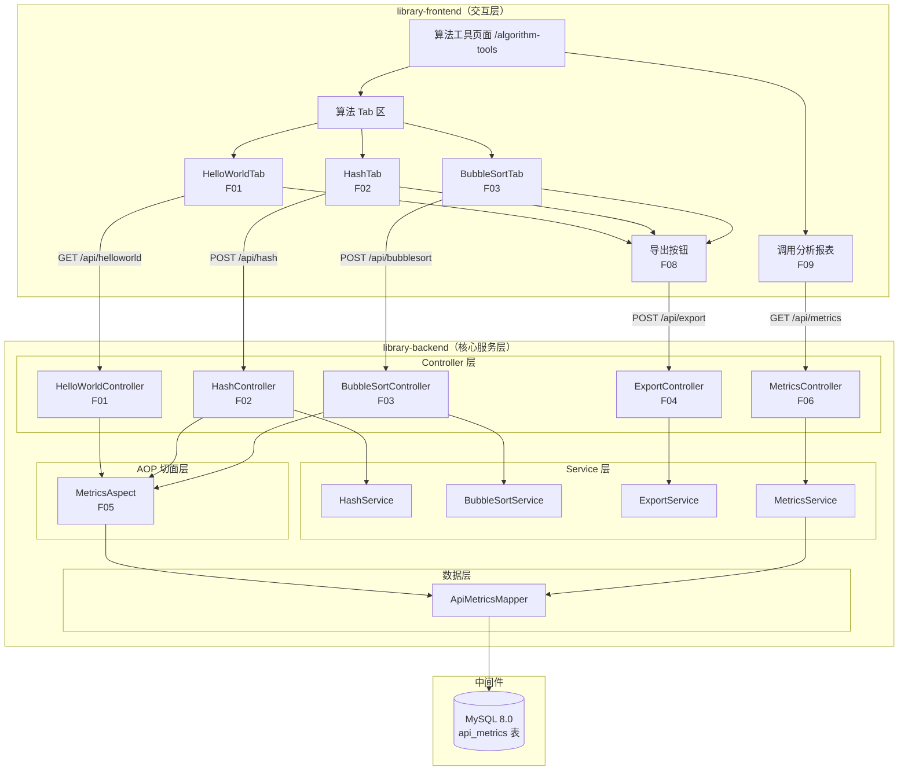

**模块清单**

| 模块 | 职责 | 依赖 |
|------|------|------|
| HelloWorldController | 提供 HelloWorld 问候接口（GET /api/helloworld） | Result（通用响应） |
| HashController | 提供哈希计算接口（POST /api/hash） | HashService、Result |
| BubbleSortController | 提供冒泡排序接口（POST /api/bubblesort） | BubbleSortService、Result |
| ExportController | 提供结果导出接口（POST /api/export），生成 CSV/XLSX 文件流 | ExportService、Result |
| MetricsController | 提供调用统计查询接口（GET /api/metrics） | MetricsService、Result |
| HashService | 哈希算法计算（MD5/SHA-1/SHA-256/SHA-512） | Java Security MessageDigest |
| BubbleSortService | 冒泡排序算法实现（升序/降序） | 无 |
| ExportService | 导出文件生成（CSV 用 OpenCSV，XLSX 用 Apache POI） | OpenCSV、Apache POI |
| MetricsService | 调用统计聚合查询 | ApiMetricsMapper |
| MetricsAspect | AOP 切面，拦截 @GetMapping/@PostMapping 自动埋点 | ApiMetricsMapper |
| ApiMetricsMapper | api_metrics 表 CRUD + 聚合统计查询 | MyBatis-Plus、MySQL |
| AlgorithmToolsPage | 前端页面入口，三 Tab 布局 + 报表面板 | Ant Design、ECharts |
| MetricsDashboard | 可视化报表面板（维度选择、图表切换、日期筛选） | ECharts、getMetrics API |

### 应用集成架构

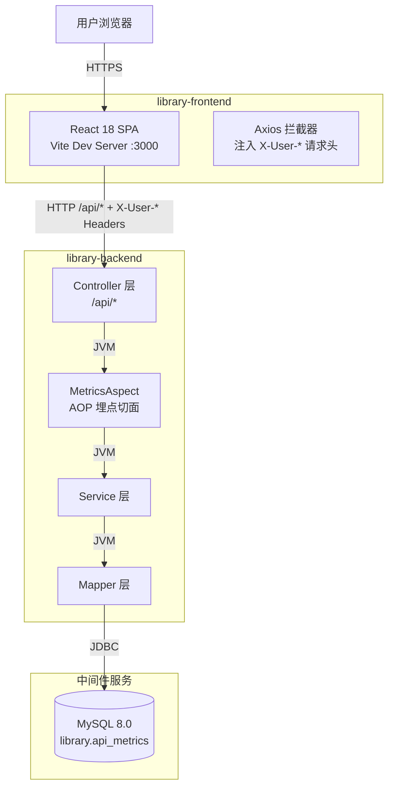

**集成关系说明：**

| 调用方 | 被调用方 | 协议 | 接口类型 | 说明 |
|--------|----------|------|----------|------|
| 用户浏览器 | library-frontend Vite Dev Server | HTTP | SPA 页面 | 开发环境 Vite 代理 /api → localhost:8080 |
| library-frontend | library-backend Controller | HTTP | oneapi REST | Axios 请求，baseURL `/api`，拦截器注入 X-User-* 头 |
| Controller | MetricsAspect | JVM | AOP Around | 切面拦截所有 @GetMapping/@PostMapping |
| Controller | Service | JVM | 方法调用 | 业务逻辑委托 |
| Service | Mapper | JVM | MyBatis-Plus | 数据访问 |
| Mapper | MySQL | JDBC | SQL | 数据库读写 |

### 部署架构

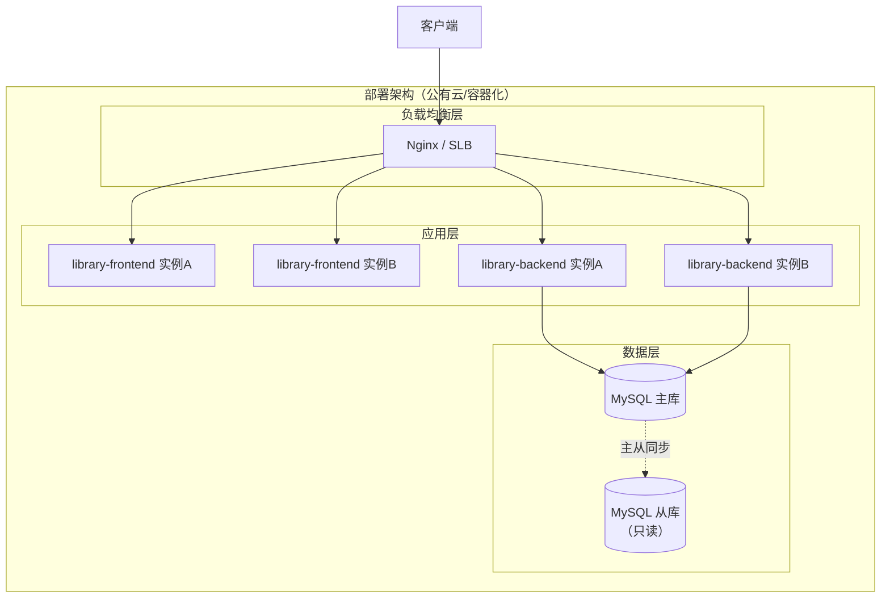

**部署说明：**
- **负载均衡层**：Nginx 或云 SLB，将前端静态资源请求和后端 API 请求分发到对应实例
- **应用层**：前端 React SPA 静态部署（Nginx/CDN），后端 Spring Boot 容器化部署（K8s），至少 2 副本保证高可用
- **数据层**：MySQL 主从架构，写操作走主库，统计查询可走从库（读写分离）；假设：单机部署阶段暂不分库分表，api_metrics 表按时间分区为后续扩展预留

---

## 3. 数据模型与存储

### 实体清单

| 实体名称 | 实体说明 | 所属模块 | 与其他实体的关系 |
|----------|----------|----------|-----------------|
| ApiMetrics | API 调用埋点记录，存储每次算法接口调用的元信息 | 埋点与统计模块 | 无外部关联（独立实体） |

### 实体关系图

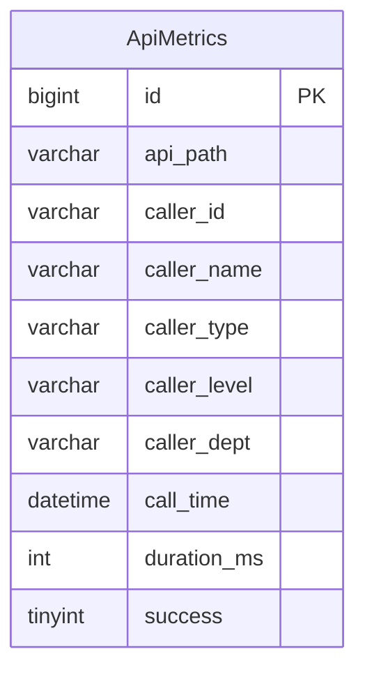

**模型说明：**
- 本模块仅新增一个实体 `api_metrics`，与其他业务实体无关联关系
- 调用人信息（caller_id、caller_name、caller_type、caller_level、caller_dept）从请求头提取，不关联用户表——假设：用户信息由上游认证系统提供，本模块不维护用户主数据
- 无缓存/消息队列设计：埋点写入采用异步方式（AOP 切面中通过线程池异步执行），不阻塞主业务流程

---

## 4. 接口设计

### 4.1 oneapi（Web 控制台接口）

| 编号 | 接口名称 | 方法 | 路径 | 模块 |
|------|----------|------|------|------|
| W01 | HelloWorld 问候 | GET | /api/helloworld | HelloWorldController |
| W02 | 哈希计算 | POST | /api/hash | HashController |
| W03 | 冒泡排序 | POST | /api/bubblesort | BubbleSortController |
| W04 | 结果导出 | POST | /api/export | ExportController |
| W05 | 调用统计查询 | GET | /api/metrics | MetricsController |

### 4.2 OpenAPI（对外接口）

本项不适用，原因：当前模块所有接口均为 Web 控制台内部使用（oneapi），不对外暴露 OpenAPI。

### 4.3 内部接口（Service 层）

| 编号 | 接口名称 | 类 | 方法签名 |
|------|----------|------|----------|
| S01 | 哈希计算 | HashService | `String compute(String input, String algorithm)` |
| S02 | 冒泡排序 | BubbleSortService | `BubbleSortResult sort(int[] array, String order)` |
| S03 | 导出文件生成 | ExportService | `byte[] export(String type, Map<String, Object> data, String format)` |
| S04 | 统计查询 | MetricsService | `Map<String, Object> query(String dimension, String startDate, String endDate, String apiPath)` |
| S05 | 埋点记录写入 | MetricsAspect | `void recordMetrics(ProceedingJoinPoint joinPoint)` — 异步执行 |

### 4.4 集成接口（Integration 层）

本项不适用，原因：当前模块不依赖外部系统，所有功能均在 library-backend 内部闭环。

---

## 5. 功能模块设计

### 5.1 HelloWorld 模块

#### 5.1.1 表结构设计

本模块不涉及数据库表，无持久化需求。

#### 5.1.2 接口详细设计

##### W01 HelloWorld 问候

- **URI**: GET /api/helloworld
- **描述**: 返回问候消息，支持自定义名称参数
- **入参**:

| 参数名称 | 类型 | 是否必填 | 描述 |
|----------|------|----------|------|
| name | String | 否 | 问候名称，默认 "World" |

- **出参**:

| 参数名称 | 类型 | 描述 |
|----------|------|------|
| code | int | 状态码，200 表示成功 |
| message | String | 提示信息 |
| data.message | String | 问候消息，格式 "Hello, {name}!" |
| data.timestamp | long | 毫秒级时间戳 |

- **错误码**:

| 错误码 | 说明 |
|--------|------|
| 400 | 参数校验失败 |
| 500 | 服务器内部错误 |

- **业务规则**: 无特殊业务规则，name 参数为空时默认使用 "World"
- **请求示例**:

```
GET /api/helloworld?name=Alice
```

- **响应示例**:

```json
{
  "code": 200,
  "message": "success",
  "data": {
    "message": "Hello, Alice!",
    "timestamp": 1720958400000
  }
}
```

#### 5.1.3 子功能详细设计

##### 5.1.3.1 HelloWorld 调用（F01）

- 处理时序图

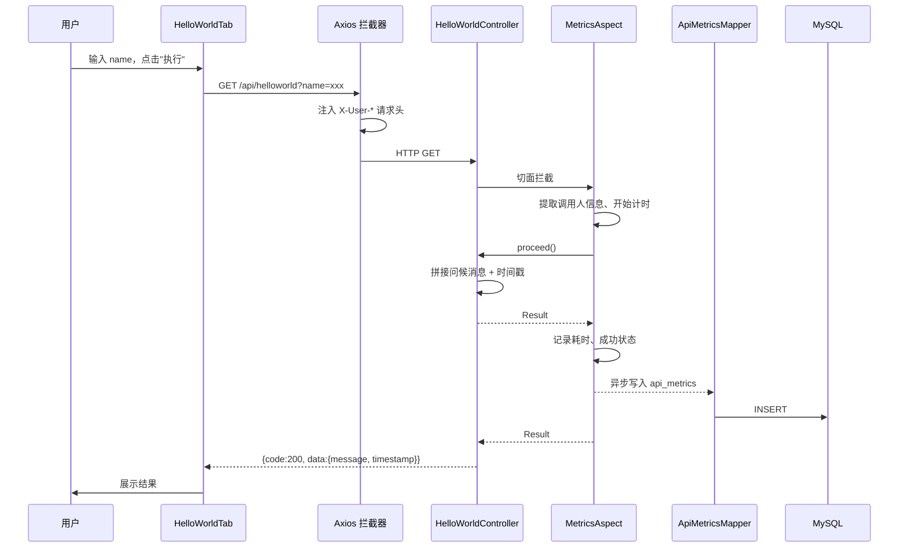

**业务规则：**

| 规则编号 | 规则描述 | 校验时机 | 不满足时的处理 |
|----------|----------|----------|--------------|
| R01 | name 参数为可选，缺失时默认 "World" | 请求时 | 使用默认值 |

**异常场景：**

| 异常场景 | 处理方式 |
|----------|----------|
| 请求参数类型错误 | Spring MVC 自动类型转换失败，返回 400 |
| 服务器内部异常 | GlobalExceptionHandler 捕获，返回 500 |

**并发控制：** 无并发风险，原因：本接口为纯计算无状态操作，不涉及数据写入。

---

### 5.2 哈希算法模块

#### 5.2.1 表结构设计

本模块不涉及数据库表，无持久化需求。

#### 5.2.2 接口详细设计

##### W02 哈希计算

- **URI**: POST /api/hash
- **描述**: 对输入字符串进行哈希计算，支持 MD5、SHA-1、SHA-256、SHA-512
- **入参**:

| 参数名称 | 类型 | 是否必填 | 描述 |
|----------|------|----------|------|
| input | String | 是 | 待哈希字符串 |
| algorithm | String | 否 | 算法类型，默认 "SHA-256"，可选 "MD5"/"SHA-1"/"SHA-512" |

- **出参**:

| 参数名称 | 类型 | 描述 |
|----------|------|------|
| code | int | 状态码 |
| message | String | 提示信息 |
| data.hash | String | 十六进制哈希值 |
| data.algorithm | String | 使用的算法 |
| data.input | String | 原始输入 |

- **错误码**:

| 错误码 | 说明 |
|--------|------|
| 400 | 参数错误：input 为空、不支持的算法 |
| 500 | 服务器内部错误 |

- **业务规则**: algorithm 不在支持列表中时抛出 IllegalArgumentException，返回 400
- **请求示例**:

```json
{
  "input": "hello",
  "algorithm": "SHA-256"
}
```

- **响应示例**:

```json
{
  "code": 200,
  "message": "success",
  "data": {
    "hash": "2cf24dba5fb0a30e26e83b2ac5b9e29e1b161e5c1fa7425e73043362938b9824",
    "algorithm": "SHA-256",
    "input": "hello"
  }
}
```

#### 5.2.3 子功能详细设计

##### 5.2.3.1 哈希计算调用（F02）

- 处理时序图

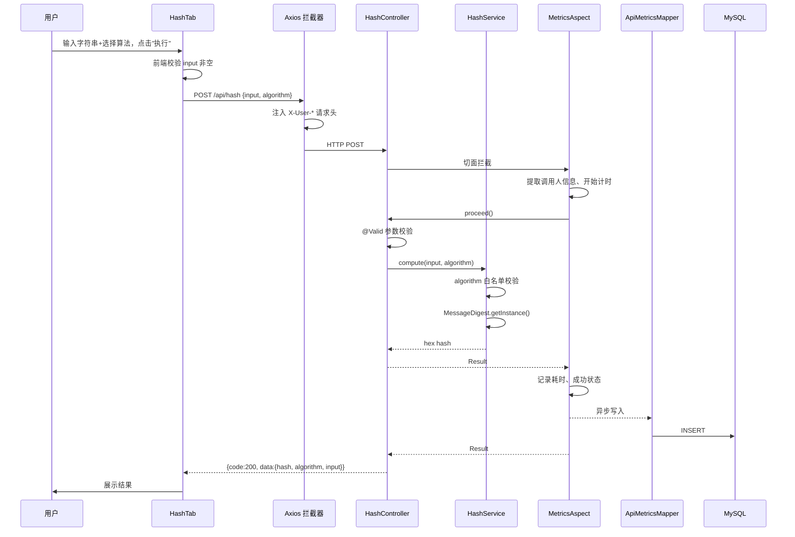

**业务规则：**

| 规则编号 | 规则描述 | 校验时机 | 不满足时的处理 |
|----------|----------|----------|--------------|
| R02 | input 不能为空 | 请求时（@NotBlank） | 返回 400 "参数错误: input不能为空" |
| R03 | algorithm 必须在 {MD5, SHA-1, SHA-256, SHA-512} 中 | 请求时 | 返回 400 "不支持的算法: xxx" |

**异常场景：**

| 异常场景 | 处理方式 |
|----------|----------|
| input 为空 | @NotBlank 校验失败 → 400 |
| algorithm 不在白名单 | IllegalArgumentException → 400 |
| NoSuchAlgorithmException（JDK 不支持） | 包装为 IllegalArgumentException → 400 |
| 服务器内部异常 | GlobalExceptionHandler → 500 |

**并发控制：** 无并发风险，原因：纯计算无状态操作。

---

### 5.3 冒泡排序模块

#### 5.3.1 表结构设计

本模块不涉及数据库表，无持久化需求。

#### 5.3.2 接口详细设计

##### W03 冒泡排序

- **URI**: POST /api/bubblesort
- **描述**: 对输入数组进行冒泡排序，返回排序结果及比较步数
- **入参**:

| 参数名称 | 类型 | 是否必填 | 描述 |
|----------|------|----------|------|
| array | int[] | 是 | 待排序数组，长度 2~1000 |
| order | String | 否 | 排序方向，"asc"（升序，默认）/ "desc"（降序） |

- **出参**:

| 参数名称 | 类型 | 描述 |
|----------|------|------|
| code | int | 状态码 |
| message | String | 提示信息 |
| data.sorted | int[] | 排序后数组 |
| data.steps | int | 比较步数 |
| data.original | int[] | 原始数组 |

- **错误码**:

| 错误码 | 说明 |
|--------|------|
| 400 | 参数错误：数组为空、长度不在 2~1000、order 不为 asc/desc |
| 500 | 服务器内部错误 |

- **请求示例**:

```json
{
  "array": [5, 3, 8, 1, 2],
  "order": "asc"
}
```

- **响应示例**:

```json
{
  "code": 200,
  "message": "success",
  "data": {
    "sorted": [1, 2, 3, 5, 8],
    "steps": 10,
    "original": [5, 3, 8, 1, 2]
  }
}
```

#### 5.3.3 子功能详细设计

##### 5.3.3.1 冒泡排序调用（F03）

- 处理时序图

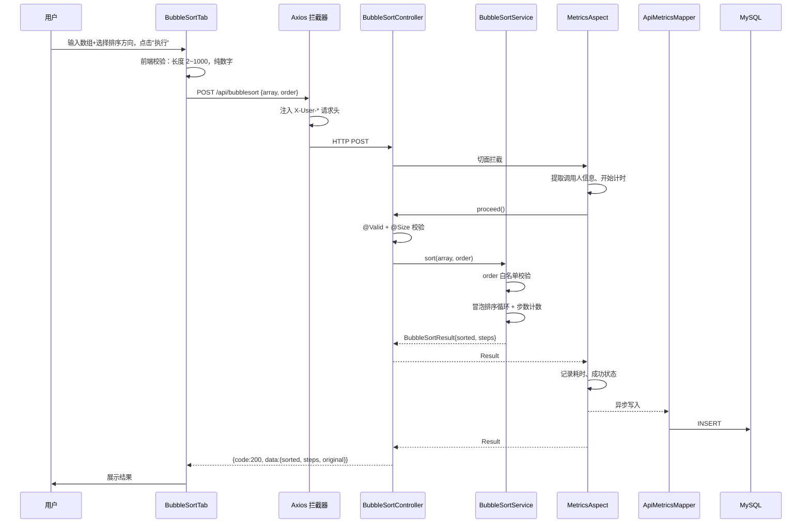

**业务规则：**

| 规则编号 | 规则描述 | 校验时机 | 不满足时的处理 |
|----------|----------|----------|--------------|
| R04 | array 长度必须在 2~1000 | 请求时（@Size） | 返回 400 "数组长度需在2~1000之间" |
| R05 | order 必须在 {asc, desc} 中 | 请求时 | 返回 400 "排序方向仅支持 asc 或 desc" |

**异常场景：**

| 异常场景 | 处理方式 |
|----------|----------|
| array 为空/长度不合法 | @Size 校验失败 → 400 |
| order 不合法 | IllegalArgumentException → 400 |
| 数组包含非数字元素 | 前端校验拦截，后端按 int[] 解析自动失败 → 400 |
| 服务器内部异常 | GlobalExceptionHandler → 500 |

**并发控制：** 无并发风险，原因：纯计算无状态操作。

---

### 5.4 导出模块

#### 5.4.1 表结构设计

本模块不涉及数据库表，无持久化需求。

#### 5.4.2 接口详细设计

##### W04 结果导出

- **URI**: POST /api/export
- **描述**: 将前端传递的结果数据导出为 CSV 或 XLSX 文件流
- **入参**:

| 参数名称 | 类型 | 是否必填 | 描述 |
|----------|------|----------|------|
| type | String | 是 | 导出类型："helloworld" / "hash" / "bubblesort" |
| data | Map | 是 | 当前 Tab 展示的结果数据（键值对） |
| format | String | 否 | 导出格式："csv"（默认）/ "xlsx" |

- **出参**: `Content-Type: application/octet-stream`，返回文件流，前端通过 Blob 下载
- **错误码**:

| 错误码 | 说明 |
|--------|------|
| 400 | 参数错误：type 不在白名单、format 不支持 |
| 500 | 导出处理异常 |

- **请求示例**:

```json
{
  "type": "helloworld",
  "data": {
    "message": "Hello, World!",
    "timestamp": 1720958400000
  },
  "format": "csv"
}
```

- **响应示例**: 二进制文件流，Content-Disposition 包含文件名

#### 5.4.3 子功能详细设计

##### 5.4.3.1 导出执行（F04、F08）

- 处理时序图

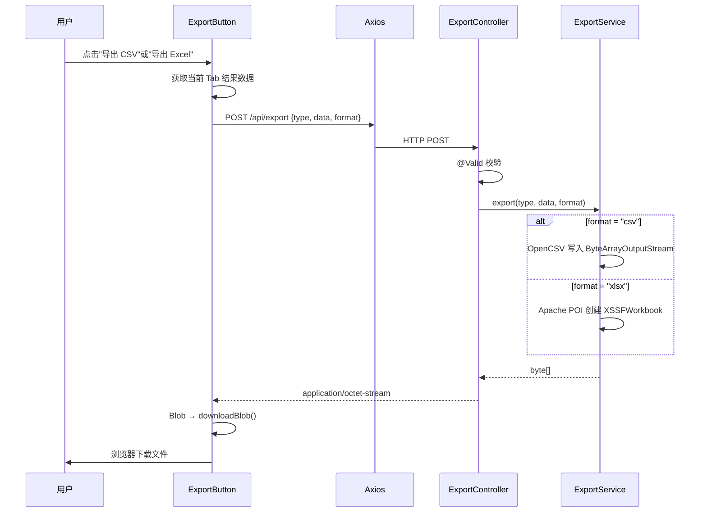

**业务规则：**

| 规则编号 | 规则描述 | 校验时机 | 不满足时的处理 |
|----------|----------|----------|--------------|
| R06 | type 必须在 {helloworld, hash, bubblesort} 中 | 请求时 | 返回 400 "导出类型仅支持..." |
| R07 | format 必须在 {csv, xlsx} 中 | 请求时 | 返回 400 "导出格式仅支持 csv 或 xlsx" |
| R08 | data 不能为空 | 请求时（@NotNull） | 返回 400 |

**异常场景：**

| 异常场景 | 处理方式 |
|----------|----------|
| type/format 不合法 | IllegalArgumentException → 400 |
| CSV 写入失败 | RuntimeException → 500 |
| XLSX 生成失败 | RuntimeException → 500 |

**并发控制：** 无并发风险，原因：无状态文件生成操作。

---

### 5.5 埋点与统计模块

#### 5.5.1 表结构设计

##### 5.5.1.1 api_metrics

| 字段名 | 数据类型 | 约束 | 默认值 | 说明 |
|--------|----------|------|--------|------|
| id | BIGINT | PK, 自增 | - | 系统自增主键 |
| api_path | VARCHAR(255) | NOT NULL | - | 接口路径，如 /api/helloworld |
| caller_id | VARCHAR(64) | - | NULL | 调用人 ID |
| caller_name | VARCHAR(128) | - | NULL | 调用人姓名 |
| caller_type | VARCHAR(32) | - | NULL | 人员类型（内部员工/外部访客/管理员） |
| caller_level | VARCHAR(16) | - | NULL | 人员层级（P1-P10） |
| caller_dept | VARCHAR(128) | - | NULL | 人员部门 |
| call_time | DATETIME | NOT NULL | - | 调用时间 |
| duration_ms | INT | - | NULL | 执行耗时(ms) |
| success | TINYINT | - | 1 | 1=成功，0=失败 |
| gmt_create | DATETIME | NOT NULL | CURRENT_TIMESTAMP | 创建时间 |
| gmt_modified | DATETIME | NOT NULL | CURRENT_TIMESTAMP | 修改时间 |

**索引：**
- PK: `pk_api_metrics` (id)
- IDX: `idx_api_metrics_api_path` (api_path)
- IDX: `idx_api_metrics_caller_type` (caller_type)
- IDX: `idx_api_metrics_caller_level` (caller_level)
- IDX: `idx_api_metrics_caller_dept` (caller_dept)
- IDX: `idx_api_metrics_call_time` (call_time)

**命名规范遵循**：表名全部小写下划线分隔，索引以 `idx_` 开头，主键以 `pk_` 开头，包含 gmt_create/gmt_modified 时间字段。

##### 5.5.1.x 枚举与常量定义

| 枚举名称 | 取值 | 含义 | 关联字段 |
|----------|------|------|----------|
| 人员类型 | 内部员工 / 外部访客 / 管理员 | 调用人身份分类 | api_metrics.caller_type |
| 人员层级 | P1 ~ P10 | 职级体系 | api_metrics.caller_level |
| 接口路径 | /api/helloworld / /api/hash / /api/bubblesort | 被调用的接口 | api_metrics.api_path |
| 成功标识 | 0 / 1 | 调用是否成功 | api_metrics.success |

#### 5.5.2 接口详细设计

##### W05 调用统计查询

- **URI**: GET /api/metrics
- **描述**: 按维度、日期范围、接口路径查询调用统计，返回聚合数据和趋势数据
- **入参**:

| 参数名称 | 类型 | 是否必填 | 描述 |
|----------|------|----------|------|
| dimension | String | 否 | 统计维度：caller_type / caller_level / caller_dept，默认 caller_type |
| startDate | String | 否 | 开始日期 yyyy-MM-dd |
| endDate | String | 否 | 结束日期 yyyy-MM-dd |
| apiPath | String | 否 | 按接口路径筛选 |

- **出参**:

| 参数名称 | 类型 | 描述 |
|----------|------|------|
| code | int | 状态码 |
| message | String | 提示信息 |
| data.dimension | String | 当前统计维度 |
| data.total | long | 总调用次数 |
| data.breakdown | Array | 维度分组明细 [{label, count, percentage}] |
| data.trend | Array | 日期趋势 [{date, count}] |

- **错误码**:

| 错误码 | 说明 |
|--------|------|
| 400 | dimension 参数不合法 |
| 500 | 服务器内部错误 |

- **请求示例**:

```
GET /api/metrics?dimension=caller_type&startDate=2025-07-01&endDate=2025-07-14
```

- **响应示例**:

```json
{
  "code": 200,
  "message": "success",
  "data": {
    "dimension": "caller_type",
    "total": 1523,
    "breakdown": [
      {"label": "内部员工", "count": 800, "percentage": 52.5},
      {"label": "外部访客", "count": 500, "percentage": 32.8},
      {"label": "管理员", "count": 223, "percentage": 14.7}
    ],
    "trend": [
      {"date": "2025-07-01", "count": 45},
      {"date": "2025-07-02", "count": 62}
    ]
  }
}
```

#### 5.5.3 子功能详细设计

##### 5.5.3.1 AOP 埋点记录（F05）

- 处理时序图

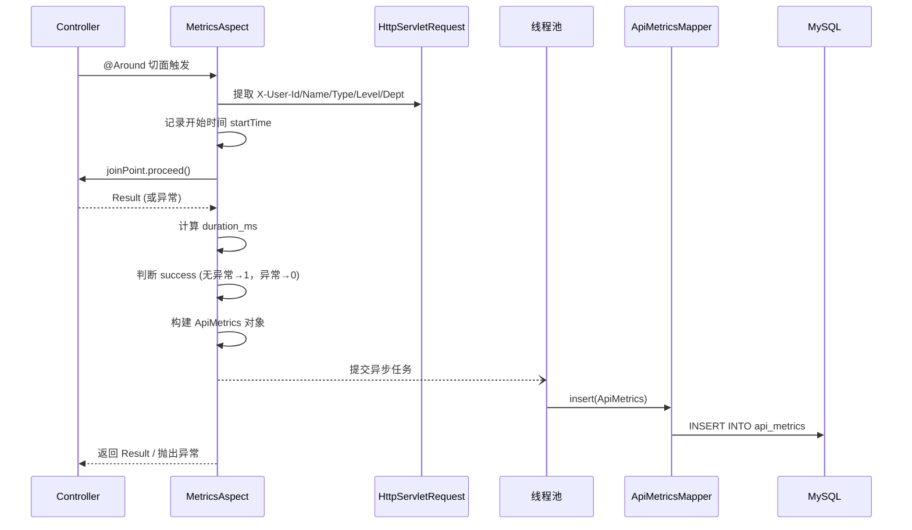

**业务规则：**

| 规则编号 | 规则描述 | 校验时机 | 不满足时的处理 |
|----------|----------|----------|--------------|
| R09 | 调用人信息优先从请求头获取 | 每次请求 | 缺失则从 SecurityContext 获取，仍缺失记录 "anonymous" |
| R10 | 埋点写入必须异步，不阻塞主流程 | 切面 after 阶段 | 线程池拒绝时静默丢弃（记录日志） |
| R11 | 调用异常时 success=0，但仍记录 | 切面 after 阶段 | 异常重新抛出，不吞异常 |

**异常场景：**

| 异常场景 | 处理方式 |
|----------|----------|
| 请求头缺失 X-User-* | 降级到 SecurityContext → "anonymous" |
| 线程池队列满 | 静默丢弃本次埋点，Log.warn |
| 数据库写入失败 | 静默丢弃，Log.error（不阻塞主流程） |

**并发控制：** 异步写入，无并发竞争。线程池默认配置：core=2, max=4, 有界队列=100。

##### 5.5.3.2 统计查询（F06）

- 处理时序图

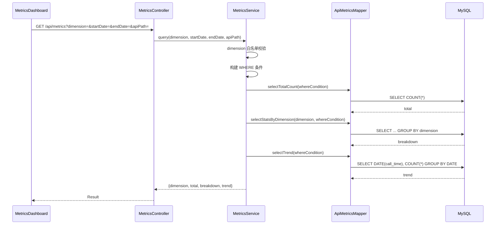

**业务规则：**

| 规则编号 | 规则描述 | 校验时机 | 不满足时的处理 |
|----------|----------|----------|--------------|
| R12 | dimension 必须在 {caller_type, caller_level, caller_dept} 中 | 查询前 | 默认使用 caller_type |
| R13 | 日期范围 startDate ≤ endDate | 查询前 | 不校验（由前端控制），后端直接拼接 BETWEEN 条件 |

**异常场景：**

| 异常场景 | 处理方式 |
|----------|----------|
| 数据库查询异常 | 500 |
| 空结果（无埋点数据） | 返回 total=0, breakdown=[], trend=[] |

**并发控制：** 无并发风险，原因：纯查询操作。

---

### 5.6 前端页面模块

#### 5.6.1 表结构设计

前端模块不涉及数据库表。

#### 5.6.2 接口详细设计

前端组件通过 Axios 调用后端 oneapi 接口（W01-W05），不单独定义接口。

#### 5.6.3 子功能详细设计

##### 5.6.3.1 三 Tab 页面布局（F07）

- 处理时序图

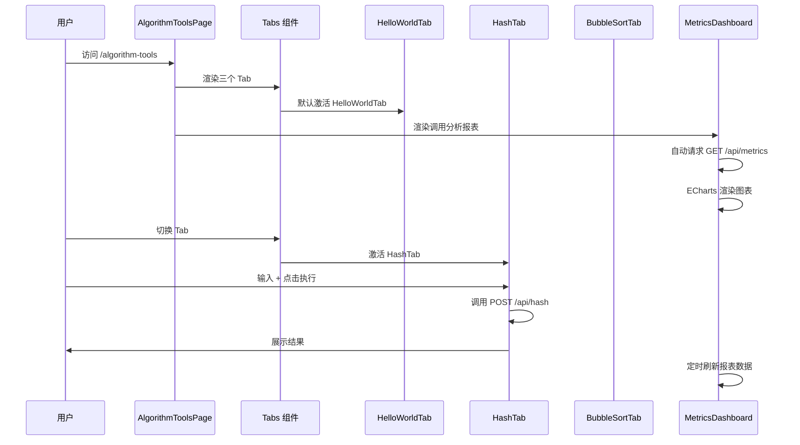

**业务规则：**

| 规则编号 | 规则描述 | 校验时机 | 不满足时的处理 |
|----------|----------|----------|--------------|
| R14 | 每个 Tab 独立维护自己的状态（输入、结果、loading） | 始终 | Tab 切换不丢失状态 |
| R15 | 导出按钮仅在当前 Tab 有结果时可用 | 渲染时 | disabled 状态 |

**异常场景：**

| 异常场景 | 处理方式 |
|----------|----------|
| 网络请求失败 | message.error 提示用户 |
| 后端返回非 200 | Axios 响应拦截器统一 reject，message.error |
| 导出 Blob 为空 | 前端校验 Blob size，提示"导出失败" |

**并发控制：** 无并发风险，各 Tab 状态独立。

##### 5.6.3.2 可视化报表（F09）

- 图表配置

| 图表类型 | 数据来源 | ECharts 配置要点 |
|----------|----------|-----------------|
| 折线图 (line) | data.trend | xAxis: date, yAxis: count, smooth: true, areaStyle |
| 饼图 (pie) | data.breakdown | series.type: pie, radius: 50%, data: [{name, value}] |
| 柱状图 (bar) | data.breakdown | xAxis: label, yAxis: count, label.show: true, position: top |

**维度切换逻辑：**
1. 用户选择维度（人员类型/层级/部门）→ 触发 getMetrics({dimension}) 重新请求
2. 图表类型切换（折线/饼图/柱状图）→ 仅改变 ECharts option，不重新请求
3. 日期范围筛选 → 触发 getMetrics({startDate, endDate})

**业务规则：**

| 规则编号 | 规则描述 | 校验时机 | 不满足时的处理 |
|----------|----------|----------|--------------|
| R16 | 报表页面加载时自动请求一次数据 | 组件挂载 | 静默失败，不阻塞页面 |
| R17 | 维度/日期变化时重新请求 | 用户交互 | 显示 loading 状态 |

**异常场景：**

| 异常场景 | 处理方式 |
|----------|----------|
| 统计数据为空 | 显示空状态占位图 |
| 网络请求失败 | 静默处理，图表区域保留上次数据或空状态 |

**并发控制：** 无并发风险，前端请求串行。

---

### 跨模块时序图

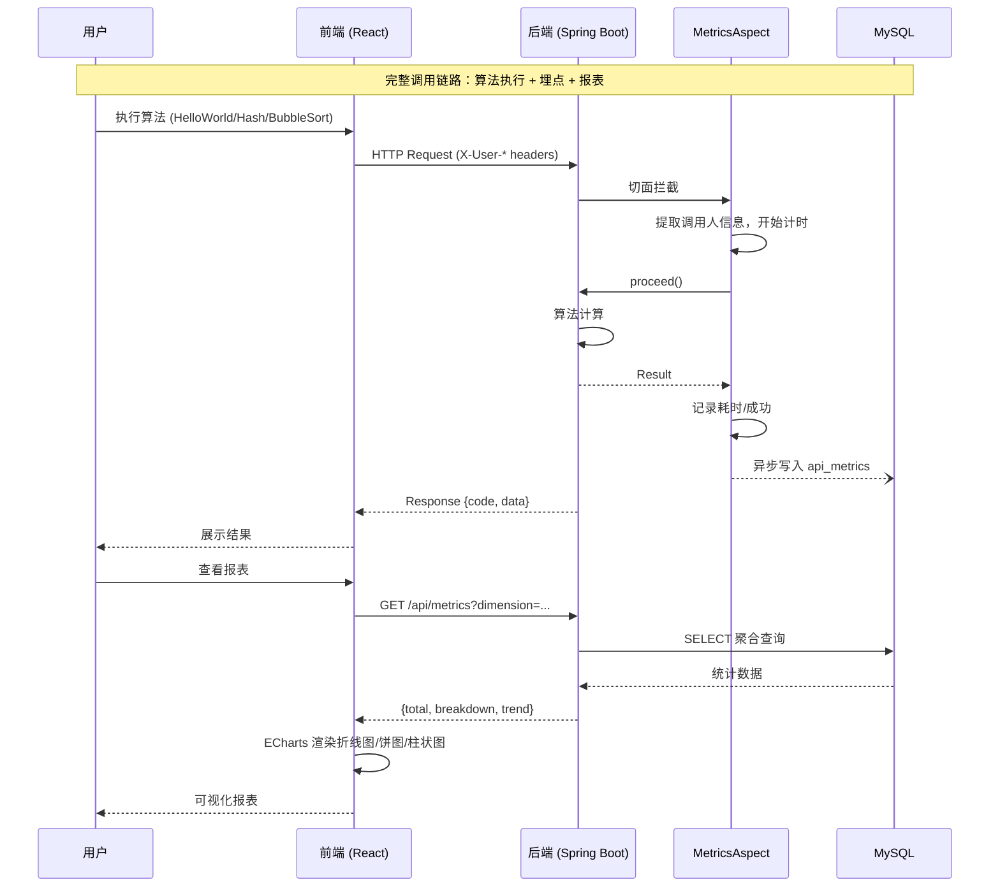

---

## 6. 非功能性需求设计

### 6.1 高可用性

- **服务多副本**：后端服务和前端静态资源均部署至少 2 副本，通过负载均衡分发流量
- **埋点异步写入**：AOP 切面使用独立线程池异步写入，线程池满时静默丢弃并记录日志，保证主业务不受埋点故障影响
- **数据库主从**：MySQL 主从架构，统计查询可走从库降低主库压力
- **降级策略**：统计数据查询失败时前端静默处理，不阻塞算法工具的正常使用

### 6.2 可扩展性

- **水平扩展**：后端服务无状态设计，可线性扩容；前端静态资源 CDN 分发
- **算法扩展**：新增算法接口仅需添加 Controller + Service，AOP 切面自动覆盖埋点
- **维度扩展**：统计维度新增只需在 api_metrics 表添加字段、修改 MetricsService 查询逻辑和前端维度下拉选项
- **导出格式扩展**：ExportService 中新增方法即可支持新格式（如 PDF）

### 6.3 稳定性/可靠性

- **参数校验**：前后端双重校验，前端拦截明显错误，后端 @Valid + 自定义 validate() 兜底
- **边界条件**：数组长度 2~1000、哈希算法白名单、排序方向白名单、导出类型/格式白名单
- **全局异常处理**：GlobalExceptionHandler 统一捕获，避免异常堆栈泄露到前端
- **埋点数据可靠性**：异步写入失败静默丢弃，不重试，避免阻塞和雪崩；假设：埋点数据允许少量丢失（非核心业务数据）

### 6.4 安全性设计

#### 6.4.1 账户系统方案

不涉及独立账户系统。假设：复用现有图书管理系统的认证体系，通过请求头 `X-User-*` 传递调用人信息（由上游网关或 Axios 拦截器注入）。

#### 6.4.2 授权与访问控制

##### 6.4.2.1 是否实现水平权限检查

不涉及数据库查询的水平权限控制。统计查询接口 `/api/metrics` 返回全量聚合数据，不区分用户——普通用户和管理员均可见全量统计。假设：调用分析报表为公开数据，不需要按用户隔离。

##### 6.4.2.2 是否实现垂直权限检查

不涉及角色权限控制。所有接口均为公开访问，无需特定角色。假设：算法工具为公共功能，所有登录用户均可使用。

##### 6.4.2.3 是否检查登录态

假设：由上游网关或拦截器统一校验登录态，本模块接口不单独校验。

#### 6.4.3 数据防护方案

##### 6.4.3.1 是否对敏感数据加密存储

不涉及敏感数据。api_metrics 表仅存储调用统计信息，不包含身份证、银行卡等敏感字段。

##### 6.4.3.2 是否对敏感数据展示进行脱敏

不涉及敏感数据展示。算法结果和统计报表均为非敏感信息。

### 6.5 监控/统计/日志/告警

- **埋点监控**：api_metrics 表本身就是监控数据源，前端可视化报表提供实时调用分析
- **日志记录**：AOP 切面记录每次调用的请求路径、调用人、耗时、成功状态
- **异常告警**：线程池满、数据库写入失败等异常通过日志记录（Log.warn/Log.error），建议接入监控告警系统（如 Prometheus + Grafana）
- **接口耗时**：duration_ms 字段记录每次调用耗时，可分析接口性能趋势

---

## 7. 变更三板斧

### 7.1 可监控

| 监控点 | 监控方式 | 指标 |
|--------|----------|------|
| 算法接口调用量 | api_metrics 聚合查询 + 前端 ECharts 报表 | 总调用次数、按维度分组、按日期趋势 |
| 接口响应时间 | AOP 切面记录 duration_ms | 平均耗时、P99 耗时 |
| 接口成功率 | AOP 切面记录 success 字段 | 成功率 = success=1 / 总数 |
| 埋点写入失败 | 日志 Log.error | 线程池满、DB 写入异常次数 |
| 导出请求量 | 可扩展：ExportController 也可纳入 AOP 埋点范围 | 导出次数、导出格式分布 |

### 7.2 可灰度

本功能为新增模块，不涉及存量逻辑变更。灰度策略：

- **前端路由灰度**：通过菜单配置控制 `/algorithm-tools` 路由的可见性，按租户/用户尾号逐步放开
- **后端接口灰度**：若需灰度，可通过 Nginx/网关按请求头或租户 ID 路由到新旧版本服务
- **不可灰度场景**：若系统无灰度基础设施，直接全量上线，风险可控（新增功能不影响现有图书管理业务）

### 7.3 可应急

| 应急场景 | 应急方案 | 操作方式 |
|----------|----------|----------|
| 算法接口异常（如哈希计算失败） | 前端展示错误提示，不影响其他 Tab 和报表 | 自动降级 |
| 埋点写入阻塞主流程 | 线程池异步写入 + 满时丢弃，主流程不受影响 | 自动降级 |
| 统计报表查询超时 | 前端静默失败，显示空状态，不阻塞算法工具 | 自动降级 |
| 需紧急下线整个模块 | 通过菜单配置隐藏前端路由 + 网关屏蔽 /api/helloworld、/api/hash、/api/bubblesort 路径 | 配置开关 |
| 数据库表数据量过大 | api_metrics 表按 call_time 分区，可快速清理历史数据 | DBA 操作 |

**回滚关注点**：
- 回滚仅需移除前端路由和菜单项，后端接口保留不影响现有业务
- 若需回滚数据库变更，api_metrics 表为新增表，DROP 无影响
- 上下游兼容：本模块为独立新增，无上下游依赖，回滚无副作用

---

## 8. 跨仓对齐清单

| 对齐项 | library-backend | library-frontend | 状态 |
|--------|:---:|:---:|:---:|
| 接口路径 | `/api/helloworld`, `/api/hash`, `/api/bubblesort`, `/api/export`, `/api/metrics` | Axios baseURL `/api`，请求路径一致 | ✅ |
| 请求/响应结构 | `{code: int, message: string, data: T}` 统一封装 | Axios 响应拦截器统一解析 `res.data.data` | ✅ |
| 导出格式 | CSV/XLSX 文件流，`application/octet-stream` | Blob 下载处理，`downloadBlob()` | ✅ |
| 埋点字段 | caller_type / caller_level / caller_dept | 维度下拉选项值一致 | ✅ |
| 认证信息传递 | 请求头 `X-User-Id`, `X-User-Name`, `X-User-Type`, `X-User-Level`, `X-User-Dept` | Axios 请求拦截器注入 | ✅ |
| 错误码 | 400（参数错误）、500（服务器错误） | 前端 `message.error` 统一处理 | ✅ |
| 哈希算法白名单 | MD5, SHA-1, SHA-256, SHA-512 | 前端 Select 选项一致 | ✅ |
| 排序方向 | asc / desc | 前端 Select 选项一致 | ✅ |
| 数组长度限制 | 2~1000 | 前端校验 + 后端 @Size | ✅ |

---

## 9. 方案检查

| 检查项 | 详细描述 | 结果 |
|------|------|------|
| 模块划分合理性检查 | 单一职责：每个 Controller/Service 职责单一；无循环依赖；无功能点超 50% 的模块 | ✅ 通过 |
| 依赖关系合理性 | 集成架构依赖合理：前端 → 后端 → MySQL，无外部系统依赖；下游 MySQL 异常时埋点异步丢弃不阻塞主流程 | ✅ 通过 |
| 单点问题检查（部署层面） | 部署架构：前端/后端均多副本，MySQL 主从，Nginx/SLB 负载均衡 | ✅ 通过 |
| 表模型设计范式检查 | api_metrics 满足 3NF：无传递依赖、无部分依赖。满足 1NF/2NF/3NF | ✅ 通过 |
| 隐私安全检查 | 接口无敏感信息（身份证/手机号/银行卡），api_metrics 仅存储调用统计元数据 | ✅ 通过 |
| 兼容性检查（接口） | 全部为新增接口，无修改存量接口，兼容性无影响 | ✅ 通过 |
| 兼容性检查（表） | 新增 api_metrics 表，不影响存量表，兼容性无影响 | ✅ 通过 |
| 数据迁移检查 | 新增表无初始数据需求，无需迁移 | ✅ 通过 |
| 一致性检查（功能点） | F01-F10 全部在 Step 5 中有对应模块设计 | ✅ 通过 |
| 一致性检查（表） | 实体 ApiMetrics 在 §5.5.1 中有完整表结构定义 | ✅ 通过 |
| 一致性检查（接口） | W01-W05 全部在 §5.2-§5.5 中有详细定义 | ✅ 通过 |
| 一致性检查（枚举） | 枚举定义（人员类型/层级/接口路径/成功标识）与表结构字段说明一致 | ✅ 通过 |
| 状态机完整性检查 | 无含状态字段的实体，不适用 | ⬜ 不适用 |
| 并发风险检查 | 算法接口为无状态纯计算，无并发风险；埋点异步写入，无竞争；统计查询为只读，无并发风险 | ✅ 通过 |
| 单点问题检查（定时任务层面） | 无定时任务 | ⬜ 不适用 |
| 非功能性设计可行性检查 | 高可用（多副本+异步埋点）、可扩展（无状态+插件化导出）、安全性（无敏感数据）、监控（埋点即监控）均可落地 | ✅ 通过 |
| 变更三板斧设计可行性检查（可监控） | 埋点覆盖所有算法接口，前端报表实时展示，监控设计可行 | ✅ 通过 |
| 变更三板斧设计可行性检查（可灰度） | 菜单配置控制路由可见性，网关屏蔽接口路径，灰度方案可行 | ✅ 通过 |
| 变更三板斧设计可行性检查（可应急） | 降级策略自动生效，配置开关可快速下线，回滚无副作用 | ✅ 通过 |

---

> **文档结束** — 系分设计完成，所有检查项通过。