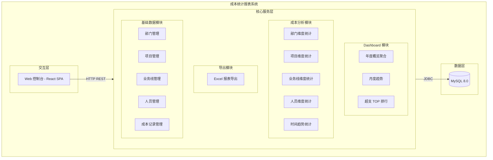
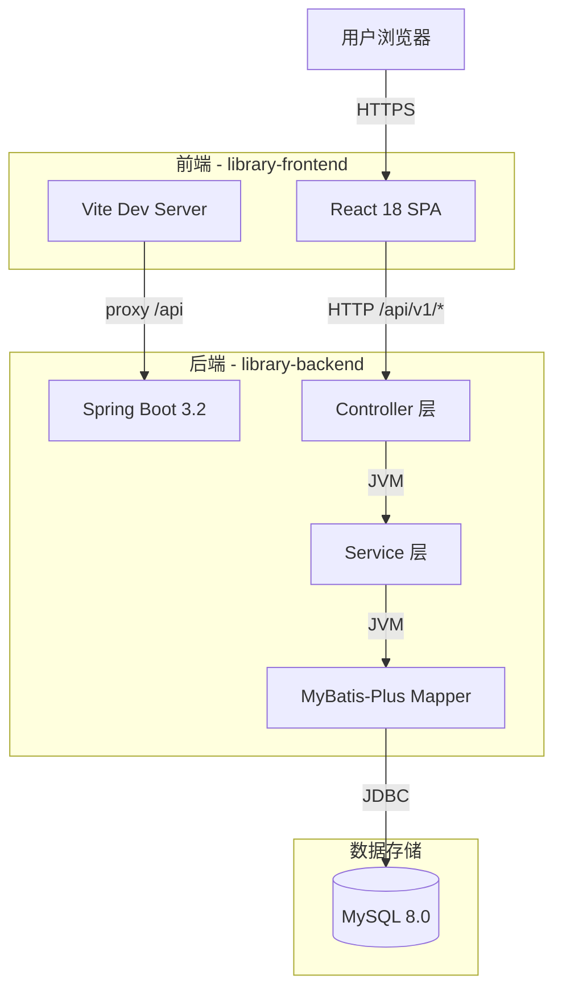
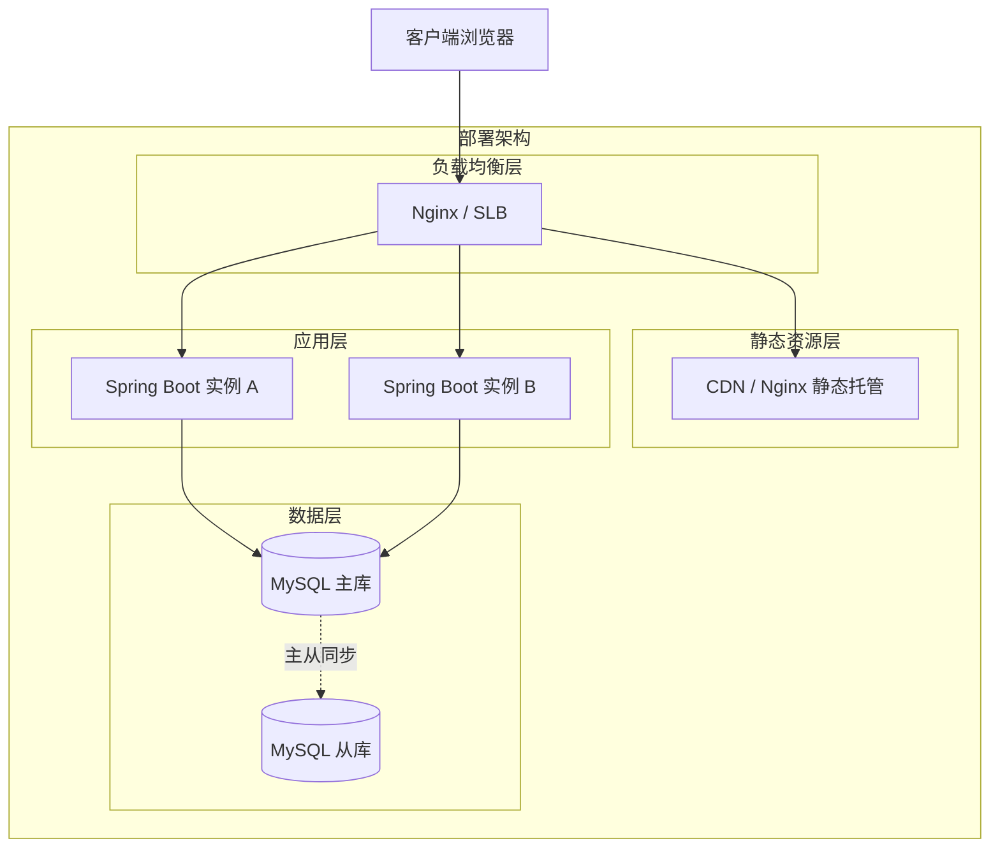
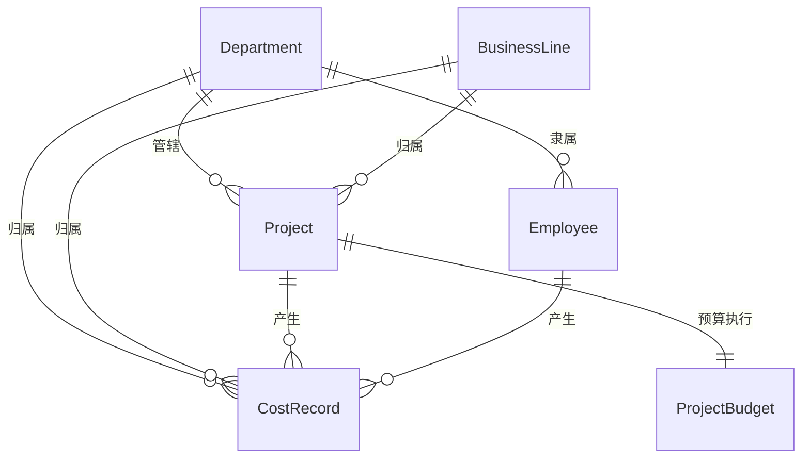
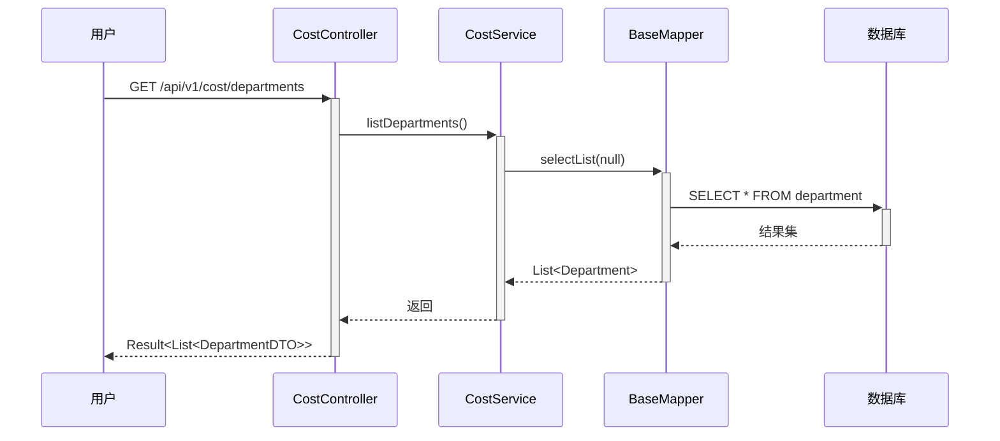
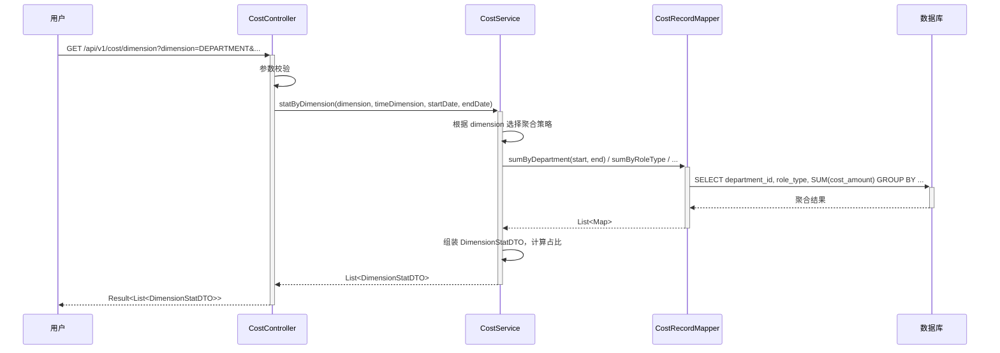
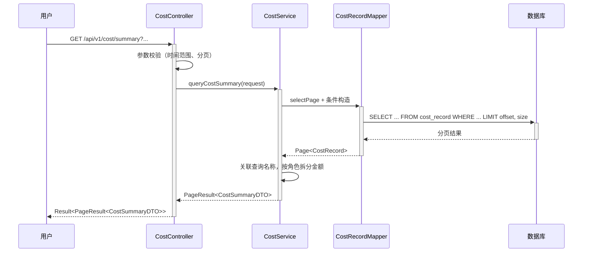
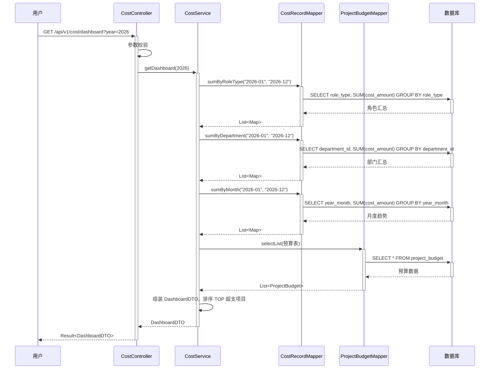
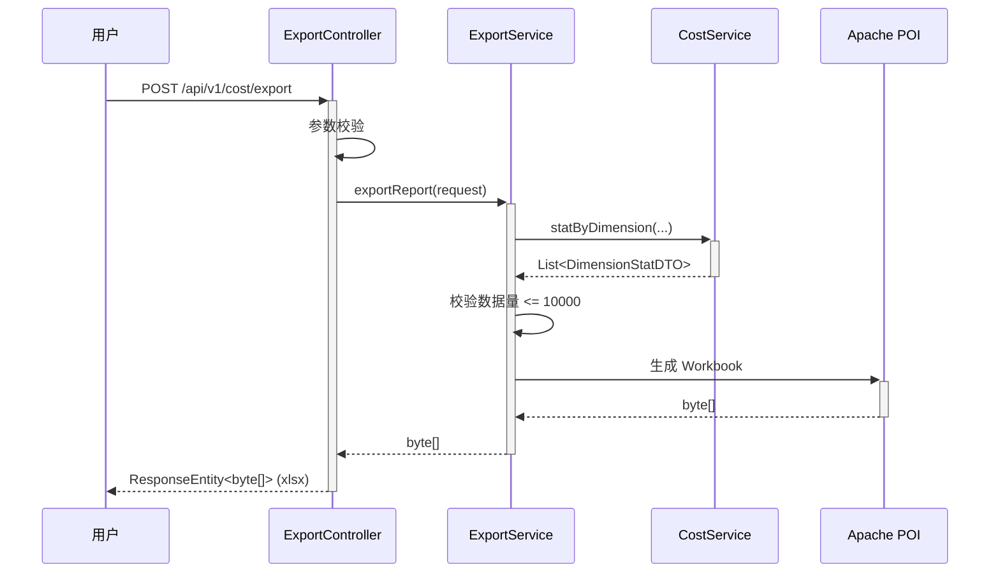

> **文档元信息**
>
> | 项目 | 内容 |
> |------|------|
> | 文档版本 | v1.0 |
> | 作者 | DTCoder |
> | 创建日期 | 2025-08-14 |
> | 需求来源 | `.agents/specs/20260814-开发一个成本统计报表 用于统计企业各项成.md` |
> | 评审状态 | 待评审 |

# 成本统计报表 系分设计

## 1. 需求与范围

### 背景与目标

企业需要对各项成本支出进行系统化统计与分析，以支撑经营决策。当前缺少统一的成本可视化分析平台，各部门/项目/业务线的成本数据分散，无法快速掌握人力成本与项目预算执行情况。

**目标**：构建企业级成本统计报表系统，包含前端 Dashboard 概览页与多维度成本分析页，支持按部门、项目、业务线、人员、时间（月/季/年）等维度统计人力成本（开发/测试/产品/运维）和项目成本（预算、实际消耗、预算占比、预计超支），并提供报表导出能力。

### 核心功能

1. **Dashboard 概览**：年度成本总览，含总成本、人力成本、项目预算/消耗汇总卡片；按角色/部门分布饼图/柱状图；月度趋势折线图；超支 TOP 项目排行表。
2. **多维度成本分析**：支持部门、项目、业务线、人员、时间趋势五个维度的成本统计，每个维度提供图表可视化 + 数据表格。
3. **人力成本分类**：按角色类型（开发/测试/产品/运维）拆分统计。
4. **项目成本管理**：展示项目预算、实际消耗、预算占比、预计超支金额。
5. **报表导出**：支持按维度、时间范围导出 Excel（.xlsx）报表。

### 约束与非功能要求

- 前后端分离架构，RESTful API 通信
- 金额精度：BigDecimal，2 位小数
- 导出格式：.xlsx
- 时间维度枚举：MONTH / QUARTER / YEAR
- 前端路由前缀：`/cost`
- API 基础路径：`/api/v1`

### 排除范围

- 不涉及权限认证体系（假设已有统一认证或本期不做）
- 不涉及成本数据的自动采集（数据由管理员手动维护或外部导入）
- 不涉及审批流程
- 不涉及消息通知

### 需求功能清单与优先级

| 编号 | 功能点 | 优先级 | PRD 原始描述/章节 | 备注 |
|------|--------|--------|-------------------|------|
| F01 | Dashboard 概览页 | P0 | 前端新建 Dashboard | 年度成本总览、统计卡片、图表 |
| F02 | 部门维度成本分析 | P0 | 按照不同维度展示和统计数据：涉及部门 | 含图表+表格 |
| F03 | 项目维度成本分析 | P0 | 项目成本（项目预算、实际消耗、预算占比、预计超支金额） | 含预算执行分析 |
| F04 | 业务线维度成本分析 | P0 | 按照不同维度展示和统计数据：涉及业务线 | 含图表+表格 |
| F05 | 人员维度成本分析 | P0 | 按照不同维度展示和统计数据：涉及人员 | 按角色分类 |
| F06 | 时间趋势分析 | P1 | 按照不同维度展示和统计数据：月份、季度、年度 | 支持月/季/年切换 |
| F07 | 人力成本分类统计 | P0 | 人力成本（开发、测试、产品、运维） | 按角色拆分 |
| F08 | 报表导出 | P1 | 支持报表导出 | Excel .xlsx 格式 |
| F09 | 维度筛选器 | P0 | 多维度展示 | 通用时间维度+范围筛选 |
| F10 | 基础数据管理 | P1 | 涉及部门、项目、业务线、人员 | 部门/项目/业务线/人员 CRUD（假设：基础数据由管理员维护） |

### 假设与待确认项

| 编号 | 假设/待确认内容 | 当前假设 | 确认状态 |
|------|-----------------|----------|----------|
| A01 | 权限认证方案 | 假设：本期不做认证，后续接入统一认证 | 待确认 |
| A02 | 成本数据来源 | 假设：cost_record 由管理员手动录入或批量导入 | 待确认 |
| A03 | 部门层级深度 | 假设：支持两级（parent_id），暂不做无限层级 | 待确认 |
| A04 | 导出报表行数上限 | 假设：单次导出不超过 10000 行 | 待确认 |
| A05 | 项目状态枚举 | 假设：ACTIVE / COMPLETED / SUSPENDED 三种 | 待确认 |
| A06 | 多租户隔离 | 假设：本期单租户，后续可扩展 tenant_id | 待确认 |

## 2. 架构与模块

### 功能架构



- **交互层**：React 18 SPA，通过 Axios 调用后端 RESTful API，使用 ECharts 进行图表可视化。
- **核心服务层**：
  - Dashboard 模块：聚合年度成本概览数据，提供统计卡片、分布图、趋势图、TOP 排行数据。
  - 成本分析模块：按部门/项目/业务线/人员/时间五个维度进行成本聚合统计。
  - 导出模块：根据筛选条件生成 Excel 文件并返回二进制流。
  - 基础数据模块：管理部门、项目、业务线、人员、成本记录等基础数据。
- **数据层**：MySQL 8.0 存储所有业务数据。

**模块清单**

| 模块 | 职责 | 依赖 |
|------|------|------|
| Dashboard 模块 | 年度成本概览聚合、趋势数据、TOP 排行 | 基础数据模块（读取成本记录） |
| 成本分析模块 | 多维度成本统计（部门/项目/业务线/人员/时间） | 基础数据模块（读取成本记录+维度数据） |
| 导出模块 | 按条件生成 Excel 报表 | 成本分析模块（获取统计数据） |
| 基础数据模块 | 部门/项目/业务线/人员/成本记录的 CRUD | 无 |

### 应用集成架构



**集成关系说明：**

| 调用方 | 被调用方 | 协议 | 接口类型 | 说明 |
|--------|----------|------|----------|------|
| 用户浏览器 | 前端 React SPA | HTTPS | 静态资源 + oneapi REST | 前端页面及 API 调用 |
| 前端 React SPA | 后端 Controller | HTTP | oneapi REST | `/api/v1/cost/*` 系列接口 |
| Vite Dev Server | 后端 Spring Boot | HTTP | proxy | 开发环境代理 `/api` → `localhost:8080` |
| Service 层 | MySQL | JDBC | SQL | MyBatis-Plus ORM 操作 |

### 部署架构



**部署说明：**
- **负载均衡层**：Nginx 或云 SLB，前端静态资源与后端 API 分流。
- **静态资源层**：前端构建产物（dist/）由 Nginx 或 CDN 托管。
- **应用层**：Spring Boot 无状态服务，至少 2 实例，支持水平扩展。
- **数据层**：MySQL 主从架构，读写分离可选。假设：公有云部署，使用 RDS。

## 3. 数据模型与存储

### 实体清单

| 实体名称 | 实体说明 | 所属模块 | 与其他实体的关系 |
|----------|----------|----------|-----------------|
| Department | 部门信息，支持两级层级 | 基础数据模块 | 一对多关联 Project、Employee |
| BusinessLine | 业务线信息 | 基础数据模块 | 一对多关联 Project、CostRecord |
| Project | 项目信息，含预算和状态 | 基础数据模块 | 多对一关联 Department、BusinessLine；一对多关联 CostRecord；一对一关联 ProjectBudget |
| Employee | 人员信息，含角色和月成本 | 基础数据模块 | 多对一关联 Department；一对多关联 CostRecord |
| CostRecord | 人力成本按月记录 | 成本分析模块 | 多对一关联 Employee、Project、Department、BusinessLine |
| ProjectBudget | 项目预算执行情况 | Dashboard 模块 | 一对一关联 Project |

### 实体关系图



**模型说明：**
- Department 通过 parent_id 实现两级层级（假设：暂不支持无限层级）。
- CostRecord 是核心事实表，冗余存储 department_id、business_line_id、role_type 以提升查询性能（避免多表 JOIN）。
- ProjectBudget 与 Project 一对一，记录预算执行汇总数据，由系统定期或实时计算更新。

## 4. 接口设计

### 4.1 oneapi（Web 控制台接口）

| 编号 | 接口名称 | 方法 | 路径 | 模块 |
|------|----------|------|------|------|
| W01 | 成本汇总查询 | GET | /api/v1/cost/summary | 成本分析模块 |
| W02 | Dashboard 概览 | GET | /api/v1/cost/dashboard | Dashboard 模块 |
| W03 | 维度统计 | GET | /api/v1/cost/dimension | 成本分析模块 |
| W04 | 项目成本详情 | GET | /api/v1/cost/project | 成本分析模块 |
| W05 | 报表导出 | POST | /api/v1/cost/export | 导出模块 |
| W06 | 部门列表 | GET | /api/v1/cost/departments | 基础数据模块 |
| W07 | 项目列表 | GET | /api/v1/cost/projects | 基础数据模块 |
| W08 | 业务线列表 | GET | /api/v1/cost/business-lines | 基础数据模块 |
| W09 | 人员列表 | GET | /api/v1/cost/employees | 基础数据模块 |

### 4.2 OpenAPI（对外接口）

本项不适用，原因：本期无对外 OpenAPI 需求，仅内部 Web 控制台使用。

### 4.3 内部接口（Service 层）

| 编号 | 接口名称 | 类 | 方法签名 |
|------|----------|------|----------|
| S01 | 查询成本汇总 | CostService | `PageResult<CostSummaryDTO> queryCostSummary(CostQueryRequest request)` |
| S02 | 获取 Dashboard 数据 | CostService | `DashboardDTO getDashboard(Integer year)` |
| S03 | 按维度统计 | CostService | `List<DimensionStatDTO> statByDimension(String dimension, String timeDimension, String startDate, String endDate)` |
| S04 | 查询项目成本 | CostService | `List<ProjectCostDTO> queryProjectCost(Long projectId, Integer year)` |
| S05 | 导出报表 | ExportService | `byte[] exportReport(ExportRequest request)` |

### 4.4 集成接口（Integration 层）

本项不适用，原因：本期无外部系统集成需求。

## 5. 功能模块设计

### 全局约定

- **错误码格式**：`{MODULE}_{SEQ}`，如 `COST_001`、`EXPORT_001`
- **通用出参结构**：`{ code: int, message: String, data: T }`
- **分页出参结构**：`{ total: long, page: int, size: int, records: List<T> }`
- **金额类型**：后端 `BigDecimal`（精度 2 位），前端 `number` + `formatMoney()` 格式化

---

### 5.1 基础数据模块

#### 5.1.1 表结构设计

##### 5.1.1.1 department（部门表）

| 字段名 | 数据类型 | 约束 | 默认值 | 说明 |
|--------|----------|------|--------|------|
| id | bigint | PK, 自增 | - | 系统自增主键 |
| name | varchar(100) | NOT NULL | - | 部门名称 |
| parent_id | bigint | NOT NULL | 0 | 上级部门 ID，0 表示顶级 |
| gmt_create | datetime | NOT NULL | CURRENT_TIMESTAMP | 创建时间 |
| gmt_modified | datetime | NOT NULL | CURRENT_TIMESTAMP ON UPDATE | 修改时间 |

**索引：**
- IDX: `idx_department_parent_id` (parent_id)

##### 5.1.1.2 business_line（业务线表）

| 字段名 | 数据类型 | 约束 | 默认值 | 说明 |
|--------|----------|------|--------|------|
| id | bigint | PK, 自增 | - | 系统自增主键 |
| name | varchar(100) | NOT NULL | - | 业务线名称 |
| gmt_create | datetime | NOT NULL | CURRENT_TIMESTAMP | 创建时间 |
| gmt_modified | datetime | NOT NULL | CURRENT_TIMESTAMP ON UPDATE | 修改时间 |

**索引：**
- UK: `uk_business_line_name` (name)

##### 5.1.1.3 project（项目表）

| 字段名 | 数据类型 | 约束 | 默认值 | 说明 |
|--------|----------|------|--------|------|
| id | bigint | PK, 自增 | - | 系统自增主键 |
| name | varchar(200) | NOT NULL | - | 项目名称 |
| department_id | bigint | NOT NULL | - | 所属部门 ID |
| business_line_id | bigint | NULL | - | 所属业务线 ID |
| budget | decimal(15,2) | NOT NULL | 0 | 项目预算金额 |
| status | varchar(20) | NOT NULL | ACTIVE | 项目状态 |
| gmt_create | datetime | NOT NULL | CURRENT_TIMESTAMP | 创建时间 |
| gmt_modified | datetime | NOT NULL | CURRENT_TIMESTAMP ON UPDATE | 修改时间 |

**索引：**
- IDX: `idx_project_dept` (department_id)
- IDX: `idx_project_biz` (business_line_id)
- IDX: `idx_project_status` (status)

##### 5.1.1.4 employee（人员表）

| 字段名 | 数据类型 | 约束 | 默认值 | 说明 |
|--------|----------|------|--------|------|
| id | bigint | PK, 自增 | - | 系统自增主键 |
| name | varchar(50) | NOT NULL | - | 人员姓名 |
| department_id | bigint | NOT NULL | - | 所属部门 ID |
| role_type | varchar(20) | NOT NULL | - | 角色类型：DEV/TEST/PRODUCT/OPS |
| monthly_cost | decimal(12,2) | NOT NULL | 0 | 月度人力成本 |
| gmt_create | datetime | NOT NULL | CURRENT_TIMESTAMP | 创建时间 |
| gmt_modified | datetime | NOT NULL | CURRENT_TIMESTAMP ON UPDATE | 修改时间 |

**索引：**
- IDX: `idx_employee_dept` (department_id)
- IDX: `idx_employee_role` (role_type)

##### 5.1.1.5 枚举与常量定义

| 枚举名称 | 取值 | 含义 | 关联字段 |
|----------|------|------|----------|
| RoleType | DEV | 开发 | employee.role_type, cost_record.role_type |
| RoleType | TEST | 测试 | employee.role_type, cost_record.role_type |
| RoleType | PRODUCT | 产品 | employee.role_type, cost_record.role_type |
| RoleType | OPS | 运维 | employee.role_type, cost_record.role_type |
| ProjectStatus | ACTIVE | 进行中 | project.status |
| ProjectStatus | COMPLETED | 已完成 | project.status |
| ProjectStatus | SUSPENDED | 已暂停 | project.status |

#### 5.1.2 接口详细设计

##### W06 部门列表

- **URI**: GET /api/v1/cost/departments
- **描述**: 获取部门列表（用于筛选器下拉）
- **入参**: 无
- **出参**:

| 参数名称 | 类型 | 描述 |
|----------|------|------|
| code | int | 状态码 |
| message | String | 提示信息 |
| data | List | 部门列表 |
| data[].id | Long | 部门 ID |
| data[].name | String | 部门名称 |
| data[].parentId | Long | 上级部门 ID |

- **请求示例**:
```
GET /api/v1/cost/departments
```

- **响应示例**:
```json
{
  "code": 200,
  "message": "success",
  "data": [
    { "id": 1, "name": "技术部", "parentId": 0 },
    { "id": 2, "name": "产品部", "parentId": 0 }
  ]
}
```

##### W07 项目列表 / W08 业务线列表 / W09 人员列表

结构与 W06 类似，返回对应实体的 id + name 列表，用于前端筛选器下拉选择。

#### 5.1.3 子功能详细设计

##### 5.1.3.1 基础数据查询（F10）

- 处理时序图


**业务规则：**
| 规则编号 | 规则描述 | 校验时机 | 不满足时的处理 |
|----------|----------|----------|--------------|
| R01 | 返回列表按 name 升序排列 | 始终 | - |

**异常场景：**
| 异常场景 | 处理方式 |
|----------|----------|
| 数据库连接异常 | 返回 500 错误码，提示"系统繁忙" |

**并发控制**：无并发风险，原因：纯读操作。

---

### 5.2 成本分析模块

#### 5.2.1 表结构设计

##### 5.2.1.1 cost_record（成本记录表）

| 字段名 | 数据类型 | 约束 | 默认值 | 说明 |
|--------|----------|------|--------|------|
| id | bigint | PK, 自增 | - | 系统自增主键 |
| employee_id | bigint | NOT NULL | - | 人员 ID |
| project_id | bigint | NULL | - | 项目 ID（可为空表示非项目投入） |
| year_month | varchar(7) | NOT NULL | - | 年月，格式 2026-01 |
| cost_amount | decimal(12,2) | NOT NULL | - | 成本金额 |
| role_type | varchar(20) | NOT NULL | - | 角色类型（冗余） |
| department_id | bigint | NOT NULL | - | 部门 ID（冗余） |
| business_line_id | bigint | NULL | - | 业务线 ID（冗余） |
| gmt_create | datetime | NOT NULL | CURRENT_TIMESTAMP | 创建时间 |
| gmt_modified | datetime | NOT NULL | CURRENT_TIMESTAMP ON UPDATE | 修改时间 |

**索引：**
- IDX: `idx_cost_record_ym` (year_month)
- IDX: `idx_cost_record_dept` (department_id)
- IDX: `idx_cost_record_proj` (project_id)
- IDX: `idx_cost_record_emp` (employee_id)
- IDX: `idx_cost_record_biz` (business_line_id)
- IDX: `idx_cost_record_role` (role_type)
- 联合索引: `idx_cost_record_ym_dept` (year_month, department_id)
- 联合索引: `idx_cost_record_ym_proj` (year_month, project_id)

**设计说明**：冗余 department_id、business_line_id、role_type 字段，避免聚合查询时多表 JOIN，提升查询性能。

#### 5.2.1.2 枚举与常量定义

| 枚举名称 | 取值 | 含义 | 关联字段 |
|----------|------|------|----------|
| TimeDimension | MONTH | 月度 | 查询参数 |
| TimeDimension | QUARTER | 季度 | 查询参数 |
| TimeDimension | YEAR | 年度 | 查询参数 |
| DimensionType | DEPARTMENT | 按部门 | 查询参数 |
| DimensionType | PROJECT | 按项目 | 查询参数 |
| DimensionType | BUSINESS_LINE | 按业务线 | 查询参数 |
| DimensionType | EMPLOYEE | 按人员 | 查询参数 |

#### 5.2.2 接口详细设计

##### W01 成本汇总查询

- **URI**: GET /api/v1/cost/summary
- **描述**: 分页查询成本汇总数据，支持多维度筛选
- **入参**:

| 参数名称 | 类型 | 是否必填 | 描述 |
|----------|------|----------|------|
| departmentId | Long | 否 | 部门 ID |
| projectId | Long | 否 | 项目 ID |
| businessLineId | Long | 否 | 业务线 ID |
| employeeId | Long | 否 | 人员 ID |
| timeDimension | String | 是 | 时间维度：MONTH/QUARTER/YEAR |
| startDate | String | 是 | 开始时间，格式 2026-01 |
| endDate | String | 是 | 结束时间，格式 2026-12 |
| page | Integer | 否 | 页码，默认 1 |
| size | Integer | 否 | 每页条数，默认 20 |

- **出参**:

| 参数名称 | 类型 | 描述 |
|----------|------|------|
| code | int | 状态码 |
| message | String | 提示信息 |
| data | PageResult | 分页数据 |
| data.records[].period | String | 时间周期 |
| data.records[].departmentName | String | 部门名称 |
| data.records[].projectName | String | 项目名称 |
| data.records[].businessLineName | String | 业务线名称 |
| data.records[].employeeName | String | 人员名称 |
| data.records[].roleType | String | 角色类型 |
| data.records[].devCost | BigDecimal | 开发成本 |
| data.records[].testCost | BigDecimal | 测试成本 |
| data.records[].productCost | BigDecimal | 产品成本 |
| data.records[].opsCost | BigDecimal | 运维成本 |
| data.records[].totalCost | BigDecimal | 总成本 |

- **错误码**:

| 错误码 | 说明 |
|--------|------|
| COST_001 | 时间范围参数不合法 |
| COST_002 | 时间维度枚举值不合法 |

- **请求示例**:
```
GET /api/v1/cost/summary?timeDimension=MONTH&startDate=2026-01&endDate=2026-06&departmentId=1&page=1&size=20
```

- **响应示例**:
```json
{
  "code": 200,
  "message": "success",
  "data": {
    "total": 50,
    "page": 1,
    "size": 20,
    "records": [
      {
        "period": "2026-01",
        "departmentName": "技术部",
        "projectName": "项目A",
        "businessLineName": "金融线",
        "employeeName": "张三",
        "roleType": "DEV",
        "devCost": 25000.00,
        "testCost": 0,
        "productCost": 0,
        "opsCost": 0,
        "totalCost": 25000.00
      }
    ]
  }
}
```

##### W03 维度统计

- **URI**: GET /api/v1/cost/dimension
- **描述**: 按指定维度聚合统计成本数据
- **入参**:

| 参数名称 | 类型 | 是否必填 | 描述 |
|----------|------|----------|------|
| dimension | String | 是 | 维度：DEPARTMENT/PROJECT/BUSINESS_LINE/EMPLOYEE |
| timeDimension | String | 是 | 时间维度：MONTH/QUARTER/YEAR |
| startDate | String | 否 | 开始时间 |
| endDate | String | 否 | 结束时间 |

- **出参**:

| 参数名称 | 类型 | 描述 |
|----------|------|------|
| data | List | 维度统计列表 |
| data[].dimensionId | Long | 维度 ID |
| data[].dimensionName | String | 维度名称 |
| data[].devCost | BigDecimal | 开发成本 |
| data[].testCost | BigDecimal | 测试成本 |
| data[].productCost | BigDecimal | 产品成本 |
| data[].opsCost | BigDecimal | 运维成本 |
| data[].totalCost | BigDecimal | 总成本 |
| data[].percentage | BigDecimal | 占比（%） |

- **请求示例**:
```
GET /api/v1/cost/dimension?dimension=DEPARTMENT&timeDimension=MONTH&startDate=2026-01&endDate=2026-12
```

##### W04 项目成本详情

- **URI**: GET /api/v1/cost/project
- **描述**: 查询项目预算执行情况
- **入参**:

| 参数名称 | 类型 | 是否必填 | 描述 |
|----------|------|----------|------|
| projectId | Long | 否 | 项目 ID，为空则查全部 |
| year | Integer | 是 | 统计年度 |

- **出参**:

| 参数名称 | 类型 | 描述 |
|----------|------|------|
| data | List | 项目成本列表 |
| data[].projectId | Long | 项目 ID |
| data[].projectName | String | 项目名称 |
| data[].departmentName | String | 所属部门 |
| data[].businessLineName | String | 所属业务线 |
| data[].budget | BigDecimal | 预算金额 |
| data[].actualCost | BigDecimal | 实际消耗 |
| data[].budgetRatio | BigDecimal | 预算占比（%） |
| data[].estimatedOverspend | BigDecimal | 预计超支金额 |

#### 5.2.3 子功能详细设计

##### 5.2.3.1 多维度成本统计（F02-F07）

- 处理时序图


**业务规则：**
| 规则编号 | 规则描述 | 校验时机 | 不满足时的处理 |
|----------|----------|----------|--------------|
| R01 | dimension 参数必须为合法枚举值 | 请求进入时 | 返回 COST_002 |
| R02 | startDate 必须 <= endDate | 请求进入时 | 返回 COST_001 |
| R03 | 占比计算：某维度 totalCost / 所有维度 totalCost 之和 * 100 | 聚合后 | 保留 2 位小数 |
| R04 | 按角色拆分：同一维度下按 role_type 分别 SUM | 聚合时 | 无数据时返回 0 |
| R05 | 季度聚合：year_month 转换为 Q1/Q2/Q3/Q4 后 GROUP BY | 聚合时 | - |
| R06 | 年度聚合：year_month 提取年份后 GROUP BY | 聚合时 | - |

**异常场景：**
| 异常场景 | 处理方式 |
|----------|----------|
| 时间范围内无数据 | 返回空列表，不报错 |
| 维度参数非法 | 返回 COST_002 错误码 |
| 数据库查询超时 | 返回 500，记录日志 |

**并发控制**：无并发风险，原因：纯读操作。

##### 5.2.3.2 成本汇总查询（F01 部分）

- 处理时序图


**业务规则：**
| 规则编号 | 规则描述 | 校验时机 | 不满足时的处理 |
|----------|----------|----------|--------------|
| R01 | 分页参数 page >= 1, size 1~100 | 请求进入时 | 默认修正为合法值 |
| R02 | 返回结果中 devCost/testCost/productCost/opsCost 按 role_type 分别 SUM | 组装时 | 无对应角色时为 0 |

---

### 5.3 Dashboard 模块

#### 5.3.1 表结构设计

##### 5.3.1.1 project_budget（项目预算执行表）

| 字段名 | 数据类型 | 约束 | 默认值 | 说明 |
|--------|----------|------|--------|------|
| id | bigint | PK, 自增 | - | 系统自增主键 |
| project_id | bigint | NOT NULL, UNIQUE | - | 项目 ID |
| total_budget | decimal(15,2) | NOT NULL | - | 总预算金额 |
| actual_cost | decimal(15,2) | NOT NULL | 0 | 实际消耗金额 |
| budget_ratio | decimal(5,2) | NOT NULL | 0 | 预算占比（%） |
| estimated_overspend | decimal(15,2) | NOT NULL | 0 | 预计超支金额 |
| gmt_create | datetime | NOT NULL | CURRENT_TIMESTAMP | 创建时间 |
| gmt_modified | datetime | NOT NULL | CURRENT_TIMESTAMP ON UPDATE | 修改时间 |

**索引：**
- UK: `uk_project_budget_project` (project_id)

#### 5.3.1.2 枚举与常量定义

本模块无额外枚举定义，复用基础数据模块的 RoleType 和 ProjectStatus。

#### 5.3.2 接口详细设计

##### W02 Dashboard 概览

- **URI**: GET /api/v1/cost/dashboard
- **描述**: 获取年度成本概览数据
- **入参**:

| 参数名称 | 类型 | 是否必填 | 描述 |
|----------|------|----------|------|
| year | Integer | 是 | 统计年度，如 2026 |

- **出参**:

| 参数名称 | 类型 | 描述 |
|----------|------|------|
| data.totalCost | BigDecimal | 年度总成本 |
| data.hrCost | BigDecimal | 人力成本合计 |
| data.projectTotalBudget | BigDecimal | 项目总预算 |
| data.projectTotalActual | BigDecimal | 项目实际消耗合计 |
| data.costByRole | Map<String, BigDecimal> | 按角色分类成本 |
| data.costByDepartment | Map<String, BigDecimal> | 按部门分类成本 |
| data.monthlyTrend | List | 月度趋势 |
| data.monthlyTrend[].month | String | 月份（2026-01） |
| data.monthlyTrend[].cost | BigDecimal | 当月成本 |
| data.topOverspendProjects | List | 超支 TOP 项目 |
| data.topOverspendProjects[].projectId | Long | 项目 ID |
| data.topOverspendProjects[].projectName | String | 项目名称 |
| data.topOverspendProjects[].budget | BigDecimal | 预算 |
| data.topOverspendProjects[].actualCost | BigDecimal | 实际消耗 |
| data.topOverspendProjects[].budgetRatio | BigDecimal | 预算占比 |
| data.topOverspendProjects[].estimatedOverspend | BigDecimal | 预计超支 |

- **错误码**:

| 错误码 | 说明 |
|--------|------|
| COST_003 | 年度参数不合法 |

- **请求示例**:
```
GET /api/v1/cost/dashboard?year=2026
```

- **响应示例**:
```json
{
  "code": 200,
  "message": "success",
  "data": {
    "totalCost": 5000000.00,
    "hrCost": 4200000.00,
    "projectTotalBudget": 6000000.00,
    "projectTotalActual": 4800000.00,
    "costByRole": { "DEV": 2500000, "TEST": 800000, "PRODUCT": 600000, "OPS": 300000 },
    "costByDepartment": { "技术部": 3000000, "产品部": 1200000, "运维部": 800000 },
    "monthlyTrend": [
      { "month": "2026-01", "cost": 400000 },
      { "month": "2026-02", "cost": 420000 }
    ],
    "topOverspendProjects": [
      {
        "projectId": 1,
        "projectName": "项目A",
        "budget": 500000,
        "actualCost": 580000,
        "budgetRatio": 116.00,
        "estimatedOverspend": 80000
      }
    ]
  }
}
```

#### 5.3.3 子功能详细设计

##### 5.3.3.1 Dashboard 概览数据聚合（F01）

- 处理时序图


**业务规则：**
| 规则编号 | 规则描述 | 校验时机 | 不满足时的处理 |
|----------|----------|----------|--------------|
| R01 | year 参数必须为 4 位合法年份 | 请求进入时 | 返回 COST_003 |
| R02 | totalCost = 所有 cost_record 在该年度的 SUM | 聚合时 | - |
| R03 | hrCost = totalCost（假设：本期仅人力成本） | 聚合时 | - |
| R04 | topOverspendProjects 按 estimated_overspend 降序取 TOP 10 | 组装时 | - |
| R05 | costByRole/costByDepartment 的 key 为中文名称 | 组装时 | 需关联查询名称 |

**异常场景：**
| 异常场景 | 处理方式 |
|----------|----------|
| 该年度无任何数据 | 返回全零的 DashboardDTO |
| 预算表无记录 | topOverspendProjects 返回空列表 |

**并发控制**：无并发风险，原因：纯读操作。

---

### 5.4 导出模块

#### 5.4.1 表结构设计

本模块无独立表，复用 cost_record 和 project_budget 数据。

#### 5.4.1.1 枚举与常量定义

本模块无额外枚举定义。

#### 5.4.2 接口详细设计

##### W05 报表导出

- **URI**: POST /api/v1/cost/export
- **描述**: 按条件导出成本报表 Excel 文件
- **入参**:

| 参数名称 | 类型 | 是否必填 | 描述 |
|----------|------|----------|------|
| dimension | String | 是 | 导出维度：DEPARTMENT/PROJECT/BUSINESS_LINE/EMPLOYEE |
| timeDimension | String | 否 | 时间维度 |
| startDate | String | 否 | 开始时间 |
| endDate | String | 否 | 结束时间 |
| filters | Object | 否 | 额外筛选条件 |

- **出参**: HTTP Response，Content-Type: `application/vnd.openxmlformats-officedocument.spreadsheetml.sheet`
- **错误码**:

| 错误码 | 说明 |
|--------|------|
| EXPORT_001 | 导出维度不合法 |
| EXPORT_002 | 导出数据量为空 |
| EXPORT_003 | 导出数据超过上限（10000 行） |

- **请求示例**:
```json
{
  "dimension": "DEPARTMENT",
  "timeDimension": "MONTH",
  "startDate": "2026-01",
  "endDate": "2026-06"
}
```

- **响应**: 二进制文件流（.xlsx）

#### 5.4.3 子功能详细设计

##### 5.4.3.1 Excel 报表导出（F08）

- 处理时序图


**业务规则：**
| 规则编号 | 规则描述 | 校验时机 | 不满足时的处理 |
|----------|----------|----------|--------------|
| R01 | 导出数据不超过 10000 行 | 查询后 | 返回 EXPORT_003 |
| R02 | 数据为空时不允许导出 | 查询后 | 返回 EXPORT_002 |
| R03 | Excel 表头根据维度动态生成 | 生成时 | - |
| R04 | 金额列格式化为 2 位小数 | 生成时 | - |

**异常场景：**
| 异常场景 | 处理方式 |
|----------|----------|
| POI 生成异常（OOM） | 捕获异常，返回 500，记录日志 |
| 数据量超限 | 返回 EXPORT_003，提示缩小范围 |

**并发控制**：
- 并发场景：多人同时导出大报表
- 控制策略：假设：本期不做限流，后续可加导出任务队列。当前通过数据量上限（10000 行）控制单次导出耗时。

---

## 6. 非功能性需求设计

### 6.1 高可用性

- 后端 Spring Boot 无状态设计，支持多实例部署，单实例故障不影响整体服务。
- MySQL 采用主从架构，主库故障时可切换从库（读操作）。
- 前端静态资源由 CDN/Nginx 托管，不依赖后端可用性。
- 导出功能异常时降级返回错误提示，不影响其他查询功能。

### 6.2 可扩展性

- 水平扩展：后端服务无状态，可通过增加实例 + 负载均衡实现水平扩展。
- 维度扩展：新增统计维度只需在 DimensionType 枚举中添加值，并在 Service 层增加对应聚合策略。
- 数据库扩展：cost_record 表数据量增长后，可按 year_month 分区或分表。
- 前端组件化：图表组件（CostChart）、筛选器（DimensionFilter）均为通用组件，新增维度页面可复用。

### 6.3 稳定性/可靠性

- 聚合查询使用索引优化（year_month + dimension_id 联合索引），避免全表扫描。
- 导出功能设置数据量上限（10000 行），防止 OOM。
- 金额计算统一使用 BigDecimal，避免浮点精度丢失。
- 分页查询限制 size 上限（100），防止单次查询数据量过大。

### 6.4 安全性设计

#### 6.4.1 账户系统方案

假设：本期不实现认证体系，后续接入企业统一认证（如 SSO/OAuth）。

#### 6.4.2 授权&访问控制

##### 6.4.2.1 水平权限检查

假设：本期不实现水平权限隔离，所有登录用户可查看全部成本数据。后续可按部门维度实现数据权限。

##### 6.4.2.2 垂直权限检查

假设：本期不实现角色权限控制，后续可接入 RBAC。

##### 6.4.2.3 登录态检查

假设：本期不检查登录态，后续通过全局拦截器统一校验。

#### 6.4.3 数据防护方案

##### 6.4.3.1 敏感数据加密存储

本项不适用，原因：成本数据不涉及个人敏感信息（身份证、银行卡等），人员姓名不属于高敏感数据。

##### 6.4.3.2 敏感数据展示脱敏

本项不适用，原因：报表展示的成本数据无需脱敏。假设：后续如需隐藏具体人员薪资，可增加脱敏策略。

### 6.5 监控/统计/日志/告警

- **接口监控**：记录每个 API 的调用次数、响应时间、错误率。
- **慢查询监控**：MyBatis-Plus 开启 SQL 日志，超过 1s 的查询记录告警。
- **导出监控**：记录导出操作的维度、数据量、耗时。
- **异常告警**：5xx 错误率超过阈值时触发告警。
- **日志规范**：关键操作（导出、异常）记录 INFO/ERROR 日志，包含请求参数和耗时。

## 7. 变更三板斧

### 7.1 可监控

- **服务埋点**：
  - 每个 Controller 方法记录入参摘要、响应码、耗时（ms）。
  - Service 层关键聚合操作记录数据行数、耗时。
  - 导出操作记录维度类型、数据量、生成耗时。
- **三方服务埋点**：本期无外部三方服务调用。
- **关键指标**：
  - API QPS / 响应时间 P99 / 错误率
  - 导出成功率 / 平均耗时
  - 数据库慢查询数量

### 7.2 可灰度

- 本期为全新功能，无旧逻辑需要灰度切换。
- 假设：上线后可通过 Nginx 路由规则按部门/用户灰度放量（前端路由 `/cost` 可控）。
- 数据库为全新表，无兼容性问题。

### 7.3 可应急

- **开关控制**：假设：前端路由可通过配置开关是否展示成本分析入口。
- **发布回滚**：
  - 后端回滚：新接口全部返回 404，不影响其他功能（无旧接口依赖）。
  - 前端回滚：移除 `/cost` 路由即可。
  - 数据库回滚：新表无数据依赖，可直接 DROP（如有数据需提前备份）。
- **应急操作优先级**：
  1. 前端关闭入口（秒级）
  2. 后端接口降级返回空数据（分钟级）
  3. 服务回滚（需发布流程）
