> **文档元信息**
>
> | 项目 | 内容 |
> |------|------|
> | 文档版本 | v1.0 |
> | 作者 | DTCoder (AI) |
> | 创建日期 | 2025-07-24 |
> | 需求来源 | .agents/specs/${system.dima}.md + .agents/specs/20260814-分别写三个接口helloworld、哈希.md |
> | 评审状态 | 待评审 |

# 多功能演示页面 + 埋点报表系统 系分设计

## 1. 需求与范围

### 背景与目标

在图书管理系统中新增「功能演示」模块，提供 HelloWorld、哈希算法、冒泡排序三个后端演示接口，前端通过 Tab 页面展示各接口执行结果并支持 Excel 导出。后端通过 AOP 切面对接口调用进行埋点记录（调用次数、调用者信息），前端在同一页面以可视化报表（折线图、饼图、柱状图）展示调用统计，支持按人员类型、人员层级、人员部门等多维度筛选。

**涉及仓库**：library-frontend（前端 React）、library-backend（后端 Spring Boot）

### 核心功能

1. 三个后端演示接口（HelloWorld / 哈希算法 / 冒泡排序）
2. 前端 Tab 页面，三个 Tab 分别展示各接口执行结果
3. 每个 Tab 支持导出当前展示结果为 Excel 文件
4. 后端 AOP 埋点自动记录接口调用日志（调用者、调用时间、耗时等）
5. 前端可视化报表展示调用统计（折线图/饼图/柱状图），支持多维度筛选

### 约束与非功能要求

| 项目 | 要求 |
|------|------|
| 接口响应时间 | 演示接口 < 500ms，统计接口 < 2s |
| 导出文件大小 | 单次导出不超过 10000 条记录 |
| 埋点写入 | 异步写入，不影响主接口性能 |
| 浏览器兼容 | Chrome 90+, Edge 90+, Firefox 90+ |
| 统一响应结构 | `{ code, message, data }` |
| 时间格式 | 日期 `yyyy-MM-dd`，时间戳 ISO 8601 |

### 排除范围

- 不涉及图书管理系统已有功能的修改
- 不涉及用户认证/鉴权系统的新建（复用现有认证体系）
- 不涉及国际化多语言支持
- 不涉及移动端适配

### 需求功能清单与优先级

| 编号 | 功能点 | 优先级 | PRD 原始描述/章节 | 备注 |
|------|--------|--------|-------------------|------|
| F01 | HelloWorld 接口 | P0 | "分别写三个接口helloworld" | 接收 name 参数，返回问候语 |
| F02 | 哈希算法接口 | P0 | "哈希算法" | 支持 MD5/SHA1/SHA256/SHA512 |
| F03 | 冒泡排序接口 | P0 | "冒泡排序" | 支持升序/降序，返回交换次数 |
| F04 | 前端 Tab 展示页 | P0 | "前端新增一个页面，有三个tab分别展示不同的执行结果" | 三个 Tab 对应三个接口 |
| F05 | 数据导出 | P0 | "新增导出按钮，后台提供导出接口" | 导出 Excel (.xlsx) |
| F06 | 接口调用埋点 | P0 | "后端再做个埋点，获取调用次数和调用人" | AOP 切面异步写入 |
| F07 | 调用统计报表可视化 | P1 | "前端在当前页面上可视化出来一个报表" | 折线图/饼图/柱状图 |
| F08 | 多维度筛选 | P1 | "根据不同的维度：人员类型、人员层级、人员部门等" | 4 种维度 |
| F09 | 调用趋势分析 | P1 | "折线图以及饼图和柱状图不同展示形式" | 按日/周/月粒度 |

### 假设与待确认项

| 编号 | 假设/待确认内容 | 当前假设 | 确认状态 |
|------|-----------------|----------|----------|
| A01 | 用户信息来源 | 假设：从现有认证系统 SecurityContext/Token 获取调用者信息（caller_id, caller_name, person_type, person_level, department），兜底方案为请求头模拟用户 | 待确认 |
| A02 | 数据库环境 | 假设：已有 MySQL 8.x 实例可用，库名 library_demo | 待确认 |
| A03 | 前端项目脚手架 | 假设：前端为全新项目，需从零搭建 React + TypeScript + Vite 骨架 | 待确认 |
| A04 | 后端项目脚手架 | 假设：后端为全新项目，需从零搭建 Spring Boot 3.x 骨架 | 待确认 |
| A05 | 导出记录范围 | 假设：导出支持选择性导出（指定 recordIds）和全量导出两种模式 | 待确认 |
| A06 | 埋点数据保留策略 | 假设：暂不做自动清理，后续按需增加数据归档策略 | 待确认 |

---

## 2. 架构与模块

### 功能架构

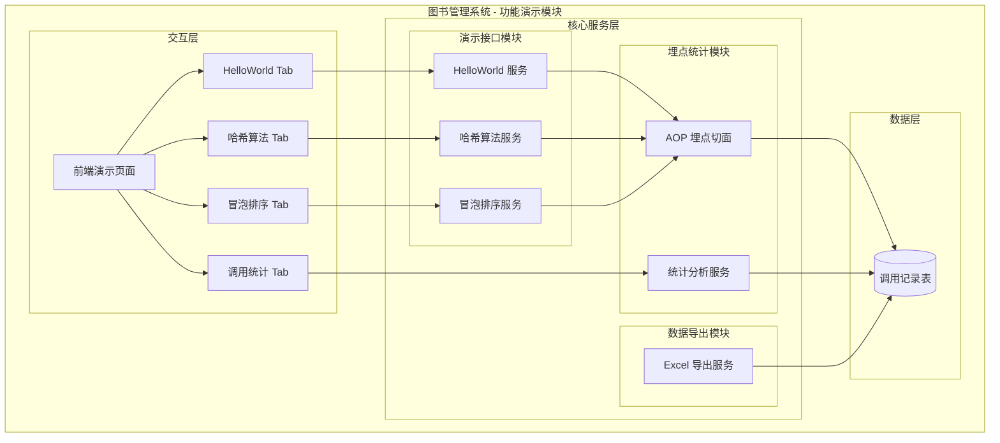

- **交互层说明**：前端 React 页面，4 个 Tab 分别承载三个演示接口调用和调用统计报表可视化
- **核心服务层说明**：
  - 演示接口模块：提供 HelloWorld、哈希算法、冒泡排序三个业务逻辑服务
  - 数据导出模块：基于 Apache POI 生成 Excel 文件流
  - 埋点统计模块：AOP 切面自动拦截接口调用并异步写入日志，统计服务提供多维度聚合查询
- **数据层说明**：MySQL 存储调用记录，支撑导出和统计查询

**模块清单**

| 模块 | 职责 | 依赖 |
|------|------|------|
| 演示接口模块 | 提供 HelloWorld / 哈希算法 / 冒泡排序三个接口的核心业务逻辑 | 无外部依赖 |
| 数据导出模块 | 根据接口类型和记录 ID 生成 Excel 文件流 | 依赖埋点统计模块的调用记录数据 |
| 埋点统计模块 | AOP 切面自动埋点 + 多维度统计聚合查询 | 依赖 MySQL 数据库 |
| 前端展示模块 | Tab 页面、结果展示、导出触发、图表可视化 | 依赖后端所有接口 |

### 应用集成架构

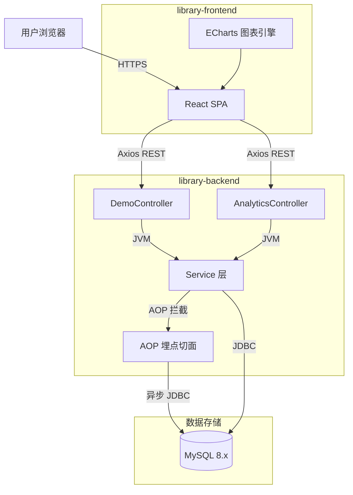

**集成关系说明：**

| 调用方 | 被调用方 | 协议 | 接口类型 | 说明 |
|--------|----------|------|----------|------|
| 用户浏览器 | React SPA | HTTPS | 静态资源 | 前端页面加载 |
| React SPA | DemoController | HTTPS | REST (oneapi) | 三个演示接口 + 导出接口，路径前缀 `/api/demo` |
| React SPA | AnalyticsController | HTTPS | REST (oneapi) | 统计查询接口，路径前缀 `/api/demo/analytics` |
| AOP 切面 | MySQL | JDBC | SQL | 异步写入调用记录 |
| Service 层 | MySQL | JDBC | SQL (MyBatis-Plus) | 查询调用记录用于导出和统计 |

### 部署架构

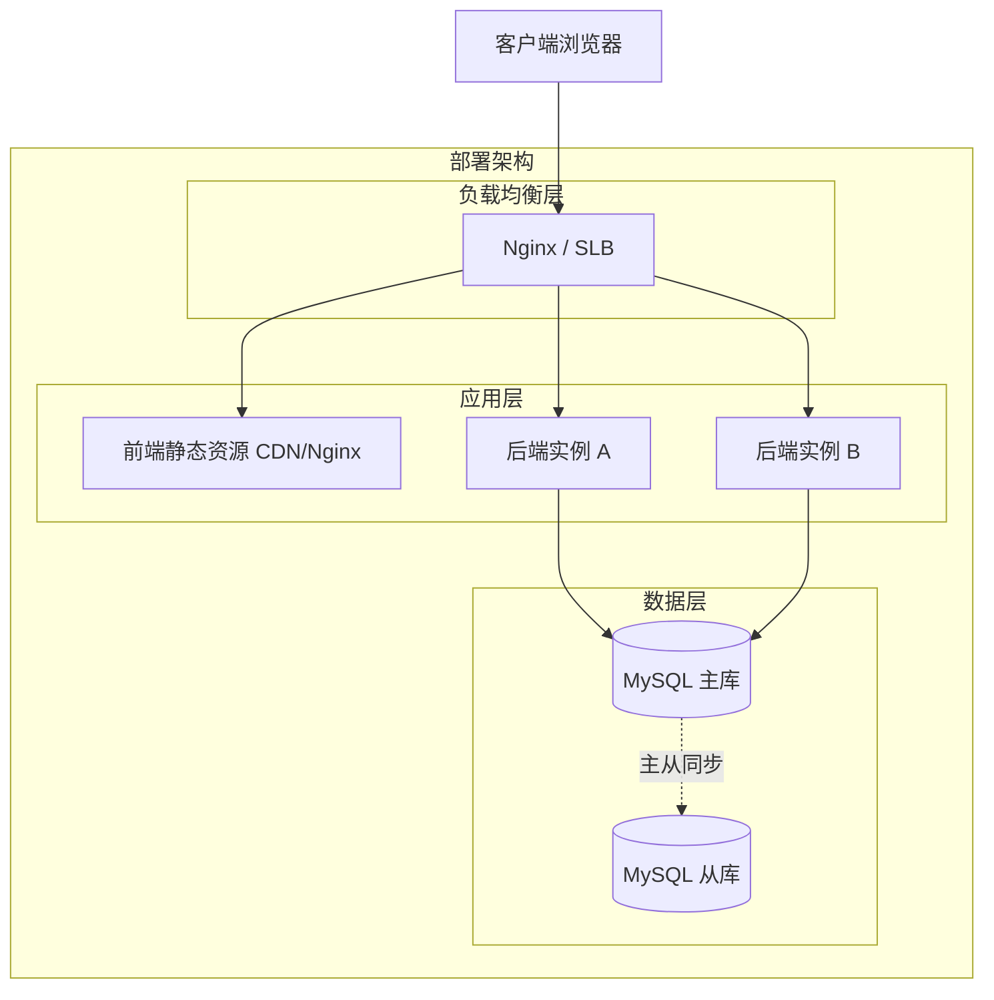

**部署说明：**
- **负载均衡层**：Nginx 或云 SLB，前端静态资源和后端 API 统一代理
- **应用层**：前端构建产物部署至 CDN 或 Nginx 静态目录；后端 Spring Boot 多实例部署（至少 2 副本保证高可用）
- **数据层**：MySQL 主从架构，主库写入、从库可用于统计查询分担读压力

假设：采用容器化部署（Docker + K8s），便于横向扩展。

---

## 3. 数据模型与存储

### 实体清单

| 实体名称 | 实体说明 | 所属模块 | 与其他实体的关系 |
|----------|----------|----------|-----------------|
| demo_call_log（调用记录） | 记录每次接口调用的完整信息（接口类型、调用者、请求参数、响应结果、耗时等） | 埋点统计模块 | 独立实体，无外键关联；通过 caller_id 逻辑关联用户体系 |

### 实体关系图

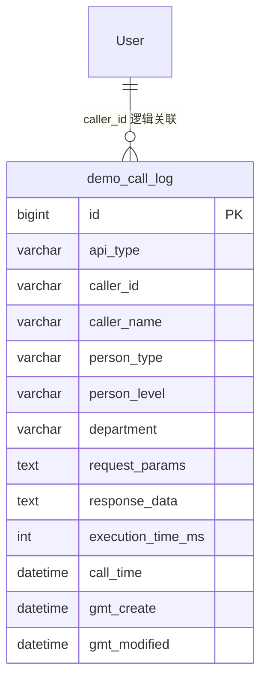

**模型说明：**
- `demo_call_log` 为本系统唯一新增实体，承载所有埋点数据
- 与用户体系通过 `caller_id` 逻辑关联（无物理外键），调用者的人员类型、层级、部门信息在埋点时冗余写入，便于后续统计聚合查询
- 遵循数据库规范：无外键、无存储过程、InnoDB 引擎、utf8mb4 编码、datetime 替代 timestamp

---

## 4. 接口设计

### 4.1 oneapi（Web 控制台接口）

| 编号 | 接口名称 | 方法 | 路径 | 模块 |
|------|----------|------|------|------|
| W01 | HelloWorld 接口 | POST | /api/demo/helloworld | 演示接口模块 |
| W02 | 哈希算法接口 | POST | /api/demo/hash | 演示接口模块 |
| W03 | 冒泡排序接口 | POST | /api/demo/bubble-sort | 演示接口模块 |
| W04 | 数据导出接口 | POST | /api/demo/export | 数据导出模块 |
| W05 | 调用统计汇总 | GET | /api/demo/analytics/summary | 埋点统计模块 |
| W06 | 调用趋势数据 | GET | /api/demo/analytics/trend | 埋点统计模块 |

### 4.2 OpenAPI（对外接口）

本项不适用，原因：本模块为内部功能演示，不对外暴露 OpenAPI。

### 4.3 内部接口（Service 层）

| 编号 | 接口名称 | 类 | 方法签名 |
|------|----------|------|----------|
| S01 | HelloWorld 业务 | HelloWorldService | `HelloWorldResult greet(HelloWorldRequest request)` |
| S02 | 哈希算法业务 | HashService | `HashResult hash(HashRequest request)` |
| S03 | 冒泡排序业务 | BubbleSortService | `BubbleSortResult sort(BubbleSortRequest request)` |
| S04 | Excel 导出 | ExportService | `void export(ExportRequest request, OutputStream out)` |
| S05 | 统计汇总查询 | AnalyticsService | `AnalyticsSummary getSummary(AnalyticsQuery query)` |
| S06 | 趋势数据查询 | AnalyticsService | `AnalyticsTrend getTrend(AnalyticsQuery query)` |
| S07 | 异步写入调用记录 | CallLogAspect | `void asyncSaveCallLog(JoinPoint joinPoint, Object result, long executionTimeMs)` |

### 4.4 集成接口（Integration 层）

本项不适用，原因：本模块不集成外部系统 API，所有数据自包含。

---

## 5. 功能模块设计

### 全局约定

| 约定项 | 约定值 |
|--------|--------|
| 错误码格式 | `DEMO_{SEQ}`，如 DEMO_001 |
| 通用出参结构 | `{ code: number, message: string, data: T }` |
| 统一响应包装类 | `DemoResponse<T>` |

**模块依赖拓扑排序**：演示接口模块 → 埋点统计模块 → 数据导出模块 → 前端展示模块

---

### 5.1 演示接口模块

#### 5.1.1 表结构设计

本模块无独立表结构，调用记录由埋点统计模块统一管理。

##### 5.1.1.1 枚举与常量定义

| 枚举名称 | 取值 | 含义 | 关联字段 |
|----------|------|------|----------|
| ApiType | HELLOWORLD | HelloWorld 接口 | demo_call_log.api_type |
| ApiType | HASH | 哈希算法接口 | demo_call_log.api_type |
| ApiType | BUBBLE_SORT | 冒泡排序接口 | demo_call_log.api_type |
| HashAlgorithm | MD5 | MD5 哈希算法（Java 名: MD5） | HashRequest.algorithm |
| HashAlgorithm | SHA1 | SHA-1 哈希算法（Java 名: SHA-1） | HashRequest.algorithm |
| HashAlgorithm | SHA256 | SHA-256 哈希算法（Java 名: SHA-256，默认） | HashRequest.algorithm |
| HashAlgorithm | SHA512 | SHA-512 哈希算法（Java 名: SHA-512） | HashRequest.algorithm |
| SortOrder | ASC | 升序排列（默认） | BubbleSortRequest.order |
| SortOrder | DESC | 降序排列 | BubbleSortRequest.order |

#### 5.1.2 接口详细设计

##### W01 HelloWorld 接口

- **URI**: POST /api/demo/helloworld
- **描述**: 接收可选的 name 参数，返回问候语及执行耗时
- **入参**:

| 参数名称 | 类型 | 是否必填 | 描述 |
|----------|------|----------|------|
| name | String | 否 | 问候对象名称，默认 "World" |

- **出参**:

| 参数名称 | 类型 | 描述 |
|----------|------|------|
| code | int | 状态码，200 表示成功 |
| message | String | 提示信息 |
| data.result | String | 问候语，如 "Hello, Alice!" |
| data.timestamp | String | 执行时间戳（ISO 8601） |
| data.executionTimeMs | long | 执行耗时（毫秒） |

- **错误码**:

| 错误码 | 说明 |
|--------|------|
| 400 | 请求参数格式错误 |
| 500 | 服务器内部错误 |

- **业务规则**: name 为空或空白字符串时，默认使用 "World"

- **请求示例**:
```json
{
  "name": "Alice"
}
```

- **响应示例**:
```json
{
  "code": 200,
  "message": "success",
  "data": {
    "result": "Hello, Alice!",
    "timestamp": "2025-01-24T10:00:00Z",
    "executionTimeMs": 1
  }
}
```

##### W02 哈希算法接口

- **URI**: POST /api/demo/hash
- **描述**: 对输入文本执行指定哈希算法运算，返回哈希结果
- **入参**:

| 参数名称 | 类型 | 是否必填 | 描述 |
|----------|------|----------|------|
| input | String | 是 | 待哈希的原始文本 |
| algorithm | String | 否 | 哈希算法类型，枚举: MD5/SHA1/SHA256/SHA512，默认 SHA256 |

- **出参**:

| 参数名称 | 类型 | 描述 |
|----------|------|------|
| code | int | 状态码 |
| message | String | 提示信息 |
| data.input | String | 原始文本 |
| data.algorithm | String | 使用的算法名称 |
| data.hashResult | String | 哈希结果（十六进制字符串） |
| data.timestamp | String | 执行时间戳 |
| data.executionTimeMs | long | 执行耗时（毫秒） |

- **错误码**:

| 错误码 | 说明 |
|--------|------|
| DEMO_001 | input 参数为空 |
| DEMO_002 | 不支持的哈希算法 |
| 500 | 服务器内部错误 |

- **业务规则**:
  - input 不能为空（@NotBlank 校验）
  - algorithm 不传时默认 SHA256
  - 哈希结果以小写十六进制字符串输出

- **请求示例**:
```json
{
  "input": "hello",
  "algorithm": "SHA256"
}
```

- **响应示例**:
```json
{
  "code": 200,
  "message": "success",
  "data": {
    "input": "hello",
    "algorithm": "SHA256",
    "hashResult": "2cf24dba5fb0a30e26e83b2ac5b9e29e1b161e5c1fa7425e73043362938b9824",
    "timestamp": "2025-01-24T10:00:00Z",
    "executionTimeMs": 3
  }
}
```

##### W03 冒泡排序接口

- **URI**: POST /api/demo/bubble-sort
- **描述**: 对输入的数字数组执行冒泡排序，返回排序结果及交换次数
- **入参**:

| 参数名称 | 类型 | 是否必填 | 描述 |
|----------|------|----------|------|
| numbers | List\<Integer\> | 是 | 待排序的数字数组 |
| order | String | 否 | 排序方向，枚举: ASC/DESC，默认 ASC |

- **出参**:

| 参数名称 | 类型 | 描述 |
|----------|------|------|
| code | int | 状态码 |
| message | String | 提示信息 |
| data.original | List\<Integer\> | 原始数组 |
| data.sorted | List\<Integer\> | 排序后数组 |
| data.order | String | 排序方向 |
| data.swapCount | int | 冒泡排序过程中的交换次数 |
| data.timestamp | String | 执行时间戳 |
| data.executionTimeMs | long | 执行耗时（毫秒） |

- **错误码**:

| 错误码 | 说明 |
|--------|------|
| DEMO_003 | numbers 参数为空 |
| DEMO_004 | 不支持的排序方向 |
| 500 | 服务器内部错误 |

- **业务规则**:
  - numbers 不能为空（@NotEmpty 校验）
  - order 不传时默认 ASC
  - 排序算法必须为标准冒泡排序，记录交换次数

- **请求示例**:
```json
{
  "numbers": [5, 3, 8, 1, 9, 2],
  "order": "ASC"
}
```

- **响应示例**:
```json
{
  "code": 200,
  "message": "success",
  "data": {
    "original": [5, 3, 8, 1, 9, 2],
    "sorted": [1, 2, 3, 5, 8, 9],
    "order": "ASC",
    "swapCount": 8,
    "timestamp": "2025-01-24T10:00:00Z",
    "executionTimeMs": 2
  }
}
```

#### 5.1.3 子功能详细设计

##### 5.1.3.1 HelloWorld 执行（F01）

- 处理时序图

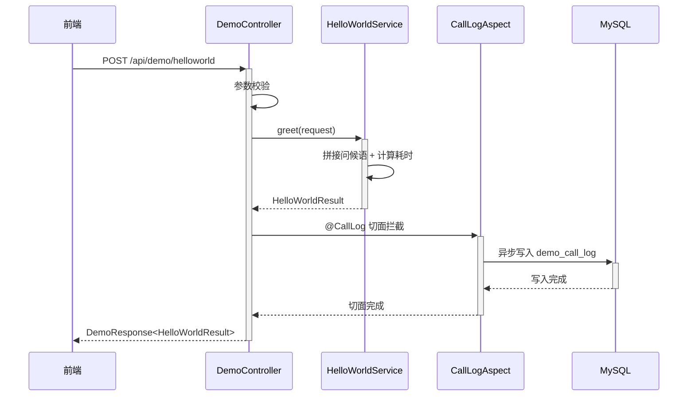

**业务规则：**

| 规则编号 | 规则描述 | 校验时机 | 不满足时的处理 |
|----------|----------|----------|--------------|
| R01 | name 为空时使用默认值 "World" | 执行前 | 自动替换为 "World" |
| R02 | 每次调用自动埋点记录 | 始终 | AOP 自动拦截，无需手动处理 |

**异常场景：**

| 异常场景 | 处理方式 |
|----------|----------|
| 请求体 JSON 格式错误 | 返回 400，提示参数格式错误 |
| 埋点异步写入失败 | 记录 ERROR 日志，不影响主接口响应 |

**并发控制：**
- 并发场景：HelloWorld 接口为无状态计算，无共享资源竞争
- 控制策略：无并发风险，原因：纯计算型接口，不涉及数据写入（埋点由 AOP 异步处理，独立事务）

##### 5.1.3.2 哈希算法执行（F02）

- 处理时序图

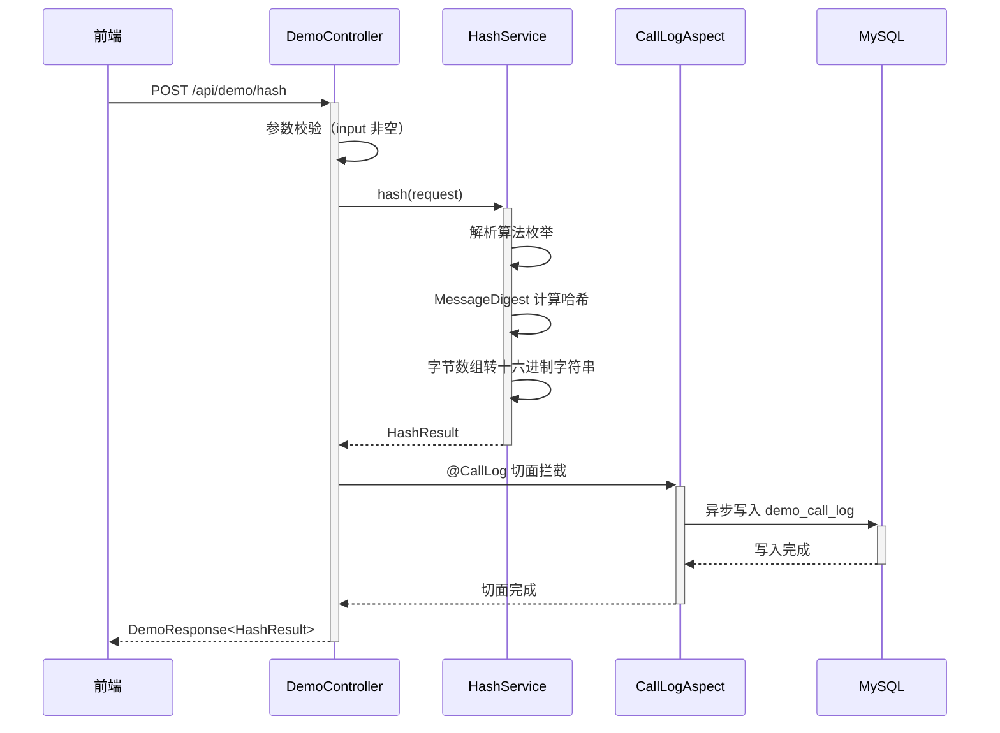

**业务规则：**

| 规则编号 | 规则描述 | 校验时机 | 不满足时的处理 |
|----------|----------|----------|--------------|
| R01 | input 不能为空 | 入参校验 | 返回 DEMO_001 |
| R02 | algorithm 必须为合法枚举值 | 入参校验 | 返回 DEMO_002 |
| R03 | 哈希结果以小写十六进制输出 | 执行时 | 自动转换 |

**异常场景：**

| 异常场景 | 处理方式 |
|----------|----------|
| 不支持的算法名称 | 返回 DEMO_002，提示不支持的哈希算法 |
| NoSuchAlgorithmException | 返回 500，记录异常日志 |

**并发控制：**
- 无并发风险，原因：纯计算型接口

##### 5.1.3.3 冒泡排序执行（F03）

- 处理时序图

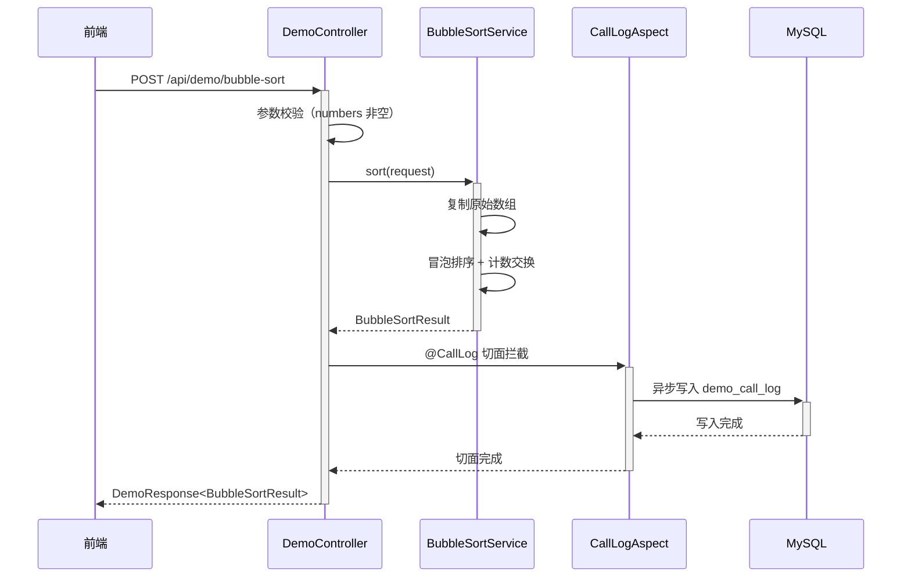

**业务规则：**

| 规则编号 | 规则描述 | 校验时机 | 不满足时的处理 |
|----------|----------|----------|--------------|
| R01 | numbers 不能为空 | 入参校验 | 返回 DEMO_003 |
| R02 | order 必须为 ASC 或 DESC | 入参校验 | 返回 DEMO_004 |
| R03 | 必须保留原始数组不变 | 执行时 | 先复制再排序 |
| R04 | 记录冒泡排序中的交换次数 | 执行时 | 每次 swap 计数 +1 |

**异常场景：**

| 异常场景 | 处理方式 |
|----------|----------|
| numbers 包含非数字 | 前端校验拦截 + 后端 JSON 反序列化失败返回 400 |
| 数组过大导致超时 | 建议前端限制输入长度，后端不做特殊限制 |

**并发控制：**
- 无并发风险，原因：纯计算型接口

---

### 5.2 埋点统计模块

#### 5.2.1 表结构设计

##### 5.2.1.1 demo_call_log（调用记录表）

| 字段名 | 数据类型 | 约束 | 默认值 | 说明 |
|--------|----------|------|--------|------|
| id | bigint | PK, 自增 | - | 系统自增主键 |
| api_type | varchar(32) | NOT NULL | - | 接口类型: HELLOWORLD/HASH/BUBBLE_SORT |
| caller_id | varchar(64) | NOT NULL | - | 调用者 ID |
| caller_name | varchar(128) | | NULL | 调用者姓名 |
| person_type | varchar(32) | | NULL | 人员类型: 正式/实习/外包 |
| person_level | varchar(32) | | NULL | 人员层级: P5/P6/P7/P8... |
| department | varchar(128) | | NULL | 所属部门 |
| request_params | text | | NULL | 请求参数（JSON 序列化） |
| response_data | text | | NULL | 响应结果（JSON 序列化） |
| execution_time_ms | int | | NULL | 执行耗时（毫秒） |
| call_time | datetime | NOT NULL | CURRENT_TIMESTAMP | 调用时间 |
| gmt_create | datetime | NOT NULL | CURRENT_TIMESTAMP | 创建时间 |
| gmt_modified | datetime | NOT NULL | CURRENT_TIMESTAMP ON UPDATE CURRENT_TIMESTAMP | 修改时间 |

**索引：**
- IDX: `idx_api_type` (api_type) — 按接口类型筛选
- IDX: `idx_caller_id` (caller_id) — 按调用者查询
- IDX: `idx_call_time` (call_time) — 按时间范围查询
- IDX: `idx_department` (department) — 按部门统计
- IDX: `idx_person_type` (person_type) — 按人员类型统计
- IDX: `idx_person_level` (person_level) — 按人员层级统计

##### 5.2.1.2 枚举与常量定义

| 枚举名称 | 取值 | 含义 | 关联字段 |
|----------|------|------|----------|
| AnalyticsDimension | PERSON_TYPE | 按人员类型维度统计 | AnalyticsQuery.dimension |
| AnalyticsDimension | PERSON_LEVEL | 按人员层级维度统计 | AnalyticsQuery.dimension |
| AnalyticsDimension | DEPARTMENT | 按部门维度统计 | AnalyticsQuery.dimension |
| AnalyticsDimension | DATE | 按日期维度统计 | AnalyticsQuery.dimension |
| Granularity | DAY | 按日粒度 | AnalyticsQuery.granularity |
| Granularity | WEEK | 按周粒度 | AnalyticsQuery.granularity |
| Granularity | MONTH | 按月粒度 | AnalyticsQuery.granularity |

#### 5.2.2 接口详细设计

##### W05 调用统计汇总

- **URI**: GET /api/demo/analytics/summary
- **描述**: 按指定维度聚合统计接口调用次数及占比
- **入参**:

| 参数名称 | 类型 | 是否必填 | 描述 |
|----------|------|----------|------|
| dimension | String | 是 | 统计维度，枚举: PERSON_TYPE/PERSON_LEVEL/DEPARTMENT/DATE |
| apiType | String | 否 | 接口类型筛选，枚举: HELLOWORLD/HASH/BUBBLE_SORT，不传查全部 |
| startDate | String | 否 | 起始日期，格式 yyyy-MM-dd |
| endDate | String | 否 | 结束日期，格式 yyyy-MM-dd |

- **出参**:

| 参数名称 | 类型 | 描述 |
|----------|------|------|
| code | int | 状态码 |
| message | String | 提示信息 |
| data.dimension | String | 当前统计维度 |
| data.items | List | 统计项列表 |
| data.items[].label | String | 维度标签（如部门名称） |
| data.items[].count | long | 调用次数 |
| data.items[].percentage | double | 占比（百分比） |
| data.totalCount | long | 总调用次数 |
| data.dateRange.start | String | 数据起始日期 |
| data.dateRange.end | String | 数据结束日期 |

- **错误码**:

| 错误码 | 说明 |
|--------|------|
| DEMO_005 | dimension 参数无效 |
| 500 | 服务器内部错误 |

- **业务规则**:
  - 按 count 降序排列
  - percentage 保留一位小数
  - 无时间范围时默认查全部历史数据

- **请求示例**:
```
GET /api/demo/analytics/summary?dimension=DEPARTMENT&apiType=HELLOWORLD
```

- **响应示例**:
```json
{
  "code": 200,
  "message": "success",
  "data": {
    "dimension": "DEPARTMENT",
    "items": [
      { "label": "技术部", "count": 156, "percentage": 35.2 },
      { "label": "产品部", "count": 89, "percentage": 20.1 }
    ],
    "totalCount": 443,
    "dateRange": { "start": "2025-01-01", "end": "2025-01-24" }
  }
}
```

##### W06 调用趋势数据

- **URI**: GET /api/demo/analytics/trend
- **描述**: 按时间粒度聚合调用趋势，用于折线图展示
- **入参**:

| 参数名称 | 类型 | 是否必填 | 描述 |
|----------|------|----------|------|
| apiType | String | 否 | 接口类型筛选 |
| granularity | String | 否 | 时间粒度，枚举: DAY/WEEK/MONTH，默认 DAY |
| startDate | String | 否 | 起始日期 |
| endDate | String | 否 | 结束日期 |

- **出参**:

| 参数名称 | 类型 | 描述 |
|----------|------|------|
| code | int | 状态码 |
| message | String | 提示信息 |
| data.granularity | String | 时间粒度 |
| data.series | List | 趋势序列（按接口类型分组） |
| data.series[].apiType | String | 接口类型 |
| data.series[].points | List | 数据点列表 |
| data.series[].points[].date | String | 日期 |
| data.series[].points[].count | long | 调用次数 |

- **错误码**:

| 错误码 | 说明 |
|--------|------|
| DEMO_006 | granularity 参数无效 |
| 500 | 服务器内部错误 |

- **请求示例**:
```
GET /api/demo/analytics/trend?granularity=DAY
```

- **响应示例**:
```json
{
  "code": 200,
  "message": "success",
  "data": {
    "granularity": "DAY",
    "series": [
      {
        "apiType": "HELLOWORLD",
        "points": [
          { "date": "2025-01-20", "count": 12 },
          { "date": "2025-01-21", "count": 18 }
        ]
      }
    ]
  }
}
```

#### 5.2.3 子功能详细设计

##### 5.2.3.1 AOP 埋点切面（F06）

- 处理时序图

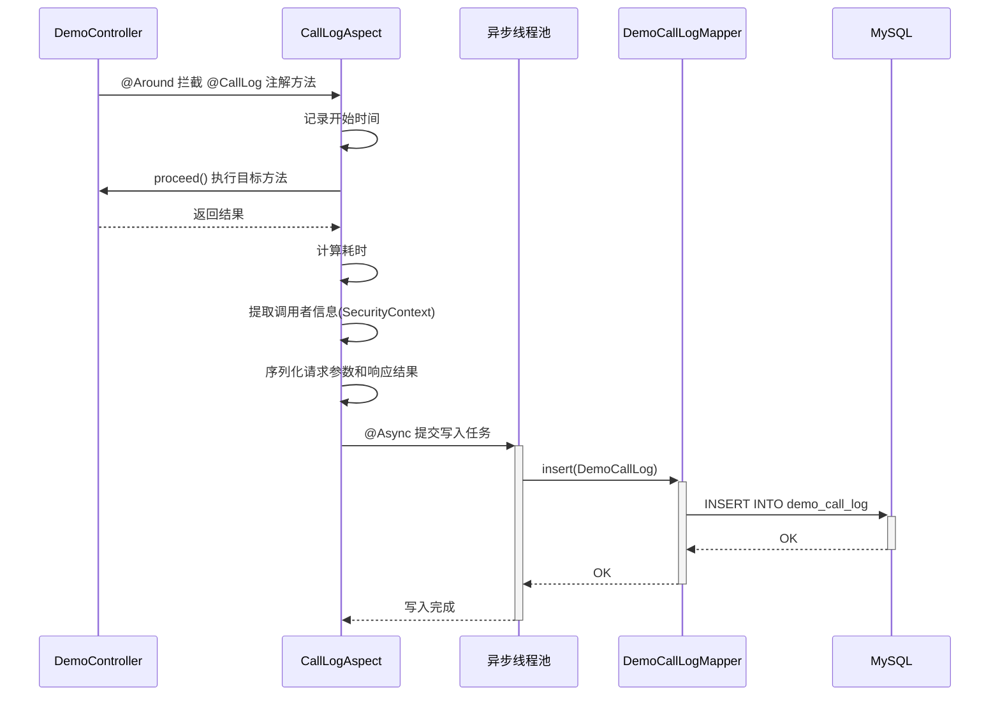

**业务规则：**

| 规则编号 | 规则描述 | 校验时机 | 不满足时的处理 |
|----------|----------|----------|--------------|
| R01 | 仅拦截带 @CallLog 注解的方法 | 切面匹配时 | 其他接口不受影响 |
| R02 | 调用者信息从 SecurityContext 获取 | 切面执行时 | 获取失败时使用兜底模拟用户信息 |
| R03 | 异步写入使用独立线程池 | 始终 | 线程池满时 CallerRunsPolicy 降级为同步写入 |
| R04 | 请求参数和响应结果 JSON 序列化存储 | 序列化时 | 序列化失败记录 WARN 日志，字段存 NULL |

**异常场景：**

| 异常场景 | 处理方式 |
|----------|----------|
| SecurityContext 为空 | 使用请求头中的模拟用户信息兜底 |
| 异步线程池队列满 | CallerRunsPolicy 降级，在调用线程执行写入 |
| 数据库写入失败 | 记录 ERROR 日志，不影响主接口响应 |
| JSON 序列化异常 | 记录 WARN 日志，对应字段存 NULL |

**并发控制：**
- 并发场景：多个请求同时触发埋点写入
- 控制策略：无并发风险，原因：每次写入为独立 INSERT 操作，无共享资源竞争；异步线程池隔离写入与主业务

##### 5.2.3.2 统计汇总查询（F07/F08）

- 处理时序图

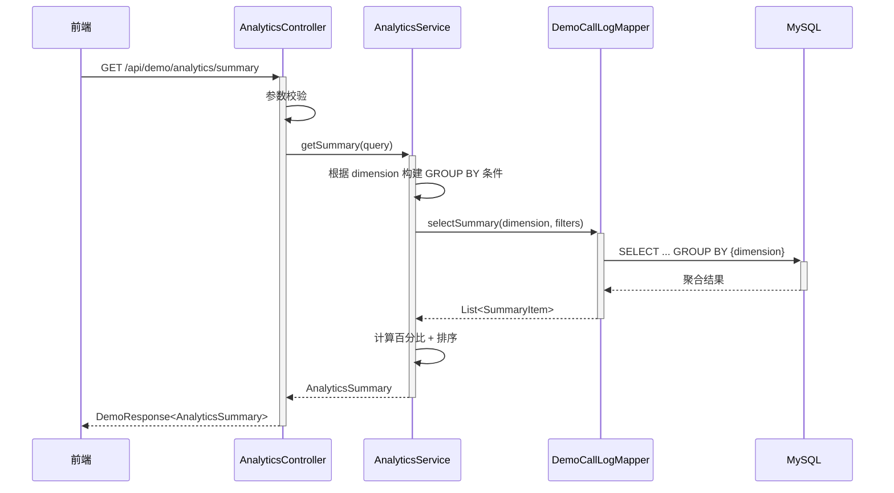

**业务规则：**

| 规则编号 | 规则描述 | 校验时机 | 不满足时的处理 |
|----------|----------|----------|--------------|
| R01 | dimension 必须为合法枚举值 | 入参校验 | 返回 DEMO_005 |
| R02 | 结果按 count 降序排列 | 查询后排序 | - |
| R03 | percentage = count / totalCount * 100，保留一位小数 | 计算时 | - |
| R04 | DATE 维度按 call_time 的日期部分分组 | SQL 构建时 | - |

**异常场景：**

| 异常场景 | 处理方式 |
|----------|----------|
| 无数据 | 返回空 items 列表，totalCount 为 0 |
| 查询超时 | 设置查询超时时间，超时返回 500 |

**并发控制：**
- 无并发风险，原因：纯读操作，不涉及数据写入

##### 5.2.3.3 趋势数据查询（F09）

- 处理时序图

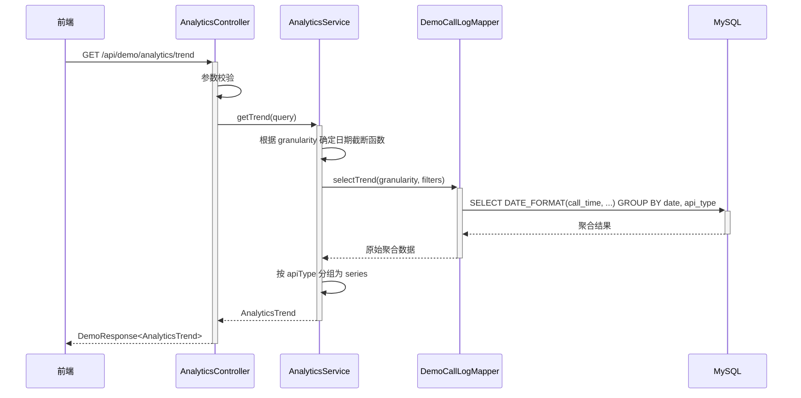

**业务规则：**

| 规则编号 | 规则描述 | 校验时机 | 不满足时的处理 |
|----------|----------|----------|--------------|
| R01 | DAY 粒度按 `%Y-%m-%d` 分组 | SQL 构建时 | - |
| R02 | WEEK 粒度按 `%x-W%v` 分组 | SQL 构建时 | - |
| R03 | MONTH 粒度按 `%Y-%m` 分组 | SQL 构建时 | - |
| R04 | 结果按 apiType 分组为多个 series | 数据组装时 | - |

**异常场景：**

| 异常场景 | 处理方式 |
|----------|----------|
| 无数据 | 返回空 series 列表 |

**并发控制：**
- 无并发风险，原因：纯读操作

---

### 5.3 数据导出模块

#### 5.3.1 表结构设计

本模块无独立表结构，复用 demo_call_log 表数据。

##### 5.3.1.1 枚举与常量定义

| 枚举名称 | 取值 | 含义 | 关联字段 |
|----------|------|------|----------|
| ExportType | HELLOWORLD | 导出 HelloWorld 记录 | ExportRequest.type |
| ExportType | HASH | 导出哈希算法记录 | ExportRequest.type |
| ExportType | BUBBLE_SORT | 导出冒泡排序记录 | ExportRequest.type |

**导出列定义：**

| 接口类型 | 导出列 |
|---------|--------|
| HELLOWORLD | 序号、输入名称、返回结果、调用时间、耗时(ms) |
| HASH | 序号、原始文本、算法类型、哈希结果、调用时间、耗时(ms) |
| BUBBLE_SORT | 序号、原始数组、排序结果、排序方向、交换次数、调用时间、耗时(ms) |

#### 5.3.2 接口详细设计

##### W04 数据导出接口

- **URI**: POST /api/demo/export
- **描述**: 根据接口类型导出调用记录为 Excel 文件
- **入参**:

| 参数名称 | 类型 | 是否必填 | 描述 |
|----------|------|----------|------|
| type | String | 是 | 接口类型，枚举: HELLOWORLD/HASH/BUBBLE_SORT |
| recordIds | List\<Long\> | 否 | 指定导出的记录 ID 列表，为空则导出全部 |

- **出参**: `application/octet-stream`（Excel .xlsx 文件流）

- **响应头**:
  - `Content-Type: application/octet-stream`
  - `Content-Disposition: attachment; filename={type}_export.xlsx`

- **错误码**:

| 错误码 | 说明 |
|--------|------|
| DEMO_007 | type 参数无效 |
| DEMO_008 | 导出数据为空 |
| 500 | 服务器内部错误 |

- **业务规则**:
  - 单次导出最多 10000 条记录
  - 大数据量使用 SXSSFWorkbook 流式写入
  - 文件名格式: `{TYPE}_export.xlsx`

- **请求示例**:
```json
{
  "type": "HELLOWORLD",
  "recordIds": []
}
```

#### 5.3.3 子功能详细设计

##### 5.3.3.1 Excel 导出（F05）

- 处理时序图

```mermaid
sequenceDiagram
    participant C as 前端
    participant Ctrl as DemoController
    participant Svc as ExportService
    participant Mapper as DemoCallLogMapper
    participant DB as MySQL
    participant POI as Apache POI

    C->>+Ctrl: POST /api/demo/export
    Ctrl->>Ctrl: 参数校验
    Ctrl->>+Svc: export(request, outputStream)
    Svc->>+Mapper: selectByTypeAndIds(type, recordIds)
    Mapper->>+DB: SELECT * FROM demo_call_log WHERE ...
    DB-->>-Mapper: 记录列表
    Mapper-->>-Svc: List<DemoCallLog>
    Svc->>Svc: 限制最多 10000 条
    Svc->>+POI: 创建 SXSSFWorkbook
    POI-->>-Svc: workbook
    Svc->>POI: 创建 Sheet + 写入表头
    Svc->>POI: 逐行写入数据
    Svc->>POI: write(outputStream)
    POI-->>-Svc: 写入完成
    Svc-->>-Ctrl: 完成
    Ctrl-->>-C: Excel 文件流
```

**业务规则：**

| 规则编号 | 规则描述 | 校验时机 | 不满足时的处理 |
|----------|----------|----------|--------------|
| R01 | type 必须为合法枚举值 | 入参校验 | 返回 DEMO_007 |
| R02 | 单次导出最多 10000 条 | 查询后截断 | 超出部分忽略 |
| R03 | recordIds 为空时导出该类型全部记录 | 查询条件构建 | - |
| R04 | 使用 SXSSFWorkbook 流式写入 | 始终 | 避免大文件 OOM |

**异常场景：**

| 异常场景 | 处理方式 |
|----------|----------|
| 查询结果为空 | 返回 DEMO_008，提示无数据可导出 |
| Excel 生成异常 | 返回 500，记录异常日志 |
| 客户端提前断开连接 | 捕获 IOException，记录 WARN 日志 |

**并发控制：**
- 并发场景：多人同时导出
- 控制策略：无并发风险，原因：每次导出为独立查询 + 独立 OutputStream，不涉及共享资源

---

### 5.4 前端展示模块

#### 5.4.1 表结构设计

本项不适用，原因：前端模块不涉及数据库表。

#### 5.4.2 接口详细设计

本模块为纯前端，不新增后端接口。消费后端 W01~W06 全部接口。

#### 5.4.3 子功能详细设计

##### 5.4.3.1 Tab 页面展示（F04）

- 页面结构

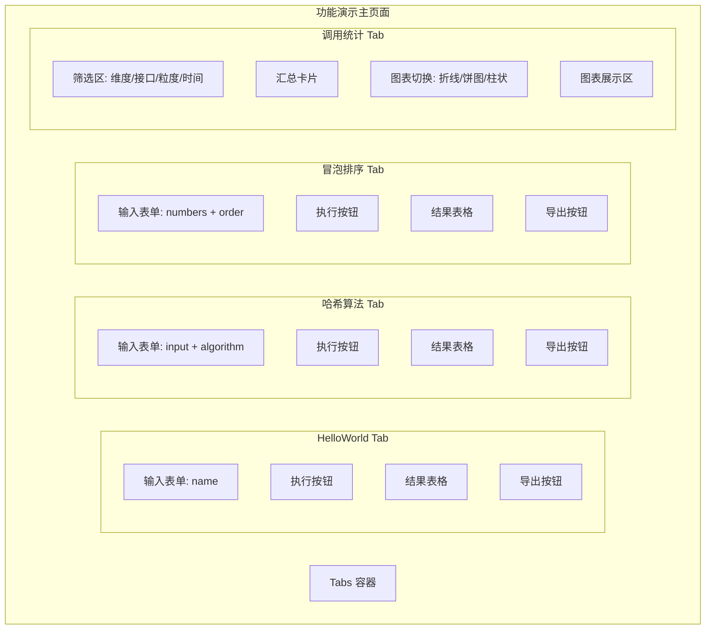

**前端组件拆分：**

| 组件 | 路径 | 职责 |
|------|------|------|
| DemoPage | pages/Demo/index.tsx | 主页面 Tabs 容器 |
| HelloWorldTab | pages/Demo/components/HelloWorldTab.tsx | HelloWorld Tab 内容 |
| HashTab | pages/Demo/components/HashTab.tsx | 哈希算法 Tab 内容 |
| BubbleSortTab | pages/Demo/components/BubbleSortTab.tsx | 冒泡排序 Tab 内容 |
| AnalyticsTab | pages/Demo/components/AnalyticsTab.tsx | 调用统计 Tab 内容 |
| ResultTable | pages/Demo/components/ResultTable.tsx | 通用结果表格 |
| ExportButton | pages/Demo/components/ExportButton.tsx | 导出按钮 |
| LineChart | pages/Demo/components/charts/LineChart.tsx | 折线图组件 |
| PieChart | pages/Demo/components/charts/PieChart.tsx | 饼图组件 |
| BarChart | pages/Demo/components/charts/BarChart.tsx | 柱状图组件 |
| demoApi | pages/Demo/services/demoApi.ts | API 请求封装 |
| demo types | pages/Demo/types/demo.ts | TypeScript 类型定义 |

**技术选型方案对比（图表库）：**

| 方案 | 优点 | 缺点 | 推荐 |
|------|------|------|------|
| ECharts + echarts-for-react | 功能强大、图表类型丰富、社区活跃、React 封装成熟 | 包体积较大（~800KB gzip） | ✅ 推荐 |
| Recharts | React 原生、轻量 | 图表类型有限、自定义能力弱 | ❌ |
| Chart.js + react-chartjs-2 | 轻量、动画流畅 | 复杂图表支持有限 | ❌ |

**推荐理由**：需求明确要求折线图、饼图、柱状图三种展示形式，ECharts 对这三种图表支持最为完善，且 echarts-for-react 封装成熟，开发效率高。

##### 5.4.3.2 图表可视化（F07/F08/F09）

- 处理时序图

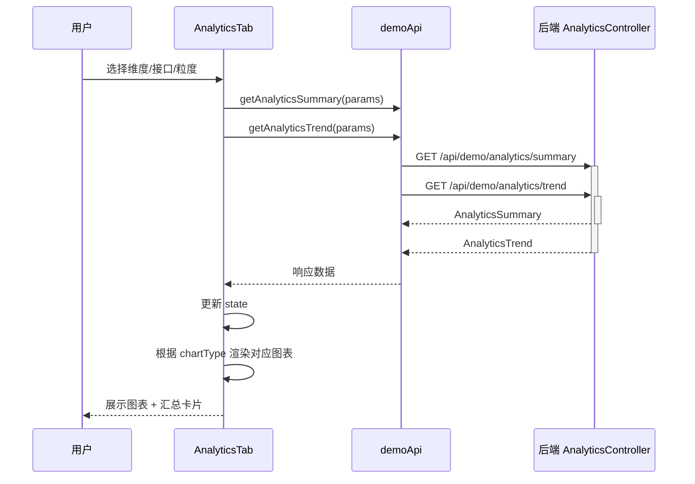

**图表与数据映射：**

| 图表类型 | 数据来源 | 数据转换 |
|----------|----------|----------|
| 折线图 | AnalyticsTrend.series | series[].points → ECharts xAxis(data) + series(data) |
| 饼图 | AnalyticsSummary.items | items[].label + count → ECharts pie data(name, value) |
| 柱状图 | AnalyticsSummary.items | items[].label → xAxis, items[].count → series data |

**业务规则：**

| 规则编号 | 规则描述 | 校验时机 | 不满足时的处理 |
|----------|----------|----------|--------------|
| R01 | 切换维度/接口/粒度时自动刷新数据 | onChange 事件 | - |
| R02 | 折线图使用 trend 数据，饼图和柱状图使用 summary 数据 | 渲染时 | - |
| R03 | 数据为空时展示 Empty 占位 | 渲染前判断 | 展示"暂无统计数据" |
| R04 | 汇总卡片展示：总调用次数、维度分类数、最活跃分类、数据范围 | 渲染时 | 无数据时显示 "-" |

**异常场景：**

| 异常场景 | 处理方式 |
|----------|----------|
| 接口调用失败 | Ant Design message.error 提示 |
| 数据为空 | 展示 Empty 组件 |
| 图表渲染异常 | ErrorBoundary 捕获，展示降级提示 |

---

### 跨模块调用链

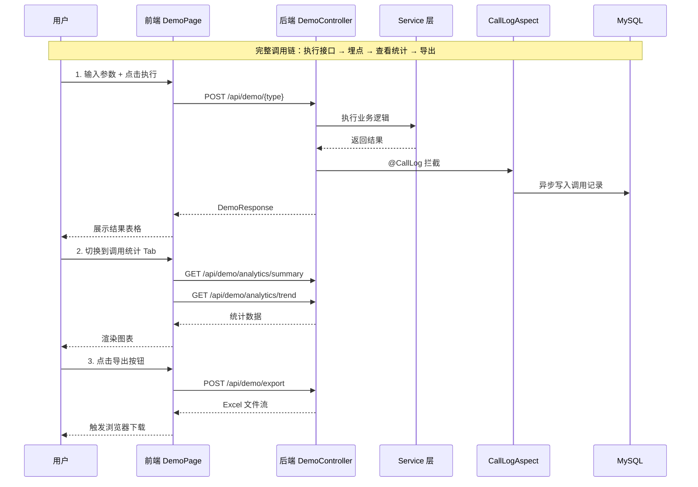

---

## 6. 非功能性需求设计

### 6.1 高可用性

- **后端多实例部署**：至少 2 个 Spring Boot 实例，通过负载均衡分发请求，单实例故障不影响服务
- **埋点降级**：AOP 切面异步写入失败不影响主接口响应；线程池满时 CallerRunsPolicy 降级为同步写入
- **数据库异常降级**：数据库不可用时，演示接口正常响应（纯计算），仅埋点和统计功能不可用，前端展示空状态

### 6.2 可扩展性

- **横向扩展**：后端无状态设计，可通过增加实例数水平扩容
- **接口扩展**：新增演示接口只需添加 Service + @CallLog 注解，AOP 自动埋点，无需修改切面代码
- **图表扩展**：前端图表组件化设计，新增图表类型只需添加新组件
- **维度扩展**：新增统计维度只需扩展 AnalyticsDimension 枚举和对应 SQL GROUP BY 逻辑

### 6.3 稳定性/可靠性

- **导出限流**：单次导出最多 10000 条，防止大文件导致 OOM 或超时
- **SXSSFWorkbook**：大数据量导出使用流式写入，内存占用可控
- **异步线程池隔离**：埋点写入使用独立线程池（core=2, max=5, queue=100），不影响主业务线程
- **前端 ErrorBoundary**：图表组件使用 ErrorBoundary 包裹，渲染异常不导致整页崩溃

### 6.4 安全性设计

#### 6.4.1 账户系统方案

复用图书管理系统现有认证体系，假设：基于 Spring Security + JWT Token 方案。

#### 6.4.2 授权&访问控制

##### 6.4.2.1 是否实现水平权限检查

不涉及。本模块为公共功能演示，调用记录为公共数据，不涉及用户私有资源的水平权限校验。

##### 6.4.2.2 是否实现垂直权限检查

不涉及。本模块所有接口对所有已登录用户开放，无需角色权限区分。

##### 6.4.2.3 是否检查登录态

假设：全局统一拦截器校验 JWT Token，未登录用户返回 401。

#### 6.4.3 数据防护方案

##### 6.4.3.1 是否对敏感数据加密存储

不涉及。本模块不存储身份证、银行卡等敏感个人信息。调用者信息（姓名、部门等）为企业内部公开信息。

##### 6.4.3.2 是否对敏感数据展示进行脱敏

不涉及。本模块展示的数据为接口执行结果和调用统计，不含敏感信息。

### 6.5 监控/统计/日志/告警

| 监控点 | 监控方式 | 告警条件 |
|--------|----------|----------|
| 接口响应时间 | Spring Boot Actuator + Micrometer | P99 > 500ms |
| 埋点写入失败率 | ERROR 日志 + 日志监控 | 失败率 > 1% |
| 异步线程池队列深度 | 自定义 Metrics | 队列使用率 > 80% |
| 导出接口耗时 | 接口埋点 | 单次导出 > 30s |
| 数据库慢查询 | MySQL slow query log | 查询 > 2s |

---

## 7. 变更三板斧

### 7.1 可监控

- **接口级埋点**：每个演示接口自带 AOP 切面记录调用次数、耗时、调用者信息，天然具备监控能力
- **Spring Boot Actuator**：暴露 `/actuator/health`、`/actuator/metrics` 端点，接入 Prometheus + Grafana
- **关键指标**：
  - 各接口 QPS、P99 延迟
  - 埋点写入成功率和延迟
  - 导出接口成功率和文件大小
  - 异步线程池活跃线程数和队列深度

### 7.2 可灰度

- **灰度方案对比**：

| 方案 | 优点 | 缺点 | 推荐 |
|------|------|------|------|
| 按租户尾号灰度 | 实现简单 | 本系统无租户概念 | ❌ |
| 按用户白名单灰度 | 精确控制 | 需维护白名单 | ❌ |
| 按流量比例灰度（Nginx） | 无需代码改动 | 不够精确 | ✅ 推荐 |

**推荐方案**：通过 Nginx 配置流量比例灰度，初始 10% 流量引入新功能，逐步放量至 100%。

**理由**：本模块为独立新增功能，不影响已有功能，灰度需求较低。如需灰度，Nginx 层面配置最为简单快速。

### 7.3 可应急

- **开关控制**：
  - 埋点开关：配置项 `demo.call-log.enabled=true/false`，关闭后 AOP 切面跳过写入，演示接口不受影响
  - 导出开关：配置项 `demo.export.enabled=true/false`，关闭后导出接口返回"功能已关闭"
  - 统计开关：配置项 `demo.analytics.enabled=true/false`，关闭后统计接口返回空数据

- **应急流程**：

| 场景 | 应急措施 | 恢复方式 |
|------|----------|----------|
| 埋点写入导致数据库压力过大 | 关闭埋点开关 | 开启开关 |
| 导出功能导致 OOM | 关闭导出开关 | 修复后开启 |
| 统计查询慢查询 | 关闭统计开关 | 优化 SQL 后开启 |
| 新版本存在 Bug | 回滚发布包 | 重新部署修复版本 |

- **回滚兼容性**：
  - 新增表 `demo_call_log` 为独立表，回滚时不影响其他功能
  - 新增接口路径 `/api/demo/*` 为独立路径，回滚后前端访问 404 但不影响其他页面
  - 前端新增页面为独立路由，回滚后路由不存在，不影响其他页面

---

## 附录：跨仓对齐点检查

| # | 对齐点 | 前端约定 | 后端约定 | 验证方式 |
|---|--------|---------|---------|---------|
| 1 | API 基础路径 | `/api/demo/*` (demoApi.ts) | `@RequestMapping("/api/demo")` | 路径字符串一致 |
| 2 | 接口类型枚举 | `HELLOWORLD / HASH / BUBBLE_SORT` (types/demo.ts) | `ApiType { HELLOWORLD, HASH, BUBBLE_SORT }` | 枚举值一致 |
| 3 | 统计维度枚举 | `PERSON_TYPE / PERSON_LEVEL / DEPARTMENT / DATE` | `AnalyticsDimension` 枚举 | 枚举值一致 |
| 4 | 哈希算法枚举 | `MD5 / SHA1 / SHA256 / SHA512` | `HashAlgorithm` 枚举 | 枚举值一致 |
| 5 | 排序方向 | `ASC / DESC` | `SortOrder` 枚举 | 枚举值一致 |
| 6 | 统一响应结构 | `{ code, message, data }` (DemoResponse\<T\>) | `DemoResponse<T>` 包装类 | 字段名一致 |
| 7 | 时间格式 | `yyyy-MM-dd` / ISO 8601 | `@DateTimeFormat` / `Instant.toString()` | 格式一致 |
| 8 | 导出协议 | `responseType: 'blob'` → 触发下载 | `application/octet-stream` + Content-Disposition | 协议一致 |
| 9 | 统计汇总响应 | `AnalyticsSummaryData` 类型 | `AnalyticsSummary` DTO | 字段名和嵌套结构一致 |
| 10 | 趋势数据响应 | `AnalyticsTrendData` 类型 | `AnalyticsTrend` DTO | 字段名和嵌套结构一致 |

---

## 附录：方案检查清单

| 检查项 | 结果 | 说明 |
|--------|------|------|
| 模块划分合理性检查 | ✅ 通过 | 4 个模块职责单一，无循环依赖 |
| 依赖关系合理性 | ✅ 通过 | 演示接口→埋点→导出→前端，单向依赖 |
| 单点问题检查（部署层面） | ✅ 通过 | 后端多实例 + MySQL 主从 |
| 表模型设计范式检查 | ✅ 通过 | 满足第三范式，无冗余字段 |
| 隐私安全检查 | ✅ 通过 | 不涉及敏感数据 |
| 兼容性检查（接口） | ✅ 通过 | 全部为新增接口，无旧调用方 |
| 兼容性检查（表） | ✅ 通过 | 全部为新增表，无旧版本兼容问题 |
| 数据迁移检查 | ✅ 通过 | 新增表无需迁移，初始为空 |
| 一致性检查（功能点） | ✅ 通过 | F01~F09 均在 Step 5 有对应设计 |
| 一致性检查（表） | ✅ 通过 | demo_call_log 在 5.2 有完整定义 |
| 一致性检查（接口） | ✅ 通过 | W01~W06 在 5.1~5.3 有详细定义 |
| 一致性检查（枚举） | ✅ 通过 | 枚举定义与表字段说明一致 |
| 状态机完整性检查 | ✅ 不适用 | 无状态字段实体 |
| 并发风险检查 | ✅ 通过 | 演示接口无状态，埋点异步隔离，导出/统计只读 |
| 单点问题检查（定时任务层面） | ✅ 不适用 | 无定时任务 |
| 非功能性设计可行性检查 | ✅ 通过 | 高可用/扩展/安全/监控均有落地方案 |
| 变更三板斧（可监控） | ✅ 通过 | AOP 埋点 + Actuator + 自定义 Metrics |
| 变更三板斧（可灰度） | ✅ 通过 | Nginx 流量比例灰度 |
| 变更三板斧（可应急） | ✅ 通过 | 配置开关 + 回滚兼容 |
