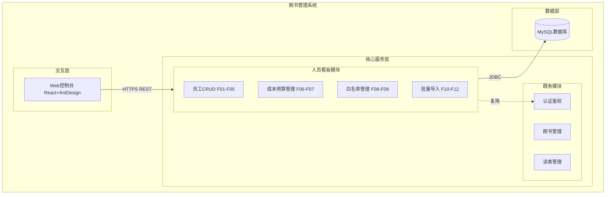
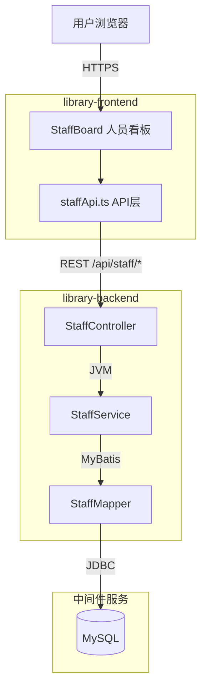
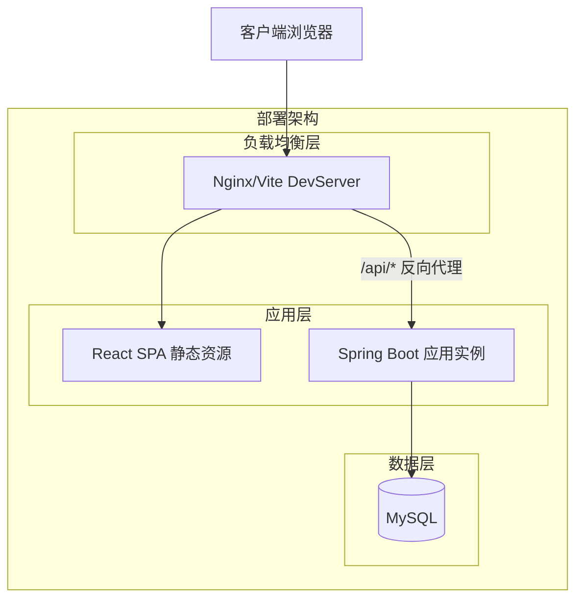
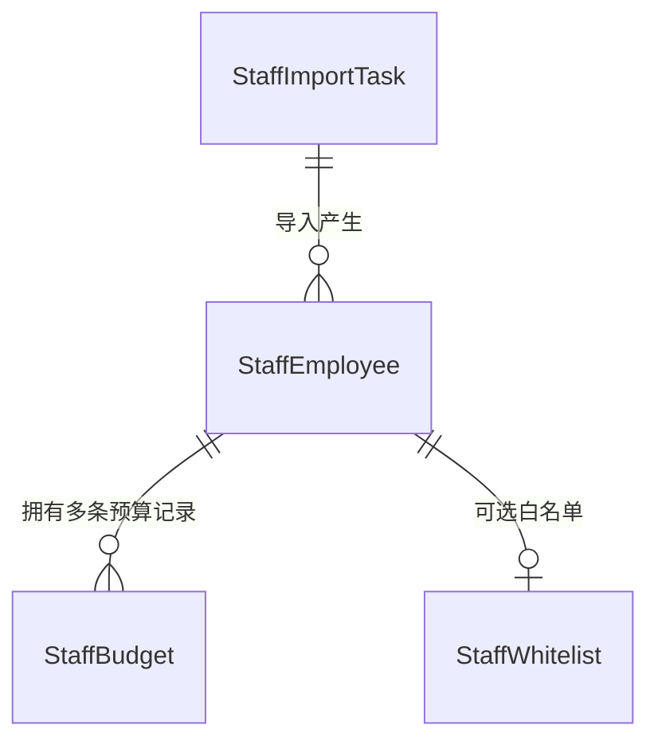
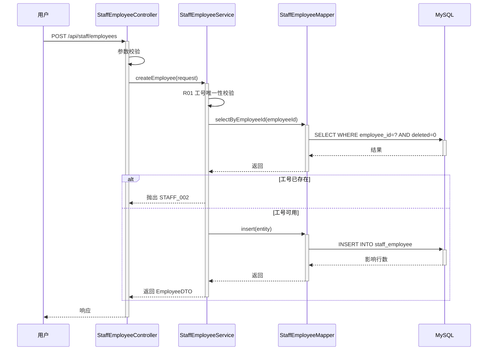
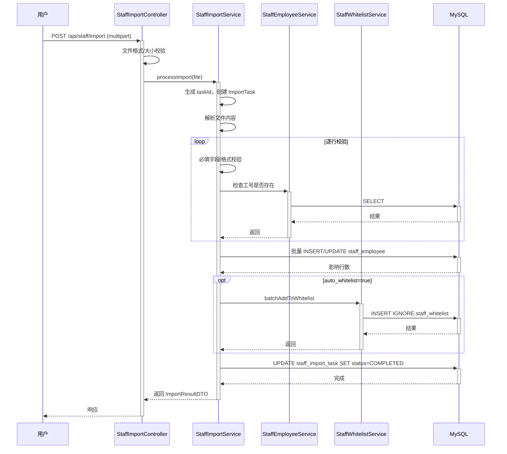
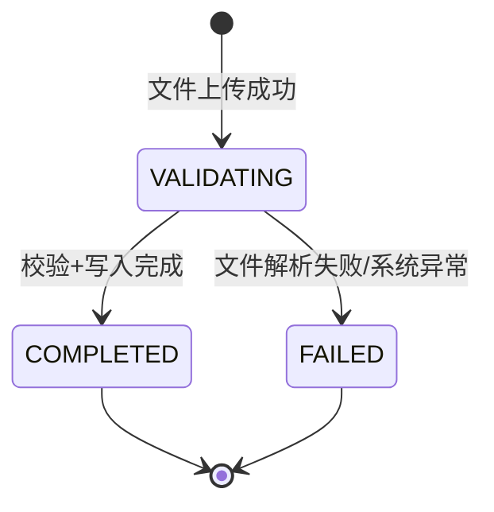

> **文档元信息**
>
> | 项目 | 内容 |
> |------|------|
> | 文档版本 | v1.0 |
> | 作者 | DTCoder |
> | 创建日期 | 2026-08-06 |
> | 需求来源 | .agents/changes/dima.md, .agents/changes/staff-board-implementation-plan.md |
> | 评审状态 | 待评审 |

# 人员看板模块 系分设计

## 1. 需求与范围

### 背景与目标

开发一个人员看板模块，作为图书管理系统的平行新功能，支持员工基本信息的增删改查、成本预算记录、白名单管理和批量导入功能。该模块与现有图书/读者管理模块独立，前后端分别新增 staff 领域包。

### 核心功能

- 员工基本信息 CRUD（分页查询、筛选、新增、编辑、逻辑删除、详情）
- 成本预算记录（按员工/年度设置预算、汇总统计）
- 白名单管理（可见性控制、添加/移除/批量添加）
- 批量导入（Excel/CSV 上传、校验、模板下载）

### 约束与非功能要求

- API 基础路径：`/api/staff/*`
- 统一响应体：`{ code: number; message?: string; data?: T }`（code === 0 表示成功）
- 分页参数：`page` (1-based), `pageSize` (默认 10)
- 日期格式：ISO 8601 (`YYYY-MM-DD`)
- 金额精度：BigDecimal，前端展示保留两位小数
- 币种默认：CNY
- 逻辑删除：DELETE 操作仅标记 deleted=true，不物理删除
- 导入文件限制：单文件 ≤ 10MB，支持 .xlsx / .csv
- 后端技术栈：Java + Spring Boot + Maven
- 前端技术栈：React 18 + TypeScript + Ant Design 5 + Vite

### 排除范围

- HR 系统对接同步（本期纯手工维护）
- 导出功能（后续迭代）
- 审计日志（后续迭代）
- 按部门隔离数据可见性（本期全量可见）
- 角色/权限分级白名单（本期单一白名单）

### 需求功能清单与优先级

| 编号 | 功能点 | 优先级 | PRD 原始描述/章节 | 备注 |
|------|--------|--------|-------------------|------|
| F01 | 员工列表分页查询 | P0 | dima.md §3.1 | 支持按部门/姓名筛选 |
| F02 | 新增员工 | P0 | dima.md §3.1 | 表单录入 |
| F03 | 编辑员工 | P0 | dima.md §3.1 | 表单修改 |
| F04 | 删除员工（逻辑删除） | P0 | dima.md §3.1 | 保留历史记录 |
| F05 | 查看员工详情 | P1 | dima.md §3.1 | 完整信息 |
| F06 | 设置/调整成本预算 | P0 | dima.md §3.2 | 年度/月度 |
| F07 | 预算汇总统计 | P1 | dima.md §3.2 | 按部门/年度 |
| F08 | 白名单添加/移除 | P0 | dima.md §3.3 | 可见性控制 |
| F09 | 白名单批量添加 | P1 | dima.md §3.3 | 批量操作 |
| F10 | 批量导入员工 | P0 | dima.md §3.4 | Excel/CSV |
| F11 | 导入模板下载 | P1 | dima.md §3.4 | 标准模板 |
| F12 | 导入校验结果展示 | P0 | dima.md §3.4 | 成功/失败明细 |

### 假设与待确认项

| 编号 | 假设/待确认内容 | 当前假设 | 确认状态 |
|------|-----------------|----------|----------|
| A01 | 员工信息来源 | 纯手工维护，不对接 HR 系统 | 待确认 |
| A02 | 成本预算精度 | 仅总额，不区分基本工资/奖金/福利明细 | 待确认 |
| A03 | 白名单粒度 | 单一白名单，不按角色/权限分级 | 待确认 |
| A04 | 导入冲突策略 | 重复工号时默认更新已有记录 | 待确认 |
| A05 | 数据权限 | 本期不做部门隔离，全量可见 | 待确认 |
| A06 | 审计日志 | 本期不记录操作审计日志 | 待确认 |
| A07 | 导出功能 | 本期不支持导出 | 待确认 |
| A08 | 数据库类型 | 使用 MySQL（与现有 library-backend 一致） | 已确认 |
| A09 | 认证方式 | 复用现有 auth 模块的登录态校验 | 已确认 |
| A10 | 导入文件大小限制 | 单文件 ≤ 10MB | 待确认 |

## 2. 架构与模块

### 功能架构



- **交互层说明**：React 18 + Ant Design 5 前端，Tab 式页面结构，新增 StaffBoard 主容器下设四个子 Tab
- **核心服务层说明**：Spring Boot 后端新增 staff 领域包，包含 Employee/Budget/Whitelist/Import 四个子模块
- **数据层说明**：MySQL 数据库新增 staff_employee / staff_budget / staff_whitelist / staff_import_task 四张表

**模块清单**

| 模块 | 职责 | 依赖 |
|------|------|------|
| staff-employee | 员工基本信息 CRUD、分页查询、筛选 | common（统一响应体）、auth（登录态） |
| staff-budget | 成本预算设置/调整/汇总统计 | staff-employee（关联工号）、common |
| staff-whitelist | 白名单添加/移除/批量添加/列表查询 | staff-employee（关联工号）、common |
| staff-import | 批量导入文件解析、校验、异步处理、模板下载 | staff-employee、staff-whitelist、common |
| common | 统一响应体、异常处理、分页封装 | 无 |
| auth | 登录态校验、用户身份获取 | 无 |

### 应用集成架构



**集成关系说明：**

| 调用方 | 被调用方 | 协议 | 接口类型 | 说明 |
|--------|----------|------|----------|------|
| 用户浏览器 | library-frontend | HTTPS | SPA | 静态资源加载 |
| library-frontend | library-backend | HTTPS | REST JSON | `/api/staff/*` 全部接口 |
| library-backend | MySQL | JDBC | SQL | MyBatis ORM |

### 部署架构



**部署说明：**
- **负载均衡层**：开发环境使用 Vite DevServer proxy；生产环境使用 Nginx 反向代理
- **应用层**：前端构建为静态资源由 Nginx 托管；后端 Spring Boot 单实例部署（可水平扩展）
- **数据层**：MySQL 单库，后续可扩展主从架构

## 3. 数据模型与存储

### 实体清单

| 实体名称 | 实体说明 | 所属模块 | 与其他实体的关系 |
|----------|----------|----------|-----------------|
| StaffEmployee | 员工基本信息 | staff-employee | 一对多关联 StaffBudget；一对一关联 StaffWhitelist |
| StaffBudget | 员工成本预算 | staff-budget | 多对一关联 StaffEmployee |
| StaffWhitelist | 白名单记录 | staff-whitelist | 一对一关联 StaffEmployee |
| StaffImportTask | 导入任务记录 | staff-import | 独立实体，记录导入批次 |

### 实体关系图



**模型说明：**
- StaffEmployee 为核心实体，employee_id 为业务唯一键
- StaffBudget 通过 employee_id 关联员工，同一员工同一年度可有多条月度/年度预算
- StaffWhitelist 为可选关联，仅白名单内员工在看板中展示
- StaffImportTask 记录每次导入批次的状态和统计信息

## 4. 接口设计

### 4.1 oneapi（Web 控制台接口）

| 编号 | 接口名称 | 方法 | 路径 | 模块 |
|------|----------|------|------|------|
| W01 | 分页查询员工列表 | GET | /api/staff/employees | staff-employee |
| W02 | 查询员工详情 | GET | /api/staff/employees/{id} | staff-employee |
| W03 | 新增员工 | POST | /api/staff/employees | staff-employee |
| W04 | 更新员工 | PUT | /api/staff/employees/{id} | staff-employee |
| W05 | 删除员工 | DELETE | /api/staff/employees/{id} | staff-employee |
| W06 | 查询预算列表 | GET | /api/staff/budgets | staff-budget |
| W07 | 设置预算 | POST | /api/staff/budgets | staff-budget |
| W08 | 调整预算 | PUT | /api/staff/budgets/{id} | staff-budget |
| W09 | 预算汇总统计 | GET | /api/staff/budgets/summary | staff-budget |
| W10 | 白名单列表 | GET | /api/staff/whitelist | staff-whitelist |
| W11 | 添加白名单 | POST | /api/staff/whitelist | staff-whitelist |
| W12 | 移除白名单 | DELETE | /api/staff/whitelist/{id} | staff-whitelist |
| W13 | 批量添加白名单 | POST | /api/staff/whitelist/batch | staff-whitelist |
| W14 | 上传导入文件 | POST | /api/staff/import | staff-import |
| W15 | 查询导入结果 | GET | /api/staff/import/result/{taskId} | staff-import |
| W16 | 下载导入模板 | GET | /api/staff/import/template | staff-import |

### 4.2 OpenAPI（对外接口）

本期不涉及对外 OpenAPI 接口。

### 4.3 内部接口（Service 层）

| 编号 | 接口名称 | 类 | 方法签名 |
|------|----------|------|----------|
| S01 | 分页查询员工 | StaffEmployeeService | PageResult<EmployeeDTO> queryEmployees(EmployeeQueryRequest request) |
| S02 | 获取员工详情 | StaffEmployeeService | EmployeeDTO getEmployee(Long id) |
| S03 | 创建员工 | StaffEmployeeService | EmployeeDTO createEmployee(EmployeeCreateRequest request) |
| S04 | 更新员工 | StaffEmployeeService | EmployeeDTO updateEmployee(Long id, EmployeeUpdateRequest request) |
| S05 | 删除员工 | StaffEmployeeService | void deleteEmployee(Long id) |
| S06 | 查询预算列表 | StaffBudgetService | List<BudgetDTO> queryBudgets(BudgetQueryRequest request) |
| S07 | 创建预算 | StaffBudgetService | BudgetDTO createBudget(BudgetCreateRequest request) |
| S08 | 更新预算 | StaffBudgetService | BudgetDTO updateBudget(Long id, BudgetUpdateRequest request) |
| S09 | 预算汇总 | StaffBudgetService | List<BudgetSummaryDTO> getBudgetSummary(Integer year) |
| S10 | 查询白名单 | StaffWhitelistService | List<WhitelistDTO> queryWhitelist() |
| S11 | 添加白名单 | StaffWhitelistService | WhitelistDTO addToWhitelist(WhitelistAddRequest request) |
| S12 | 移除白名单 | StaffWhitelistService | void removeFromWhitelist(Long id) |
| S13 | 批量添加白名单 | StaffWhitelistService | List<WhitelistDTO> batchAddToWhitelist(WhitelistBatchAddRequest request) |
| S14 | 处理导入文件 | StaffImportService | ImportResultDTO processImport(MultipartFile file) |
| S15 | 查询导入结果 | StaffImportService | ImportResultDTO getImportResult(String taskId) |

### 4.4 集成接口（Integration 层）

本期不涉及外部系统集成接口。

## 5. 功能模块设计

### 5.1 staff-employee（员工管理模块）

#### 5.1.1 表结构设计

##### 5.1.1.1 staff_employee

| 字段名 | 数据类型 | 约束 | 默认值 | 说明 |
|--------|----------|------|--------|------|
| id | bigint | PK, 自增 | - | 系统自增主键 |
| employee_id | varchar(64) | NOT NULL, UK | - | 工号，业务唯一标识 |
| name | varchar(128) | NOT NULL | - | 姓名 |
| department | varchar(128) | NOT NULL | - | 部门 |
| position | varchar(128) | NOT NULL | - | 职位 |
| hire_date | date | NOT NULL | - | 入职日期 |
| contact_info | varchar(256) | NOT NULL | - | 联系方式（手机/邮箱） |
| skills | text | NULL | NULL | 技能标签，JSON数组格式 |
| certifications | text | NULL | NULL | 资质证书，JSON数组格式 |
| project_experience | text | NULL | NULL | 项目经验备注 |
| deleted | tinyint | NOT NULL | 0 | 逻辑删除标记：0-正常，1-已删除 |
| gmt_create | datetime | NOT NULL | CURRENT_TIMESTAMP | 创建时间 |
| gmt_modified | datetime | NOT NULL | CURRENT_TIMESTAMP ON UPDATE CURRENT_TIMESTAMP | 修改时间 |

**索引：**
- UK: `uk_staff_employee_employee_id` (employee_id)
- IDX: `idx_staff_employee_department` (department)
- IDX: `idx_staff_employee_name` (name)

##### 5.1.1.2 枚举与常量定义

| 枚举名称 | 取值 | 含义 | 关联字段 |
|----------|------|------|----------|
| DeletedFlag | 0 | 正常 | staff_employee.deleted |
| DeletedFlag | 1 | 已删除 | staff_employee.deleted |

#### 5.1.2 接口详细设计

##### W01 分页查询员工列表

- **URI**: GET /api/staff/employees
- **描述**: 分页查询员工列表，支持按部门和姓名筛选
- **入参**:

| 参数名称 | 类型 | 是否必填 | 描述 |
|----------|------|----------|------|
| page | Integer | 否 | 页码，默认1 |
| pageSize | Integer | 否 | 每页条数，默认10 |
| department | String | 否 | 部门筛选（模糊匹配） |
| name | String | 否 | 姓名筛选（模糊匹配） |

- **出参**:

| 参数名称 | 类型 | 描述 |
|----------|------|------|
| code | Integer | 结果码，0表示成功 |
| message | String | 提示信息 |
| data | Object | 分页数据 |
| data.records | Array | 员工列表 |
| data.total | Long | 总记录数 |
| data.page | Integer | 当前页码 |
| data.pageSize | Integer | 每页条数 |

- **错误码**:

| 错误码 | 说明 |
|--------|------|
| STAFF_001 | 分页参数非法 |

- **业务规则**: 仅查询 deleted=0 的记录；department/name 为模糊匹配

- **请求示例**:
```
GET /api/staff/employees?page=1&pageSize=10&department=技术部
```

- **响应示例**:
```json
{
  "code": 0,
  "message": "SUCCESS",
  "data": {
    "records": [
      {
        "id": 1,
        "employeeId": "EMP001",
        "name": "张三",
        "department": "技术部",
        "position": "高级工程师",
        "hireDate": "2024-01-15",
        "contactInfo": "13800138000",
        "skills": ["Java", "Spring"],
        "certifications": ["PMP"],
        "projectExperience": "图书馆系统重构",
        "createdAt": "2024-01-15T10:00:00",
        "updatedAt": "2024-01-15T10:00:00"
      }
    ],
    "total": 1,
    "page": 1,
    "pageSize": 10
  }
}
```

##### W03 新增员工

- **URI**: POST /api/staff/employees
- **描述**: 新增员工基本信息
- **入参**:

| 参数名称 | 类型 | 是否必填 | 描述 |
|----------|------|----------|------|
| employeeId | String | 是 | 工号 |
| name | String | 是 | 姓名 |
| department | String | 是 | 部门 |
| position | String | 是 | 职位 |
| hireDate | String | 是 | 入职日期 YYYY-MM-DD |
| contactInfo | String | 是 | 联系方式 |
| skills | Array | 否 | 技能标签 |
| certifications | Array | 否 | 资质证书 |
| projectExperience | String | 否 | 项目经验备注 |

- **出参**:

| 参数名称 | 类型 | 描述 |
|----------|------|------|
| code | Integer | 结果码 |
| message | String | 提示信息 |
| data | Object | 新建的员工对象 |

- **错误码**:

| 错误码 | 说明 |
|--------|------|
| STAFF_002 | 工号已存在 |
| STAFF_003 | 必填字段缺失 |
| STAFF_004 | 日期格式非法 |

- **业务规则**: R01-工号全局唯一；R02-必填字段非空校验；R03-日期格式校验

- **请求示例**:
```json
{
  "employeeId": "EMP002",
  "name": "李四",
  "department": "产品部",
  "position": "产品经理",
  "hireDate": "2024-03-01",
  "contactInfo": "lisi@example.com",
  "skills": ["需求分析", "原型设计"]
}
```

- **响应示例**:
```json
{
  "code": 0,
  "message": "SUCCESS",
  "data": {
    "id": 2,
    "employeeId": "EMP002",
    "name": "李四",
    "department": "产品部",
    "position": "产品经理",
    "hireDate": "2024-03-01",
    "contactInfo": "lisi@example.com",
    "skills": ["需求分析", "原型设计"],
    "createdAt": "2024-03-01T09:00:00",
    "updatedAt": "2024-03-01T09:00:00"
  }
}
```

##### W04 更新员工

- **URI**: PUT /api/staff/employees/{id}
- **描述**: 更新员工基本信息（工号不可修改）
- **入参**: 同 W03，但 employeeId 不可修改
- **出参**: 同 W03
- **错误码**:

| 错误码 | 说明 |
|--------|------|
| STAFF_005 | 员工不存在 |
| STAFF_003 | 必填字段缺失 |

- **业务规则**: R04-员工必须存在且未删除；R05-工号字段忽略传入值

##### W05 删除员工

- **URI**: DELETE /api/staff/employees/{id}
- **描述**: 逻辑删除员工（设置 deleted=1）
- **入参**:

| 参数名称 | 类型 | 是否必填 | 描述 |
|----------|------|----------|------|
| id | Long | 是 | 员工ID（路径参数） |

- **出参**:

| 参数名称 | 类型 | 描述 |
|----------|------|------|
| code | Integer | 结果码 |
| message | String | 提示信息 |
| data | null | 无返回数据 |

- **错误码**:

| 错误码 | 说明 |
|--------|------|
| STAFF_005 | 员工不存在 |

- **业务规则**: R06-逻辑删除，不物理删除；R07-已删除的员工不重复删除

#### 5.1.3 子功能详细设计

##### 5.1.3.1 新增员工（F02）

- 处理时序图



**业务规则：**

| 规则编号 | 规则描述 | 校验时机 | 不满足时的处理 |
|----------|----------|----------|--------------|
| R01 | 工号全局唯一（deleted=0范围内） | 创建时 | 返回错误码 STAFF_002，提示"工号已存在" |
| R02 | 必填字段非空 | 创建时 | 返回错误码 STAFF_003，提示具体缺失字段 |
| R03 | hireDate 格式为 YYYY-MM-DD | 创建时 | 返回错误码 STAFF_004，提示"日期格式非法" |

**异常场景：**

| 异常场景 | 处理方式 |
|----------|----------|
| 数据库插入失败 | 事务回滚，返回 STAFF_999 系统异常 |
| 并发创建同工号 | 数据库唯一键约束兜底，捕获 DuplicateKeyException 返回 STAFF_002 |

**并发控制：**
- 并发场景：多人同时创建相同工号的员工
- 控制策略：数据库唯一键约束 + 应用层预检查双重保障

### 5.2 staff-budget（成本预算模块）

#### 5.2.1 表结构设计

##### 5.2.1.1 staff_budget

| 字段名 | 数据类型 | 约束 | 默认值 | 说明 |
|--------|----------|------|--------|------|
| id | bigint | PK, 自增 | - | 系统自增主键 |
| employee_id | varchar(64) | NOT NULL | - | 关联工号 |
| budget_year | int | NOT NULL | - | 预算年度 |
| budget_month | int | NULL | NULL | 预算月份，NULL表示年度预算 |
| amount | decimal(15,2) | NOT NULL | 0.00 | 预算金额 |
| currency | varchar(8) | NOT NULL | 'CNY' | 币种 |
| gmt_create | datetime | NOT NULL | CURRENT_TIMESTAMP | 创建时间 |
| gmt_modified | datetime | NOT NULL | CURRENT_TIMESTAMP ON UPDATE CURRENT_TIMESTAMP | 修改时间 |

**索引：**
- IDX: `idx_staff_budget_employee_id` (employee_id)
- IDX: `idx_staff_budget_year` (budget_year)
- UK: `uk_staff_budget_emp_year_month` (employee_id, budget_year, budget_month)

##### 5.2.1.2 枚举与常量定义

本模块无枚举/常量定义。

#### 5.2.2 接口详细设计

##### W07 设置预算

- **URI**: POST /api/staff/budgets
- **描述**: 为员工设置年度或月度预算
- **入参**:

| 参数名称 | 类型 | 是否必填 | 描述 |
|----------|------|----------|------|
| employeeId | String | 是 | 工号 |
| budgetYear | Integer | 是 | 预算年度 |
| budgetMonth | Integer | 否 | 预算月份，null为年度预算 |
| amount | BigDecimal | 是 | 预算金额 |
| currency | String | 否 | 币种，默认CNY |

- **出参**:

| 参数名称 | 类型 | 描述 |
|----------|------|------|
| code | Integer | 结果码 |
| message | String | 提示信息 |
| data | Object | 新建的预算对象 |

- **错误码**:

| 错误码 | 说明 |
|--------|------|
| STAFF_010 | 员工不存在 |
| STAFF_011 | 该员工该时段预算已存在 |
| STAFF_012 | 预算金额非法 |

- **业务规则**: R08-员工必须存在；R09-同一员工同一年度同一月份预算唯一；R10-金额 ≥ 0

#### 5.2.3 子功能详细设计

##### 5.2.3.1 设置预算（F06）

**业务规则：**

| 规则编号 | 规则描述 | 校验时机 | 不满足时的处理 |
|----------|----------|----------|--------------|
| R08 | 关联员工必须存在且未删除 | 创建时 | 返回 STAFF_010 |
| R09 | 同一员工+年度+月份组合唯一 | 创建时 | 返回 STAFF_011 |
| R10 | 预算金额 ≥ 0 | 创建/更新时 | 返回 STAFF_012 |

**并发控制：**
- 并发场景：多人同时为同一员工设置同一时段预算
- 控制策略：数据库唯一键约束兜底

### 5.3 staff-whitelist（白名单模块）

#### 5.3.1 表结构设计

##### 5.3.1.1 staff_whitelist

| 字段名 | 数据类型 | 约束 | 默认值 | 说明 |
|--------|----------|------|--------|------|
| id | bigint | PK, 自增 | - | 系统自增主键 |
| employee_id | varchar(64) | NOT NULL, UK | - | 关联工号 |
| added_at | datetime | NOT NULL | CURRENT_TIMESTAMP | 加入时间 |
| added_by | varchar(128) | NOT NULL | - | 操作人 |
| remark | varchar(512) | NULL | NULL | 备注 |
| gmt_create | datetime | NOT NULL | CURRENT_TIMESTAMP | 创建时间 |
| gmt_modified | datetime | NOT NULL | CURRENT_TIMESTAMP ON UPDATE CURRENT_TIMESTAMP | 修改时间 |

**索引：**
- UK: `uk_staff_whitelist_employee_id` (employee_id)

##### 5.3.1.2 枚举与常量定义

本模块无枚举/常量定义。

#### 5.3.2 接口详细设计

##### W11 添加白名单

- **URI**: POST /api/staff/whitelist
- **描述**: 将员工加入白名单
- **入参**:

| 参数名称 | 类型 | 是否必填 | 描述 |
|----------|------|----------|------|
| employeeId | String | 是 | 工号 |
| remark | String | 否 | 备注 |

- **出参**:

| 参数名称 | 类型 | 描述 |
|----------|------|------|
| code | Integer | 结果码 |
| message | String | 提示信息 |
| data | Object | 白名单记录 |

- **错误码**:

| 错误码 | 说明 |
|--------|------|
| STAFF_020 | 员工不存在 |
| STAFF_021 | 该员工已在白名单中 |

- **业务规则**: R11-员工必须存在；R12-白名单中工号唯一

#### 5.3.3 子功能详细设计

##### 5.3.3.1 添加白名单（F08）

**业务规则：**

| 规则编号 | 规则描述 | 校验时机 | 不满足时的处理 |
|----------|----------|----------|--------------|
| R11 | 关联员工必须存在且未删除 | 添加时 | 返回 STAFF_020 |
| R12 | 白名单中工号唯一 | 添加时 | 返回 STAFF_021 |

**并发控制：**
- 并发场景：多人同时添加同一员工到白名单
- 控制策略：数据库唯一键约束兜底

### 5.4 staff-import（批量导入模块）

#### 5.4.1 表结构设计

##### 5.4.1.1 staff_import_task

| 字段名 | 数据类型 | 约束 | 默认值 | 说明 |
|--------|----------|------|--------|------|
| id | bigint | PK, 自增 | - | 系统自增主键 |
| task_id | varchar(64) | NOT NULL, UK | - | 任务ID（UUID） |
| file_name | varchar(256) | NOT NULL | - | 上传文件名 |
| total_count | int | NOT NULL | 0 | 总记录数 |
| success_count | int | NOT NULL | 0 | 成功条数 |
| failure_count | int | NOT NULL | 0 | 失败条数 |
| status | varchar(16) | NOT NULL | 'VALIDATING' | 任务状态 |
| failure_details | longtext | NULL | NULL | 失败明细JSON |
| auto_whitelist | tinyint | NOT NULL | 1 | 是否自动加入白名单 |
| gmt_create | datetime | NOT NULL | CURRENT_TIMESTAMP | 创建时间 |
| gmt_modified | datetime | NOT NULL | CURRENT_TIMESTAMP ON UPDATE CURRENT_TIMESTAMP | 修改时间 |

**索引：**
- UK: `uk_staff_import_task_task_id` (task_id)

##### 5.4.1.2 枚举与常量定义

| 枚举名称 | 取值 | 含义 | 关联字段 |
|----------|------|------|----------|
| ImportTaskStatus | VALIDATING | 校验中 | staff_import_task.status |
| ImportTaskStatus | COMPLETED | 已完成 | staff_import_task.status |
| ImportTaskStatus | FAILED | 失败 | staff_import_task.status |

#### 5.4.2 接口详细设计

##### W14 上传导入文件

- **URI**: POST /api/staff/import
- **描述**: 上传 Excel/CSV 文件进行批量导入
- **入参**:

| 参数名称 | 类型 | 是否必填 | 描述 |
|----------|------|----------|------|
| file | MultipartFile | 是 | 导入文件（.xlsx/.csv） |

- **出参**:

| 参数名称 | 类型 | 描述 |
|----------|------|------|
| code | Integer | 结果码 |
| message | String | 提示信息 |
| data | Object | 导入结果 |
| data.taskId | String | 任务ID |
| data.totalCount | Integer | 总记录数 |
| data.successCount | Integer | 成功条数 |
| data.failureCount | Integer | 失败条数 |
| data.failures | Array | 失败明细 |
| data.status | String | 任务状态 |

- **错误码**:

| 错误码 | 说明 |
|--------|------|
| STAFF_030 | 文件格式不支持 |
| STAFF_031 | 文件大小超限 |
| STAFF_032 | 文件解析失败 |

- **业务规则**: R13-仅支持 .xlsx/.csv；R14-文件大小 ≤ 10MB；R15-重复工号默认更新

#### 5.4.3 子功能详细设计

##### 5.4.3.1 批量导入员工（F10）

- 处理时序图



**业务规则：**

| 规则编号 | 规则描述 | 校验时机 | 不满足时的处理 |
|----------|----------|----------|--------------|
| R13 | 仅支持 .xlsx / .csv 格式 | 上传时 | 返回 STAFF_030 |
| R14 | 文件大小 ≤ 10MB | 上传时 | 返回 STAFF_031 |
| R15 | 重复工号默认更新已有记录 | 导入时 | 执行 UPDATE |
| R16 | 必填字段非空校验 | 逐行校验 | 记入失败明细 |
| R17 | 日期格式校验 | 逐行校验 | 记入失败明细 |
| R18 | 导入成功后自动加入白名单 | 写入后 | 可配置开关 |

**异常场景：**

| 异常场景 | 处理方式 |
|----------|----------|
| 文件解析异常 | 标记任务 FAILED，返回 STAFF_032 |
| 部分行写入失败 | 成功行提交，失败行记入明细，任务状态 COMPLETED |
| 事务超时 | 分批写入，每批 100 条 |

**并发控制：**
- 并发场景：多人同时上传导入文件
- 控制策略：每个导入任务独立 taskId，互不影响；员工写入通过唯一键约束保证幂等

**状态机设计：**



**状态流转规则：**

| 当前状态 | 目标状态 | 流转条件 | 前置校验 | 触发动作 |
|----------|----------|----------|----------|----------|
| VALIDATING | COMPLETED | 所有行处理完毕 | 无 | 更新统计计数 |
| VALIDATING | FAILED | 文件无法解析或系统异常 | 无 | 记录错误信息 |

## 6. 非功能性需求设计

### 6.1 高可用性

- 本模块为内部管理系统，无外部强依赖
- 数据库连接池配置合理超时和重试
- 导入功能采用同步处理+分批写入，避免长事务导致连接耗尽
- 下游异常时（如数据库不可用），返回统一错误码 STAFF_999，前端展示友好提示

### 6.2 可扩展性

- 后端 Spring Boot 支持水平扩展，无状态设计
- 前端 SPA 静态资源可 CDN 加速
- 数据库表设计预留扩展字段（如 skills/certifications 使用 JSON 存储，便于后续增加标签类型）
- 导入功能可后续升级为异步队列模式（MQ + Worker）

### 6.3 稳定性/可靠性

- 大批量导入采用分批写入（每批 100 条），避免单次事务过大
- 逻辑删除保证数据可追溯
- 唯一键约束保证数据一致性
- 前端表单校验 + 后端参数校验双重保障

### 6.4 安全性设计

#### 6.4.1 账户系统方案

复用现有 auth 模块的登录态校验机制，不新增认证体系。

#### 6.4.2 授权&访问控制

##### 6.4.2.1 是否实现水平权限检查

本期不涉及水平权限检查，所有已登录用户可查看全量数据。后续可按部门隔离。

##### 6.4.2.2 是否实现垂直权限检查

本期不做角色权限分级，所有已登录用户拥有相同操作权限。后续可扩展 RBAC。

##### 6.4.2.3 是否检查登录态

全局统一拦截器校验登录态，`/api/staff/*` 所有接口均需登录。

#### 6.4.3 数据防护方案

##### 6.4.3.1 是否对敏感数据加密存储

联系方式（contact_info）本期明文存储。后续如需加密可使用 AES 加密存储。

##### 6.4.3.2 是否对敏感数据展示进行脱敏

本期不做脱敏处理。后续可对手机号/邮箱做掩码展示。

### 6.5 监控/统计/日志/告警

- 关键接口响应时间监控（P99 < 500ms）
- 导入任务成功率监控
- 异常日志统一输出到 SLF4J，包含操作人、操作类型、错误码
- 数据库慢查询告警阈值：> 1s

## 7. 变更三板斧

### 7.1 可监控

- 所有 `/api/staff/*` 接口接入统一请求日志拦截器，记录请求参数、响应码、耗时
- 导入任务状态变更写入日志，便于排查
- 数据库操作通过 MyBatis 拦截器记录慢 SQL

### 7.2 可灰度

- 人员看板为全新模块，不影响既有图书/读者管理功能
- 前端通过 Tab 切换入口，可通过配置开关控制 Tab 显隐
- 后端接口独立 `/api/staff/*` 路径，可通过网关路由控制开放范围
- 推荐灰度方案：先开放给管理员角色验证，再全量开放

### 7.3 可应急

- **前端应急**：隐藏 StaffBoard Tab 入口即可下线整个功能，不影响其他模块
- **后端应急**：通过网关禁用 `/api/staff/*` 路由，或配置 Feature Flag 关闭 staff 模块
- **数据应急**：逻辑删除设计保证误操作可恢复；导入任务有完整记录可追溯
- **回滚方案**：代码回滚不影响已有数据（新增表独立，不修改既有表结构）

## 附录：错误码汇总

| 错误码 | 模块 | 说明 |
|--------|------|------|
| STAFF_001 | employee | 分页参数非法 |
| STAFF_002 | employee | 工号已存在 |
| STAFF_003 | employee | 必填字段缺失 |
| STAFF_004 | employee | 日期格式非法 |
| STAFF_005 | employee | 员工不存在 |
| STAFF_010 | budget | 员工不存在 |
| STAFF_011 | budget | 该时段预算已存在 |
| STAFF_012 | budget | 预算金额非法 |
| STAFF_020 | whitelist | 员工不存在 |
| STAFF_021 | whitelist | 已在白名单中 |
| STAFF_030 | import | 文件格式不支持 |
| STAFF_031 | import | 文件大小超限 |
| STAFF_032 | import | 文件解析失败 |
| STAFF_999 | common | 系统内部异常 |

## 方案检查结果（Step 9）

| 检查项 | 结果 | 说明 |
|--------|------|------|
| 模块划分合理性检查 | ✅ 通过 | 四个子模块职责清晰，无循环依赖 |
| 依赖关系合理性 | ✅ 通过 | 仅依赖 common/auth，无外部强依赖 |
| 单点问题检查（部署层面） | ✅ 通过 | 无状态设计，可水平扩展 |
| 表模型设计范式检查 | ✅ 通过 | 满足第三范式，JSON字段为灵活扩展设计 |
| 隐私安全检查 | ⚠️ 待改进 | 联系方式明文存储，已标注后续加密计划 |
| 兼容性检查（接口） | ✅ 通过 | 全新接口，无旧调用方 |
| 兼容性检查（表） | ✅ 通过 | 全新表，不影响既有表 |
| 数据迁移检查 | ✅ 通过 | 无需迁移，新表初始化即可 |
| 一致性检查（功能点） | ✅ 通过 | F01-F12 均在第5章有对应设计 |
| 一致性检查（表） | ✅ 通过 | 4个实体均有完整表结构定义 |
| 一致性检查（接口） | ✅ 通过 | W01-W16 均有详细定义 |
| 一致性检查（枚举） | ✅ 通过 | DeletedFlag/ImportTaskStatus 与表字段一致 |
| 状态机完整性检查 | ✅ 通过 | ImportTask 有完整状态机，无孤岛状态 |
| 并发风险检查 | ✅ 通过 | 唯一键约束+应用层预检查双重保障 |
| 单点问题检查（定时任务层面） | ✅ 不适用 | 无定时任务 |
| 非功能性设计可行性检查 | ✅ 通过 | 设计落地可行 |
| 变更三板斧（可监控） | ✅ 通过 | 请求日志+慢SQL监控 |
| 变更三板斧（可灰度） | ✅ 通过 | Tab开关+网关路由控制 |
| 变更三板斧（可应急） | ✅ 通过 | 前端隐藏入口+后端路由禁用 |
